# Sweep Analysis: `lorenz_partial_25d_additive_mse_uniform_p30_obsnoise001_nd30_seed5`

**Project**: [Lorenz_INDpartial_NDsweep_D1_NormTrue__JacobianODE](https://wandb.ai/JacobianODE/Lorenz_INDpartial_NDsweep_D1_NormTrue__JacobianODE/groups/lorenz_partial_25d_additive_mse_uniform_p30_obsnoise001_nd30_seed5)  
**Launched**: 2026-04-20T03:40:11Z  
**Completed**: 2026-04-20T15:30:11Z  
**Outcome**: `complete_clean`  
**Git**: `latent-JacobianODE` @ `e1921d4`  
**Expected runs**: 1

## Experiment Context

### `lorenz_partial_25d_additive_mse_uniform_p30_obsnoise001_nd30_seed5`

**Description**

n_delays=30, LC=0, obs_noise=0.01, prediction_steps=30, p30 uniform
reconstruction. Same config as the broken 2eyziq6e run but with
model.encoder.permutation_seed=5 — chosen so the cumulative encoder
permutation chain at zero-init routes z_dyn[0] directly to
decoded[0], guaranteeing a non-zero ∂decoded[0]/∂z_dyn at init.
Single-run experiment.

**Hypothesis**

See ..._obsnoise005_nd30_seed5. Same hypothesis at the lower noise
level — included to control for whether the seed fix is sensitive to
obs_noise. If both noise levels train cleanly, the init alone is
sufficient and we can keep training on uniform loss only. If only
one trains, that's evidence that noise-driven optimization pressure
is required to push the model into the bad attractor (and hence
that the loss-asymmetry fix is the real one).

**Success criteria**

- trajectory val_loss is non-constant across epochs
- trajectory val_loss reaches at least the level of the n_delays=25 / n_delays=35 runs in the obsnoise001 ndelays sweep
- no training divergence

## Results

**Chosen run** (by `best_traj_loss`): `hpz2p5jq` — traj_loss=0.00060, MASE=0.5779, R²=0.9984, LC loss=0.780, epoch=118.0

**Runs analyzed**: 1 (expected 1)

### Per-run results

| run_idx | run_id | best_traj_loss | best_MASE | R² | LC loss | epoch |
|---|---|---|---|---|---|---|
| 0 | `hpz2p5jq` | 0.00060 | 0.5779 | 0.9984 | 0.780 | 118.0 |

## Success-criteria verdicts (automated)

| Criterion | Verdict | Note |
|---|---|---|
| trajectory val_loss is non-constant across epochs | **Unknown** |  |
| trajectory val_loss reaches at least the level of the n_delays=25 / n_delays=35 runs in the obsnoise001 ndelays sweep | **Unknown** |  |
| no training divergence | **Unknown** |  |

_Automated verdicts use simple numeric-threshold parsing and may mis-classify qualitative criteria. The Discussion section below takes precedence._

## Figures

### sweep_overview

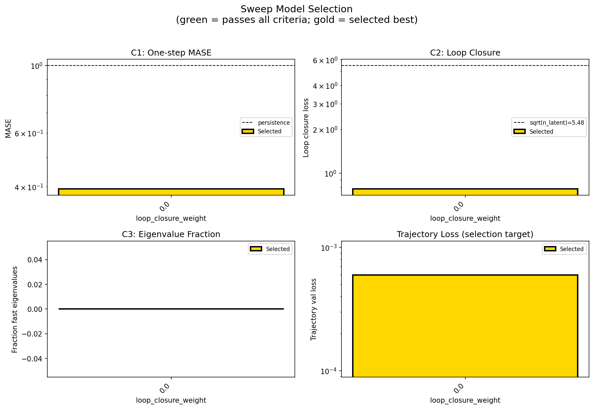

### sweep_pareto

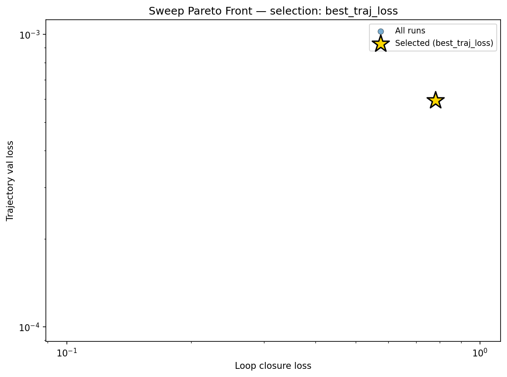

### reconstruction

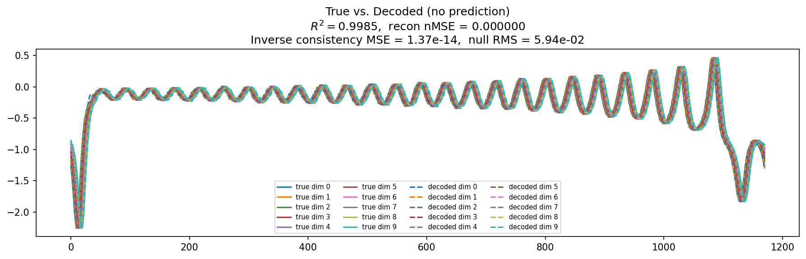

### prediction_windows

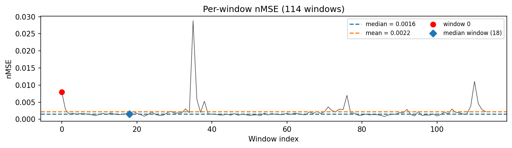

### long_trajectory

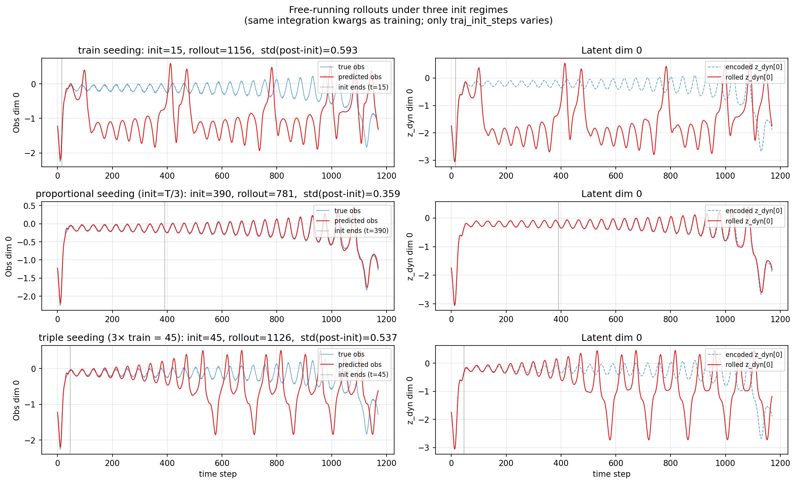

### mase

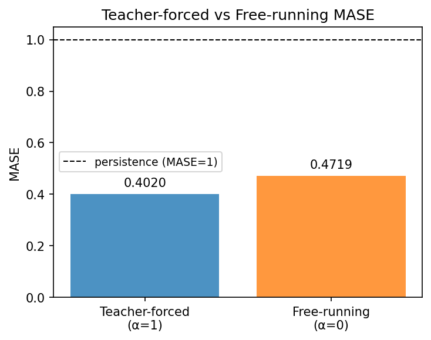

### latent_utilization

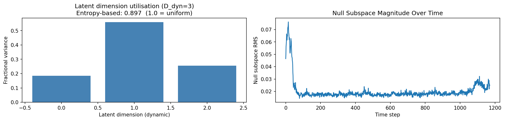

### lyapunov

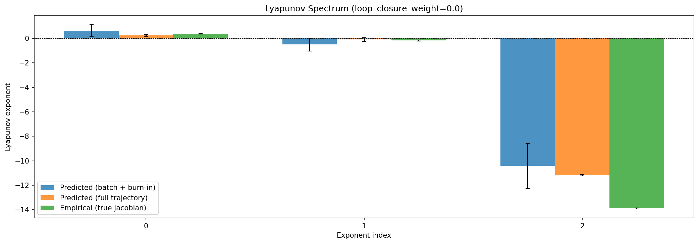

### kaplan_yorke

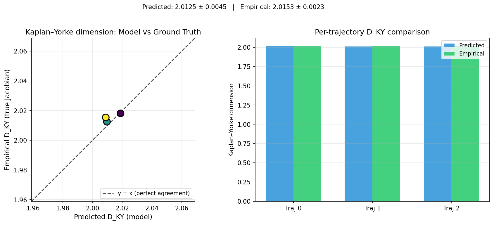

### per_run_lyapunov

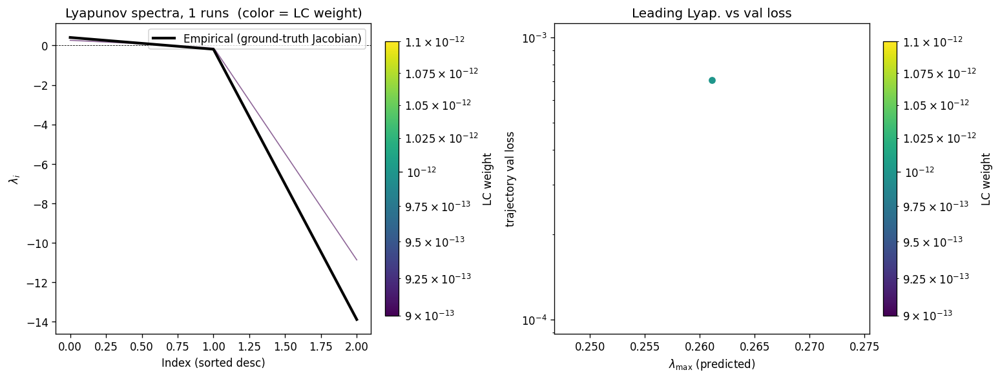

### per_run_lyapunov_vs_true

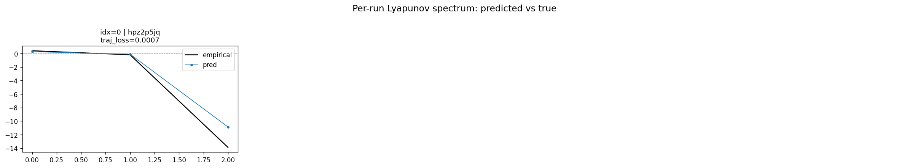

### per_run_lyapunov_relerr

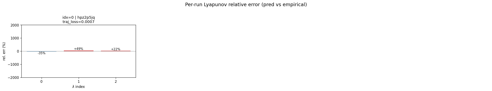

### encoder_decoder_jacobians

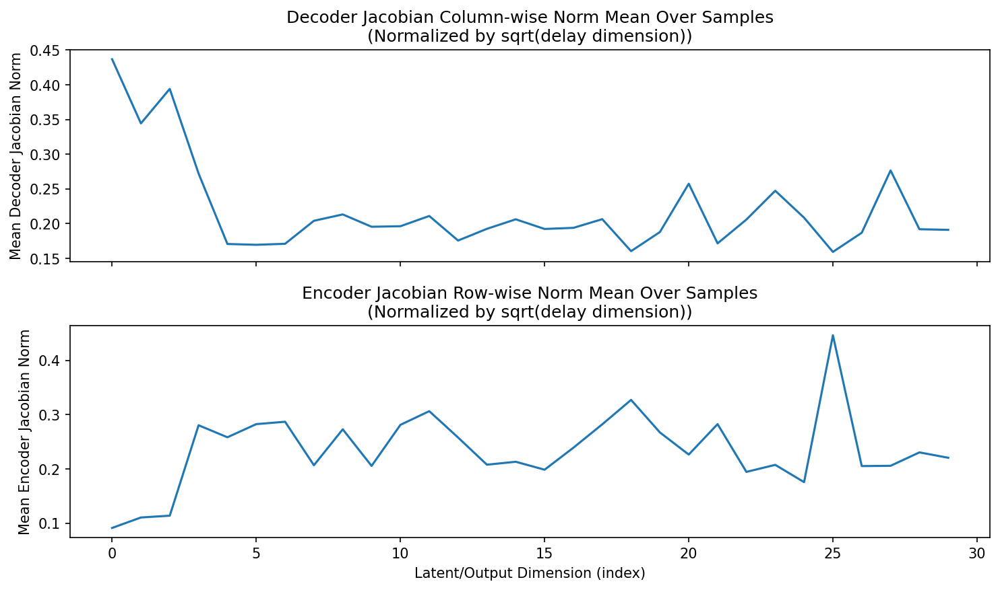

### amplification

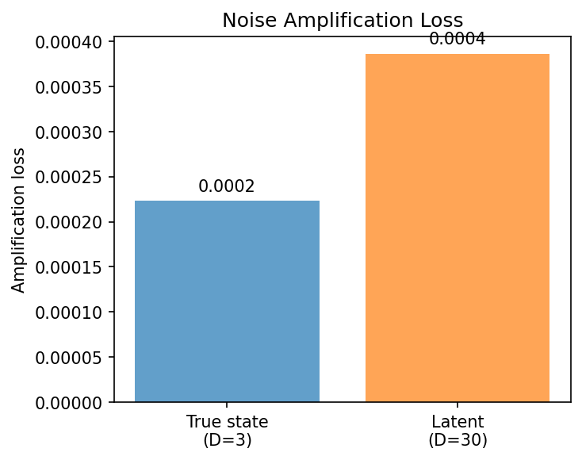

### kaplan_yorke_pca

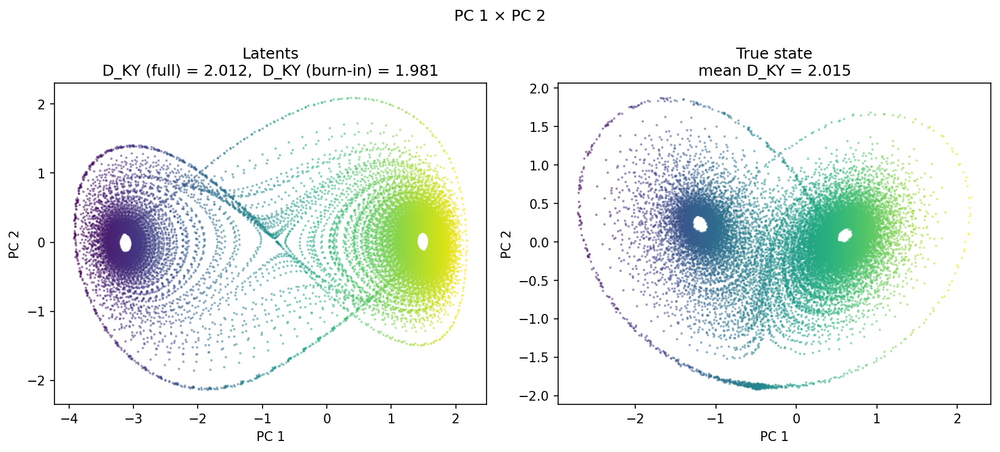

### prediction_detail_latent

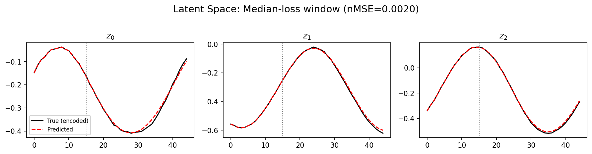

### prediction_detail_obs

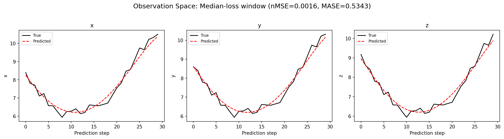

## Discussion

<!--
This section is intentionally left as a placeholder. A human reviewer
or Claude Code agent should fill it in based on the tables and figures
above, explicitly addressing each success criterion and comparing the
outcome to the stated hypothesis. Write the Discussion to
`discussion.md` in this directory and re-run `render_report`.
-->

_(to be written)_

## `run_analytics` stdout

<details><summary>Click to expand — full diagnostic output from <code>run_analytics</code></summary>

```
No run_id provided — selecting best run from group 'lorenz_partial_25d_additive_mse_uniform_p30_obsnoise001_nd30_seed5' ...
Found 1 total runs in JacobianODE/Lorenz_INDpartial_NDsweep_D1_NormTrue__JacobianODE (group=lorenz_partial_25d_additive_mse_uniform_p30_obsnoise001_nd30_seed5)
All runs (state, loop_closure_weight, tangent_entropy_weight, kl_dyn_weight):
  hpz2p5jq: state=finished, lc=0.0, te=0.0, kl_dyn=0.0

slurm_timeout_min not found in any run config — falling back to 180 min
  Including hpz2p5jq (lc=0.0): use_all_runs=True (state=finished)
Found 1 effectively-done sweep runs:
  loop_closure_weight=0.0, tangent_entropy_weight=0.0, kl_dyn_weight=0.0 -> run_id=hpz2p5jq
n_dims=30, n_latent=30, n_dyn=3, dt=0.0150
  run=hpz2p5jq: DiagnosticMetrics(one_step_mase=0.39327314496040344, loop_closure_loss=0.7803782820701599, fast_eigenvalue_fraction=0.0, trajectory_val_loss=0.0005953841027803719) (from cache, n_batches=100)

Ranking method:           best_traj_loss
Best run ID:              hpz2p5jq
Best loop_closure_weight: 0.0
Best tangent_entropy_weight: 0.0
Best kl_dyn_weight:       0.0
Best traj loss:           0.000595
Criteria applied: ['C1', 'C2', 'C3']
Surviving: 1 / 1
Auto-selected run_id: hpz2p5jq

======================================================================
PARETO FRONTIER RUNS (1 runs)
======================================================================
  Run ID               LC Loss   Traj Val Loss
  ------------  --------------  --------------
  hpz2p5jq            0.780378        0.000595 <-- selected

======================================================================
RANKING METHOD COMPARISON (over 1 survivors)
======================================================================
  Method                  Run ID               LC Loss   Traj Val Loss
  ----------------------  ------------  --------------  --------------
  best_traj_loss          hpz2p5jq            0.780378        0.000595 <-- active
  pareto_knee             hpz2p5jq            0.780378        0.000595
  geo_rank                hpz2p5jq            0.780378        0.000595
  minimax_rank            hpz2p5jq            0.780378        0.000595
  geo_log_score           hpz2p5jq            0.780378        0.000595
  minimax_log_score       hpz2p5jq            0.780378        0.000595
======================================================================

Loading run hpz2p5jq from JacobianODE/Lorenz_INDpartial_NDsweep_D1_NormTrue__JacobianODE ...
Train dataset shape: torch.Size([24772, 45, 30])
Validation dataset shape: torch.Size([7882, 45, 30])
Test dataset shape: torch.Size([3378, 45, 30])
Train trajectories dataset shape: torch.Size([22, 1171, 30])
Validation trajectories dataset shape: torch.Size([7, 1171, 30])
Test trajectories dataset shape: torch.Size([3, 1171, 30])
Loading checkpoint epoch=118-step=23800.ckpt...
Computing reconstruction ...
Computing MASE ...
Teacher-forced MASE: 0.4020
Free-running MASE:   0.4719
Computing latent utilization ...
Entropy-based utilization: 0.897
Null subspace mean RMS: 2.168186e-02
Computing Lyapunov exponents ...
  Computing full-trajectory Lyapunov (3 test trajs, T=1171) ...
Predicted Lyapunov exponents (batch+burn-in, 128 windowed trajs):
  λ_1 = +0.6186 ± 0.4945
  λ_2 = -0.4980 ± 0.5331
  λ_3 = -10.4291 ± 1.8419
Predicted Lyapunov exponents (full-length, 3 test trajs):
  λ_1 = +0.2372 ± 0.0935
  λ_2 = -0.0978 ± 0.1453
  λ_3 = -11.1691 ± 0.0558
Empirical Lyapunov exponents (mean ± std):
  λ_1 = +0.3846 ± 0.0251
  λ_2 = -0.1716 ± 0.0444
  λ_3 = -13.8799 ± 0.0398
Mean KY dim (predicted): 2.012 ± 0.005
Mean KY dim (empirical): 2.015 ± 0.002
Mean KY dim (burn-in):   1.981 ± 0.122
Computing prediction windows ...
Windows: 114 — nMSE min=0.0008, median=0.0016, mean=0.0022, max=0.0288
Computing long-trajectory free-running rollouts ...
Computing encoder/decoder Jacobians ...
encoder_jacobian: (128, 30, 30)
decoder_jacobian: (128, 30, 30)
Computing amplification loss ...
Amplification loss — True state: 0.000223
Amplification loss — Latent:     0.000386
```

</details>
