# Sweep Analysis: `lorenz_partial_additive_mse_uniform_p30_obsnoise001__ndelays_sweep`

**Project**: [Lorenz_INDpartial_NDsweep_D1_NormTrue__JacobianODE](https://wandb.ai/JacobianODE/Lorenz_INDpartial_NDsweep_D1_NormTrue__JacobianODE/groups/lorenz_partial_additive_mse_uniform_p30_obsnoise001__ndelays_sweep)  
**Launched**: 2026-04-19T22:25:57Z  
**Completed**: 2026-04-20T05:15:19Z  
**Outcome**: `complete_clean`  
**Git**: `latent-JacobianODE` @ `477d6a0`  
**Expected runs**: 10

## Experiment Context

### `lorenz_partial_additive_mse_uniform_p30_obsnoise001__ndelays_sweep`

**Description**

Lorenz partial additive coupling, uniform reconstruction loss,
obs_noise=0.01, prediction_steps=30, loop_closure_weight=0.
Sweeps delay_embedding_params.n_delays over [5, 10, 15, 20, 25,
30, 35, 40, 45, 50]. n_target_dims fixed at 3; encoder.n_input
is auto-resolved from n_delays × |observed_indices| at Hydra
runtime.

**Hypothesis**

Holding LC=0 pins the reconstruction + forward-rollout objective
at its baseline and isolates how much the chart-learning problem
(and thus Lyapunov recovery) depends on the delay-embedding
length alone. Embedding too short → attractor not unfolded
cleanly (Takens dimensionality bound is 2×3+1=7 for generic
Lorenz); embedding too long → too much redundant dim structure
for the encoder to carve into 3 dyn + (N-3) null.
Expect a sweet spot somewhere in the teens-to-twenties on clean
data; at obs_noise=0.01 the window is likely not yet pushed
toward the long end (contrast with the obsnoise005 variant).

**Success criteria**

- Clear minimum in best val traj_loss as a function of n_delays (not monotonic)
- λ_min accuracy non-monotonic in n_delays too, ideally tracking the val loss minimum
- All runs converge (no training divergence regardless of n_delays)

## Results

**Swept axes** (2): `data.train_test_params.delay_embedding_params.n_delays`, `model.encoder.n_input`

**Chosen run** (by `best_traj_loss`): `htrnbil4` — traj_loss=0.00044, MASE=0.5726, R²=0.9988, LC loss=2.896, epoch=119.0

Swept-axis values at chosen run: `data.train_test_params.delay_embedding_params.n_delays`=45 · `model.encoder.n_input`=45

**Runs analyzed**: 10 (expected 10)

### Per-run results

| run_idx | run_id | `data.train_test_params.delay_embedding_params.n_delays` | `model.encoder.n_input` | best_traj_loss | best_MASE | R² | LC loss | epoch |
|---|---|---|---|---|---|---|---|---|
| 8 | `htrnbil4` | 45 | 45 | 0.00044 | 0.5726 | 0.9988 | 2.896 | 119.0 |
| 7 | `mt362mfq` | 40 | 40 | 0.00068 | 0.6000 | 0.9982 | 1.102 | 111.0 |
| 6 | `r8v6vao1` | 35 | 35 | 0.00077 | 0.6291 | 0.9979 | 1.660 | 181.0 |
| 4 | `b2mixsm8` | 25 | 25 | 0.00151 | 0.7031 | 0.9959 | 0.412 | 139.0 |
| 3 | `0zkh7nui` | 20 | 20 | 0.00243 | 0.8606 | 0.9934 | 0.228 | 49.0 |
| 2 | `zvldwae9` | 15 | 15 | 0.00437 | 0.9654 | 0.9887 | 0.115 | 133.0 |
| 1 | `yss0ka8u` | 10 | 10 | 0.00750 | 1.4351 | 0.9800 | 0.035 | 60.0 |
| 9 | `wy6ex26e` | 50 | 50 | 0.01409 | 1.9834 | 0.9631 | 5.335 | 21.0 |
| 0 | `ahkte45j` | 5 | 5 | 0.01423 | 2.3107 | 0.9623 | 0.052 | 71.0 |
| 5 | `2eyziq6e` | 30 | 30 | 1.09857 | 34.4996 | -1.9571 | 0.231 | — |

## Success-criteria verdicts (automated)

| Criterion | Verdict | Note |
|---|---|---|
| Clear minimum in best val traj_loss as a function of n_delays (not monotonic) | **Unknown** |  |
| λ_min accuracy non-monotonic in n_delays too, ideally tracking the val loss minimum | **Unknown** |  |
| All runs converge (no training divergence regardless of n_delays) | **Unknown** |  |

_Automated verdicts use simple numeric-threshold parsing and may mis-classify qualitative criteria. The Discussion section below takes precedence._

## Figures

### sweep_overview

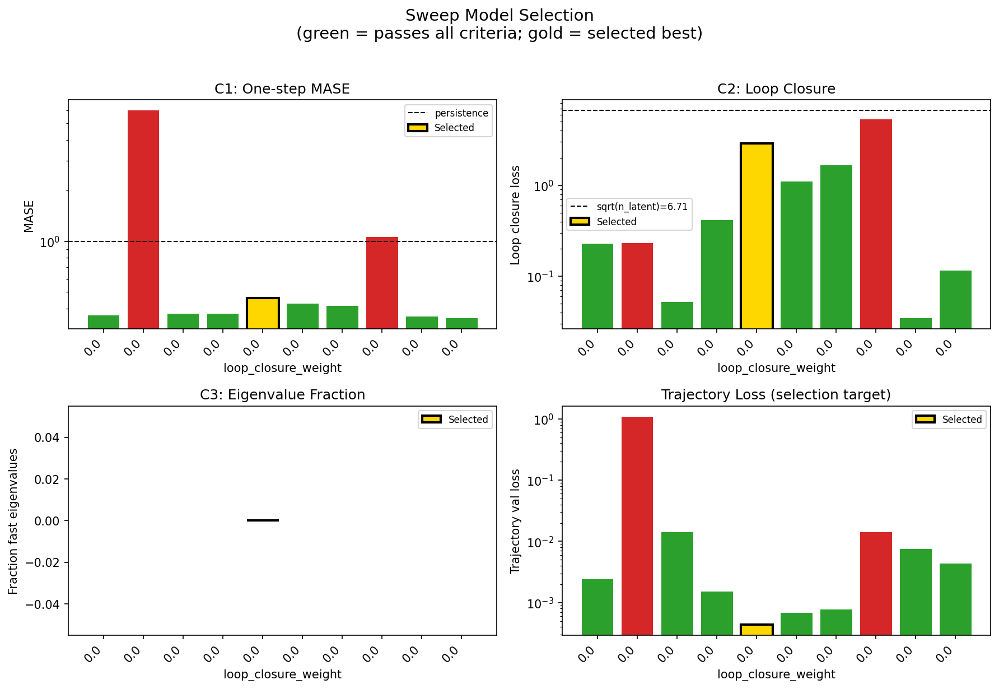

### sweep_pareto

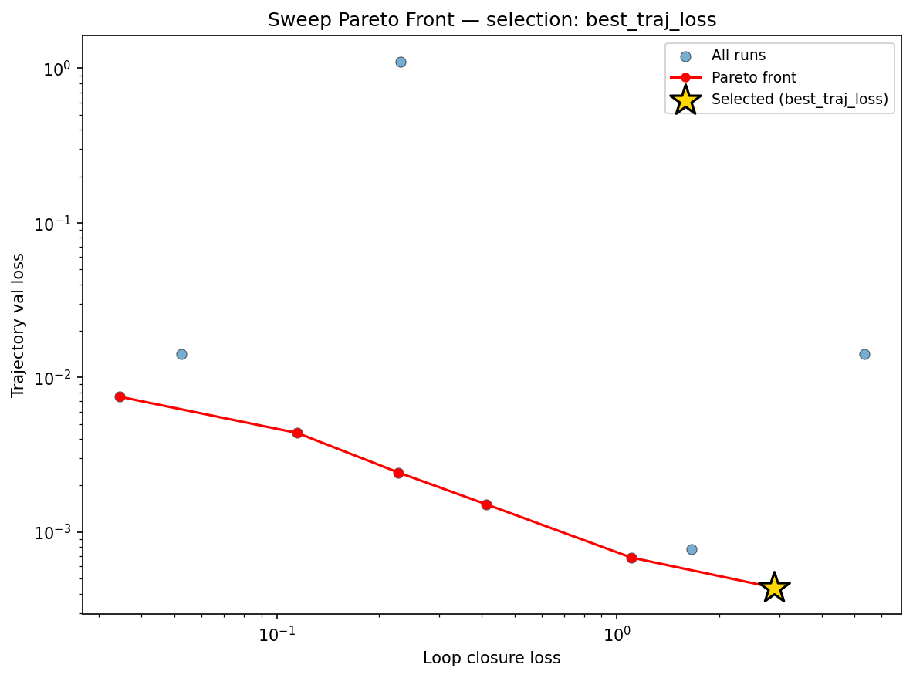

### reconstruction

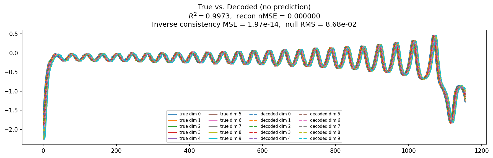

### prediction_windows

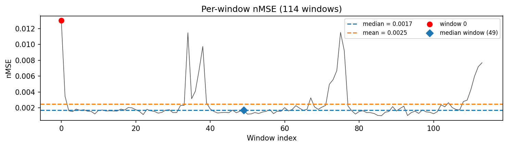

### long_trajectory

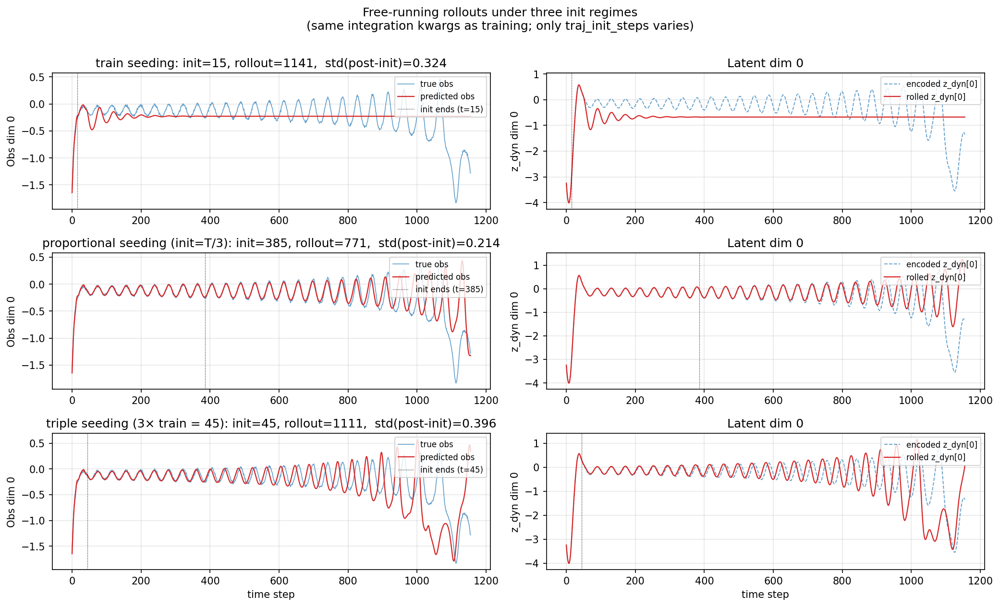

### mase

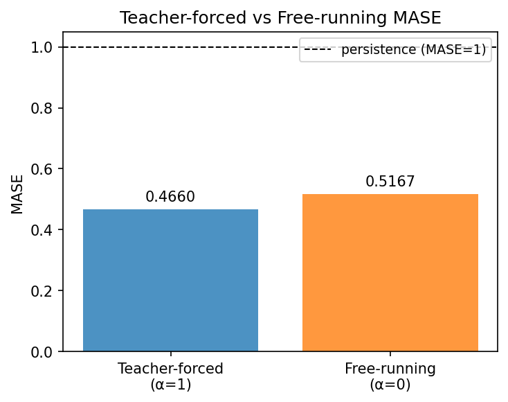

### latent_utilization

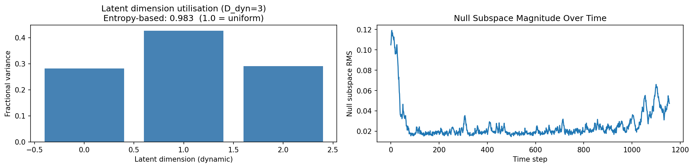

### lyapunov

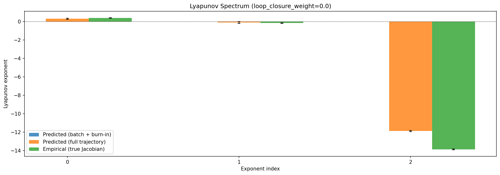

### kaplan_yorke

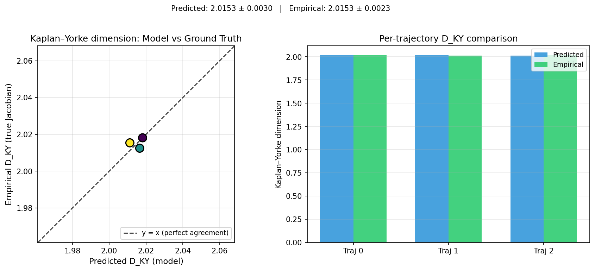

### per_run_lyapunov

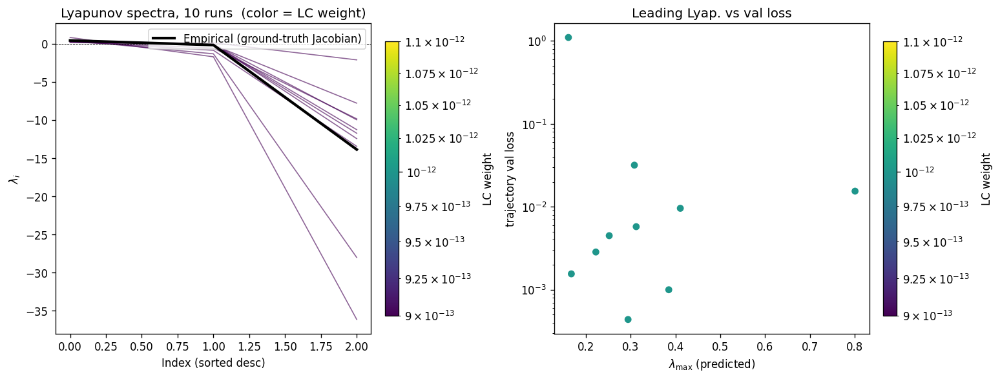

### per_run_lyapunov_vs_true

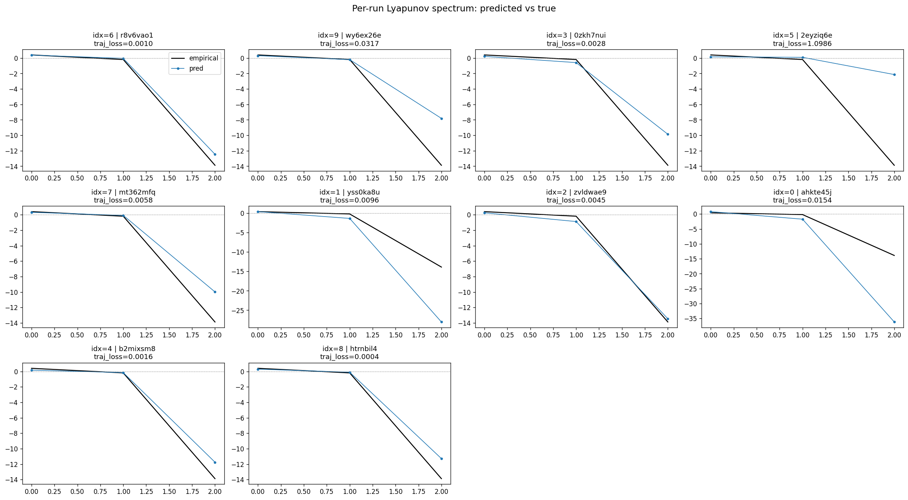

### per_run_lyapunov_relerr

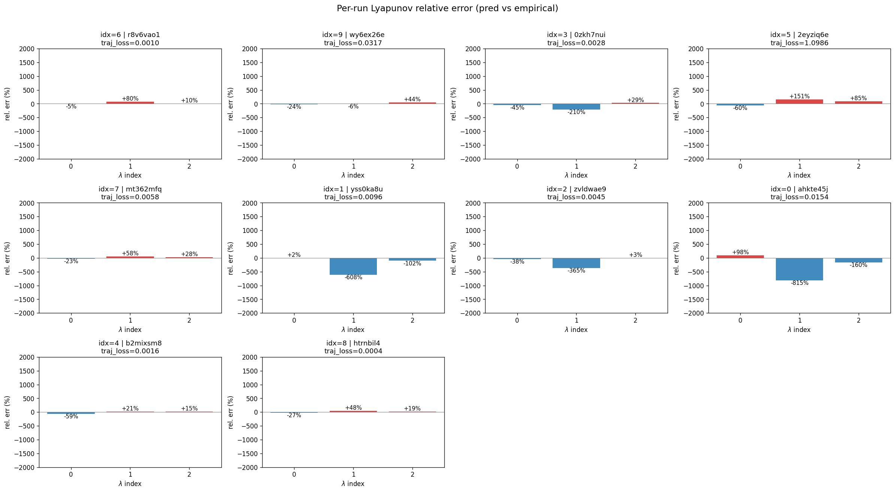

### encoder_decoder_jacobians

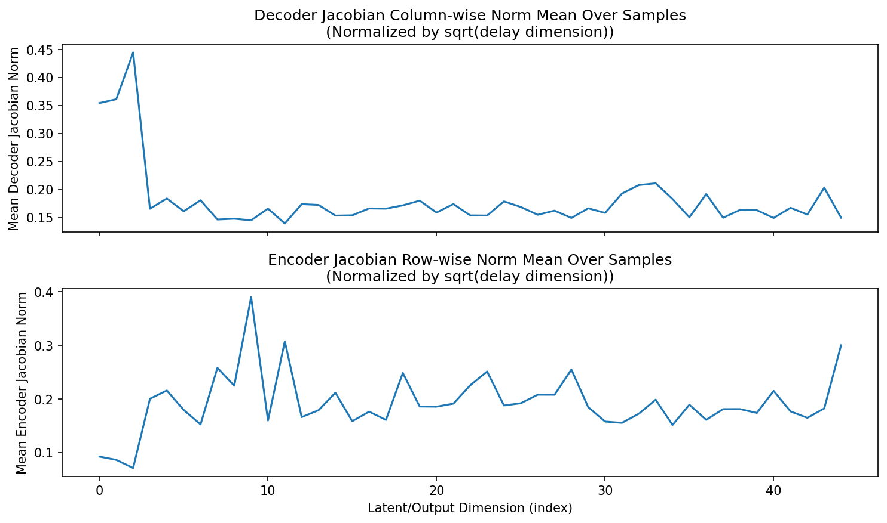

### amplification

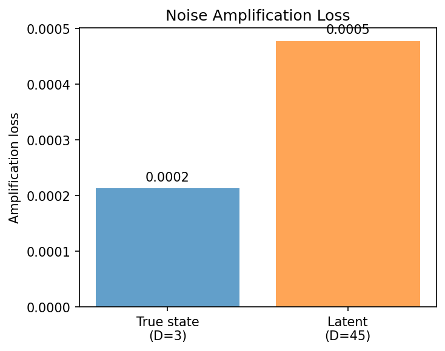

### kaplan_yorke_pca

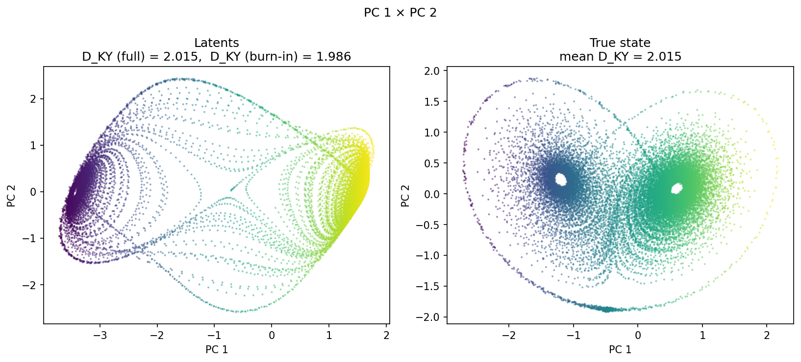

### prediction_detail_latent

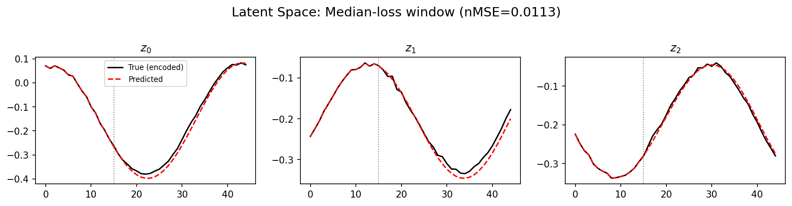

### prediction_detail_obs

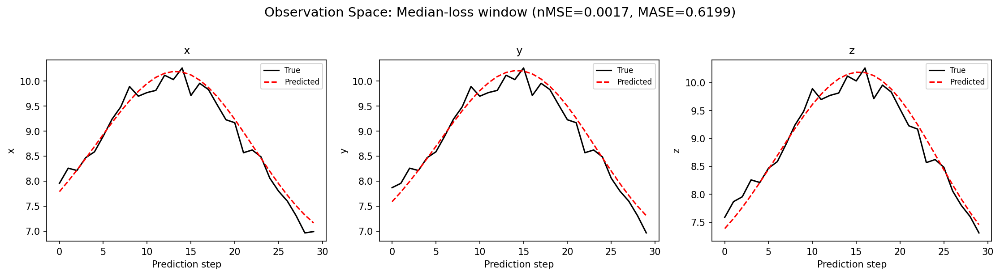

## Discussion

<!--
This section is intentionally left as a placeholder. A human reviewer
or Claude Code agent should fill it in based on the tables and figures
above, explicitly addressing each success criterion and comparing the
outcome to the stated hypothesis. Write the Discussion to
`discussion.md` in this directory and re-run `render_report`.
-->

_(to be written)_

## `run_analytics` stdout

<details><summary>Click to expand — full diagnostic output from <code>run_analytics</code></summary>

```
No run_id provided — selecting best run from group 'lorenz_partial_additive_mse_uniform_p30_obsnoise001__ndelays_sweep' ...
Found 10 total runs in JacobianODE/Lorenz_INDpartial_NDsweep_D1_NormTrue__JacobianODE (group=lorenz_partial_additive_mse_uniform_p30_obsnoise001__ndelays_sweep)
All runs (state, loop_closure_weight, tangent_entropy_weight, kl_dyn_weight):
  r8v6vao1: state=finished, lc=0.0, te=0.0, kl_dyn=0.0
  wy6ex26e: state=finished, lc=0.0, te=0.0, kl_dyn=0.0
  0zkh7nui: state=finished, lc=0.0, te=0.0, kl_dyn=0.0
  2eyziq6e: state=finished, lc=0.0, te=0.0, kl_dyn=0.0
  mt362mfq: state=finished, lc=0.0, te=0.0, kl_dyn=0.0
  yss0ka8u: state=finished, lc=0.0, te=0.0, kl_dyn=0.0
  zvldwae9: state=finished, lc=0.0, te=0.0, kl_dyn=0.0
  ahkte45j: state=finished, lc=0.0, te=0.0, kl_dyn=0.0
  b2mixsm8: state=finished, lc=0.0, te=0.0, kl_dyn=0.0
  htrnbil4: state=finished, lc=0.0, te=0.0, kl_dyn=0.0

slurm_timeout_min not found in any run config — falling back to 180 min
  Including r8v6vao1 (lc=0.0): use_all_runs=True (state=finished)
  Including wy6ex26e (lc=0.0): use_all_runs=True (state=finished)
  Including 0zkh7nui (lc=0.0): use_all_runs=True (state=finished)
  Including 2eyziq6e (lc=0.0): use_all_runs=True (state=finished)
  Including mt362mfq (lc=0.0): use_all_runs=True (state=finished)
  Including yss0ka8u (lc=0.0): use_all_runs=True (state=finished)
  Including zvldwae9 (lc=0.0): use_all_runs=True (state=finished)
  Including ahkte45j (lc=0.0): use_all_runs=True (state=finished)
  Including b2mixsm8 (lc=0.0): use_all_runs=True (state=finished)
  Including htrnbil4 (lc=0.0): use_all_runs=True (state=finished)
Found 10 effectively-done sweep runs:
  loop_closure_weight=0.0, tangent_entropy_weight=0.0, kl_dyn_weight=0.0 -> run_id=0zkh7nui
  loop_closure_weight=0.0, tangent_entropy_weight=0.0, kl_dyn_weight=0.0 -> run_id=2eyziq6e
  loop_closure_weight=0.0, tangent_entropy_weight=0.0, kl_dyn_weight=0.0 -> run_id=ahkte45j
  loop_closure_weight=0.0, tangent_entropy_weight=0.0, kl_dyn_weight=0.0 -> run_id=b2mixsm8
  loop_closure_weight=0.0, tangent_entropy_weight=0.0, kl_dyn_weight=0.0 -> run_id=htrnbil4
  loop_closure_weight=0.0, tangent_entropy_weight=0.0, kl_dyn_weight=0.0 -> run_id=mt362mfq
  loop_closure_weight=0.0, tangent_entropy_weight=0.0, kl_dyn_weight=0.0 -> run_id=r8v6vao1
  loop_closure_weight=0.0, tangent_entropy_weight=0.0, kl_dyn_weight=0.0 -> run_id=wy6ex26e
  loop_closure_weight=0.0, tangent_entropy_weight=0.0, kl_dyn_weight=0.0 -> run_id=yss0ka8u
  loop_closure_weight=0.0, tangent_entropy_weight=0.0, kl_dyn_weight=0.0 -> run_id=zvldwae9
n_dims=20, n_latent=20, n_dyn=3, dt=0.0150
  run=0zkh7nui: DiagnosticMetrics(one_step_mase=0.36341559886932373, loop_closure_loss=0.22793477773666382, fast_eigenvalue_fraction=0.0, trajectory_val_loss=0.002425663871690631) (from cache, n_batches=100)
  run=2eyziq6e: DiagnosticMetrics(one_step_mase=5.992181301116943, loop_closure_loss=0.23063239455223083, fast_eigenvalue_fraction=0.0, trajectory_val_loss=1.0985738039016724) (from cache, n_batches=100)
  run=ahkte45j: DiagnosticMetrics(one_step_mase=0.372988760471344, loop_closure_loss=0.05247814953327179, fast_eigenvalue_fraction=0.0, trajectory_val_loss=0.014231435023248196) (from cache, n_batches=100)
  run=b2mixsm8: DiagnosticMetrics(one_step_mase=0.3721044957637787, loop_closure_loss=0.41198310256004333, fast_eigenvalue_fraction=0.0, trajectory_val_loss=0.0015149586834013462) (from cache, n_batches=100)
  run=htrnbil4: DiagnosticMetrics(one_step_mase=0.4618355631828308, loop_closure_loss=2.895845890045166, fast_eigenvalue_fraction=0.0, trajectory_val_loss=0.00043698959052562714) (from cache, n_batches=100)
  run=mt362mfq: DiagnosticMetrics(one_step_mase=0.4269067347049713, loop_closure_loss=1.1016403436660767, fast_eigenvalue_fraction=0.0, trajectory_val_loss=0.0006842044531367719) (from cache, n_batches=100)
  run=r8v6vao1: DiagnosticMetrics(one_step_mase=0.41434019804000854, loop_closure_loss=1.660424828529358, fast_eigenvalue_fraction=0.0, trajectory_val_loss=0.0007737129344604909) (from cache, n_batches=100)
  run=wy6ex26e: DiagnosticMetrics(one_step_mase=1.064403772354126, loop_closure_loss=5.3353190422058105, fast_eigenvalue_fraction=0.0, trajectory_val_loss=0.014089317061007023) (from cache, n_batches=100)
  run=yss0ka8u: DiagnosticMetrics(one_step_mase=0.35876113176345825, loop_closure_loss=0.03453351557254791, fast_eigenvalue_fraction=0.0, trajectory_val_loss=0.0074974549934268) (from cache, n_batches=100)
  run=zvldwae9: DiagnosticMetrics(one_step_mase=0.3496623933315277, loop_closure_loss=0.11502780765295029, fast_eigenvalue_fraction=0.0, trajectory_val_loss=0.004368781577795744) (from cache, n_batches=100)

Ranking method:           best_traj_loss
Best run ID:              htrnbil4
Best loop_closure_weight: 0.0
Best tangent_entropy_weight: 0.0
Best kl_dyn_weight:       0.0
Best traj loss:           0.000437
Criteria applied: ['C1', 'C2', 'C3']
Surviving: 8 / 10
Auto-selected run_id: htrnbil4

======================================================================
PARETO FRONTIER RUNS (6 runs)
======================================================================
  Run ID               LC Loss   Traj Val Loss
  ------------  --------------  --------------
  yss0ka8u            0.034534        0.007497
  zvldwae9            0.115028        0.004369
  0zkh7nui            0.227935        0.002426
  b2mixsm8            0.411983        0.001515
  mt362mfq            1.101640        0.000684
  htrnbil4            2.895846        0.000437 <-- selected

======================================================================
RANKING METHOD COMPARISON (over 8 survivors)
======================================================================
  Method                  Run ID               LC Loss   Traj Val Loss
  ----------------------  ------------  --------------  --------------
  best_traj_loss          htrnbil4            2.895846        0.000437 <-- active
  pareto_knee             zvldwae9            0.115028        0.004369
  geo_rank                yss0ka8u            0.034534        0.007497
  minimax_rank            0zkh7nui            0.227935        0.002426
  geo_log_score           htrnbil4            2.895846        0.000437
  minimax_log_score       0zkh7nui            0.227935        0.002426
======================================================================

Loading run htrnbil4 from JacobianODE/Lorenz_INDpartial_NDsweep_D1_NormTrue__JacobianODE ...
Train dataset shape: torch.Size([24442, 45, 45])
Validation dataset shape: torch.Size([7777, 45, 45])
Test dataset shape: torch.Size([3333, 45, 45])
Train trajectories dataset shape: torch.Size([22, 1156, 45])
Validation trajectories dataset shape: torch.Size([7, 1156, 45])
Test trajectories dataset shape: torch.Size([3, 1156, 45])
Loading checkpoint epoch=119-step=24000.ckpt...
Computing reconstruction ...
Computing MASE ...
Teacher-forced MASE: 0.4660
Free-running MASE:   0.5167
Computing latent utilization ...
Entropy-based utilization: 0.983
Null subspace mean RMS: 3.065358e-02
Computing Lyapunov exponents ...
  Computing full-trajectory Lyapunov (3 test trajs, T=1156) ...
Predicted Lyapunov exponents (batch+burn-in, 128 windowed trajs):
  λ_1 = +nan ± nan
  λ_2 = +nan ± nan
  λ_3 = +nan ± nan
Predicted Lyapunov exponents (full-length, 3 test trajs):
  λ_1 = +0.2957 ± 0.0658
  λ_2 = -0.1135 ± 0.1030
  λ_3 = -11.8841 ± 0.0653
Empirical Lyapunov exponents (mean ± std):
  λ_1 = +0.3846 ± 0.0251
  λ_2 = -0.1716 ± 0.0444
  λ_3 = -13.8799 ± 0.0398
Mean KY dim (predicted): 2.015 ± 0.003
Mean KY dim (empirical): 2.015 ± 0.002
Mean KY dim (burn-in):   1.986 ± 0.309
Computing prediction windows ...
Windows: 114 — nMSE min=0.0010, median=0.0017, mean=0.0025, max=0.0130
Computing long trajectory prediction ...
Computing encoder/decoder Jacobians ...
encoder_jacobian: (128, 45, 45)
decoder_jacobian: (128, 45, 45)
Computing amplification loss ...
Amplification loss — True state: 0.000213
Amplification loss — Latent:     0.000478
```

</details>
