# Sweep Analysis: `lorenz_partial_additive_mse_uniform_p30_obsnoise005__ndelays_sweep`

**Project**: [Lorenz_INDpartial_NDsweep_D1_NormTrue__JacobianODE](https://wandb.ai/JacobianODE/Lorenz_INDpartial_NDsweep_D1_NormTrue__JacobianODE/groups/lorenz_partial_additive_mse_uniform_p30_obsnoise005__ndelays_sweep)  
**Launched**: 2026-04-19T22:26:23Z  
**Completed**: 2026-04-20T06:00:21Z  
**Outcome**: `complete_clean`  
**Git**: `latent-JacobianODE` @ `477d6a0`  
**Expected runs**: 10

## Experiment Context

### `lorenz_partial_additive_mse_uniform_p30_obsnoise005__ndelays_sweep`

**Description**

Lorenz partial additive coupling, uniform reconstruction loss,
obs_noise=0.05, prediction_steps=30, loop_closure_weight=0.
Sweeps delay_embedding_params.n_delays over [5, 10, 15, 20, 25,
30, 35, 40, 45, 50]. n_target_dims fixed at 3; encoder.n_input
is auto-resolved from n_delays × |observed_indices| at Hydra
runtime.

**Hypothesis**

The obs y7938e7x post-mortem suggested the 25-delay embedding may
be sub-optimal at obs_noise=0.05 (overestimated |λ_min|). Larger
n_delays effectively lower-passes more noise out of any single
delay coordinate (each delay is one noisy point); smaller n_delays
keeps the embedding tight but can't unfold the attractor cleanly.
Expect the best n_delays at obs_noise=0.05 to be larger than at
obs_noise=0.01.

**Success criteria**

- Clear minimum in best val traj_loss as a function of n_delays
- Best n_delays at obs_noise=0.05 ≥ best n_delays at obs_noise=0.01
- All runs converge (no training divergence regardless of n_delays)

## Results

**Swept axes** (2): `data.train_test_params.delay_embedding_params.n_delays`, `model.encoder.n_input`

**Chosen run** (by `best_traj_loss`): `16s8uli1` — traj_loss=0.00576, MASE=0.7755, R²=0.9846, LC loss=1.109, epoch=177.0

Swept-axis values at chosen run: `data.train_test_params.delay_embedding_params.n_delays`=50 · `model.encoder.n_input`=50

**Runs analyzed**: 10 (expected 10)

### Per-run results

| run_idx | run_id | `data.train_test_params.delay_embedding_params.n_delays` | `model.encoder.n_input` | best_traj_loss | best_MASE | R² | LC loss | epoch |
|---|---|---|---|---|---|---|---|---|
| 9 | `16s8uli1` | 50 | 50 | 0.00576 | 0.7755 | 0.9846 | 1.109 | 177.0 |
| 7 | `sw7tq71c` | 40 | 40 | 0.00591 | 0.7838 | 0.9842 | 0.575 | 103.0 |
| 8 | `3oodwc3a` | 45 | 45 | 0.00698 | 0.8305 | 0.9805 | 3.019 | 40.0 |
| 6 | `4fzvocqs` | 35 | 35 | 0.00947 | 0.8800 | 0.9750 | 6.006 | 109.0 |
| 4 | `rnsg3d7o` | 25 | 25 | 0.00970 | 0.9074 | 0.9742 | 1.343 | 94.0 |
| 3 | `iw0d7gcy` | 20 | 20 | 0.01016 | 0.9165 | 0.9723 | 0.356 | 116.0 |
| 2 | `vqt1l45r` | 15 | 15 | 0.02415 | 1.2308 | 0.9362 | 0.190 | 12.0 |
| 1 | `zc95ojvj` | 10 | 10 | 0.02574 | 1.3429 | 0.9317 | 0.056 | 153.0 |
| 0 | `g0jmo6np` | 5 | 5 | 0.04770 | 2.0318 | 0.8742 | 0.839 | 156.0 |
| 5 | `qxpj8xpn` | 30 | 30 | 1.09957 | 11.9960 | -1.9394 | 1.061 | — |

## Success-criteria verdicts (automated)

| Criterion | Verdict | Note |
|---|---|---|
| Clear minimum in best val traj_loss as a function of n_delays | **Unknown** |  |
| Best n_delays at obs_noise=0.05 ≥ best n_delays at obs_noise=0.01 | **Unknown** |  |
| All runs converge (no training divergence regardless of n_delays) | **Unknown** |  |

_Automated verdicts use simple numeric-threshold parsing and may mis-classify qualitative criteria. The Discussion section below takes precedence._

## Figures

### sweep_overview

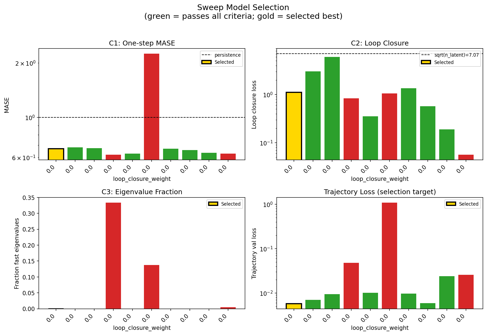

### sweep_pareto

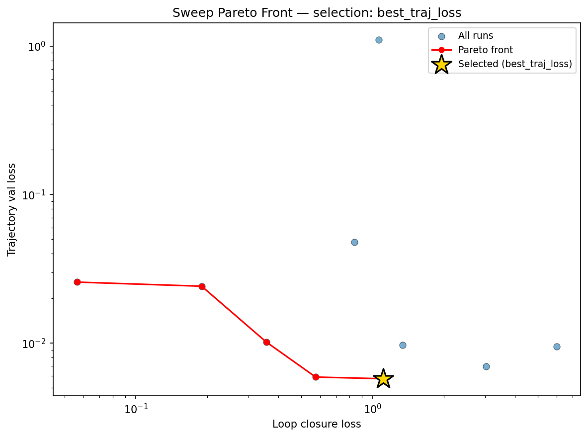

### reconstruction

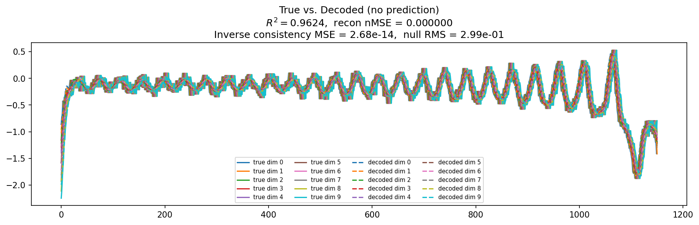

### prediction_windows

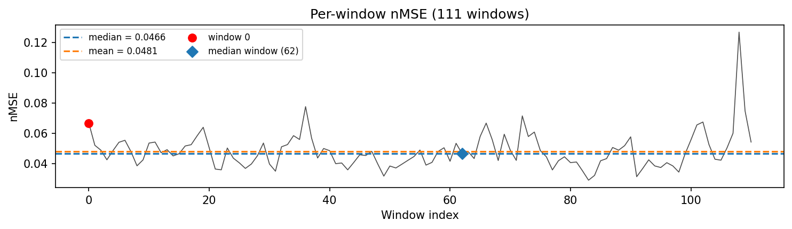

### long_trajectory

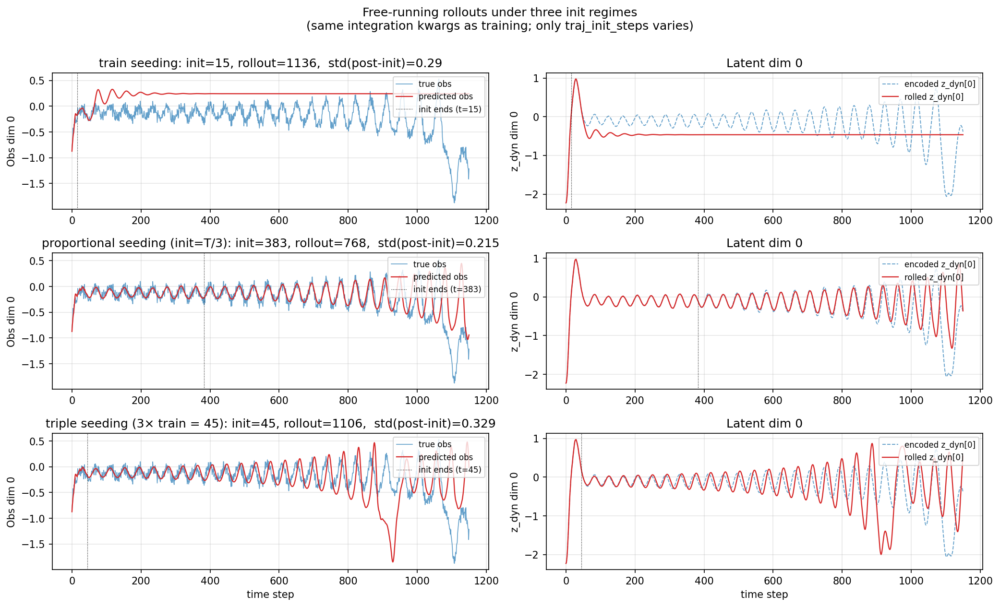

### mase

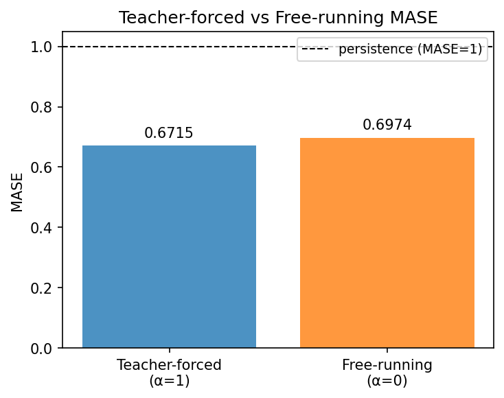

### latent_utilization

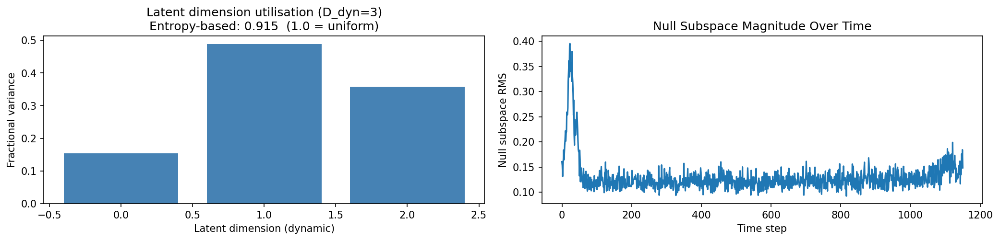

### lyapunov

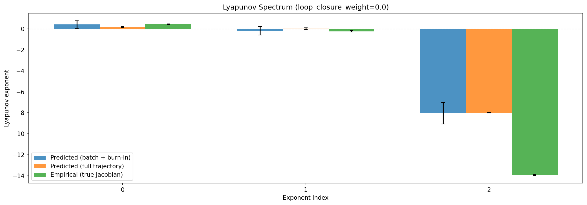

### kaplan_yorke

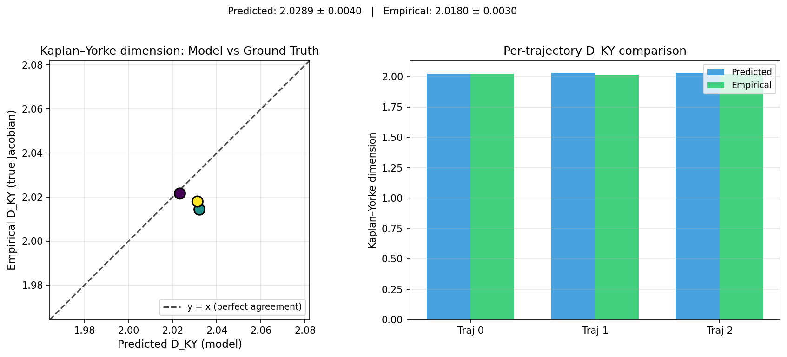

### per_run_lyapunov

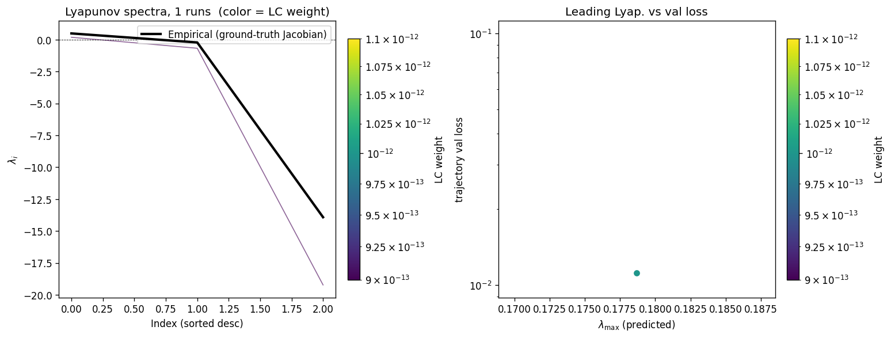

### per_run_lyapunov_vs_true

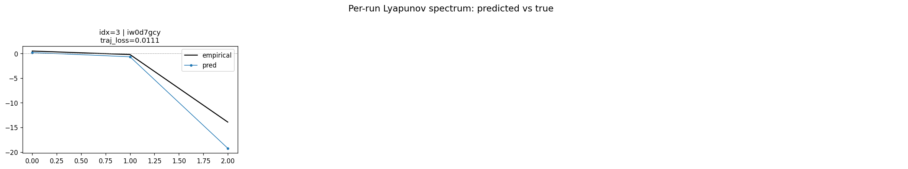

### per_run_lyapunov_relerr

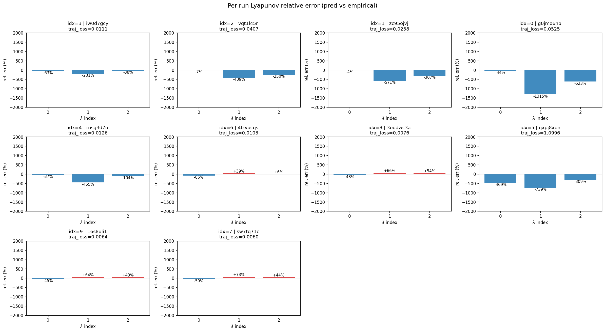

### encoder_decoder_jacobians

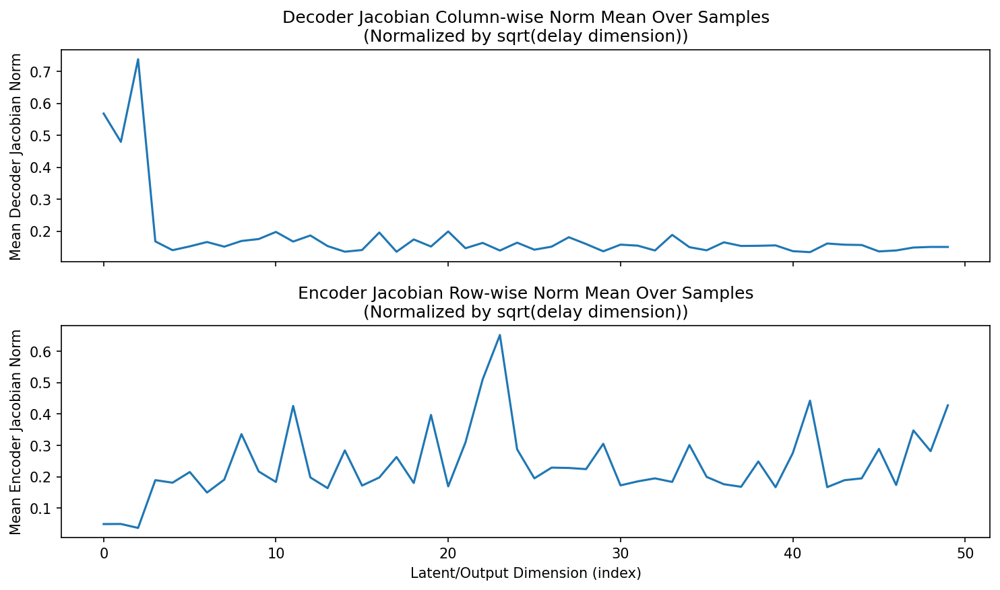

### amplification

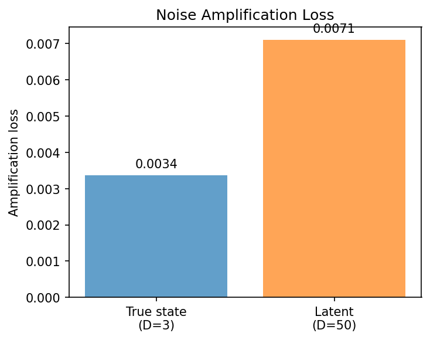

### kaplan_yorke_pca

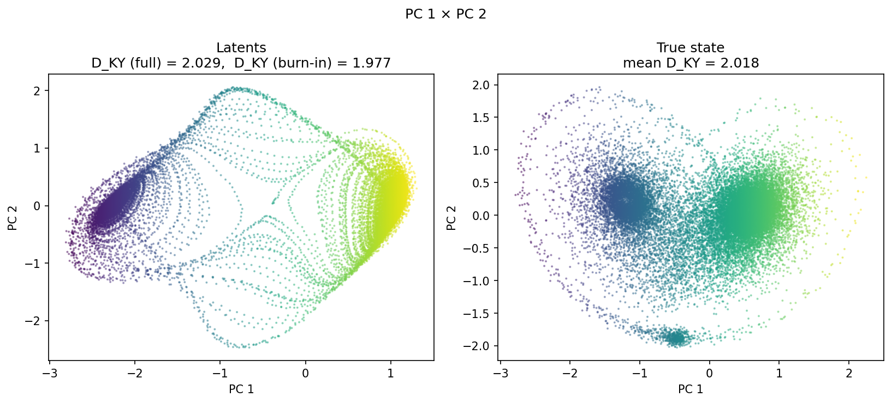

### prediction_detail_latent

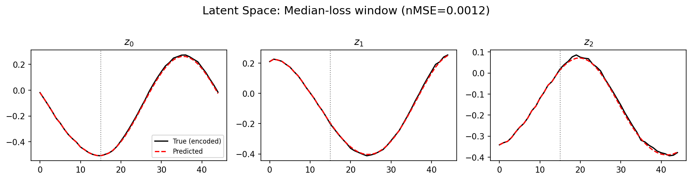

### prediction_detail_obs

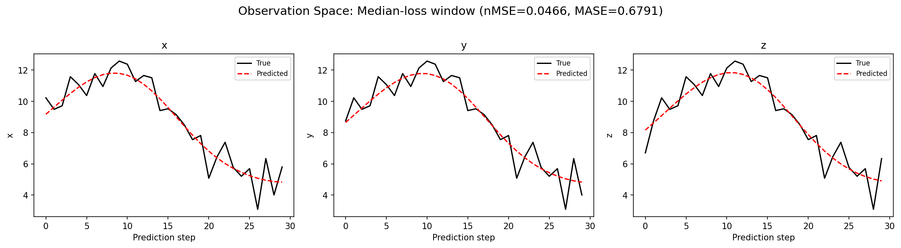

## Discussion

<!--
This section is intentionally left as a placeholder. A human reviewer
or Claude Code agent should fill it in based on the tables and figures
above, explicitly addressing each success criterion and comparing the
outcome to the stated hypothesis. Write the Discussion to
`discussion.md` in this directory and re-run `render_report`.
-->

_(to be written)_

## `run_analytics` stdout

<details><summary>Click to expand — full diagnostic output from <code>run_analytics</code></summary>

```
No run_id provided — selecting best run from group 'lorenz_partial_additive_mse_uniform_p30_obsnoise005__ndelays_sweep' ...
Found 10 total runs in JacobianODE/Lorenz_INDpartial_NDsweep_D1_NormTrue__JacobianODE (group=lorenz_partial_additive_mse_uniform_p30_obsnoise005__ndelays_sweep)
All runs (state, loop_closure_weight, tangent_entropy_weight, kl_dyn_weight):
  iw0d7gcy: state=finished, lc=0.0, te=0.0, kl_dyn=0.0
  vqt1l45r: state=finished, lc=0.0, te=0.0, kl_dyn=0.0
  zc95ojvj: state=finished, lc=0.0, te=0.0, kl_dyn=0.0
  g0jmo6np: state=finished, lc=0.0, te=0.0, kl_dyn=0.0
  rnsg3d7o: state=finished, lc=0.0, te=0.0, kl_dyn=0.0
  4fzvocqs: state=finished, lc=0.0, te=0.0, kl_dyn=0.0
  3oodwc3a: state=finished, lc=0.0, te=0.0, kl_dyn=0.0
  qxpj8xpn: state=finished, lc=0.0, te=0.0, kl_dyn=0.0
  16s8uli1: state=finished, lc=0.0, te=0.0, kl_dyn=0.0
  sw7tq71c: state=finished, lc=0.0, te=0.0, kl_dyn=0.0

slurm_timeout_min not found in any run config — falling back to 180 min
  Including iw0d7gcy (lc=0.0): use_all_runs=True (state=finished)
  Including vqt1l45r (lc=0.0): use_all_runs=True (state=finished)
  Including zc95ojvj (lc=0.0): use_all_runs=True (state=finished)
  Including g0jmo6np (lc=0.0): use_all_runs=True (state=finished)
  Including rnsg3d7o (lc=0.0): use_all_runs=True (state=finished)
  Including 4fzvocqs (lc=0.0): use_all_runs=True (state=finished)
  Including 3oodwc3a (lc=0.0): use_all_runs=True (state=finished)
  Including qxpj8xpn (lc=0.0): use_all_runs=True (state=finished)
  Including 16s8uli1 (lc=0.0): use_all_runs=True (state=finished)
  Including sw7tq71c (lc=0.0): use_all_runs=True (state=finished)
Found 10 effectively-done sweep runs:
  loop_closure_weight=0.0, tangent_entropy_weight=0.0, kl_dyn_weight=0.0 -> run_id=16s8uli1
  loop_closure_weight=0.0, tangent_entropy_weight=0.0, kl_dyn_weight=0.0 -> run_id=3oodwc3a
  loop_closure_weight=0.0, tangent_entropy_weight=0.0, kl_dyn_weight=0.0 -> run_id=4fzvocqs
  loop_closure_weight=0.0, tangent_entropy_weight=0.0, kl_dyn_weight=0.0 -> run_id=g0jmo6np
  loop_closure_weight=0.0, tangent_entropy_weight=0.0, kl_dyn_weight=0.0 -> run_id=iw0d7gcy
  loop_closure_weight=0.0, tangent_entropy_weight=0.0, kl_dyn_weight=0.0 -> run_id=qxpj8xpn
  loop_closure_weight=0.0, tangent_entropy_weight=0.0, kl_dyn_weight=0.0 -> run_id=rnsg3d7o
  loop_closure_weight=0.0, tangent_entropy_weight=0.0, kl_dyn_weight=0.0 -> run_id=sw7tq71c
  loop_closure_weight=0.0, tangent_entropy_weight=0.0, kl_dyn_weight=0.0 -> run_id=vqt1l45r
  loop_closure_weight=0.0, tangent_entropy_weight=0.0, kl_dyn_weight=0.0 -> run_id=zc95ojvj
n_dims=50, n_latent=50, n_dyn=3, dt=0.0150
  run=16s8uli1: DiagnosticMetrics(one_step_mase=0.6690319180488586, loop_closure_loss=1.109110713005066, fast_eigenvalue_fraction=0.0, trajectory_val_loss=0.0057553634978830814) (from cache, n_batches=100)
  run=3oodwc3a: DiagnosticMetrics(one_step_mase=0.6827640533447266, loop_closure_loss=3.018904447555542, fast_eigenvalue_fraction=0.0, trajectory_val_loss=0.006982374936342239) (from cache, n_batches=100)
  run=4fzvocqs: DiagnosticMetrics(one_step_mase=0.6758391261100769, loop_closure_loss=6.006000518798828, fast_eigenvalue_fraction=0.0, trajectory_val_loss=0.009467532858252525) (from cache, n_batches=100)
  run=g0jmo6np: DiagnosticMetrics(one_step_mase=0.6205236911773682, loop_closure_loss=0.8387559652328491, fast_eigenvalue_fraction=0.3333333432674408, trajectory_val_loss=0.0477001890540123) (from cache, n_batches=100)
  run=iw0d7gcy: DiagnosticMetrics(one_step_mase=0.6295002698898315, loop_closure_loss=0.35624420642852783, fast_eigenvalue_fraction=0.0, trajectory_val_loss=0.010159987956285477) (from cache, n_batches=100)
  run=qxpj8xpn: DiagnosticMetrics(one_step_mase=2.2484309673309326, loop_closure_loss=1.061212420463562, fast_eigenvalue_fraction=0.13750000298023224, trajectory_val_loss=1.0995689630508423) (from cache, n_batches=100)
  run=rnsg3d7o: DiagnosticMetrics(one_step_mase=0.6702324748039246, loop_closure_loss=1.3428367376327515, fast_eigenvalue_fraction=0.0, trajectory_val_loss=0.009704153053462505) (from cache, n_batches=100)
  run=sw7tq71c: DiagnosticMetrics(one_step_mase=0.6575711369514465, loop_closure_loss=0.5754083395004272, fast_eigenvalue_fraction=0.0, trajectory_val_loss=0.005907409358769655) (from cache, n_batches=100)
  run=vqt1l45r: DiagnosticMetrics(one_step_mase=0.6356289386749268, loop_closure_loss=0.18966253101825714, fast_eigenvalue_fraction=0.0, trajectory_val_loss=0.024153903126716614) (from cache, n_batches=100)
  run=zc95ojvj: DiagnosticMetrics(one_step_mase=0.6290665864944458, loop_closure_loss=0.056427132338285446, fast_eigenvalue_fraction=0.004999999888241291, trajectory_val_loss=0.025739939883351326) (from cache, n_batches=100)

Ranking method:           best_traj_loss
Best run ID:              16s8uli1
Best loop_closure_weight: 0.0
Best tangent_entropy_weight: 0.0
Best kl_dyn_weight:       0.0
Best traj loss:           0.005755
Criteria applied: ['C1', 'C2', 'C3']
Surviving: 7 / 10
Auto-selected run_id: 16s8uli1

======================================================================
PARETO FRONTIER RUNS (5 runs)
======================================================================
  Run ID               LC Loss   Traj Val Loss
  ------------  --------------  --------------
  zc95ojvj            0.056427        0.025740
  vqt1l45r            0.189663        0.024154
  iw0d7gcy            0.356244        0.010160
  sw7tq71c            0.575408        0.005907
  16s8uli1            1.109111        0.005755 <-- selected

======================================================================
RANKING METHOD COMPARISON (over 7 survivors)
======================================================================
  Method                  Run ID               LC Loss   Traj Val Loss
  ----------------------  ------------  --------------  --------------
  best_traj_loss          16s8uli1            1.109111        0.005755 <-- active
  pareto_knee             sw7tq71c            0.575408        0.005907
  geo_rank                16s8uli1            1.109111        0.005755
  minimax_rank            sw7tq71c            0.575408        0.005907
  geo_log_score           16s8uli1            1.109111        0.005755
  minimax_log_score       sw7tq71c            0.575408        0.005907
======================================================================

Loading run 16s8uli1 from JacobianODE/Lorenz_INDpartial_NDsweep_D1_NormTrue__JacobianODE ...
Train dataset shape: torch.Size([24332, 45, 50])
Validation dataset shape: torch.Size([7742, 45, 50])
Test dataset shape: torch.Size([3318, 45, 50])
Train trajectories dataset shape: torch.Size([22, 1151, 50])
Validation trajectories dataset shape: torch.Size([7, 1151, 50])
Test trajectories dataset shape: torch.Size([3, 1151, 50])
Loading checkpoint epoch=177-step=35600.ckpt...
Computing reconstruction ...
Computing MASE ...
Teacher-forced MASE: 0.6715
Free-running MASE:   0.6974
Computing latent utilization ...
Entropy-based utilization: 0.915
Null subspace mean RMS: 1.339928e-01
Computing Lyapunov exponents ...
  Computing full-trajectory Lyapunov (3 test trajs, T=1151) ...
Predicted Lyapunov exponents (batch+burn-in, 128 windowed trajs):
  λ_1 = +0.4261 ± 0.3584
  λ_2 = -0.1643 ± 0.4247
  λ_3 = -8.0417 ± 1.0189
Predicted Lyapunov exponents (full-length, 3 test trajs):
  λ_1 = +0.2022 ± 0.0573
  λ_2 = +0.0285 ± 0.0762
  λ_3 = -7.9933 ± 0.0260
Empirical Lyapunov exponents (mean ± std):
  λ_1 = +0.4677 ± 0.0259
  λ_2 = -0.2173 ± 0.0549
  λ_3 = -13.9174 ± 0.0513
Mean KY dim (predicted): 2.029 ± 0.004
Mean KY dim (empirical): 2.018 ± 0.003
Mean KY dim (burn-in):   1.977 ± 0.233
Computing prediction windows ...
Windows: 111 — nMSE min=0.0291, median=0.0466, mean=0.0481, max=0.1267
Computing long-trajectory free-running rollouts ...
Computing encoder/decoder Jacobians ...
encoder_jacobian: (128, 50, 50)
decoder_jacobian: (128, 50, 50)
Computing amplification loss ...
Amplification loss — True state: 0.003375
Amplification loss — Latent:     0.007112
```

</details>
