# Sweep Analysis: `lorenz_partial_additive_mse_uniform_p30_obsnoise005_chain__ndelays_5_100_sweep`

**Project**: [Lorenz_INDpartial_NDsweep_D1_NormTrue__JacobianODE](https://wandb.ai/JacobianODE/Lorenz_INDpartial_NDsweep_D1_NormTrue__JacobianODE/groups/lorenz_partial_additive_mse_uniform_p30_obsnoise005_chain__ndelays_5_100_sweep)  
**Launched**: 2026-05-02T07:35:15Z  
**Completed**: 2026-05-02T18:55:33Z  
**Outcome**: `complete_clean`  
**Git**: `latent-JacobianODE` @ `95677e6`  
**Expected runs**: 20

## Experiment Context

### `lorenz_partial_additive_mse_uniform_p30_obsnoise005_chain__ndelays_5_100_sweep`

**Description**

Lorenz partial additive coupling, uniform reconstruction loss,
obs_noise=0.05, prediction_steps=30, loop_closure_weight=0.
Sweeps delay_embedding_params.n_delays over [5, 10, ..., 100] (20
cells). n_target_dims fixed at 3; encoder.n_input is auto-resolved
from n_delays × |observed_indices| at Hydra runtime.
On reap, the chain dispatches the top-3 n_delays into the existing
`splitmode_p30_obsnoise005_top3nd` LC × obs_noise grid (108-cell
Stage A, ~54-cell Stage B).

**Hypothesis**

Bigger n_delays bound (100 vs 50) lets us see whether the optimum
plateaus at 50 or keeps improving. At obs_noise=0.05, more delays
average out more noise per delay coordinate.

**Success criteria**

- All 20 cells train without divergence
- Best traj_loss is monotone-or-curve in n_delays (no random scatter)
- On reap, controller logs '[chain ...] axis_select OK' and grid instruction lands in instructions/pending/

## Results

**Swept axes** (2): `data.train_test_params.delay_embedding_params.n_delays`, `model.encoder.n_input`

**Chosen run** (by `best_traj_loss`): `9ptb3ina` — traj_loss=0.00513, MASE=0.7598, R²=0.9858, LC loss=3.008, epoch=92.0

Swept-axis values at chosen run: `data.train_test_params.delay_embedding_params.n_delays`=45 · `model.encoder.n_input`=45

### Integrity checks

⚠️ **1 run_idx slot(s) had multiple matching wandb runs** — the best by `best_traj_loss` was kept; the others are listed below for audit:
  - run_idx=**0**: chose `r63wsasd`, dropped `bokje8d9`

**Runs analyzed**: 20 (expected 20)

### Per-run results

| run_idx | run_id | `data.train_test_params.delay_embedding_params.n_delays` | `model.encoder.n_input` | best_traj_loss | best_MASE | R² | LC loss | epoch |
|---|---|---|---|---|---|---|---|---|
| 8 | `9ptb3ina` | 45 | 45 | 0.00513 | 0.7598 | 0.9858 | 3.008 | 92.0 |
| 16 | `n1sgrof7` | 85 | 85 | 0.00535 | 0.7767 | 0.9860 | 31.413 | 98.0 |
| 14 | `v62wnqgz` | 75 | 75 | 0.00560 | 0.7895 | 0.9849 | 50.205 | 85.0 |
| 7 | `k1vjfld7` | 40 | 40 | 0.00562 | 0.7839 | 0.9850 | 1.571 | 91.0 |
| 9 | `zw2tstb6` | 50 | 50 | 0.00596 | 0.7975 | 0.9841 | 1.658 | 83.0 |
| 10 | `ig461nn4` | 55 | 55 | 0.00623 | 0.8101 | 0.9834 | 3.703 | 90.0 |
| 19 | `phvs7piu` | 100 | 100 | 0.00627 | 0.8155 | 0.9832 | 14.805 | 83.0 |
| 18 | `g5fzzzx6` | 95 | 95 | 0.00642 | 0.8161 | 0.9826 | 28.041 | 76.0 |
| 12 | `zqz9kfxd` | 65 | 65 | 0.00649 | 0.7925 | 0.9828 | 23.533 | 107.0 |
| 11 | `6mgla6s9` | 60 | 60 | 0.00661 | 0.8202 | 0.9822 | 22.412 | 98.0 |
| 15 | `83ydtyam` | 80 | 80 | 0.00670 | 0.8175 | 0.9821 | 43.450 | 82.0 |
| 6 | `dtn2of2g` | 35 | 35 | 0.00740 | 0.8420 | 0.9806 | 16.896 | 81.0 |
| 4 | `0n8zzm4d` | 25 | 25 | 0.00808 | 0.8587 | 0.9786 | 4.055 | 99.0 |
| 3 | `bl160pvy` | 20 | 20 | 0.01093 | 0.9129 | 0.9702 | 0.689 | 88.0 |
| 2 | `w2zoejol` | 15 | 15 | 0.02172 | 1.1077 | 0.9428 | 0.450 | 92.0 |
| 1 | `s3s1kq5n` | 10 | 10 | 0.02297 | 1.3028 | 0.9390 | 0.478 | 108.0 |
| 13 | `ss4noj5q` | 70 | 70 | 0.03166 | 1.2696 | 0.9164 | 37.780 | 25.0 |
| 0 | `r63wsasd` | 5 | 5 | 0.07352 | 2.4514 | 0.8062 | 0.445 | 114.0 |
| 5 | `2ess20yo` | 30 | 30 | 1.09957 | 11.9960 | -1.9394 | 2.006 | — |
| 17 | `reqpr8x8` | 90 | 90 | nan | nan | nan | 16.948 | — |

## Success-criteria verdicts (automated)

| Criterion | Verdict | Note |
|---|---|---|
| All 20 cells train without divergence | **Unknown** |  |
| Best traj_loss is monotone-or-curve in n_delays (no random scatter) | **Unknown** |  |
| On reap, controller logs '[chain ...] axis_select OK' and grid instruction lands in instructions/pending/ | **Unknown** |  |

_Automated verdicts use simple numeric-threshold parsing and may mis-classify qualitative criteria. The Discussion section below takes precedence._

## Figures

### sweep_overview

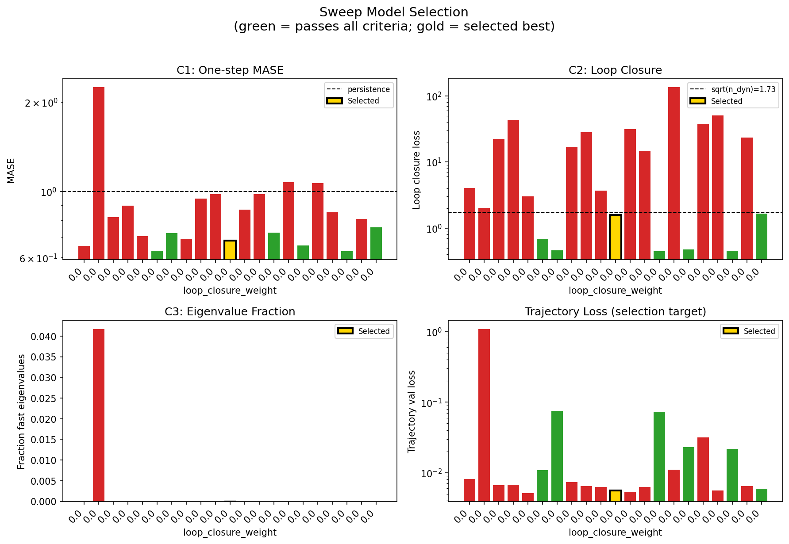

### sweep_pareto

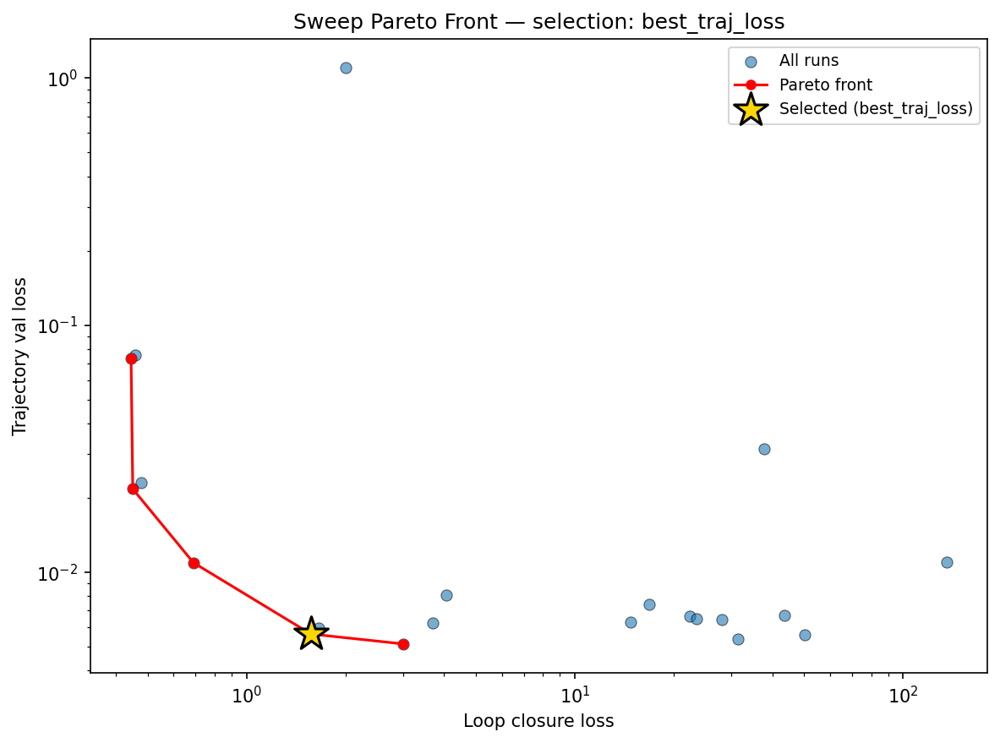

### reconstruction

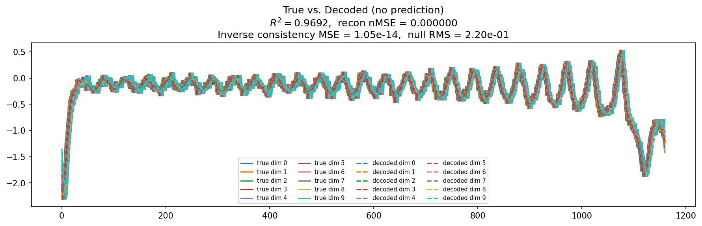

### prediction_windows

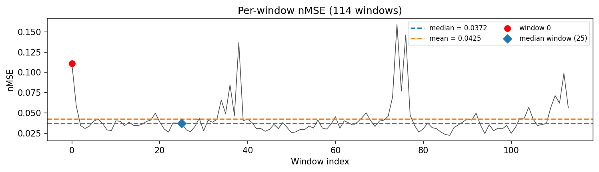

### long_trajectory

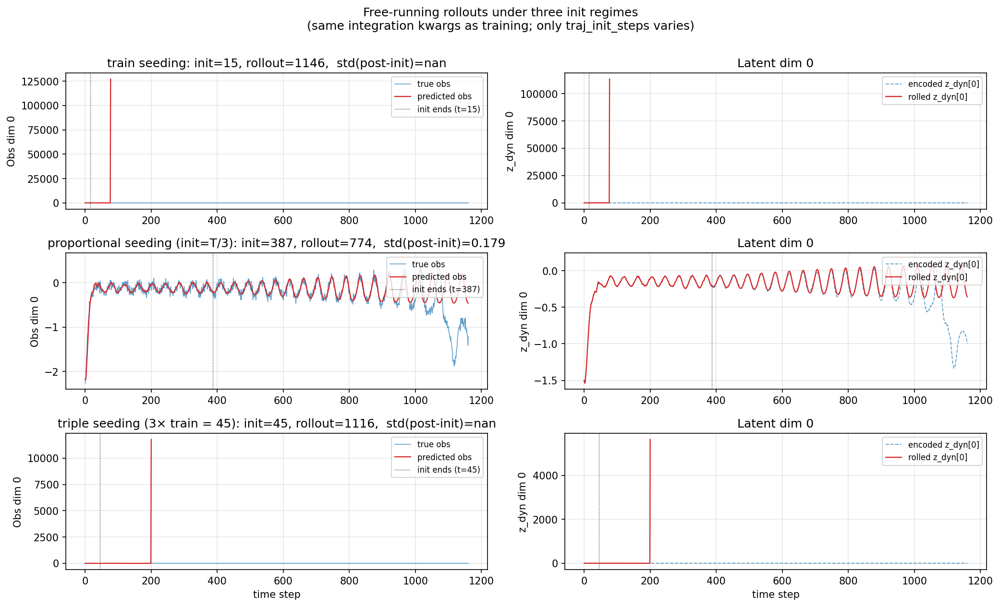

### mase

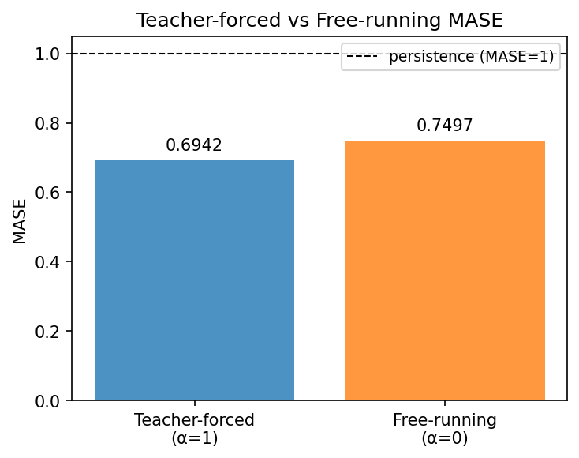

### latent_utilization

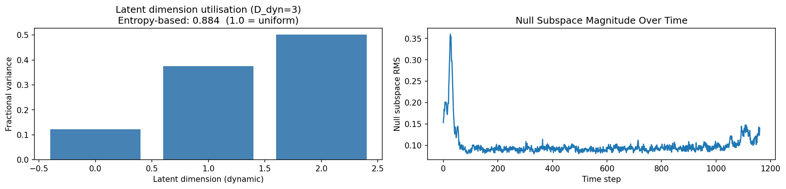

### lyapunov

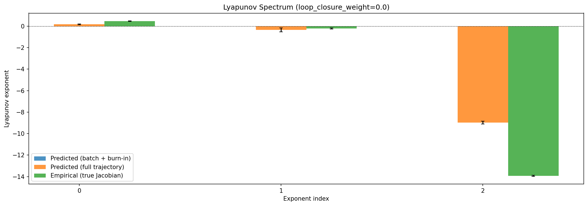

### kaplan_yorke

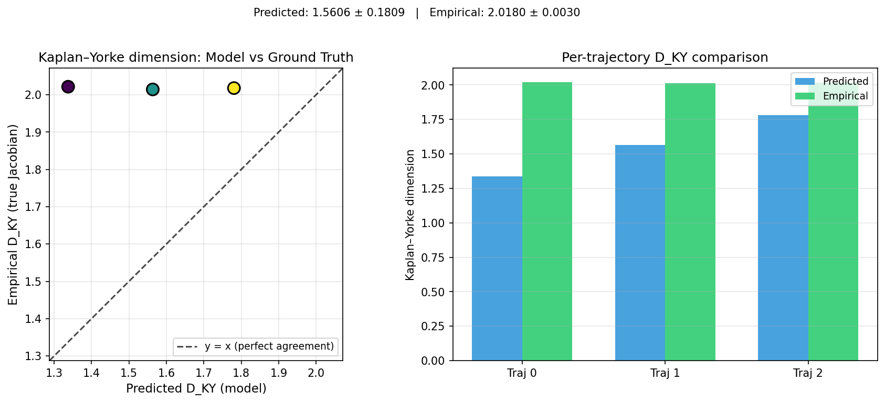

### per_run_lyapunov

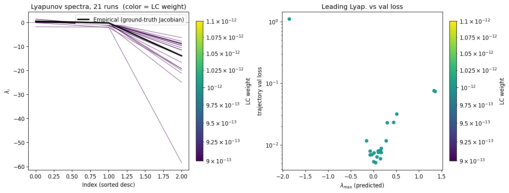

### per_run_lyapunov_vs_true

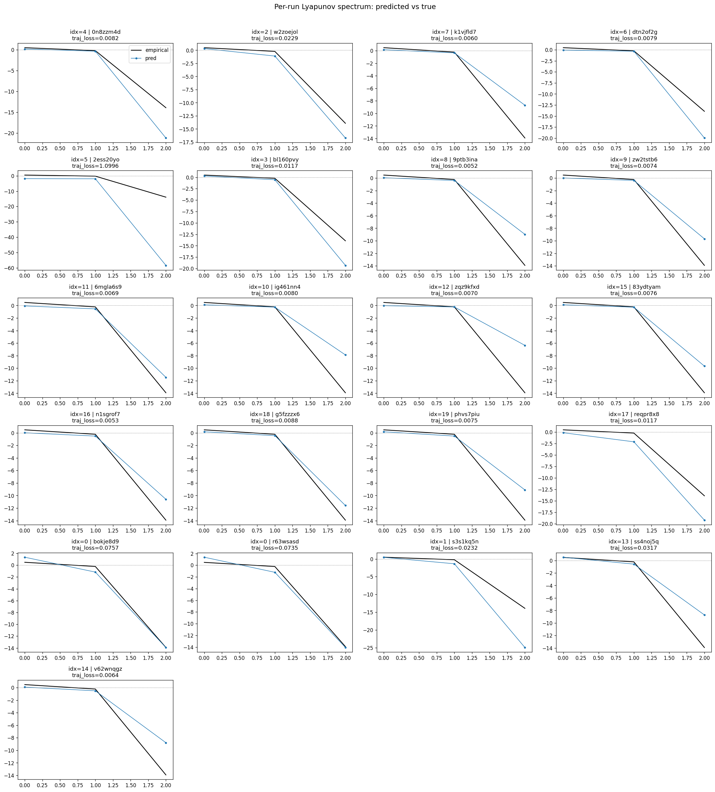

### per_run_lyapunov_relerr

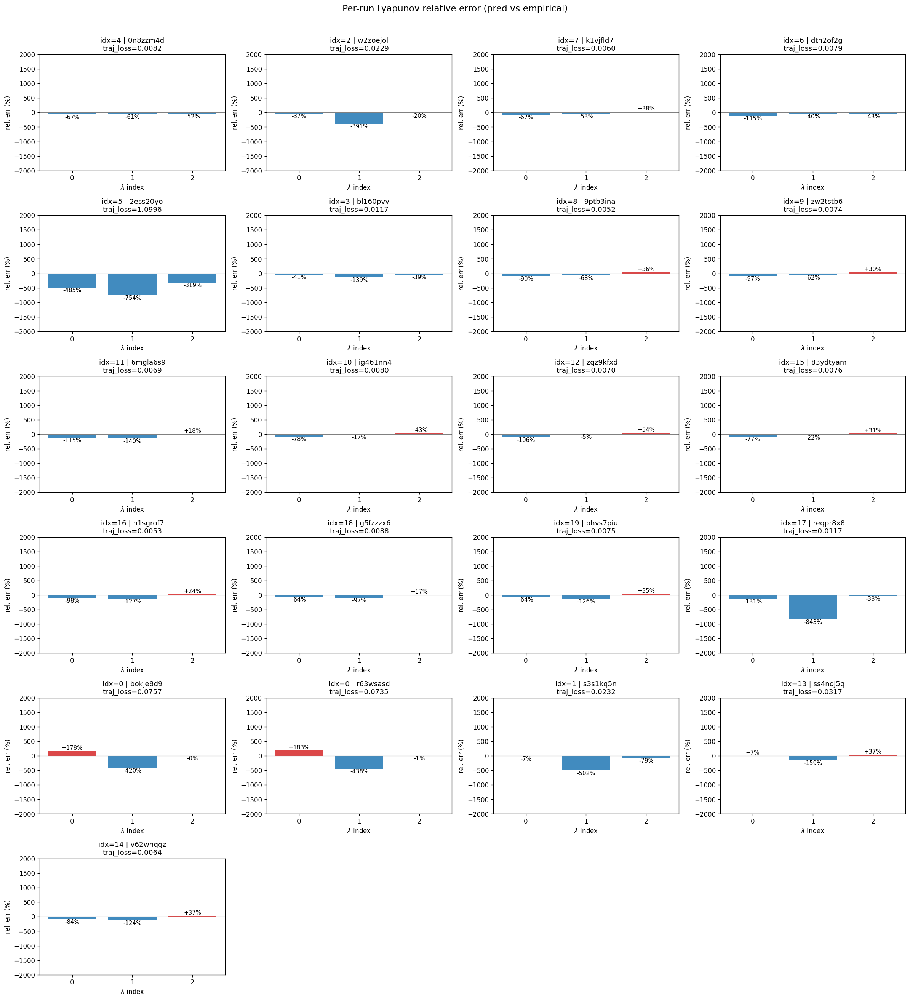

### encoder_decoder_jacobians

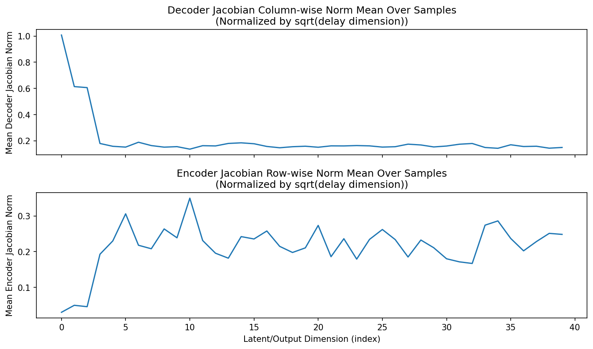

### amplification

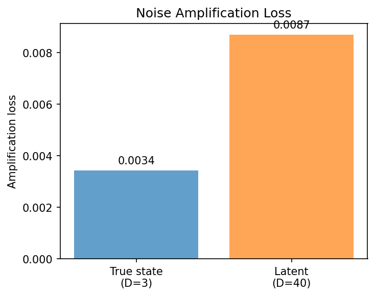

### kaplan_yorke_pca

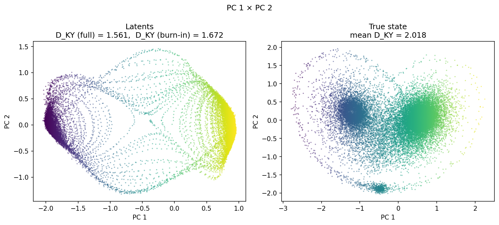

### prediction_detail_latent

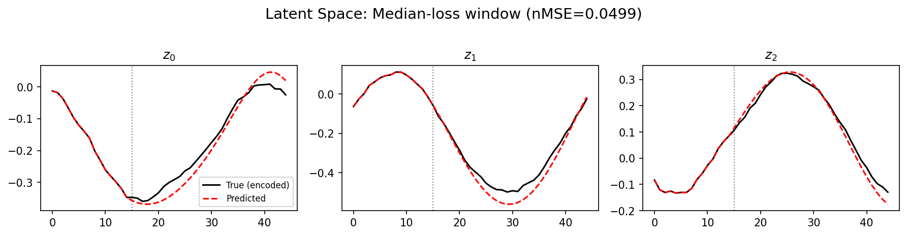

### prediction_detail_obs

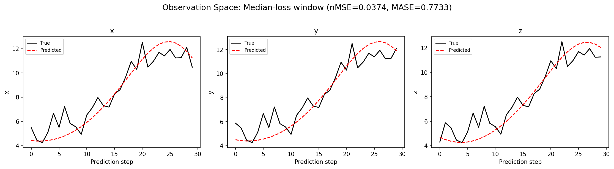

### tangent_spectrum

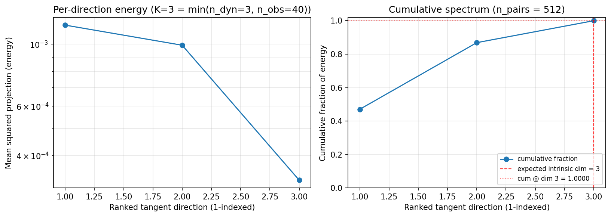

### per_run_tangent_spectrum

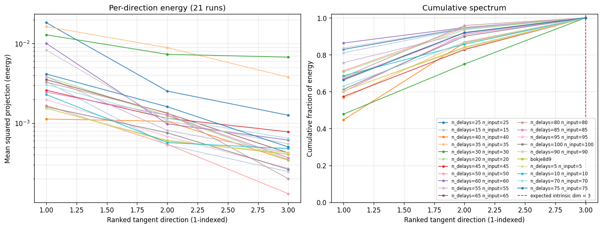

## Discussion

<!--
This section is intentionally left as a placeholder. A human reviewer
or Claude Code agent should fill it in based on the tables and figures
above, explicitly addressing each success criterion and comparing the
outcome to the stated hypothesis. Write the Discussion to
`discussion.md` in this directory and re-run `render_report`.
-->

_(to be written)_

## `run_analytics` stdout

<details><summary>Click to expand — full diagnostic output from <code>run_analytics</code></summary>

```
No run_id provided — selecting best run from group 'lorenz_partial_additive_mse_uniform_p30_obsnoise005_chain__ndelays_5_100_sweep' ...
Found 21 total runs in JacobianODE/Lorenz_INDpartial_NDsweep_D1_NormTrue__JacobianODE (group=lorenz_partial_additive_mse_uniform_p30_obsnoise005_chain__ndelays_5_100_sweep)
All runs (state, loop_closure_weight, tangent_entropy_weight, kl_dyn_weight):
  0n8zzm4d: state=crashed, lc=0.0, te=0.0, kl_dyn=0.0
  w2zoejol: state=crashed, lc=0.0, te=0.0, kl_dyn=0.0
  k1vjfld7: state=crashed, lc=0.0, te=0.0, kl_dyn=0.0
  dtn2of2g: state=crashed, lc=0.0, te=0.0, kl_dyn=0.0
  2ess20yo: state=finished, lc=0.0, te=0.0, kl_dyn=0.0
  bl160pvy: state=crashed, lc=0.0, te=0.0, kl_dyn=0.0
  9ptb3ina: state=finished, lc=0.0, te=0.0, kl_dyn=0.0
  zw2tstb6: state=crashed, lc=0.0, te=0.0, kl_dyn=0.0
  6mgla6s9: state=crashed, lc=0.0, te=0.0, kl_dyn=0.0
  ig461nn4: state=crashed, lc=0.0, te=0.0, kl_dyn=0.0
  zqz9kfxd: state=crashed, lc=0.0, te=0.0, kl_dyn=0.0
  83ydtyam: state=crashed, lc=0.0, te=0.0, kl_dyn=0.0
  n1sgrof7: state=finished, lc=0.0, te=0.0, kl_dyn=0.0
  g5fzzzx6: state=crashed, lc=0.0, te=0.0, kl_dyn=0.0
  phvs7piu: state=crashed, lc=0.0, te=0.0, kl_dyn=0.0
  reqpr8x8: state=crashed, lc=0.0, te=0.0, kl_dyn=0.0
  bokje8d9: state=crashed, lc=0.0, te=0.0, kl_dyn=0.0
  r63wsasd: state=crashed, lc=0.0, te=0.0, kl_dyn=0.0
  s3s1kq5n: state=finished, lc=0.0, te=0.0, kl_dyn=0.0
  ss4noj5q: state=finished, lc=0.0, te=0.0, kl_dyn=0.0
  v62wnqgz: state=running, lc=0.0, te=0.0, kl_dyn=0.0

slurm_timeout_min not found in any run config — falling back to 180 min
  Including 0n8zzm4d (lc=0.0): use_all_runs=True (state=crashed)
  Including w2zoejol (lc=0.0): use_all_runs=True (state=crashed)
  Including k1vjfld7 (lc=0.0): use_all_runs=True (state=crashed)
  Including dtn2of2g (lc=0.0): use_all_runs=True (state=crashed)
  Including 2ess20yo (lc=0.0): use_all_runs=True (state=finished)
  Including bl160pvy (lc=0.0): use_all_runs=True (state=crashed)
  Including 9ptb3ina (lc=0.0): use_all_runs=True (state=finished)
  Including zw2tstb6 (lc=0.0): use_all_runs=True (state=crashed)
  Including 6mgla6s9 (lc=0.0): use_all_runs=True (state=crashed)
  Including ig461nn4 (lc=0.0): use_all_runs=True (state=crashed)
  Including zqz9kfxd (lc=0.0): use_all_runs=True (state=crashed)
  Including 83ydtyam (lc=0.0): use_all_runs=True (state=crashed)
  Including n1sgrof7 (lc=0.0): use_all_runs=True (state=finished)
  Including g5fzzzx6 (lc=0.0): use_all_runs=True (state=crashed)
  Including phvs7piu (lc=0.0): use_all_runs=True (state=crashed)
  Including reqpr8x8 (lc=0.0): use_all_runs=True (state=crashed)
  Including bokje8d9 (lc=0.0): use_all_runs=True (state=crashed)
  Including r63wsasd (lc=0.0): use_all_runs=True (state=crashed)
  Including s3s1kq5n (lc=0.0): use_all_runs=True (state=finished)
  Including ss4noj5q (lc=0.0): use_all_runs=True (state=finished)
  Including v62wnqgz (lc=0.0): use_all_runs=True (state=running)
Found 21 effectively-done sweep runs:
  loop_closure_weight=0.0, tangent_entropy_weight=0.0, kl_dyn_weight=0.0 -> run_id=0n8zzm4d
  loop_closure_weight=0.0, tangent_entropy_weight=0.0, kl_dyn_weight=0.0 -> run_id=2ess20yo
  loop_closure_weight=0.0, tangent_entropy_weight=0.0, kl_dyn_weight=0.0 -> run_id=6mgla6s9
  loop_closure_weight=0.0, tangent_entropy_weight=0.0, kl_dyn_weight=0.0 -> run_id=83ydtyam
  loop_closure_weight=0.0, tangent_entropy_weight=0.0, kl_dyn_weight=0.0 -> run_id=9ptb3ina
  loop_closure_weight=0.0, tangent_entropy_weight=0.0, kl_dyn_weight=0.0 -> run_id=bl160pvy
  loop_closure_weight=0.0, tangent_entropy_weight=0.0, kl_dyn_weight=0.0 -> run_id=bokje8d9
  loop_closure_weight=0.0, tangent_entropy_weight=0.0, kl_dyn_weight=0.0 -> run_id=dtn2of2g
  loop_closure_weight=0.0, tangent_entropy_weight=0.0, kl_dyn_weight=0.0 -> run_id=g5fzzzx6
  loop_closure_weight=0.0, tangent_entropy_weight=0.0, kl_dyn_weight=0.0 -> run_id=ig461nn4
  loop_closure_weight=0.0, tangent_entropy_weight=0.0, kl_dyn_weight=0.0 -> run_id=k1vjfld7
  loop_closure_weight=0.0, tangent_entropy_weight=0.0, kl_dyn_weight=0.0 -> run_id=n1sgrof7
  loop_closure_weight=0.0, tangent_entropy_weight=0.0, kl_dyn_weight=0.0 -> run_id=phvs7piu
  loop_closure_weight=0.0, tangent_entropy_weight=0.0, kl_dyn_weight=0.0 -> run_id=r63wsasd
  loop_closure_weight=0.0, tangent_entropy_weight=0.0, kl_dyn_weight=0.0 -> run_id=reqpr8x8
  loop_closure_weight=0.0, tangent_entropy_weight=0.0, kl_dyn_weight=0.0 -> run_id=s3s1kq5n
  loop_closure_weight=0.0, tangent_entropy_weight=0.0, kl_dyn_weight=0.0 -> run_id=ss4noj5q
  loop_closure_weight=0.0, tangent_entropy_weight=0.0, kl_dyn_weight=0.0 -> run_id=v62wnqgz
  loop_closure_weight=0.0, tangent_entropy_weight=0.0, kl_dyn_weight=0.0 -> run_id=w2zoejol
  loop_closure_weight=0.0, tangent_entropy_weight=0.0, kl_dyn_weight=0.0 -> run_id=zqz9kfxd
  loop_closure_weight=0.0, tangent_entropy_weight=0.0, kl_dyn_weight=0.0 -> run_id=zw2tstb6
n_dims=25, n_latent=25, n_dyn=3, dt=0.0150
  run=0n8zzm4d: DiagnosticMetrics(one_step_mase=0.6574689745903015, loop_closure_loss=4.054520130157471, fast_eigenvalue_fraction=0.0, trajectory_val_loss=0.00808319728821516) (from W&B history)
  run=2ess20yo: DiagnosticMetrics(one_step_mase=2.2465319633483887, loop_closure_loss=2.005669355392456, fast_eigenvalue_fraction=0.0416666679084301, trajectory_val_loss=1.0995689630508423) (from W&B history)
  run=6mgla6s9: DiagnosticMetrics(one_step_mase=0.8203098177909851, loop_closure_loss=22.41213607788086, fast_eigenvalue_fraction=0.0, trajectory_val_loss=0.006613464560359716) (from W&B history)
  run=83ydtyam: DiagnosticMetrics(one_step_mase=0.8970001935958862, loop_closure_loss=43.450016021728516, fast_eigenvalue_fraction=0.0, trajectory_val_loss=0.006696376018226147) (from W&B history)
  run=9ptb3ina: DiagnosticMetrics(one_step_mase=0.7079468369483948, loop_closure_loss=3.008054733276367, fast_eigenvalue_fraction=0.0, trajectory_val_loss=0.005126113072037697) (from W&B history)
  run=bl160pvy: DiagnosticMetrics(one_step_mase=0.6329125761985779, loop_closure_loss=0.6890865564346313, fast_eigenvalue_fraction=0.0, trajectory_val_loss=0.010930359363555908) (from W&B history)
  run=bokje8d9: DiagnosticMetrics(one_step_mase=0.7261512279510498, loop_closure_loss=0.4575902819633484, fast_eigenvalue_fraction=0.0, trajectory_val_loss=0.07571537047624588) (from W&B history)
  run=dtn2of2g: DiagnosticMetrics(one_step_mase=0.6942533254623413, loop_closure_loss=16.896045684814453, fast_eigenvalue_fraction=0.0, trajectory_val_loss=0.007397010922431946) (from W&B history)
  run=g5fzzzx6: DiagnosticMetrics(one_step_mase=0.9467947483062744, loop_closure_loss=28.040613174438477, fast_eigenvalue_fraction=0.0, trajectory_val_loss=0.006419679615646601) (from W&B history)
  run=ig461nn4: DiagnosticMetrics(one_step_mase=0.9808865189552307, loop_closure_loss=3.7034389972686768, fast_eigenvalue_fraction=0.0, trajectory_val_loss=0.006226045545190573) (from W&B history)
  run=k1vjfld7: DiagnosticMetrics(one_step_mase=0.6845749020576477, loop_closure_loss=1.5710924863815308, fast_eigenvalue_fraction=0.0, trajectory_val_loss=0.005623101722449064) (from W&B history)
  run=n1sgrof7: DiagnosticMetrics(one_step_mase=0.8698402643203735, loop_closure_loss=31.41326904296875, fast_eigenvalue_fraction=0.0, trajectory_val_loss=0.005347886122763157) (from W&B history)
  run=phvs7piu: DiagnosticMetrics(one_step_mase=0.9796512126922607, loop_closure_loss=14.805009841918945, fast_eigenvalue_fraction=0.0, trajectory_val_loss=0.0062667070887982845) (from W&B history)
  run=r63wsasd: DiagnosticMetrics(one_step_mase=0.7289502024650574, loop_closure_loss=0.4448773264884949, fast_eigenvalue_fraction=0.0, trajectory_val_loss=0.07351799309253693) (from W&B history)
  run=reqpr8x8: DiagnosticMetrics(one_step_mase=1.075610876083374, loop_closure_loss=135.78948974609375, fast_eigenvalue_fraction=0.0, trajectory_val_loss=0.010971247218549252) (from W&B history)
  run=s3s1kq5n: DiagnosticMetrics(one_step_mase=0.6596358418464661, loop_closure_loss=0.4775063693523407, fast_eigenvalue_fraction=0.0, trajectory_val_loss=0.022967839613556862) (from W&B history)
  run=ss4noj5q: DiagnosticMetrics(one_step_mase=1.0664713382720947, loop_closure_loss=37.77985763549805, fast_eigenvalue_fraction=0.0, trajectory_val_loss=0.03165598213672638) (from W&B history)
  run=v62wnqgz: DiagnosticMetrics(one_step_mase=0.8508985042572021, loop_closure_loss=50.20488357543945, fast_eigenvalue_fraction=0.0, trajectory_val_loss=0.005598281044512987) (from W&B history)
  run=w2zoejol: DiagnosticMetrics(one_step_mase=0.6299511790275574, loop_closure_loss=0.4501948952674866, fast_eigenvalue_fraction=0.0, trajectory_val_loss=0.02172347530722618) (from W&B history)
  run=zqz9kfxd: DiagnosticMetrics(one_step_mase=0.8090766072273254, loop_closure_loss=23.533004760742188, fast_eigenvalue_fraction=0.0, trajectory_val_loss=0.00648955162614584) (from W&B history)
  run=zw2tstb6: DiagnosticMetrics(one_step_mase=0.7595682144165039, loop_closure_loss=1.6578952074050903, fast_eigenvalue_fraction=0.0, trajectory_val_loss=0.005958148278295994) (from W&B history)

Ranking method:           best_traj_loss
Best run ID:              k1vjfld7
Best loop_closure_weight: 0.0
Best tangent_entropy_weight: 0.0
Best kl_dyn_weight:       0.0
Best traj loss:           0.005623
Criteria applied: ['C1', 'C2', 'C3']
Surviving: 7 / 21
Auto-selected run_id: k1vjfld7

======================================================================
PARETO FRONTIER RUNS (5 runs)
======================================================================
  Run ID               LC Loss   Traj Val Loss
  ------------  --------------  --------------
  r63wsasd            0.444877        0.073518
  w2zoejol            0.450195        0.021723
  bl160pvy            0.689087        0.010930
  k1vjfld7            1.571092        0.005623 <-- selected
  9ptb3ina            3.008055        0.005126

======================================================================
RANKING METHOD COMPARISON (over 7 survivors)
======================================================================
  Method                  Run ID               LC Loss   Traj Val Loss
  ----------------------  ------------  --------------  --------------
  best_traj_loss          k1vjfld7            1.571092        0.005623 <-- active
  pareto_knee             w2zoejol            0.450195        0.021723
  geo_rank                k1vjfld7            1.571092        0.005623
  minimax_rank            w2zoejol            0.450195        0.021723
  geo_log_score           k1vjfld7            1.571092        0.005623
  minimax_log_score       bl160pvy            0.689087        0.010930
======================================================================

Loading run k1vjfld7 from JacobianODE/Lorenz_INDpartial_NDsweep_D1_NormTrue__JacobianODE ...
Loading checkpoint epoch=91-step=18400.ckpt...
Train dataset shape: torch.Size([24552, 45, 40])
Validation dataset shape: torch.Size([7812, 45, 40])
Test dataset shape: torch.Size([3348, 45, 40])
Train trajectories dataset shape: torch.Size([22, 1161, 40])
Validation trajectories dataset shape: torch.Size([7, 1161, 40])
Test trajectories dataset shape: torch.Size([3, 1161, 40])
Loading checkpoint epoch=91-step=18400.ckpt...
Computing reconstruction ...
Computing MASE ...
Teacher-forced MASE: 0.6942
Free-running MASE:   0.7497
Computing latent utilization ...
Entropy-based utilization: 0.884
Null subspace mean RMS: 1.043494e-01
Computing Lyapunov exponents ...
  Computing full-trajectory Lyapunov (3 test trajs, T=1161) ...
Predicted Lyapunov exponents (batch+burn-in, 128 windowed trajs):
  λ_1 = +nan ± nan
  λ_2 = +nan ± nan
  λ_3 = +nan ± nan
Predicted Lyapunov exponents (full-length, 3 test trajs):
  λ_1 = +0.1685 ± 0.0305
  λ_2 = -0.3425 ± 0.1828
  λ_3 = -8.9733 ± 0.1227
Empirical Lyapunov exponents (mean ± std):
  λ_1 = +0.4677 ± 0.0259
  λ_2 = -0.2173 ± 0.0549
  λ_3 = -13.9174 ± 0.0513
Mean KY dim (predicted): 1.561 ± 0.181
Mean KY dim (empirical): 2.018 ± 0.003
Mean KY dim (burn-in):   1.672 ± 0.502
Computing prediction windows ...
Windows: 114 — nMSE min=0.0224, median=0.0372, mean=0.0425, max=0.1596
Computing long-trajectory free-running rollouts ...
Computing encoder/decoder Jacobians ...
encoder_jacobian: (128, 40, 40)
decoder_jacobian: (128, 40, 40)
Computing amplification loss ...
Amplification loss — True state: 0.003431
Amplification loss — Latent:     0.008702
Computing tangent space spectrum ...
```

</details>
