# Sweep Analysis: `lorenz_partial_additive_splitmode_p30_obsnoise005_cayley_autodim_chain__ndelays_5_100_sweep`

**Project**: [Lorenz_INDpartial_NDsweep_cayley_autodim_D1_NormTrue__JacobianODE](https://wandb.ai/JacobianODE/Lorenz_INDpartial_NDsweep_cayley_autodim_D1_NormTrue__JacobianODE/groups/lorenz_partial_additive_splitmode_p30_obsnoise005_cayley_autodim_chain__ndelays_5_100_sweep)  
**Launched**: 2026-05-02T19:50:17Z  
**Completed**: 2026-05-03T01:35:24Z  
**Outcome**: `complete_clean`  
**Git**: `latent-JacobianODE` @ `41023f1`  
**Expected runs**: 20

## Experiment Context

### `lorenz_partial_additive_splitmode_p30_obsnoise005_cayley_autodim_chain__ndelays_5_100_sweep`

**Description**

Lorenz partial additive coupling, PCA-99 autodim + split-mode +
Cayley + near-identity init + TF-coupled LR. Single observed channel
(idx 0), obs_noise=0.05, prediction_steps=30, traj_init_steps=15.
Sweeps delay_embedding_params.n_delays over [5, 10, ..., 100] (20
cells). n_target_dims is auto-picked per cell from the noisy training
delay-embeddings via PCA-99; encoder.n_input is auto-resolved from
n_delays at Hydra runtime.
On reap, the chain dispatches the top-3 n_delays into the Cayley LC
× obs_noise grid sweep `..._cayley_autodim_top3nd__lc_obsnoisescale_sweep`.

**Hypothesis**

With the standard Cayley + autodim + split-mode recipe, the n_delays
optimum may shift vs the prior non-Cayley non-autodim scout (which
fixed n_target_dims=3 and used random permutations). Identity-start
+ Cayley should give a cleaner curve over n_delays since the encoder
no longer has random-permutation slop fighting against the dynamics
MLP. PCA-99 lets the latent dim grow with the embedding dim where
needed.

**Success criteria**

- All 20 cells train without divergence
- Per-cell autodim n_target_dims logged (expect growth with n_delays)
- Best traj_loss is monotone-or-curve in n_delays (no random scatter)
- On reap, controller logs '[chain ...] axis_select OK' and grid instruction lands in instructions/pending/

## Results

**Swept axes** (22): `data.train_test_params.delay_embedding_params.n_delays`, `model.encoder.n_input`, `model.n_target_dims`, `model.n_target_dims_pca_auto`, `model.n_target_dims_pca_cum_var`, `model.params.input_dim`, `model.params.output_dim`, `training.lightning.cosine_T_max`, `training.lightning.diffeomorphism_weight`, `training.lightning.latent_noise_per_step`, `training.lightning.latent_noise_scale`, `training.lightning.learn_fnn_weight`, `training.lightning.learn_jac_cons_weight`, `training.lightning.learn_jac_norm_weight`, `training.lightning.learn_loop_closure_weight`, `training.lightning.learn_r2_weight`, `training.lightning.log_var_init`, `training.lightning.loop_closure_int_method`, `training.lightning.precompute_latent_noise_factor`, `training.lightning.tangent_entropy_mode`, `training.lightning.tangent_entropy_n_samples`, `training.lightning.tangent_entropy_weight`

**Chosen run** (by `best_traj_loss`): `6pt0eef4` — traj_loss=0.00514, MASE=0.7603, R²=0.9866, LC loss=30.974, epoch=107.0

Swept-axis values at chosen run: `data.train_test_params.delay_embedding_params.n_delays`=85 · `model.encoder.n_input`=85 · `model.n_target_dims`=14 · `model.n_target_dims_pca_auto`=14 · `model.n_target_dims_pca_cum_var`=0.990074 · `model.params.input_dim`=14 · `model.params.output_dim`=196 · `training.lightning.cosine_T_max`=100 · `training.lightning.diffeomorphism_weight`=0 · `training.lightning.latent_noise_per_step`=False · `training.lightning.latent_noise_scale`=0 · `training.lightning.learn_fnn_weight`=False · `training.lightning.learn_jac_cons_weight`=False · `training.lightning.learn_jac_norm_weight`=False · `training.lightning.learn_loop_closure_weight`=False · `training.lightning.learn_r2_weight`=False · `training.lightning.log_var_init`=auto · `training.lightning.loop_closure_int_method`=Trapezoid · `training.lightning.precompute_latent_noise_factor`=True · `training.lightning.tangent_entropy_mode`=quadratic · `training.lightning.tangent_entropy_n_samples`=256 · `training.lightning.tangent_entropy_weight`=0

**Runs analyzed**: 20 (expected 20)

### Per-run results

| run_idx | run_id | `data.train_test_params.delay_embedding_params.n_delays` | `model.encoder.n_input` | `model.n_target_dims` | `model.n_target_dims_pca_auto` | `model.n_target_dims_pca_cum_var` | `model.params.input_dim` | `model.params.output_dim` | `training.lightning.cosine_T_max` | `training.lightning.diffeomorphism_weight` | `training.lightning.latent_noise_per_step` | `training.lightning.latent_noise_scale` | `training.lightning.learn_fnn_weight` | `training.lightning.learn_jac_cons_weight` | `training.lightning.learn_jac_norm_weight` | `training.lightning.learn_loop_closure_weight` | `training.lightning.learn_r2_weight` | `training.lightning.log_var_init` | `training.lightning.loop_closure_int_method` | `training.lightning.precompute_latent_noise_factor` | `training.lightning.tangent_entropy_mode` | `training.lightning.tangent_entropy_n_samples` | `training.lightning.tangent_entropy_weight` | best_traj_loss | best_MASE | R² | LC loss | epoch |
|---|---|---|---|---|---|---|---|---|---|---|---|---|---|---|---|---|---|---|---|---|---|---|---|---|---|---|---|---|
| 16 | `6pt0eef4` | 85 | 85 | 14 | 14 | 0.990074 | 14 | 196 | 100 | 0 | False | 0 | False | False | False | False | False | auto | Trapezoid | True | quadratic | 256 | 0 | 0.00514 | 0.7603 | 0.9866 | 30.974 | 107.0 |
| 12 | `z6rq7a88` | 65 | 65 | 11 | 11 | 0.990219 | 11 | 121 | 100 | 0 | False | 0 | False | False | False | False | False | auto | Trapezoid | True | quadratic | 256 | 0 | 0.00537 | 0.7667 | 0.9857 | 19.869 | 109.0 |
| 14 | `4a0qqu1o` | 75 | 75 | 12 | 12 | 0.990036 | 12 | 144 | 100 | 0 | False | 0 | False | False | False | False | False | auto | Trapezoid | True | quadratic | 256 | 0 | 0.00570 | 0.7839 | 0.9846 | 23.872 | 72.0 |
| 17 | `3cwrrjbb` | 90 | 90 | 15 | 15 | 0.990087 | 15 | 225 | 100 | 0 | False | 0 | False | False | False | False | False | auto | Trapezoid | True | quadratic | 256 | 0 | 0.00572 | 0.7846 | 0.9847 | 22.492 | 108.0 |
| 10 | `o0fzjaqg` | 55 | 55 | 9 | 9 | 0.990192 | 9 | 81 | 100 | 0 | False | 0 | False | False | False | False | False | auto | Trapezoid | True | quadratic | 256 | 0 | 0.00574 | 0.7868 | 0.9847 | 35.921 | 114.0 |
| 19 | `b6rqlpix` | 100 | 100 | 17 | 17 | 0.990106 | 17 | 289 | 100 | 0 | False | 0 | False | False | False | False | False | auto | Trapezoid | True | quadratic | 256 | 0 | 0.00585 | 0.7914 | 0.9843 | 19.076 | 103.0 |
| 11 | `01ngc7hg` | 60 | 60 | 10 | 10 | 0.990208 | 10 | 100 | 100 | 0 | False | 0 | False | False | False | False | False | auto | Trapezoid | True | quadratic | 256 | 0 | 0.00599 | 0.7923 | 0.9839 | 22.288 | 108.0 |
| 5 | `j0xl13ov` | 30 | 30 | 5 | 5 | 0.990271 | 5 | 25 | 100 | 0 | False | 0 | False | False | False | False | False | auto | Trapezoid | True | quadratic | 256 | 0 | 0.00628 | 0.8104 | 0.9833 | 26.403 | 103.0 |
| 15 | `7cd0v85y` | 80 | 80 | 13 | 13 | 0.990058 | 13 | 169 | 100 | 0 | False | 0 | False | False | False | False | False | auto | Trapezoid | True | quadratic | 256 | 0 | 0.00639 | 0.7958 | 0.9830 | 21.745 | 105.0 |
| 7 | `2g14oxfz` | 40 | 40 | 7 | 7 | 0.990472 | 7 | 49 | 100 | 0 | False | 0 | False | False | False | False | False | auto | Trapezoid | True | quadratic | 256 | 0 | 0.00647 | 0.7993 | 0.9828 | 14.463 | 90.0 |
| 6 | `l8eqint7` | 35 | 35 | 6 | 6 | 0.990408 | 6 | 36 | 100 | 0 | False | 0 | False | False | False | False | False | auto | Trapezoid | True | quadratic | 256 | 0 | 0.00653 | 0.7997 | 0.9828 | 12.577 | 108.0 |
| 8 | `dvd4m4j6` | 45 | 45 | 7 | 7 | 0.990085 | 7 | 49 | 100 | 0 | False | 0 | False | False | False | False | False | auto | Trapezoid | True | quadratic | 256 | 0 | 0.00684 | 0.8164 | 0.9807 | 10.715 | 41.0 |
| 9 | `00uwjk1l` | 50 | 50 | 8 | 8 | 0.990154 | 8 | 64 | 100 | 0 | False | 0 | False | False | False | False | False | auto | Trapezoid | True | quadratic | 256 | 0 | 0.00717 | 0.8150 | 0.9806 | 30.240 | 74.0 |
| 13 | `yv4qyo8g` | 70 | 70 | 11 | 11 | 0.990007 | 11 | 121 | 100 | 0 | False | 0 | False | False | False | False | False | auto | Trapezoid | True | quadratic | 256 | 0 | 0.00773 | 0.8025 | 0.9795 | 30.263 | 70.0 |
| 18 | `4dg41gx9` | 95 | 95 | 16 | 16 | 0.990098 | 16 | 256 | 100 | 0 | False | 0 | False | False | False | False | False | auto | Trapezoid | True | quadratic | 256 | 0 | 0.00830 | 0.8565 | 0.9776 | 18.250 | 47.0 |
| 4 | `agayvyh6` | 25 | 25 | 5 | 5 | 0.990796 | 5 | 25 | 100 | 0 | False | 0 | False | False | False | False | False | auto | Trapezoid | True | quadratic | 256 | 0 | 0.00971 | 0.8971 | 0.9744 | 7.508 | 109.0 |
| 3 | `dlnfq59a` | 20 | 20 | 4 | 4 | 0.990715 | 4 | 16 | None | None | None | None | None | None | None | None | None | None | None | None | None | None | None | 0.01155 | 0.9457 | 0.9688 | 12.392 | 126.0 |
| 2 | `0kq9y1x2` | 15 | 15 | 3 | 3 | 0.990585 | 3 | 9 | None | None | None | None | None | None | None | None | None | None | None | None | None | None | None | 0.02247 | 1.1464 | 0.9406 | 0.512 | 93.0 |
| 1 | `kgcwcd7m` | 10 | 10 | 3 | 3 | 0.991956 | 3 | 9 | 100 | 0 | False | 0 | False | False | False | False | False | auto | Trapezoid | True | quadratic | 256 | 0 | 0.02472 | 1.3354 | 0.9343 | 0.275 | 89.0 |
| 0 | `imwiz3cy` | 5 | 5 | 2 | 2 | 0.993071 | 2 | 4 | 100 | 0 | False | 0 | False | False | False | False | False | auto | Trapezoid | True | quadratic | 256 | 0 | 0.06177 | 2.2958 | 0.8371 | 0.224 | 151.0 |

## Success-criteria verdicts (automated)

| Criterion | Verdict | Note |
|---|---|---|
| All 20 cells train without divergence | **Unknown** |  |
| Per-cell autodim n_target_dims logged (expect growth with n_delays) | **Unknown** |  |
| Best traj_loss is monotone-or-curve in n_delays (no random scatter) | **Unknown** |  |
| On reap, controller logs '[chain ...] axis_select OK' and grid instruction lands in instructions/pending/ | **Unknown** |  |

_Automated verdicts use simple numeric-threshold parsing and may mis-classify qualitative criteria. The Discussion section below takes precedence._

## Figures

### sweep_overview

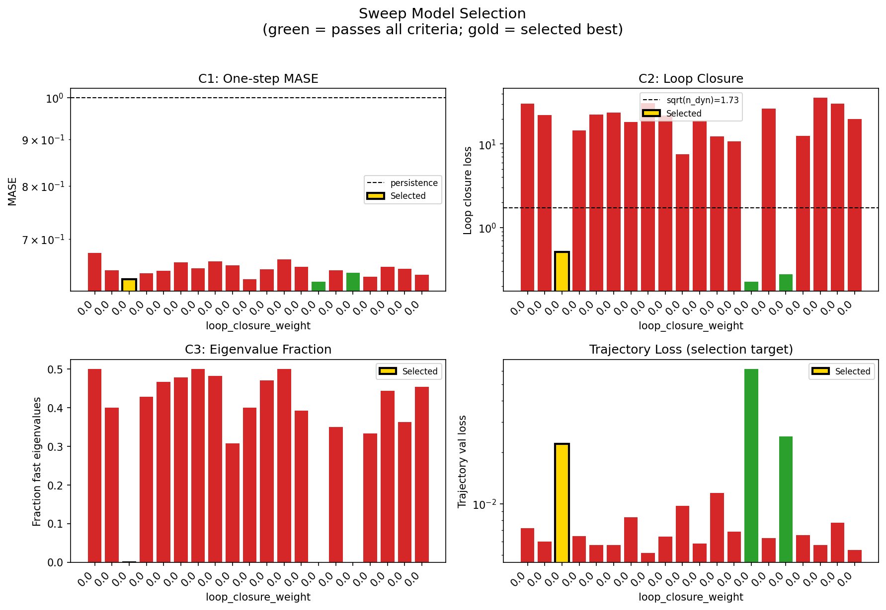

### sweep_pareto

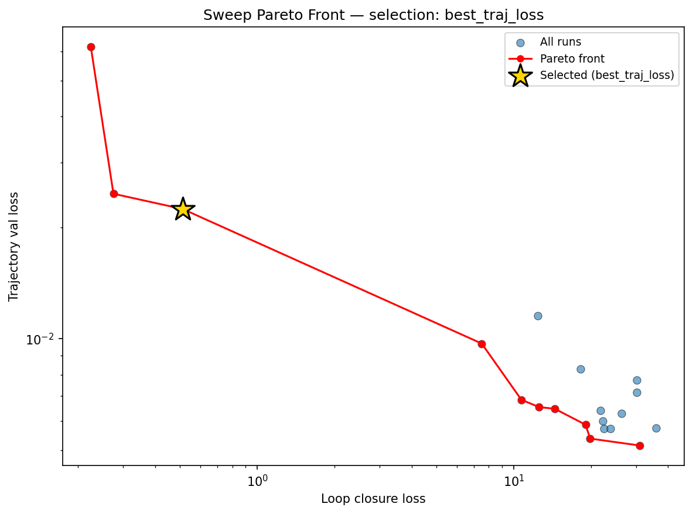

### reconstruction

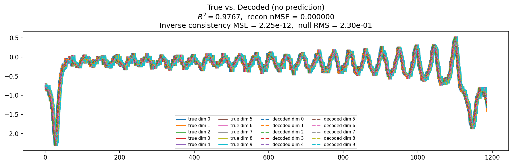

### prediction_windows

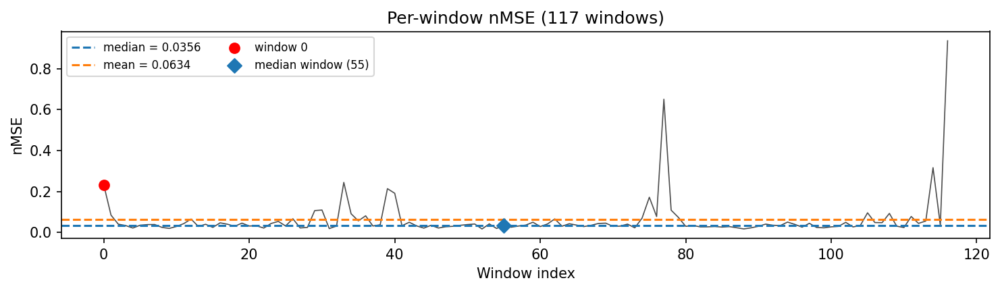

### long_trajectory

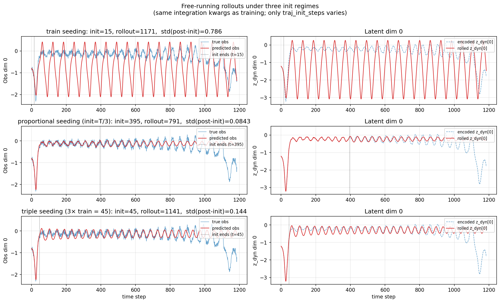

### mase

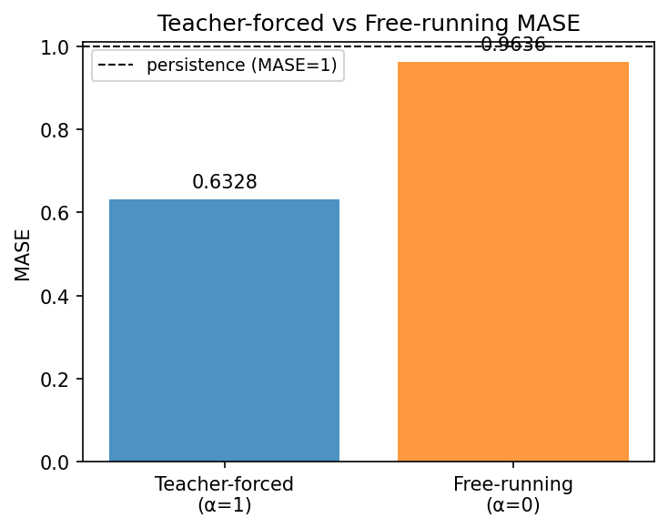

### latent_utilization

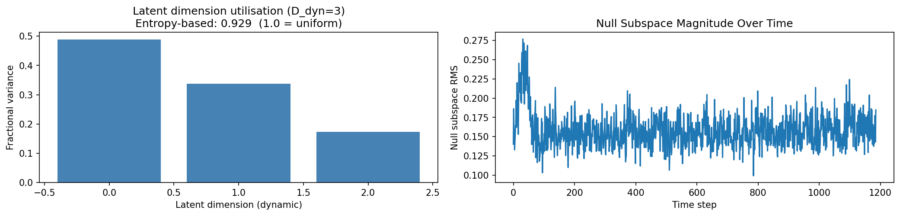

### lyapunov

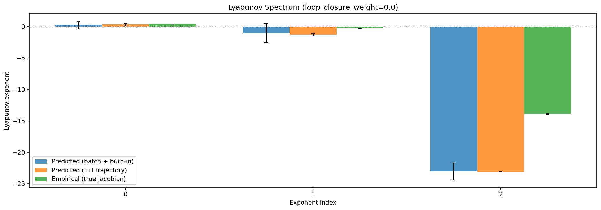

### kaplan_yorke

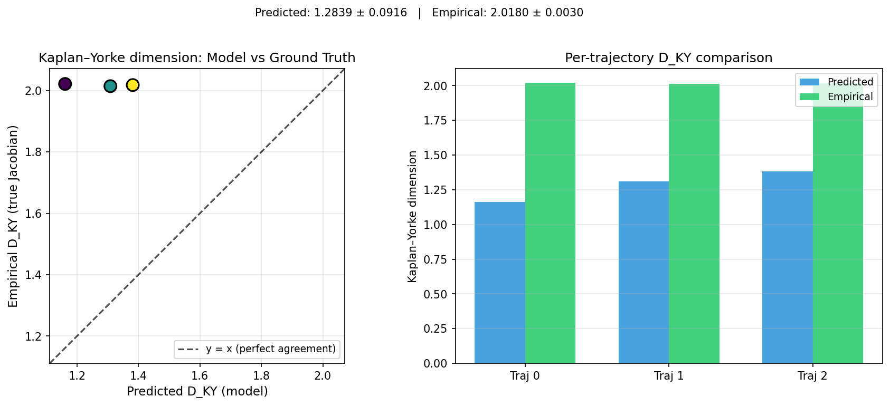

### per_run_lyapunov

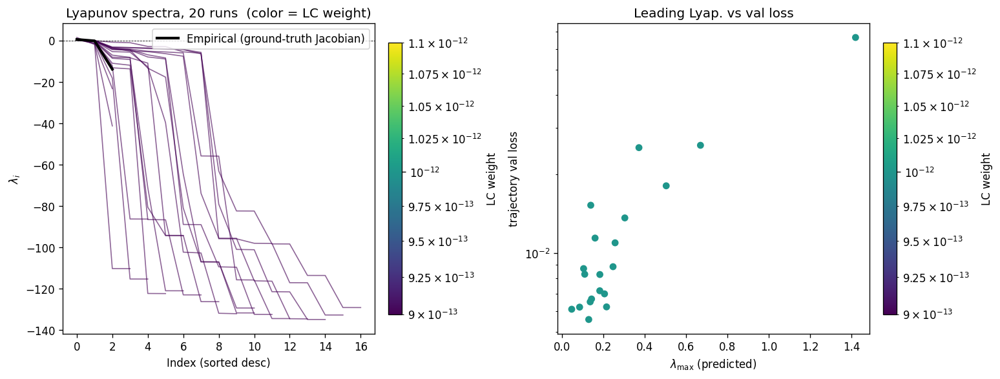

### per_run_lyapunov_vs_true

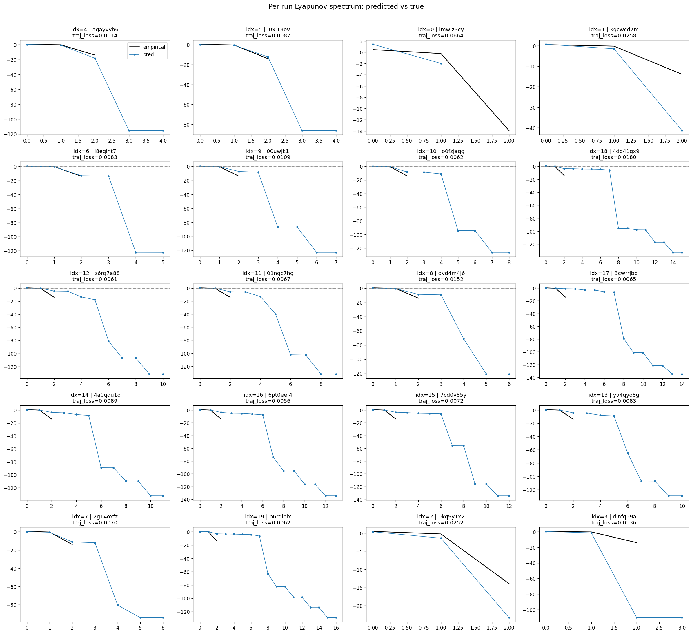

### per_run_lyapunov_relerr

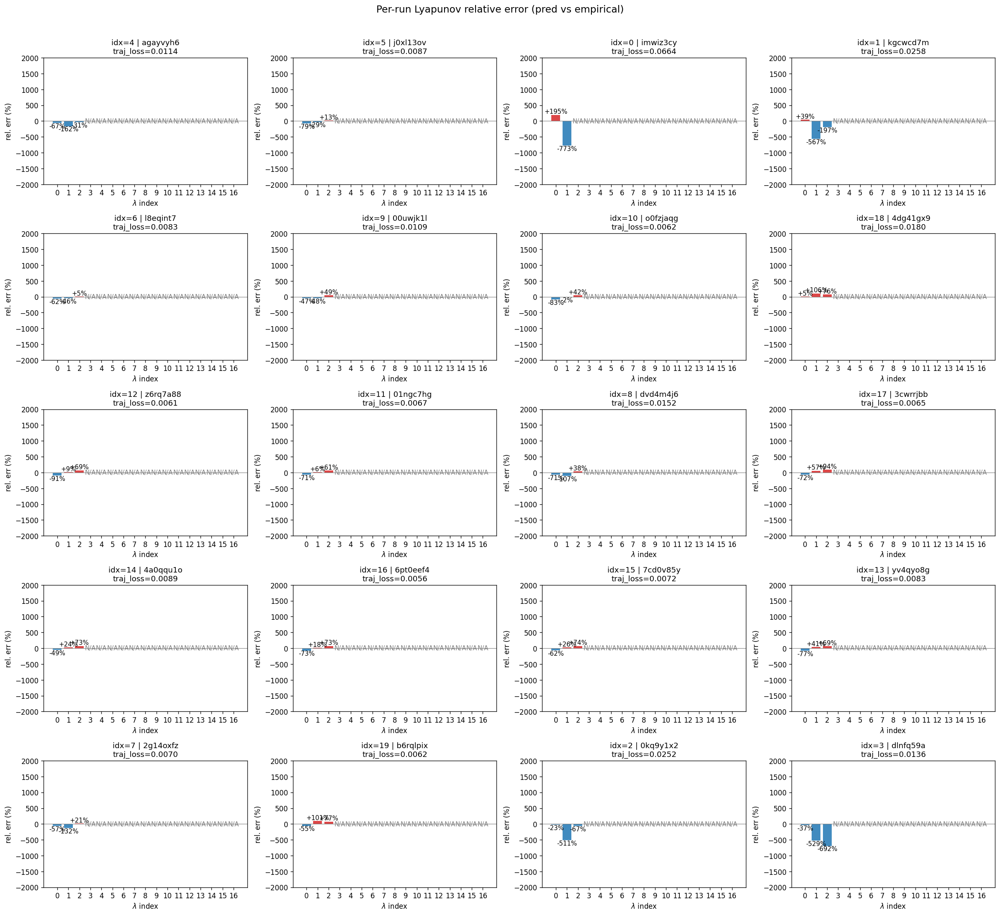

### encoder_decoder_jacobians

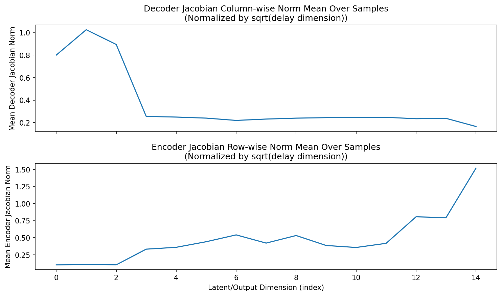

### amplification

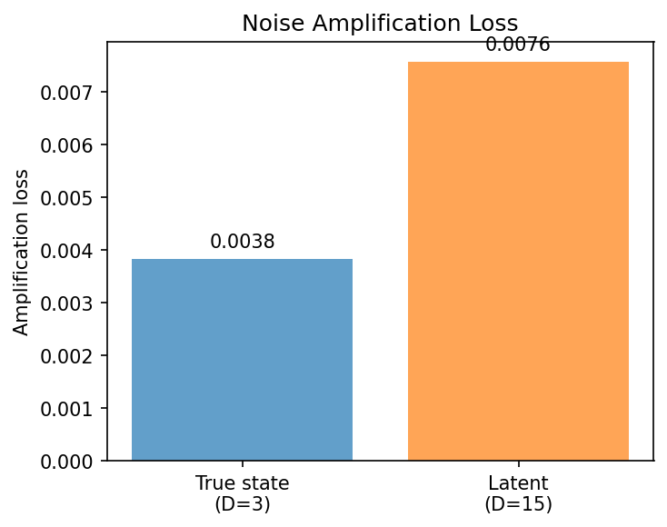

### kaplan_yorke_pca

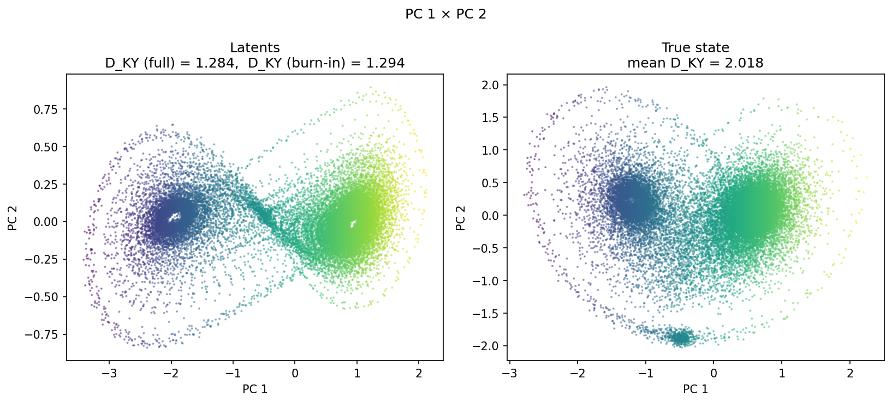

### prediction_detail_latent

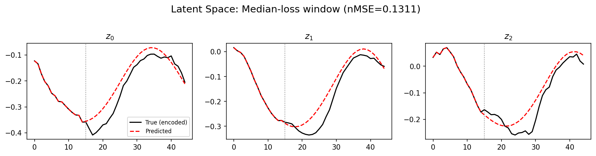

### prediction_detail_obs

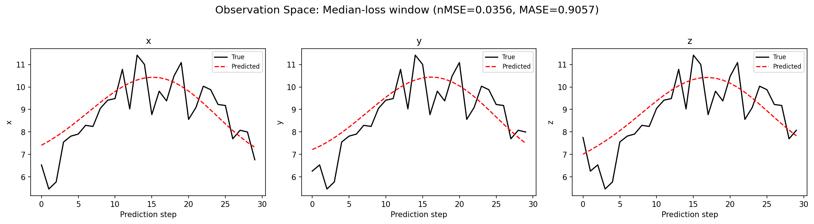

### tangent_spectrum

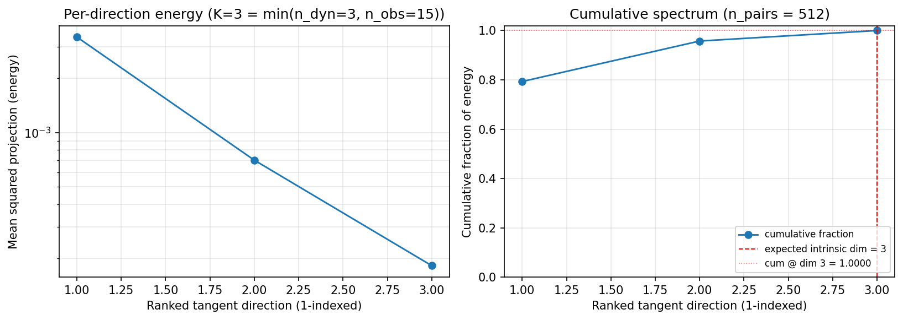

### per_run_tangent_spectrum

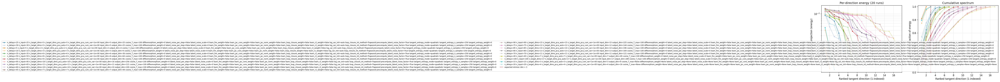

## Discussion

<!--
This section is intentionally left as a placeholder. A human reviewer
or Claude Code agent should fill it in based on the tables and figures
above, explicitly addressing each success criterion and comparing the
outcome to the stated hypothesis. Write the Discussion to
`discussion.md` in this directory and re-run `render_report`.
-->

_(to be written)_

## `run_analytics` stdout

<details><summary>Click to expand — full diagnostic output from <code>run_analytics</code></summary>

```
No run_id provided — selecting best run from group 'lorenz_partial_additive_splitmode_p30_obsnoise005_cayley_autodim_chain__ndelays_5_100_sweep' ...
Found 20 total runs in JacobianODE/Lorenz_INDpartial_NDsweep_cayley_autodim_D1_NormTrue__JacobianODE (group=lorenz_partial_additive_splitmode_p30_obsnoise005_cayley_autodim_chain__ndelays_5_100_sweep)
All runs (state, loop_closure_weight, tangent_entropy_weight, kl_dyn_weight):
  agayvyh6: state=crashed, lc=0.0, te=0.0, kl_dyn=0.0
  j0xl13ov: state=crashed, lc=0.0, te=0.0, kl_dyn=0.0
  imwiz3cy: state=crashed, lc=0.0, te=0.0, kl_dyn=0.0
  kgcwcd7m: state=finished, lc=0.0, te=0.0, kl_dyn=0.0
  l8eqint7: state=crashed, lc=0.0, te=0.0, kl_dyn=0.0
  00uwjk1l: state=finished, lc=0.0, te=0.0, kl_dyn=0.0
  o0fzjaqg: state=crashed, lc=0.0, te=0.0, kl_dyn=0.0
  4dg41gx9: state=finished, lc=0.0, te=0.0, kl_dyn=0.0
  z6rq7a88: state=crashed, lc=0.0, te=0.0, kl_dyn=0.0
  01ngc7hg: state=crashed, lc=0.0, te=0.0, kl_dyn=0.0
  dvd4m4j6: state=finished, lc=0.0, te=0.0, kl_dyn=0.0
  3cwrrjbb: state=crashed, lc=0.0, te=0.0, kl_dyn=0.0
  4a0qqu1o: state=finished, lc=0.0, te=0.0, kl_dyn=0.0
  6pt0eef4: state=crashed, lc=0.0, te=0.0, kl_dyn=0.0
  7cd0v85y: state=crashed, lc=0.0, te=0.0, kl_dyn=0.0
  yv4qyo8g: state=crashed, lc=0.0, te=0.0, kl_dyn=0.0
  2g14oxfz: state=crashed, lc=0.0, te=0.0, kl_dyn=0.0
  b6rqlpix: state=crashed, lc=0.0, te=0.0, kl_dyn=0.0
  0kq9y1x2: state=finished, lc=0.0, te=0.0, kl_dyn=0.0
  dlnfq59a: state=running, lc=0.0, te=0.0, kl_dyn=0.0

slurm_timeout_min not found in any run config — falling back to 180 min
  Including agayvyh6 (lc=0.0): use_all_runs=True (state=crashed)
  Including j0xl13ov (lc=0.0): use_all_runs=True (state=crashed)
  Including imwiz3cy (lc=0.0): use_all_runs=True (state=crashed)
  Including kgcwcd7m (lc=0.0): use_all_runs=True (state=finished)
  Including l8eqint7 (lc=0.0): use_all_runs=True (state=crashed)
  Including 00uwjk1l (lc=0.0): use_all_runs=True (state=finished)
  Including o0fzjaqg (lc=0.0): use_all_runs=True (state=crashed)
  Including 4dg41gx9 (lc=0.0): use_all_runs=True (state=finished)
  Including z6rq7a88 (lc=0.0): use_all_runs=True (state=crashed)
  Including 01ngc7hg (lc=0.0): use_all_runs=True (state=crashed)
  Including dvd4m4j6 (lc=0.0): use_all_runs=True (state=finished)
  Including 3cwrrjbb (lc=0.0): use_all_runs=True (state=crashed)
  Including 4a0qqu1o (lc=0.0): use_all_runs=True (state=finished)
  Including 6pt0eef4 (lc=0.0): use_all_runs=True (state=crashed)
  Including 7cd0v85y (lc=0.0): use_all_runs=True (state=crashed)
  Including yv4qyo8g (lc=0.0): use_all_runs=True (state=crashed)
  Including 2g14oxfz (lc=0.0): use_all_runs=True (state=crashed)
  Including b6rqlpix (lc=0.0): use_all_runs=True (state=crashed)
  Including 0kq9y1x2 (lc=0.0): use_all_runs=True (state=finished)
  Including dlnfq59a (lc=0.0): use_all_runs=True (state=running)
Found 20 effectively-done sweep runs:
  loop_closure_weight=0.0, tangent_entropy_weight=0.0, kl_dyn_weight=0.0 -> run_id=00uwjk1l
  loop_closure_weight=0.0, tangent_entropy_weight=0.0, kl_dyn_weight=0.0 -> run_id=01ngc7hg
  loop_closure_weight=0.0, tangent_entropy_weight=0.0, kl_dyn_weight=0.0 -> run_id=0kq9y1x2
  loop_closure_weight=0.0, tangent_entropy_weight=0.0, kl_dyn_weight=0.0 -> run_id=2g14oxfz
  loop_closure_weight=0.0, tangent_entropy_weight=0.0, kl_dyn_weight=0.0 -> run_id=3cwrrjbb
  loop_closure_weight=0.0, tangent_entropy_weight=0.0, kl_dyn_weight=0.0 -> run_id=4a0qqu1o
  loop_closure_weight=0.0, tangent_entropy_weight=0.0, kl_dyn_weight=0.0 -> run_id=4dg41gx9
  loop_closure_weight=0.0, tangent_entropy_weight=0.0, kl_dyn_weight=0.0 -> run_id=6pt0eef4
  loop_closure_weight=0.0, tangent_entropy_weight=0.0, kl_dyn_weight=0.0 -> run_id=7cd0v85y
  loop_closure_weight=0.0, tangent_entropy_weight=0.0, kl_dyn_weight=0.0 -> run_id=agayvyh6
  loop_closure_weight=0.0, tangent_entropy_weight=0.0, kl_dyn_weight=0.0 -> run_id=b6rqlpix
  loop_closure_weight=0.0, tangent_entropy_weight=0.0, kl_dyn_weight=0.0 -> run_id=dlnfq59a
  loop_closure_weight=0.0, tangent_entropy_weight=0.0, kl_dyn_weight=0.0 -> run_id=dvd4m4j6
  loop_closure_weight=0.0, tangent_entropy_weight=0.0, kl_dyn_weight=0.0 -> run_id=imwiz3cy
  loop_closure_weight=0.0, tangent_entropy_weight=0.0, kl_dyn_weight=0.0 -> run_id=j0xl13ov
  loop_closure_weight=0.0, tangent_entropy_weight=0.0, kl_dyn_weight=0.0 -> run_id=kgcwcd7m
  loop_closure_weight=0.0, tangent_entropy_weight=0.0, kl_dyn_weight=0.0 -> run_id=l8eqint7
  loop_closure_weight=0.0, tangent_entropy_weight=0.0, kl_dyn_weight=0.0 -> run_id=o0fzjaqg
  loop_closure_weight=0.0, tangent_entropy_weight=0.0, kl_dyn_weight=0.0 -> run_id=yv4qyo8g
  loop_closure_weight=0.0, tangent_entropy_weight=0.0, kl_dyn_weight=0.0 -> run_id=z6rq7a88
n_dims=50, n_latent=50, n_dyn=8, dt=0.0150
  run=00uwjk1l: DiagnosticMetrics(one_step_mase=0.6754624247550964, loop_closure_loss=30.240192413330078, fast_eigenvalue_fraction=0.5, trajectory_val_loss=0.007172144018113613) (from W&B history)
  run=01ngc7hg: DiagnosticMetrics(one_step_mase=0.6466826796531677, loop_closure_loss=22.28786849975586, fast_eigenvalue_fraction=0.4000000059604645, trajectory_val_loss=0.005989021621644497) (from W&B history)
  run=0kq9y1x2: DiagnosticMetrics(one_step_mase=0.6322402954101562, loop_closure_loss=0.5119985938072205, fast_eigenvalue_fraction=0.0, trajectory_val_loss=0.02247111313045025) (from W&B history)
  run=2g14oxfz: DiagnosticMetrics(one_step_mase=0.6418149471282959, loop_closure_loss=14.462990760803223, fast_eigenvalue_fraction=0.4285714328289032, trajectory_val_loss=0.006465525832027197) (from W&B history)
  run=3cwrrjbb: DiagnosticMetrics(one_step_mase=0.6461144685745239, loop_closure_loss=22.491716384887695, fast_eigenvalue_fraction=0.46666666865348816, trajectory_val_loss=0.0057178218849003315) (from W&B history)
  run=4a0qqu1o: DiagnosticMetrics(one_step_mase=0.6601777076721191, loop_closure_loss=23.872220993041992, fast_eigenvalue_fraction=0.4791666567325592, trajectory_val_loss=0.005702839698642492) (from W&B history)
  run=4dg41gx9: DiagnosticMetrics(one_step_mase=0.6501593589782715, loop_closure_loss=18.249780654907227, fast_eigenvalue_fraction=0.5, trajectory_val_loss=0.00830024853348732) (from W&B history)
  run=6pt0eef4: DiagnosticMetrics(one_step_mase=0.6616532802581787, loop_closure_loss=30.973756790161133, fast_eigenvalue_fraction=0.4821428656578064, trajectory_val_loss=0.005142477806657553) (from W&B history)
  run=7cd0v85y: DiagnosticMetrics(one_step_mase=0.655305027961731, loop_closure_loss=21.744522094726562, fast_eigenvalue_fraction=0.3076923191547394, trajectory_val_loss=0.006391320843249559) (from W&B history)
  run=agayvyh6: DiagnosticMetrics(one_step_mase=0.6323376893997192, loop_closure_loss=7.5076093673706055, fast_eigenvalue_fraction=0.4000000059604645, trajectory_val_loss=0.009711140766739845) (from W&B history)
  run=b6rqlpix: DiagnosticMetrics(one_step_mase=0.6486927270889282, loop_closure_loss=19.075916290283203, fast_eigenvalue_fraction=0.47058823704719543, trajectory_val_loss=0.00585276260972023) (from W&B history)
  run=dlnfq59a: DiagnosticMetrics(one_step_mase=0.6651644110679626, loop_closure_loss=12.391884803771973, fast_eigenvalue_fraction=0.5, trajectory_val_loss=0.011546650901436806) (from W&B history)
  run=dvd4m4j6: DiagnosticMetrics(one_step_mase=0.6522124409675598, loop_closure_loss=10.714605331420898, fast_eigenvalue_fraction=0.3928571343421936, trajectory_val_loss=0.006839513313025236) (from W&B history)
  run=imwiz3cy: DiagnosticMetrics(one_step_mase=0.6283477544784546, loop_closure_loss=0.2242143303155899, fast_eigenvalue_fraction=0.0, trajectory_val_loss=0.0617748387157917) (from W&B history)
  run=j0xl13ov: DiagnosticMetrics(one_step_mase=0.6471287608146667, loop_closure_loss=26.403085708618164, fast_eigenvalue_fraction=0.3499999940395355, trajectory_val_loss=0.006280282512307167) (from W&B history)
  run=kgcwcd7m: DiagnosticMetrics(one_step_mase=0.6431223154067993, loop_closure_loss=0.27470678091049194, fast_eigenvalue_fraction=0.0, trajectory_val_loss=0.024723567068576813) (from W&B history)
  run=l8eqint7: DiagnosticMetrics(one_step_mase=0.636674702167511, loop_closure_loss=12.576972961425781, fast_eigenvalue_fraction=0.3333333432674408, trajectory_val_loss=0.006532621569931507) (from W&B history)
  run=o0fzjaqg: DiagnosticMetrics(one_step_mase=0.6528958678245544, loop_closure_loss=35.92095184326172, fast_eigenvalue_fraction=0.4444444477558136, trajectory_val_loss=0.005740104243159294) (from W&B history)
  run=yv4qyo8g: DiagnosticMetrics(one_step_mase=0.64963698387146, loop_closure_loss=30.262615203857422, fast_eigenvalue_fraction=0.3636363744735718, trajectory_val_loss=0.00772519176825881) (from W&B history)
  run=z6rq7a88: DiagnosticMetrics(one_step_mase=0.6396624445915222, loop_closure_loss=19.86850929260254, fast_eigenvalue_fraction=0.4545454680919647, trajectory_val_loss=0.005368427839130163) (from W&B history)

Ranking method:           best_traj_loss
Best run ID:              0kq9y1x2
Best loop_closure_weight: 0.0
Best tangent_entropy_weight: 0.0
Best kl_dyn_weight:       0.0
Best traj loss:           0.022471
Criteria applied: ['C1', 'C2', 'C3']
Surviving: 3 / 20
Auto-selected run_id: 0kq9y1x2

======================================================================
PARETO FRONTIER RUNS (10 runs)
======================================================================
  Run ID               LC Loss   Traj Val Loss
  ------------  --------------  --------------
  imwiz3cy            0.224214        0.061775
  kgcwcd7m            0.274707        0.024724
  0kq9y1x2            0.511999        0.022471 <-- selected
  agayvyh6            7.507609        0.009711
  dvd4m4j6           10.714605        0.006840
  l8eqint7           12.576973        0.006533
  2g14oxfz           14.462991        0.006466
  b6rqlpix           19.075916        0.005853
  z6rq7a88           19.868509        0.005368
  6pt0eef4           30.973757        0.005142

======================================================================
RANKING METHOD COMPARISON (over 3 survivors)
======================================================================
  Method                  Run ID               LC Loss   Traj Val Loss
  ----------------------  ------------  --------------  --------------
  best_traj_loss          0kq9y1x2            0.511999        0.022471 <-- active
  pareto_knee             kgcwcd7m            0.274707        0.024724
  geo_rank                0kq9y1x2            0.511999        0.022471
  minimax_rank            kgcwcd7m            0.274707        0.024724
  geo_log_score           0kq9y1x2            0.511999        0.022471
  minimax_log_score       kgcwcd7m            0.274707        0.024724
======================================================================

Loading run 0kq9y1x2 from JacobianODE/Lorenz_INDpartial_NDsweep_cayley_autodim_D1_NormTrue__JacobianODE ...
Loading checkpoint epoch=93-step=18800.ckpt...
Train dataset shape: torch.Size([25102, 45, 15])
Validation dataset shape: torch.Size([7987, 45, 15])
Test dataset shape: torch.Size([3423, 45, 15])
Train trajectories dataset shape: torch.Size([22, 1186, 15])
Validation trajectories dataset shape: torch.Size([7, 1186, 15])
Test trajectories dataset shape: torch.Size([3, 1186, 15])
Loading checkpoint epoch=93-step=18800.ckpt...
Computing reconstruction ...
Computing MASE ...
Teacher-forced MASE: 0.6328
Free-running MASE:   0.9636
Computing latent utilization ...
Entropy-based utilization: 0.929
Null subspace mean RMS: 1.597451e-01
Computing Lyapunov exponents ...
  Computing full-trajectory Lyapunov (3 test trajs, T=1186) ...
Predicted Lyapunov exponents (batch+burn-in, 128 windowed trajs):
  λ_1 = +0.2751 ± 0.6134
  λ_2 = -0.9826 ± 1.4936
  λ_3 = -23.0646 ± 1.3321
Predicted Lyapunov exponents (full-length, 3 test trajs):
  λ_1 = +0.3777 ± 0.1998
  λ_2 = -1.2736 ± 0.2190
  λ_3 = -23.1209 ± 0.0195
Empirical Lyapunov exponents (mean ± std):
  λ_1 = +0.4677 ± 0.0259
  λ_2 = -0.2173 ± 0.0549
  λ_3 = -13.9174 ± 0.0513
Mean KY dim (predicted): 1.284 ± 0.092
Mean KY dim (empirical): 2.018 ± 0.003
Mean KY dim (burn-in):   1.294 ± 0.761
Computing prediction windows ...
Windows: 117 — nMSE min=0.0172, median=0.0356, mean=0.0634, max=0.9358
Computing long-trajectory free-running rollouts ...
Computing encoder/decoder Jacobians ...
encoder_jacobian: (128, 15, 15)
decoder_jacobian: (128, 15, 15)
Computing amplification loss ...
Amplification loss — True state: 0.003832
Amplification loss — Latent:     0.007571
Computing tangent space spectrum ...
```

</details>
