# Sweep Analysis: `lorenz_partial_additive_splitmode_p30_obsnoise005_cayley_autodim_nd35__lc_sweep`

**Project**: [Lorenz_INDpartial_NDsweep_cayley_autodim_D1_NormTrue__JacobianODE](https://wandb.ai/JacobianODE/Lorenz_INDpartial_NDsweep_cayley_autodim_D1_NormTrue__JacobianODE/groups/lorenz_partial_additive_splitmode_p30_obsnoise005_cayley_autodim_nd35__lc_sweep)  
**Launched**: 2026-05-04T04:30:19Z  
**Completed**: 2026-05-04T08:15:29Z  
**Outcome**: `complete_clean`  
**Git**: `latent-JacobianODE` @ `885b651`  
**Expected runs**: 9

## Experiment Context

### `lorenz_partial_additive_splitmode_p30_obsnoise005_cayley_autodim_nd35__lc_sweep`

**Description**

Lorenz partial-obs (single channel, n_delays=35), Cayley + PCA-99
autodim + split-mode loss + TF-coupled LR. obs_noise=0.05 on the
data, NO obs_noise_scale at training time. 9-cell sweep over
loop_closure_weight only. Single-stage, full 3-hour SLURM per cell.

**Hypothesis**

n_delays=35 produced the best Lyapunov exponent recovery in the
Cayley chain scout (5-100 sweep). Hold n_delays fixed there and
sweep LC alone to find the best loop-closure weight at this
embedding dimension. Drop obs_noise_scale because the v2 grid
showed all obs_noise_scale>=0.01 cells diverge to NaN at this
recipe; obs_noise_scale=0 isolates the LC effect.

**Success criteria**

- All 9 cells train without NaN
- Per-cell autodim n_target_dims logged
- Best run's leading Lyapunov exponent within ~30% of empirical

## Results

**Swept axes** (1): `training.lightning.loop_closure_weight`

**Chosen run** (by `best_traj_loss`): `g1esargp` — traj_loss=0.00661, MASE=0.8004, R²=0.9826, LC loss=5.555, epoch=108.0

Swept-axis values at chosen run: `training.lightning.loop_closure_weight`=1.0e-06

**Runs analyzed**: 9 (expected 9)

### Per-run results

| run_idx | run_id | `training.lightning.loop_closure_weight` | best_traj_loss | best_MASE | R² | LC loss | epoch |
|---|---|---|---|---|---|---|---|
| 1 | `g1esargp` | 1.0e-06 | 0.00661 | 0.8004 | 0.9826 | 5.555 | 108.0 |
| 2 | `n1mm6b2s` | 1.0e-05 | 0.00683 | 0.8012 | 0.9820 | 1.678 | 108.0 |
| 0 | `cdk7c6i1` | 0 | 0.00683 | 0.8019 | 0.9820 | 12.573 | 100.0 |
| 3 | `10t4rgnb` | 1.0e-04 | 0.00717 | 0.8096 | 0.9811 | 0.304 | 105.0 |
| 4 | `obvp7et3` | 0.001 | 0.00727 | 0.8160 | 0.9809 | 0.051 | 108.0 |
| 5 | `4fppsvdw` | 0.01 | 0.00829 | 0.8523 | 0.9781 | 0.006 | 109.0 |
| 7 | `hd8qnfnx` | 1 | 0.01130 | 0.9657 | 0.9702 | 0.000 | 112.0 |
| 8 | `aewh8n3d` | 10 | 0.01370 | 1.0406 | 0.9639 | 0.000 | 105.0 |
| 6 | `44gh0sy8` | 0.1 | 0.01831 | 1.0912 | 0.9516 | 0.000 | 39.0 |

## Success-criteria verdicts (automated)

| Criterion | Verdict | Note |
|---|---|---|
| All 9 cells train without NaN | **Unknown** |  |
| Per-cell autodim n_target_dims logged | **Unknown** |  |
| Best run's leading Lyapunov exponent within ~30% of empirical | **Unknown** |  |

_Automated verdicts use simple numeric-threshold parsing and may mis-classify qualitative criteria. The Discussion section below takes precedence._

## Figures

### sweep_overview

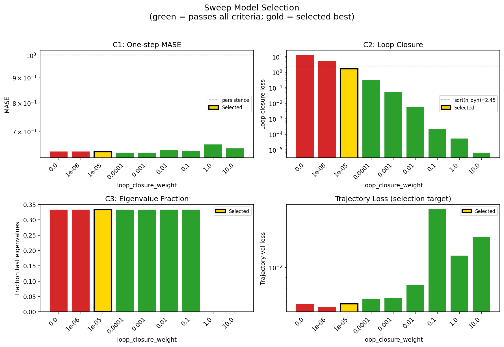

### sweep_pareto

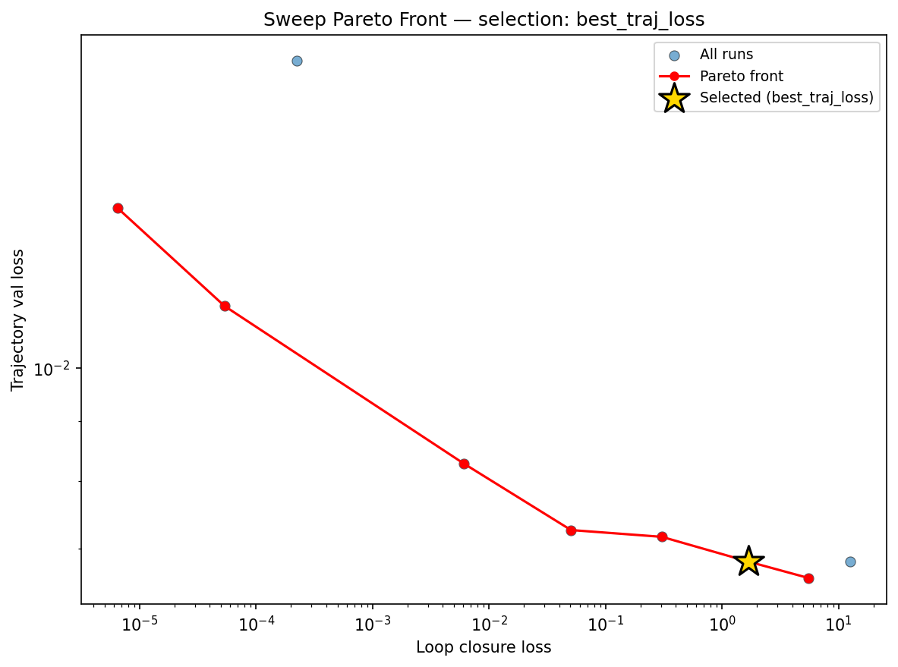

### reconstruction

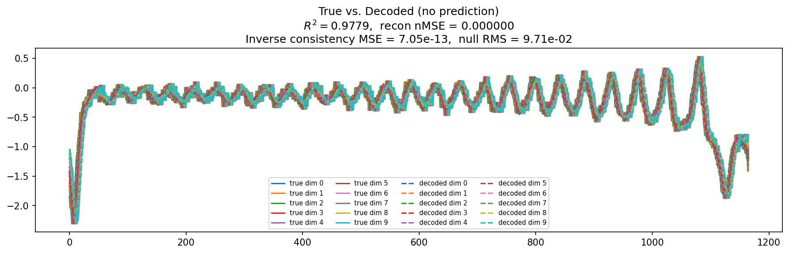

### prediction_windows

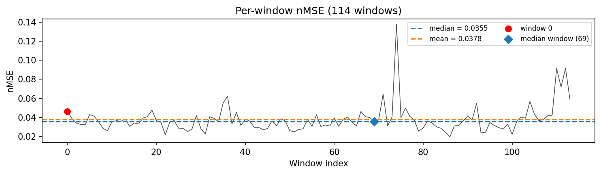

### long_trajectory

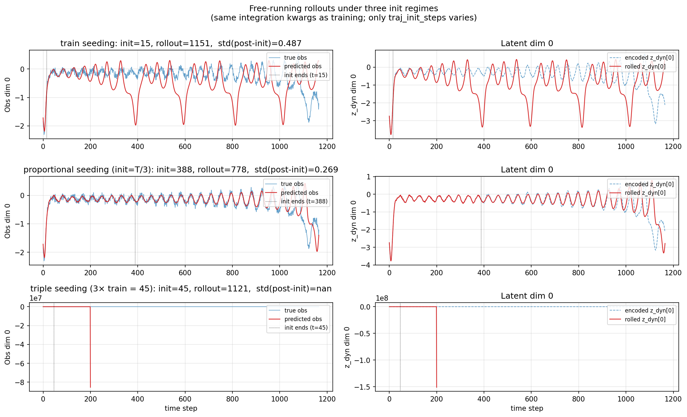

### mase

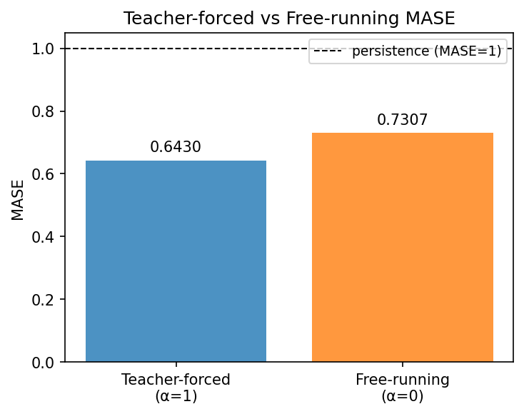

### latent_utilization

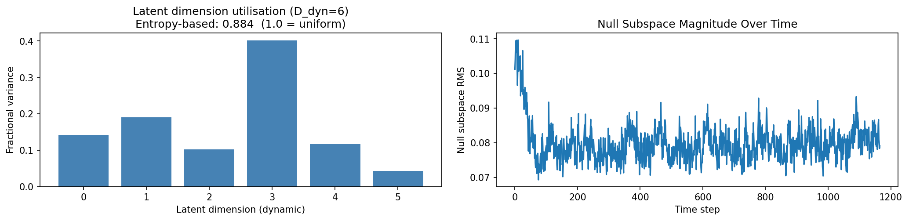

### lyapunov

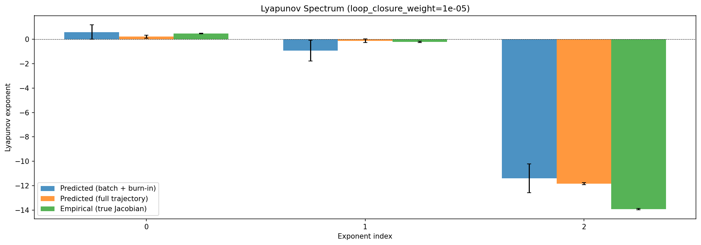

### kaplan_yorke

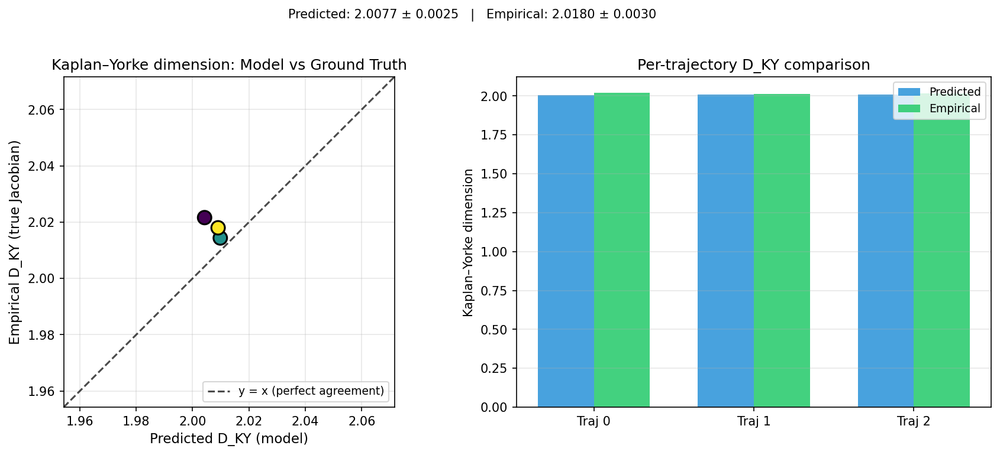

### per_run_lyapunov

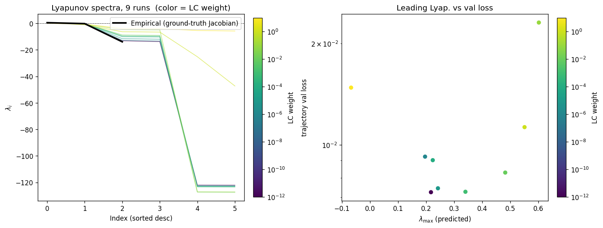

### per_run_lyapunov_vs_true

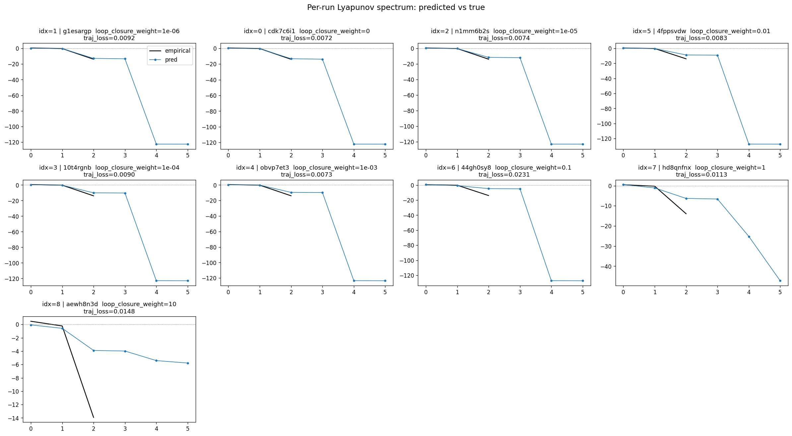

### per_run_lyapunov_relerr

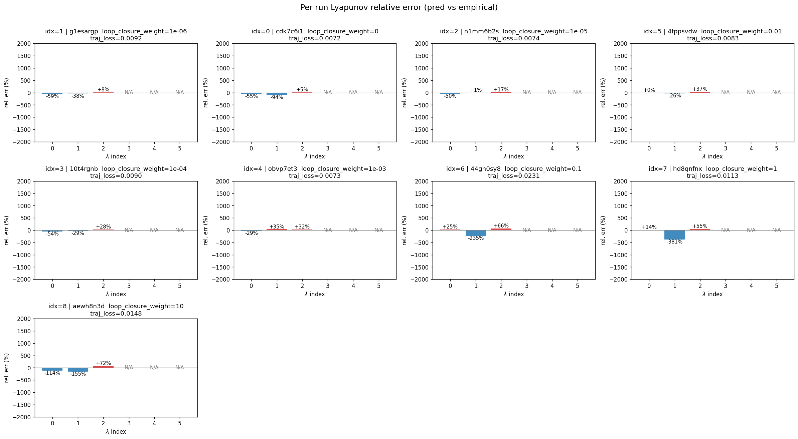

### encoder_decoder_jacobians

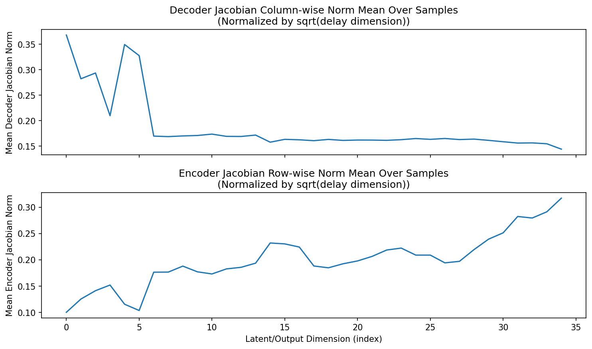

### amplification

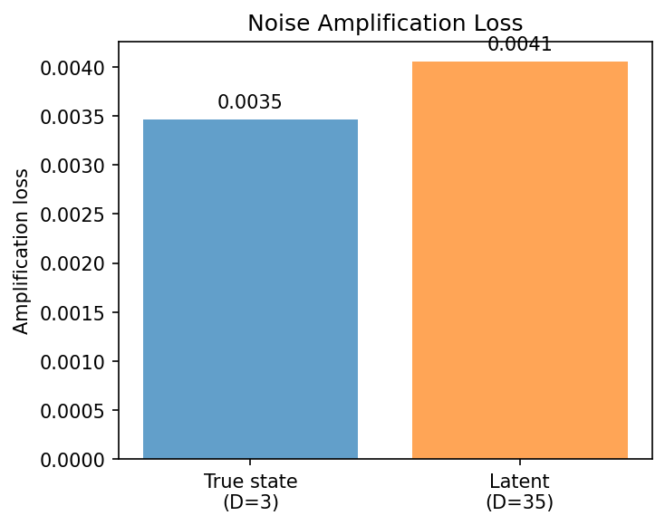

### kaplan_yorke_pca

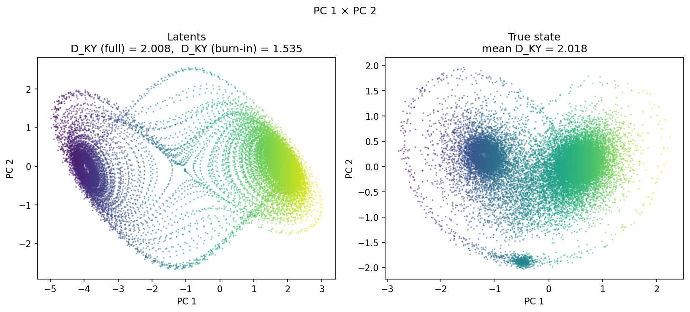

### prediction_detail_latent

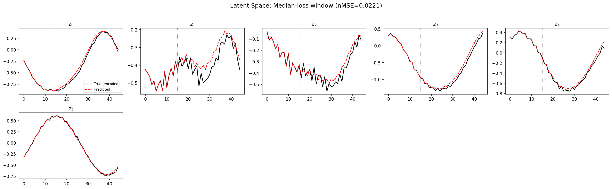

### prediction_detail_obs

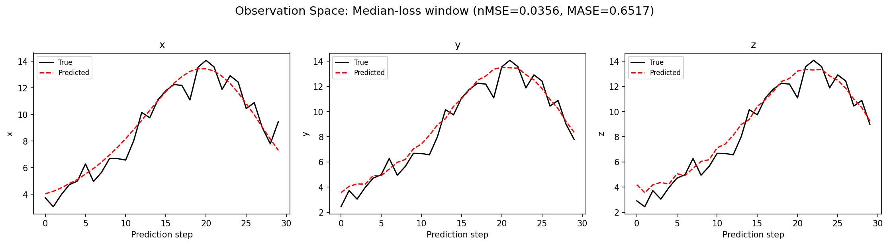

### tangent_spectrum

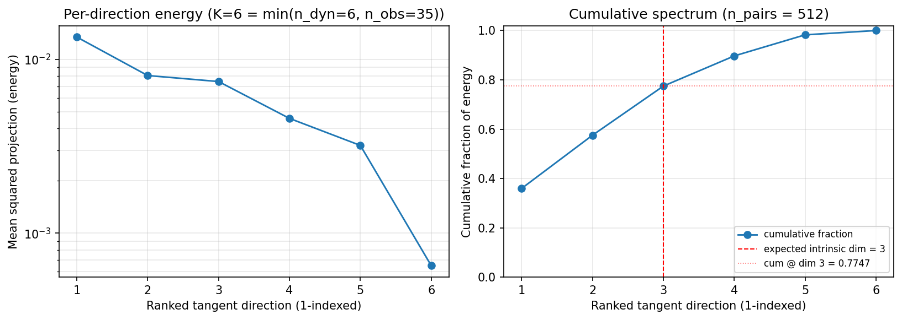

### per_run_tangent_spectrum

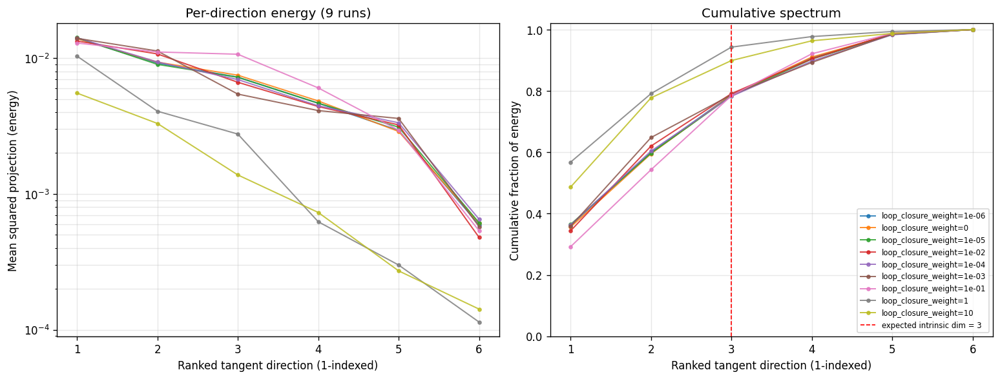

## Discussion

<!--
This section is intentionally left as a placeholder. A human reviewer
or Claude Code agent should fill it in based on the tables and figures
above, explicitly addressing each success criterion and comparing the
outcome to the stated hypothesis. Write the Discussion to
`discussion.md` in this directory and re-run `render_report`.
-->

_(to be written)_

## `run_analytics` stdout

<details><summary>Click to expand — full diagnostic output from <code>run_analytics</code></summary>

```
No run_id provided — selecting best run from group 'lorenz_partial_additive_splitmode_p30_obsnoise005_cayley_autodim_nd35__lc_sweep' ...
Found 9 total runs in JacobianODE/Lorenz_INDpartial_NDsweep_cayley_autodim_D1_NormTrue__JacobianODE (group=lorenz_partial_additive_splitmode_p30_obsnoise005_cayley_autodim_nd35__lc_sweep)
All runs (state, loop_closure_weight, tangent_entropy_weight, kl_dyn_weight):
  g1esargp: state=finished, lc=1e-06, te=0.0, kl_dyn=0.0
  cdk7c6i1: state=finished, lc=0.0, te=0.0, kl_dyn=0.0
  n1mm6b2s: state=finished, lc=1e-05, te=0.0, kl_dyn=0.0
  4fppsvdw: state=finished, lc=0.01, te=0.0, kl_dyn=0.0
  10t4rgnb: state=finished, lc=0.0001, te=0.0, kl_dyn=0.0
  obvp7et3: state=finished, lc=0.001, te=0.0, kl_dyn=0.0
  44gh0sy8: state=finished, lc=0.1, te=0.0, kl_dyn=0.0
  hd8qnfnx: state=finished, lc=1.0, te=0.0, kl_dyn=0.0
  aewh8n3d: state=finished, lc=10.0, te=0.0, kl_dyn=0.0

slurm_timeout_min not found in any run config — falling back to 180 min
  Including g1esargp (lc=1e-06): use_all_runs=True (state=finished)
  Including cdk7c6i1 (lc=0.0): use_all_runs=True (state=finished)
  Including n1mm6b2s (lc=1e-05): use_all_runs=True (state=finished)
  Including 4fppsvdw (lc=0.01): use_all_runs=True (state=finished)
  Including 10t4rgnb (lc=0.0001): use_all_runs=True (state=finished)
  Including obvp7et3 (lc=0.001): use_all_runs=True (state=finished)
  Including 44gh0sy8 (lc=0.1): use_all_runs=True (state=finished)
  Including hd8qnfnx (lc=1.0): use_all_runs=True (state=finished)
  Including aewh8n3d (lc=10.0): use_all_runs=True (state=finished)
Found 9 effectively-done sweep runs:
  loop_closure_weight=0.0, tangent_entropy_weight=0.0, kl_dyn_weight=0.0 -> run_id=cdk7c6i1
  loop_closure_weight=1e-06, tangent_entropy_weight=0.0, kl_dyn_weight=0.0 -> run_id=g1esargp
  loop_closure_weight=1e-05, tangent_entropy_weight=0.0, kl_dyn_weight=0.0 -> run_id=n1mm6b2s
  loop_closure_weight=0.0001, tangent_entropy_weight=0.0, kl_dyn_weight=0.0 -> run_id=10t4rgnb
  loop_closure_weight=0.001, tangent_entropy_weight=0.0, kl_dyn_weight=0.0 -> run_id=obvp7et3
  loop_closure_weight=0.01, tangent_entropy_weight=0.0, kl_dyn_weight=0.0 -> run_id=4fppsvdw
  loop_closure_weight=0.1, tangent_entropy_weight=0.0, kl_dyn_weight=0.0 -> run_id=44gh0sy8
  loop_closure_weight=1.0, tangent_entropy_weight=0.0, kl_dyn_weight=0.0 -> run_id=hd8qnfnx
  loop_closure_weight=10.0, tangent_entropy_weight=0.0, kl_dyn_weight=0.0 -> run_id=aewh8n3d
n_dims=35, n_latent=35, n_dyn=6, dt=0.0150
  run=cdk7c6i1: DiagnosticMetrics(one_step_mase=0.6368582844734192, loop_closure_loss=12.573192596435547, fast_eigenvalue_fraction=0.3333333432674408, trajectory_val_loss=0.00682832719758153) (from W&B history)
  run=g1esargp: DiagnosticMetrics(one_step_mase=0.6364641189575195, loop_closure_loss=5.555117130279541, fast_eigenvalue_fraction=0.3333333432674408, trajectory_val_loss=0.006609244272112846) (from W&B history)
  run=n1mm6b2s: DiagnosticMetrics(one_step_mase=0.6357985734939575, loop_closure_loss=1.6779987812042236, fast_eigenvalue_fraction=0.3333333432674408, trajectory_val_loss=0.006827888544648886) (from W&B history)
  run=10t4rgnb: DiagnosticMetrics(one_step_mase=0.6336358785629272, loop_closure_loss=0.3040429651737213, fast_eigenvalue_fraction=0.3333333432674408, trajectory_val_loss=0.007168845739215612) (from W&B history)
  run=obvp7et3: DiagnosticMetrics(one_step_mase=0.6331437230110168, loop_closure_loss=0.050565920770168304, fast_eigenvalue_fraction=0.3333333432674408, trajectory_val_loss=0.007265176624059677) (from W&B history)
  run=4fppsvdw: DiagnosticMetrics(one_step_mase=0.6404325366020203, loop_closure_loss=0.006037137005478144, fast_eigenvalue_fraction=0.3333333432674408, trajectory_val_loss=0.008285491727292538) (from W&B history)
  run=44gh0sy8: DiagnosticMetrics(one_step_mase=0.6396046280860901, loop_closure_loss=0.00022548627748619765, fast_eigenvalue_fraction=0.3333333432674408, trajectory_val_loss=0.018310919404029846) (from W&B history)
  run=hd8qnfnx: DiagnosticMetrics(one_step_mase=0.6584667563438416, loop_closure_loss=5.3656360250897706e-05, fast_eigenvalue_fraction=0.0, trajectory_val_loss=0.011297713965177536) (from W&B history)
  run=aewh8n3d: DiagnosticMetrics(one_step_mase=0.6463721394538879, loop_closure_loss=6.50302217763965e-06, fast_eigenvalue_fraction=0.0, trajectory_val_loss=0.01369971502572298) (from W&B history)

Ranking method:           best_traj_loss
Best run ID:              n1mm6b2s
Best loop_closure_weight: 1e-05
Best tangent_entropy_weight: 0.0
Best kl_dyn_weight:       0.0
Best traj loss:           0.006828
Criteria applied: ['C1', 'C2', 'C3']
Surviving: 7 / 9
Auto-selected run_id: n1mm6b2s

======================================================================
PARETO FRONTIER RUNS (7 runs)
======================================================================
  Run ID               LC Loss   Traj Val Loss
  ------------  --------------  --------------
  aewh8n3d            0.000007        0.013700
  hd8qnfnx            0.000054        0.011298
  4fppsvdw            0.006037        0.008285
  obvp7et3            0.050566        0.007265
  10t4rgnb            0.304043        0.007169
  n1mm6b2s            1.677999        0.006828 <-- selected
  g1esargp            5.555117        0.006609

======================================================================
RANKING METHOD COMPARISON (over 7 survivors)
======================================================================
  Method                  Run ID               LC Loss   Traj Val Loss
  ----------------------  ------------  --------------  --------------
  best_traj_loss          n1mm6b2s            1.677999        0.006828 <-- active
  pareto_knee             obvp7et3            0.050566        0.007265
  geo_rank                aewh8n3d            0.000007        0.013700
  minimax_rank            4fppsvdw            0.006037        0.008285
  geo_log_score           n1mm6b2s            1.677999        0.006828
  minimax_log_score       hd8qnfnx            0.000054        0.011298
======================================================================

Loading run n1mm6b2s from JacobianODE/Lorenz_INDpartial_NDsweep_cayley_autodim_D1_NormTrue__JacobianODE ...
Loading checkpoint epoch=108-step=21800.ckpt...
Train dataset shape: torch.Size([24662, 45, 35])
Validation dataset shape: torch.Size([7847, 45, 35])
Test dataset shape: torch.Size([3363, 45, 35])
Train trajectories dataset shape: torch.Size([22, 1166, 35])
Validation trajectories dataset shape: torch.Size([7, 1166, 35])
Test trajectories dataset shape: torch.Size([3, 1166, 35])
Loading checkpoint epoch=108-step=21800.ckpt...
Computing reconstruction ...
Computing MASE ...
Teacher-forced MASE: 0.6430
Free-running MASE:   0.7307
Computing latent utilization ...
Entropy-based utilization: 0.884
Null subspace mean RMS: 7.993452e-02
Computing Lyapunov exponents ...
  Computing full-trajectory Lyapunov (3 test trajs, T=1166) ...
Predicted Lyapunov exponents (batch+burn-in, 128 windowed trajs):
  λ_1 = +0.5891 ± 0.5960
  λ_2 = -0.9387 ± 0.8505
  λ_3 = -11.4018 ± 1.1885
  λ_4 = -11.8020 ± 0.8704
  λ_5 = -122.4269 ± 1.0928
  λ_6 = -122.6129 ± 1.0866
Predicted Lyapunov exponents (full-length, 3 test trajs):
  λ_1 = +0.2117 ± 0.1333
  λ_2 = -0.1205 ± 0.1419
  λ_3 = -11.8430 ± 0.0912
  λ_4 = -12.1082 ± 0.0724
  λ_5 = -123.0491 ± 0.0184
  λ_6 = -123.1252 ± 0.0132
Empirical Lyapunov exponents (mean ± std, all trajectories):
  λ_1 = +0.4677 ± 0.0259
  λ_2 = -0.2173 ± 0.0549
  λ_3 = -13.9174 ± 0.0513
Mean KY dim (predicted): 2.008 ± 0.002
Mean KY dim (empirical): 2.018 ± 0.003
Mean KY dim (burn-in):   1.535 ± 0.425
Computing prediction windows ...
Windows: 114 — nMSE min=0.0194, median=0.0355, mean=0.0378, max=0.1378
Computing long-trajectory free-running rollouts ...
Computing encoder/decoder Jacobians ...
encoder_jacobian: (128, 35, 35)
decoder_jacobian: (128, 35, 35)
Computing amplification loss ...
Amplification loss — True state: 0.003469
Amplification loss — Latent:     0.004059
Computing tangent space spectrum ...
```

</details>
