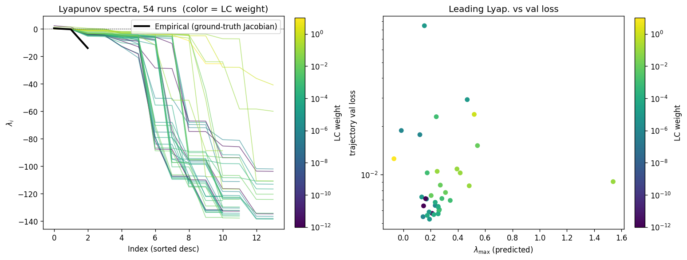
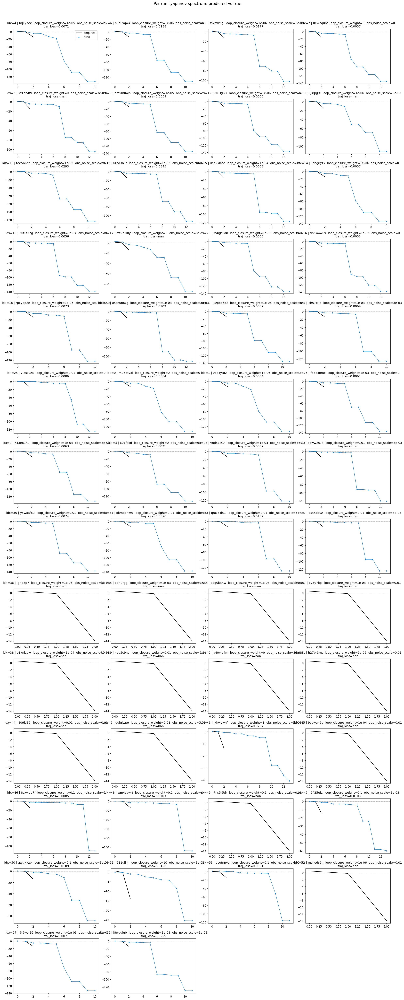
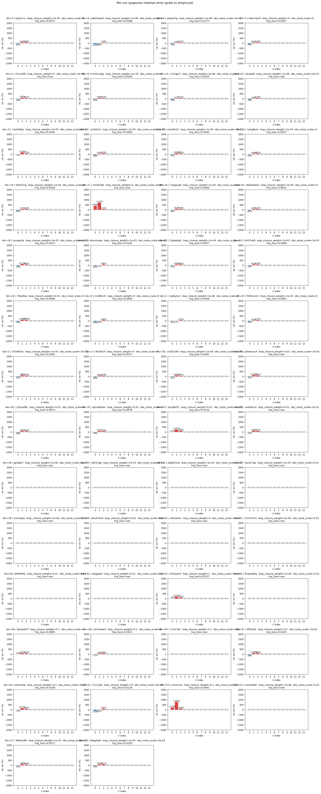
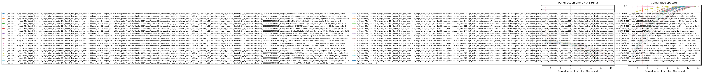

# Sweep Analysis: `lorenz_partial_additive_splitmode_p30_obsnoise005_cayley_autodim_top3nd_v2__lc_obsnoisescale_sweep_20260503T045452Z__stage_b`

**Project**: [Lorenz_INDpartial_NDsweep_cayley_autodim_D1_NormTrue__JacobianODE](https://wandb.ai/JacobianODE/Lorenz_INDpartial_NDsweep_cayley_autodim_D1_NormTrue__JacobianODE/groups/lorenz_partial_additive_splitmode_p30_obsnoise005_cayley_autodim_top3nd_v2__lc_obsnoisescale_sweep_20260503T045452Z__stage_b)  
**Launched**: 2026-05-03T09:35:16Z  
**Completed**: 2026-05-03T18:00:36Z  
**Outcome**: `complete_clean`  
**Git**: `latent-JacobianODE` @ `56c7aab`  
**Expected runs**: 54

## Experiment Context

### `lorenz_partial_additive_splitmode_p30_obsnoise005_cayley_autodim_top3nd_v2__lc_obsnoisescale_sweep`

**Description**

Lorenz partial additive coupling, Cayley + autodim + split-mode +
TF-coupled LR. Single observed channel (idx 0), obs_noise=0.05,
prediction_steps=30, traj_init_steps=15. 108-run grid: 3 n_delays
(chain-pinned) × 9 LC weights × 4 obs_noise_scale values.

**Hypothesis**

Same noise-injection / LC ramp hypothesis as the prior splitmode
obsnoise005 grid, now run under the standard Cayley + autodim recipe
end-to-end so the n_delays choice from the scout transfers cleanly.

**Success criteria**

- All 108 Stage A runs train without divergence
- Per-cell autodim n_target_dims logged
- two_stage_cull keeps top ~54 (cull_fraction=0.5)
- Best obs_noise_scale > 0 cell strictly improves vs obs_noise_scale=0 baseline at the same (n_delays, LC) cell on val/trajectory_loss

## Results

**Swept axes** (10): `data.train_test_params.delay_embedding_params.n_delays`, `model.encoder.n_input`, `model.n_target_dims`, `model.n_target_dims_pca_auto`, `model.n_target_dims_pca_cum_var`, `model.params.input_dim`, `model.params.output_dim`, `training.ckpt_path`, `training.lightning.loop_closure_weight`, `training.lightning.obs_noise_scale`

**Chosen run** (by `best_traj_loss`): `0ew7quhf` — traj_loss=0.00505, MASE=0.7580, R²=0.9868, LC loss=32.145, epoch=107.0

Swept-axis values at chosen run: `data.train_test_params.delay_embedding_params.n_delays`=85 · `model.encoder.n_input`=85 · `model.n_target_dims`=14 · `model.n_target_dims_pca_auto`=14 · `model.n_target_dims_pca_cum_var`=0.990074 · `model.params.input_dim`=14 · `model.params.output_dim`=196 · `training.ckpt_path`=/orcd/data/ekmiller/001/eisenaj/JacobianODE/sweeps/two_stage_ckpts/lorenz_partial_additive_splitmode_p30_obsnoise005_cayley_autodim_top3nd_v2__lc_obsnoisescale_sweep_20260503T045452Z__stage_a/2df04e3fa0fbf3a7/last.ckpt · `training.lightning.loop_closure_weight`=0 · `training.lightning.obs_noise_scale`=0

**Runs analyzed**: 54 (expected 54)

### Per-run results

| run_idx | run_id | `data.train_test_params.delay_embedding_params.n_delays` | `model.encoder.n_input` | `model.n_target_dims` | `model.n_target_dims_pca_auto` | `model.n_target_dims_pca_cum_var` | `model.params.input_dim` | `model.params.output_dim` | `training.ckpt_path` | `training.lightning.loop_closure_weight` | `training.lightning.obs_noise_scale` | best_traj_loss | best_MASE | R² | LC loss | epoch |
|---|---|---|---|---|---|---|---|---|---|---|---|---|---|---|---|---|
| 7 | `0ew7quhf` | 85 | 85 | 14 | 14 | 0.990074 | 14 | 196 | /orcd/data/ekmiller/001/eisenaj/JacobianODE/sweeps/two_stage_ckpts/lorenz_partial_additive_splitmode_p30_obsnoise005_cayley_autodim_top3nd_v2__lc_obsnoisescale_sweep_20260503T045452Z__stage_a/2df04e3fa0fbf3a7/last.ckpt | 0 | 0 | 0.00505 | 0.7580 | 0.9868 | 32.145 | 107.0 |
| 12 | `3u1igjv7` | 85 | 85 | 14 | 14 | 0.990074 | 14 | 196 | /orcd/data/ekmiller/001/eisenaj/JacobianODE/sweeps/two_stage_ckpts/lorenz_partial_additive_splitmode_p30_obsnoise005_cayley_autodim_top3nd_v2__lc_obsnoisescale_sweep_20260503T045452Z__stage_a/387ba3ec7a6fa0c6/last.ckpt | 1.0e-06 | 0 | 0.00513 | 0.7595 | 0.9866 | 12.055 | 104.0 |
| 16 | `db6w4w0x` | 85 | 85 | 14 | 14 | 0.990074 | 14 | 196 | /orcd/data/ekmiller/001/eisenaj/JacobianODE/sweeps/two_stage_ckpts/lorenz_partial_additive_splitmode_p30_obsnoise005_cayley_autodim_top3nd_v2__lc_obsnoisescale_sweep_20260503T045452Z__stage_a/c869655a88896b02/last.ckpt | 1.0e-05 | 0 | 0.00517 | 0.7654 | 0.9865 | 2.665 | 107.0 |
| 3 | `601fkiof` | 75 | 75 | 12 | 12 | 0.990036 | 12 | 144 | /orcd/data/ekmiller/001/eisenaj/JacobianODE/sweeps/two_stage_ckpts/lorenz_partial_additive_splitmode_p30_obsnoise005_cayley_autodim_top3nd_v2__lc_obsnoisescale_sweep_20260503T045452Z__stage_a/f9fac93de95a15de/last.ckpt | 0 | 0 | 0.00526 | 0.7711 | 0.9858 | 28.198 | 108.0 |
| 19 | `50tuf37g` | 85 | 85 | 14 | 14 | 0.990074 | 14 | 196 | /orcd/data/ekmiller/001/eisenaj/JacobianODE/sweeps/two_stage_ckpts/lorenz_partial_additive_splitmode_p30_obsnoise005_cayley_autodim_top3nd_v2__lc_obsnoisescale_sweep_20260503T045452Z__stage_a/3d56e5e25c96ace7/last.ckpt | 1.0e-04 | 0 | 0.00534 | 0.7753 | 0.9860 | 0.387 | 104.0 |
| 9 | `hm5mu4jp` | 75 | 75 | 12 | 12 | 0.990036 | 12 | 144 | /orcd/data/ekmiller/001/eisenaj/JacobianODE/sweeps/two_stage_ckpts/lorenz_partial_additive_splitmode_p30_obsnoise005_cayley_autodim_top3nd_v2__lc_obsnoisescale_sweep_20260503T045452Z__stage_a/a2d21244f6486470/last.ckpt | 1.0e-05 | 0 | 0.00535 | 0.7762 | 0.9855 | 2.593 | 108.0 |
| 28 | `vnd51t40` | 65 | 65 | 11 | 11 | 0.990219 | 11 | 121 | /orcd/data/ekmiller/001/eisenaj/JacobianODE/sweeps/two_stage_ckpts/lorenz_partial_additive_splitmode_p30_obsnoise005_cayley_autodim_top3nd_v2__lc_obsnoisescale_sweep_20260503T045452Z__stage_a/d6c534289e80f23e/last.ckpt | 1.0e-04 | 0.003 | 0.00545 | 0.7714 | 0.9855 | 0.712 | 116.0 |
| 4 | `bqily7cx` | 65 | 65 | 11 | 11 | 0.990219 | 11 | 121 | /orcd/data/ekmiller/001/eisenaj/JacobianODE/sweeps/two_stage_ckpts/lorenz_partial_additive_splitmode_p30_obsnoise005_cayley_autodim_top3nd_v2__lc_obsnoisescale_sweep_20260503T045452Z__stage_a/a078d33b8344f73a/last.ckpt | 1.0e-05 | 0 | 0.00547 | 0.7654 | 0.9854 | 2.241 | 105.0 |
| 22 | `2zpbe6q2` | 75 | 75 | 12 | 12 | 0.990036 | 12 | 144 | /orcd/data/ekmiller/001/eisenaj/JacobianODE/sweeps/two_stage_ckpts/lorenz_partial_additive_splitmode_p30_obsnoise005_cayley_autodim_top3nd_v2__lc_obsnoisescale_sweep_20260503T045452Z__stage_a/4d2c9f4d9533308e/last.ckpt | 1.0e-04 | 0 | 0.00553 | 0.7825 | 0.9850 | 0.386 | 108.0 |
| 2 | `743e81hu` | 75 | 75 | 12 | 12 | 0.990036 | 12 | 144 | /orcd/data/ekmiller/001/eisenaj/JacobianODE/sweeps/two_stage_ckpts/lorenz_partial_additive_splitmode_p30_obsnoise005_cayley_autodim_top3nd_v2__lc_obsnoisescale_sweep_20260503T045452Z__stage_a/226028ce880f3e5a/last.ckpt | 1.0e-04 | 0.003 | 0.00562 | 0.7968 | 0.9849 | 2.085 | 127.0 |
| 14 | `1dcg8yzx` | 65 | 65 | 11 | 11 | 0.990219 | 11 | 121 | /orcd/data/ekmiller/001/eisenaj/JacobianODE/sweeps/two_stage_ckpts/lorenz_partial_additive_splitmode_p30_obsnoise005_cayley_autodim_top3nd_v2__lc_obsnoisescale_sweep_20260503T045452Z__stage_a/56926cceabd9cb08/last.ckpt | 1.0e-04 | 0 | 0.00563 | 0.7734 | 0.9850 | 0.332 | 124.0 |
| 0 | `m268tv5i` | 65 | 65 | 11 | 11 | 0.990219 | 11 | 121 | /orcd/data/ekmiller/001/eisenaj/JacobianODE/sweeps/two_stage_ckpts/lorenz_partial_additive_splitmode_p30_obsnoise005_cayley_autodim_top3nd_v2__lc_obsnoisescale_sweep_20260503T045452Z__stage_a/fd66dec68d19e5b7/last.ckpt | 0 | 0 | 0.00573 | 0.7794 | 0.9848 | 18.991 | 75.0 |
| 18 | `rpxypp2e` | 65 | 65 | 11 | 11 | 0.990219 | 11 | 121 | /orcd/data/ekmiller/001/eisenaj/JacobianODE/sweeps/two_stage_ckpts/lorenz_partial_additive_splitmode_p30_obsnoise005_cayley_autodim_top3nd_v2__lc_obsnoisescale_sweep_20260503T045452Z__stage_a/69198fcea2a6ff45/last.ckpt | 1.0e-05 | 0.003 | 0.00576 | 0.7884 | 0.9846 | 3.754 | 70.0 |
| 20 | `7vbgsua8` | 85 | 85 | 14 | 14 | 0.990074 | 14 | 196 | /orcd/data/ekmiller/001/eisenaj/JacobianODE/sweeps/two_stage_ckpts/lorenz_partial_additive_splitmode_p30_obsnoise005_cayley_autodim_top3nd_v2__lc_obsnoisescale_sweep_20260503T045452Z__stage_a/2eee7c9fed79df25/last.ckpt | 0.001 | 0 | 0.00577 | 0.7852 | 0.9849 | 0.061 | 127.0 |
| 25 | `f83bxnmc` | 75 | 75 | 12 | 12 | 0.990036 | 12 | 144 | /orcd/data/ekmiller/001/eisenaj/JacobianODE/sweeps/two_stage_ckpts/lorenz_partial_additive_splitmode_p30_obsnoise005_cayley_autodim_top3nd_v2__lc_obsnoisescale_sweep_20260503T045452Z__stage_a/2119b66362b1e636/last.ckpt | 0.001 | 0 | 0.00584 | 0.7933 | 0.9842 | 0.062 | 101.0 |
| 1 | `vepkytu2` | 65 | 65 | 11 | 11 | 0.990219 | 11 | 121 | /orcd/data/ekmiller/001/eisenaj/JacobianODE/sweeps/two_stage_ckpts/lorenz_partial_additive_splitmode_p30_obsnoise005_cayley_autodim_top3nd_v2__lc_obsnoisescale_sweep_20260503T045452Z__stage_a/94f8b35c2c623c37/last.ckpt | 1.0e-06 | 0 | 0.00586 | 0.7795 | 0.9845 | 8.030 | 74.0 |
| 13 | `urnd3a1t` | 85 | 85 | 14 | 14 | 0.990074 | 14 | 196 | /orcd/data/ekmiller/001/eisenaj/JacobianODE/sweeps/two_stage_ckpts/lorenz_partial_additive_splitmode_p30_obsnoise005_cayley_autodim_top3nd_v2__lc_obsnoisescale_sweep_20260503T045452Z__stage_a/4df2b83c11d3f1e5/last.ckpt | 1.0e-05 | 0.003 | 0.00601 | 0.8165 | 0.9842 | 35.224 | 76.0 |
| 23 | `lsh57ek8` | 65 | 65 | 11 | 11 | 0.990219 | 11 | 121 | /orcd/data/ekmiller/001/eisenaj/JacobianODE/sweeps/two_stage_ckpts/lorenz_partial_additive_splitmode_p30_obsnoise005_cayley_autodim_top3nd_v2__lc_obsnoisescale_sweep_20260503T045452Z__stage_a/20fb2a744b2703af/last.ckpt | 0.001 | 0.003 | 0.00606 | 0.7902 | 0.9838 | 0.145 | 113.0 |
| 15 | `uee2kb22` | 85 | 85 | 14 | 14 | 0.990074 | 14 | 196 | /orcd/data/ekmiller/001/eisenaj/JacobianODE/sweeps/two_stage_ckpts/lorenz_partial_additive_splitmode_p30_obsnoise005_cayley_autodim_top3nd_v2__lc_obsnoisescale_sweep_20260503T045452Z__stage_a/cfc0d801b52a5286/last.ckpt | 1.0e-04 | 0.003 | 0.00610 | 0.8069 | 0.9840 | 2.413 | 103.0 |
| 27 | `9t9wui86` | 65 | 65 | 11 | 11 | 0.990219 | 11 | 121 | /orcd/data/ekmiller/001/eisenaj/JacobianODE/sweeps/two_stage_ckpts/lorenz_partial_additive_splitmode_p30_obsnoise005_cayley_autodim_top3nd_v2__lc_obsnoisescale_sweep_20260503T045452Z__stage_a/8e6ad8a535cde348/last.ckpt | 0.001 | 0 | 0.00618 | 0.7882 | 0.9835 | 0.043 | 114.0 |
| 30 | `y5wxaf8u` | 75 | 75 | 12 | 12 | 0.990036 | 12 | 144 | /orcd/data/ekmiller/001/eisenaj/JacobianODE/sweeps/two_stage_ckpts/lorenz_partial_additive_splitmode_p30_obsnoise005_cayley_autodim_top3nd_v2__lc_obsnoisescale_sweep_20260503T045452Z__stage_a/daecb2727b10c462/last.ckpt | 0.01 | 0 | 0.00680 | 0.8240 | 0.9817 | 0.009 | 153.0 |
| 31 | `qkmdphwn` | 65 | 65 | 11 | 11 | 0.990219 | 11 | 121 | /orcd/data/ekmiller/001/eisenaj/JacobianODE/sweeps/two_stage_ckpts/lorenz_partial_additive_splitmode_p30_obsnoise005_cayley_autodim_top3nd_v2__lc_obsnoisescale_sweep_20260503T045452Z__stage_a/531e24af5f60e05c/last.ckpt | 0.01 | 0 | 0.00703 | 0.8144 | 0.9813 | 0.006 | 126.0 |
| 24 | `7l8sz9za` | 85 | 85 | 14 | 14 | 0.990074 | 14 | 196 | /orcd/data/ekmiller/001/eisenaj/JacobianODE/sweeps/two_stage_ckpts/lorenz_partial_additive_splitmode_p30_obsnoise005_cayley_autodim_top3nd_v2__lc_obsnoisescale_sweep_20260503T045452Z__stage_a/8ecd17d95fae770c/last.ckpt | 0.01 | 0 | 0.00744 | 0.8233 | 0.9804 | 0.007 | 106.0 |
| 46 | `8zxwob7f` | 85 | 85 | 14 | 14 | 0.990074 | 14 | 196 | /orcd/data/ekmiller/001/eisenaj/JacobianODE/sweeps/two_stage_ckpts/lorenz_partial_additive_splitmode_p30_obsnoise005_cayley_autodim_top3nd_v2__lc_obsnoisescale_sweep_20260503T045452Z__stage_a/a8efee72bc115510/last.ckpt | 0.1 | 0 | 0.00774 | 0.8540 | 0.9797 | 0.001 | 160.0 |
| 21 | `u4snumwg` | 85 | 85 | 14 | 14 | 0.990074 | 14 | 196 | /orcd/data/ekmiller/001/eisenaj/JacobianODE/sweeps/two_stage_ckpts/lorenz_partial_additive_splitmode_p30_obsnoise005_cayley_autodim_top3nd_v2__lc_obsnoisescale_sweep_20260503T045452Z__stage_a/7e615db08f4d56d6/last.ckpt | 0.001 | 0.003 | 0.00782 | 0.8808 | 0.9795 | 1.258 | 125.0 |
| 53 | `ucotnnva` | 75 | 75 | 12 | 12 | 0.990036 | 12 | 144 | /orcd/data/ekmiller/001/eisenaj/JacobianODE/sweeps/two_stage_ckpts/lorenz_partial_additive_splitmode_p30_obsnoise005_cayley_autodim_top3nd_v2__lc_obsnoisescale_sweep_20260503T045452Z__stage_a/8250fcbac7b6b8b0/last.ckpt | 0.1 | 0 | 0.00844 | 0.8886 | 0.9772 | 0.001 | 116.0 |
| 8 | `sskpxk5g` | 85 | 85 | 14 | 14 | 0.990074 | 14 | 196 | /orcd/data/ekmiller/001/eisenaj/JacobianODE/sweeps/two_stage_ckpts/lorenz_partial_additive_splitmode_p30_obsnoise005_cayley_autodim_top3nd_v2__lc_obsnoisescale_sweep_20260503T045452Z__stage_a/0b81e0672bf7ca5c/last.ckpt | 1.0e-06 | 0.003 | 0.00921 | 0.8993 | 0.9758 | 74.182 | 26.0 |
| 33 | `qmz8kl51` | 65 | 65 | 11 | 11 | 0.990219 | 11 | 121 | /orcd/data/ekmiller/001/eisenaj/JacobianODE/sweeps/two_stage_ckpts/lorenz_partial_additive_splitmode_p30_obsnoise005_cayley_autodim_top3nd_v2__lc_obsnoisescale_sweep_20260503T045452Z__stage_a/7b562cd3e5152aa3/last.ckpt | 0.01 | 0.003 | 0.01008 | 0.9350 | 0.9732 | 0.087 | 51.0 |
| 6 | `p8o0xqw4` | 75 | 75 | 12 | 12 | 0.990036 | 12 | 144 | /orcd/data/ekmiller/001/eisenaj/JacobianODE/sweeps/two_stage_ckpts/lorenz_partial_additive_splitmode_p30_obsnoise005_cayley_autodim_top3nd_v2__lc_obsnoisescale_sweep_20260503T045452Z__stage_a/c6873eb89e0a8273/last.ckpt | 1.0e-06 | 0 | 0.01011 | 0.9323 | 0.9730 | 7.703 | 20.0 |
| 5 | `7t1nn4f9` | 85 | 85 | 14 | 14 | 0.990074 | 14 | 196 | /orcd/data/ekmiller/001/eisenaj/JacobianODE/sweeps/two_stage_ckpts/lorenz_partial_additive_splitmode_p30_obsnoise005_cayley_autodim_top3nd_v2__lc_obsnoisescale_sweep_20260503T045452Z__stage_a/8d7d8fe94139aa16/last.ckpt | 0 | 0.003 | 0.01030 | 0.9226 | 0.9731 | 102.180 | 21.0 |
| 32 | `as44dcuz` | 75 | 75 | 12 | 12 | 0.990036 | 12 | 144 | /orcd/data/ekmiller/001/eisenaj/JacobianODE/sweeps/two_stage_ckpts/lorenz_partial_additive_splitmode_p30_obsnoise005_cayley_autodim_top3nd_v2__lc_obsnoisescale_sweep_20260503T045452Z__stage_a/161ad51a1df755c8/last.ckpt | 0.01 | 0.003 | 0.01188 | 0.9546 | 0.9681 | 0.080 | 55.0 |
| 10 | `3jsrpg9i` | 75 | 75 | 12 | 12 | 0.990036 | 12 | 144 | /orcd/data/ekmiller/001/eisenaj/JacobianODE/sweeps/two_stage_ckpts/lorenz_partial_additive_splitmode_p30_obsnoise005_cayley_autodim_top3nd_v2__lc_obsnoisescale_sweep_20260503T045452Z__stage_a/ebccc34e6de77b5c/last.ckpt | 1.0e-06 | 0.003 | 0.01274 | 0.9628 | 0.9657 | 84.530 | 24.0 |
| 11 | `tee5b6pr` | 75 | 75 | 12 | 12 | 0.990036 | 12 | 144 | /orcd/data/ekmiller/001/eisenaj/JacobianODE/sweeps/two_stage_ckpts/lorenz_partial_additive_splitmode_p30_obsnoise005_cayley_autodim_top3nd_v2__lc_obsnoisescale_sweep_20260503T045452Z__stage_a/6bd8bf36346f79e0/last.ckpt | 1.0e-05 | 0.003 | 0.01290 | 1.0183 | 0.9650 | 11.992 | 20.0 |
| 17 | `mt2b1l8y` | 75 | 75 | 12 | 12 | 0.990036 | 12 | 144 | /orcd/data/ekmiller/001/eisenaj/JacobianODE/sweeps/two_stage_ckpts/lorenz_partial_additive_splitmode_p30_obsnoise005_cayley_autodim_top3nd_v2__lc_obsnoisescale_sweep_20260503T045452Z__stage_a/2ccfc8c01df3fd0b/last.ckpt | 0 | 0.003 | nan | nan | nan | 4608.303 | 20.0 |
| 29 | `pdww2su4` | 85 | 85 | 14 | 14 | 0.990074 | 14 | 196 | /orcd/data/ekmiller/001/eisenaj/JacobianODE/sweeps/two_stage_ckpts/lorenz_partial_additive_splitmode_p30_obsnoise005_cayley_autodim_top3nd_v2__lc_obsnoisescale_sweep_20260503T045452Z__stage_a/a009083e0b40c1b3/last.ckpt | 0.01 | 0.003 | 0.01357 | 1.0331 | 0.9642 | 0.007 | 25.0 |
| 26 | `i8wgdlq0` | 75 | 75 | 12 | 12 | 0.990036 | 12 | 144 | /orcd/data/ekmiller/001/eisenaj/JacobianODE/sweeps/two_stage_ckpts/lorenz_partial_additive_splitmode_p30_obsnoise005_cayley_autodim_top3nd_v2__lc_obsnoisescale_sweep_20260503T045452Z__stage_a/563c458b3d7ec240/last.ckpt | 0.001 | 0.003 | 0.01484 | 1.0046 | 0.9601 | 0.080 | 20.0 |
| 34 | `a4g0k3nw` | 75 | 75 | 12 | 12 | 0.990036 | 12 | 144 | /orcd/data/ekmiller/001/eisenaj/JacobianODE/sweeps/two_stage_ckpts/lorenz_partial_additive_splitmode_p30_obsnoise005_cayley_autodim_top3nd_v2__lc_obsnoisescale_sweep_20260503T045452Z__stage_a/ed2d4604a03fb1bb/last.ckpt | 0.001 | 0.01 | nan | nan | nan | nan | 15.0 |
| 35 | `odrl2rgg` | 65 | 65 | 11 | 11 | 0.990219 | 11 | 121 | /orcd/data/ekmiller/001/eisenaj/JacobianODE/sweeps/two_stage_ckpts/lorenz_partial_additive_splitmode_p30_obsnoise005_cayley_autodim_top3nd_v2__lc_obsnoisescale_sweep_20260503T045452Z__stage_a/fe32108d865a0485/last.ckpt | 0.001 | 0.01 | nan | nan | nan | nan | 16.0 |
| 36 | `jgrje8p7` | 65 | 65 | 11 | 11 | 0.990219 | 11 | 121 | /orcd/data/ekmiller/001/eisenaj/JacobianODE/sweeps/two_stage_ckpts/lorenz_partial_additive_splitmode_p30_obsnoise005_cayley_autodim_top3nd_v2__lc_obsnoisescale_sweep_20260503T045452Z__stage_a/9401cdc9150e0788/last.ckpt | 1.0e-06 | 0.003 | nan | nan | nan | nan | 16.0 |
| 37 | `by3y7iqz` | 85 | 85 | 14 | 14 | 0.990074 | 14 | 196 | /orcd/data/ekmiller/001/eisenaj/JacobianODE/sweeps/two_stage_ckpts/lorenz_partial_additive_splitmode_p30_obsnoise005_cayley_autodim_top3nd_v2__lc_obsnoisescale_sweep_20260503T045452Z__stage_a/33bd3cb733a079da/last.ckpt | 0.001 | 0.01 | nan | nan | nan | nan | 15.0 |
| 38 | `o1knlzpw` | 65 | 65 | 11 | 11 | 0.990219 | 11 | 121 | /orcd/data/ekmiller/001/eisenaj/JacobianODE/sweeps/two_stage_ckpts/lorenz_partial_additive_splitmode_p30_obsnoise005_cayley_autodim_top3nd_v2__lc_obsnoisescale_sweep_20260503T045452Z__stage_a/f899b0d113e19830/last.ckpt | 1.0e-04 | 0.01 | nan | nan | nan | nan | 17.0 |
| 39 | `4ou5c9nd` | 65 | 65 | 11 | 11 | 0.990219 | 11 | 121 | /orcd/data/ekmiller/001/eisenaj/JacobianODE/sweeps/two_stage_ckpts/lorenz_partial_additive_splitmode_p30_obsnoise005_cayley_autodim_top3nd_v2__lc_obsnoisescale_sweep_20260503T045452Z__stage_a/c0442d5c87efea80/last.ckpt | 0.01 | 0.01 | nan | nan | nan | nan | 17.0 |
| 40 | `v40vle4m` | 65 | 65 | 11 | 11 | 0.990219 | 11 | 121 | /orcd/data/ekmiller/001/eisenaj/JacobianODE/sweeps/two_stage_ckpts/lorenz_partial_additive_splitmode_p30_obsnoise005_cayley_autodim_top3nd_v2__lc_obsnoisescale_sweep_20260503T045452Z__stage_a/a7a361a2f6e21622/last.ckpt | 0 | 0.003 | nan | nan | nan | nan | 16.0 |
| 41 | `h27br3mt` | 65 | 65 | 11 | 11 | 0.990219 | 11 | 121 | /orcd/data/ekmiller/001/eisenaj/JacobianODE/sweeps/two_stage_ckpts/lorenz_partial_additive_splitmode_p30_obsnoise005_cayley_autodim_top3nd_v2__lc_obsnoisescale_sweep_20260503T045452Z__stage_a/6c4db0481487a4c1/last.ckpt | 1.0e-05 | 0.01 | nan | nan | nan | nan | 20.0 |
| 42 | `dujgjwpo` | 85 | 85 | 14 | 14 | 0.990074 | 14 | 196 | /orcd/data/ekmiller/001/eisenaj/JacobianODE/sweeps/two_stage_ckpts/lorenz_partial_additive_splitmode_p30_obsnoise005_cayley_autodim_top3nd_v2__lc_obsnoisescale_sweep_20260503T045452Z__stage_a/f0a9acc0fc6e424a/last.ckpt | 0.01 | 0.01 | nan | nan | nan | nan | 15.0 |
| 47 | `9fl25efz` | 85 | 85 | 14 | 14 | 0.990074 | 14 | 196 | /orcd/data/ekmiller/001/eisenaj/JacobianODE/sweeps/two_stage_ckpts/lorenz_partial_additive_splitmode_p30_obsnoise005_cayley_autodim_top3nd_v2__lc_obsnoisescale_sweep_20260503T045452Z__stage_a/f85db824ec903a54/last.ckpt | 0.1 | 0.003 | 0.00850 | 0.8897 | 0.9777 | 0.012 | 127.0 |
| 48 | `wm4sawrt` | 65 | 65 | 11 | 11 | 0.990219 | 11 | 121 | /orcd/data/ekmiller/001/eisenaj/JacobianODE/sweeps/two_stage_ckpts/lorenz_partial_additive_splitmode_p30_obsnoise005_cayley_autodim_top3nd_v2__lc_obsnoisescale_sweep_20260503T045452Z__stage_a/62cf27a31da5a153/last.ckpt | 0.1 | 0 | 0.00869 | 0.8700 | 0.9769 | 0.001 | 118.0 |
| 43 | `ikhwywnf` | 85 | 85 | 14 | 14 | 0.990074 | 14 | 196 | /orcd/data/ekmiller/001/eisenaj/JacobianODE/sweeps/two_stage_ckpts/lorenz_partial_additive_splitmode_p30_obsnoise005_cayley_autodim_top3nd_v2__lc_obsnoisescale_sweep_20260503T045452Z__stage_a/1d9e16300067f50e/last.ckpt | 1 | 0.003 | 0.01445 | 1.1185 | 0.9619 | 0.001 | 91.0 |
| 44 | `8d9kl89j` | 75 | 75 | 12 | 12 | 0.990036 | 12 | 144 | /orcd/data/ekmiller/001/eisenaj/JacobianODE/sweeps/two_stage_ckpts/lorenz_partial_additive_splitmode_p30_obsnoise005_cayley_autodim_top3nd_v2__lc_obsnoisescale_sweep_20260503T045452Z__stage_a/b28442cc441ed628/last.ckpt | 0.01 | 0.01 | nan | nan | nan | nan | 16.0 |
| 45 | `9cqwq46q` | 75 | 75 | 12 | 12 | 0.990036 | 12 | 144 | /orcd/data/ekmiller/001/eisenaj/JacobianODE/sweeps/two_stage_ckpts/lorenz_partial_additive_splitmode_p30_obsnoise005_cayley_autodim_top3nd_v2__lc_obsnoisescale_sweep_20260503T045452Z__stage_a/0aa7eb79a90bdc78/last.ckpt | 1.0e-04 | 0.01 | nan | nan | nan | nan | 17.0 |
| 49 | `7ns5r5dr` | 65 | 65 | 11 | 11 | 0.990219 | 11 | 121 | /orcd/data/ekmiller/001/eisenaj/JacobianODE/sweeps/two_stage_ckpts/lorenz_partial_additive_splitmode_p30_obsnoise005_cayley_autodim_top3nd_v2__lc_obsnoisescale_sweep_20260503T045452Z__stage_a/db398e7f91c92e5a/last.ckpt | 0.1 | 0.01 | nan | nan | nan | nan | 16.0 |
| 50 | `awtrxkzp` | 65 | 65 | 11 | 11 | 0.990219 | 11 | 121 | /orcd/data/ekmiller/001/eisenaj/JacobianODE/sweeps/two_stage_ckpts/lorenz_partial_additive_splitmode_p30_obsnoise005_cayley_autodim_top3nd_v2__lc_obsnoisescale_sweep_20260503T045452Z__stage_a/12551106778c3c79/last.ckpt | 0.1 | 0.003 | 0.00988 | 0.9661 | 0.9738 | 0.084 | 110.0 |
| 51 | `511uijl4` | 65 | 65 | 11 | 11 | 0.990219 | 11 | 121 | /orcd/data/ekmiller/001/eisenaj/JacobianODE/sweeps/two_stage_ckpts/lorenz_partial_additive_splitmode_p30_obsnoise005_cayley_autodim_top3nd_v2__lc_obsnoisescale_sweep_20260503T045452Z__stage_a/6e14759f3e2afe44/last.ckpt | 10 | 0.003 | 0.01257 | 1.0696 | 0.9665 | 0.000 | 127.0 |
| 52 | `mzneds6h` | 75 | 75 | 12 | 12 | 0.990036 | 12 | 144 | /orcd/data/ekmiller/001/eisenaj/JacobianODE/sweeps/two_stage_ckpts/lorenz_partial_additive_splitmode_p30_obsnoise005_cayley_autodim_top3nd_v2__lc_obsnoisescale_sweep_20260503T045452Z__stage_a/cb78516c7f2a1ac8/last.ckpt | 1.0e-06 | 0.01 | nan | nan | nan | nan | 15.0 |

### Best run per `obs_noise_scale`

| obs_noise_scale | Best LC weight | Best traj loss | MASE at best | R² | LC loss | epoch |
|---|---|---|---|---|---|---|
| 0.0 | 0.0e+00 | 0.00505 | 0.7580 | 0.9868 | 32.145 | 107.0 |
| 0.003 | 1.0e-04 | 0.00545 | 0.7714 | 0.9855 | 0.712 | 116.0 |
| 0.01 | 1.0e-03 | nan | nan | nan | nan | 15.0 |

## Success-criteria verdicts (automated)

| Criterion | Verdict | Note |
|---|---|---|
| All 108 Stage A runs train without divergence | **Unknown** |  |
| Per-cell autodim n_target_dims logged | **Unknown** |  |
| two_stage_cull keeps top ~54 (cull_fraction=0.5) | **Unknown** |  |
| Best obs_noise_scale > 0 cell strictly improves vs obs_noise_scale=0 baseline at the same (n_delays, LC) cell on val/trajectory_loss | **Unknown** |  |

_Automated verdicts use simple numeric-threshold parsing and may mis-classify qualitative criteria. The Discussion section below takes precedence._

## Figures

### per_run_lyapunov

### per_run_lyapunov_vs_true

### per_run_lyapunov_relerr

### per_run_tangent_spectrum

## Discussion

<!--
This section is intentionally left as a placeholder. A human reviewer
or Claude Code agent should fill it in based on the tables and figures
above, explicitly addressing each success criterion and comparing the
outcome to the stated hypothesis. Write the Discussion to
`discussion.md` in this directory and re-run `render_report`.
-->

_(to be written)_
