# Sweep Analysis: `lorenz_partial_additive_splitmode_p30_obsnoise005_cayley_autodim_top3nd_v2__lc_obsnoisescale_sweep_20260503T045452Z__stage_b`

**Project**: [Lorenz_INDpartial_NDsweep_cayley_autodim_D1_NormTrue__JacobianODE](https://wandb.ai/JacobianODE/Lorenz_INDpartial_NDsweep_cayley_autodim_D1_NormTrue__JacobianODE/groups/lorenz_partial_additive_splitmode_p30_obsnoise005_cayley_autodim_top3nd_v2__lc_obsnoisescale_sweep_20260503T045452Z__stage_b)  
**Launched**: 2026-05-03T09:35:16Z  
**Completed**: 2026-05-03T18:00:36Z  
**Outcome**: `complete_clean`  
**Git**: `latent-JacobianODE` @ `56c7aab`  
**Expected runs**: 54

## Experiment Context

### `lorenz_partial_additive_splitmode_p30_obsnoise005_cayley_autodim_top3nd_v2__lc_obsnoisescale_sweep`

**Description**

Lorenz partial additive coupling, Cayley + autodim + split-mode +
TF-coupled LR. Single observed channel (idx 0), obs_noise=0.05,
prediction_steps=30, traj_init_steps=15. 108-run grid: 3 n_delays
(chain-pinned) × 9 LC weights × 4 obs_noise_scale values.

**Hypothesis**

Same noise-injection / LC ramp hypothesis as the prior splitmode
obsnoise005 grid, now run under the standard Cayley + autodim recipe
end-to-end so the n_delays choice from the scout transfers cleanly.

**Success criteria**

- All 108 Stage A runs train without divergence
- Per-cell autodim n_target_dims logged
- two_stage_cull keeps top ~54 (cull_fraction=0.5)
- Best obs_noise_scale > 0 cell strictly improves vs obs_noise_scale=0 baseline at the same (n_delays, LC) cell on val/trajectory_loss

## Results

**Swept axes** (10): `data.train_test_params.delay_embedding_params.n_delays`, `model.encoder.n_input`, `model.n_target_dims`, `model.n_target_dims_pca_auto`, `model.n_target_dims_pca_cum_var`, `model.params.input_dim`, `model.params.output_dim`, `training.ckpt_path`, `training.lightning.loop_closure_weight`, `training.lightning.obs_noise_scale`

**Chosen run** (by `best_traj_loss`): `0ew7quhf` — traj_loss=0.00505, MASE=0.7580, R²=0.9868, LC loss=32.145, epoch=107.0

Swept-axis values at chosen run: `data.train_test_params.delay_embedding_params.n_delays`=85 · `model.encoder.n_input`=85 · `model.n_target_dims`=14 · `model.n_target_dims_pca_auto`=14 · `model.n_target_dims_pca_cum_var`=0.990074 · `model.params.input_dim`=14 · `model.params.output_dim`=196 · `training.ckpt_path`=/orcd/data/ekmiller/001/eisenaj/JacobianODE/sweeps/two_stage_ckpts/lorenz_partial_additive_splitmode_p30_obsnoise005_cayley_autodim_top3nd_v2__lc_obsnoisescale_sweep_20260503T045452Z__stage_a/2df04e3fa0fbf3a7/last.ckpt · `training.lightning.loop_closure_weight`=0 · `training.lightning.obs_noise_scale`=0

**Runs analyzed**: 54 (expected 54)

### Per-run results

| run_idx | run_id | `data.train_test_params.delay_embedding_params.n_delays` | `model.encoder.n_input` | `model.n_target_dims` | `model.n_target_dims_pca_auto` | `model.n_target_dims_pca_cum_var` | `model.params.input_dim` | `model.params.output_dim` | `training.ckpt_path` | `training.lightning.loop_closure_weight` | `training.lightning.obs_noise_scale` | best_traj_loss | best_MASE | R² | LC loss | epoch |
|---|---|---|---|---|---|---|---|---|---|---|---|---|---|---|---|---|
| 7 | `0ew7quhf` | 85 | 85 | 14 | 14 | 0.990074 | 14 | 196 | /orcd/data/ekmiller/001/eisenaj/JacobianODE/sweeps/two_stage_ckpts/lorenz_partial_additive_splitmode_p30_obsnoise005_cayley_autodim_top3nd_v2__lc_obsnoisescale_sweep_20260503T045452Z__stage_a/2df04e3fa0fbf3a7/last.ckpt | 0 | 0 | 0.00505 | 0.7580 | 0.9868 | 32.145 | 107.0 |
| 12 | `3u1igjv7` | 85 | 85 | 14 | 14 | 0.990074 | 14 | 196 | /orcd/data/ekmiller/001/eisenaj/JacobianODE/sweeps/two_stage_ckpts/lorenz_partial_additive_splitmode_p30_obsnoise005_cayley_autodim_top3nd_v2__lc_obsnoisescale_sweep_20260503T045452Z__stage_a/387ba3ec7a6fa0c6/last.ckpt | 1.0e-06 | 0 | 0.00513 | 0.7595 | 0.9866 | 12.055 | 104.0 |
| 16 | `db6w4w0x` | 85 | 85 | 14 | 14 | 0.990074 | 14 | 196 | /orcd/data/ekmiller/001/eisenaj/JacobianODE/sweeps/two_stage_ckpts/lorenz_partial_additive_splitmode_p30_obsnoise005_cayley_autodim_top3nd_v2__lc_obsnoisescale_sweep_20260503T045452Z__stage_a/c869655a88896b02/last.ckpt | 1.0e-05 | 0 | 0.00517 | 0.7654 | 0.9865 | 2.665 | 107.0 |
| 3 | `601fkiof` | 75 | 75 | 12 | 12 | 0.990036 | 12 | 144 | /orcd/data/ekmiller/001/eisenaj/JacobianODE/sweeps/two_stage_ckpts/lorenz_partial_additive_splitmode_p30_obsnoise005_cayley_autodim_top3nd_v2__lc_obsnoisescale_sweep_20260503T045452Z__stage_a/f9fac93de95a15de/last.ckpt | 0 | 0 | 0.00526 | 0.7711 | 0.9858 | 28.198 | 108.0 |
| 19 | `50tuf37g` | 85 | 85 | 14 | 14 | 0.990074 | 14 | 196 | /orcd/data/ekmiller/001/eisenaj/JacobianODE/sweeps/two_stage_ckpts/lorenz_partial_additive_splitmode_p30_obsnoise005_cayley_autodim_top3nd_v2__lc_obsnoisescale_sweep_20260503T045452Z__stage_a/3d56e5e25c96ace7/last.ckpt | 1.0e-04 | 0 | 0.00534 | 0.7753 | 0.9860 | 0.387 | 104.0 |
| 9 | `hm5mu4jp` | 75 | 75 | 12 | 12 | 0.990036 | 12 | 144 | /orcd/data/ekmiller/001/eisenaj/JacobianODE/sweeps/two_stage_ckpts/lorenz_partial_additive_splitmode_p30_obsnoise005_cayley_autodim_top3nd_v2__lc_obsnoisescale_sweep_20260503T045452Z__stage_a/a2d21244f6486470/last.ckpt | 1.0e-05 | 0 | 0.00535 | 0.7762 | 0.9855 | 2.593 | 108.0 |
| 28 | `vnd51t40` | 65 | 65 | 11 | 11 | 0.990219 | 11 | 121 | /orcd/data/ekmiller/001/eisenaj/JacobianODE/sweeps/two_stage_ckpts/lorenz_partial_additive_splitmode_p30_obsnoise005_cayley_autodim_top3nd_v2__lc_obsnoisescale_sweep_20260503T045452Z__stage_a/d6c534289e80f23e/last.ckpt | 1.0e-04 | 0.003 | 0.00545 | 0.7714 | 0.9855 | 0.712 | 116.0 |
| 4 | `bqily7cx` | 65 | 65 | 11 | 11 | 0.990219 | 11 | 121 | /orcd/data/ekmiller/001/eisenaj/JacobianODE/sweeps/two_stage_ckpts/lorenz_partial_additive_splitmode_p30_obsnoise005_cayley_autodim_top3nd_v2__lc_obsnoisescale_sweep_20260503T045452Z__stage_a/a078d33b8344f73a/last.ckpt | 1.0e-05 | 0 | 0.00547 | 0.7654 | 0.9854 | 2.241 | 105.0 |
| 22 | `2zpbe6q2` | 75 | 75 | 12 | 12 | 0.990036 | 12 | 144 | /orcd/data/ekmiller/001/eisenaj/JacobianODE/sweeps/two_stage_ckpts/lorenz_partial_additive_splitmode_p30_obsnoise005_cayley_autodim_top3nd_v2__lc_obsnoisescale_sweep_20260503T045452Z__stage_a/4d2c9f4d9533308e/last.ckpt | 1.0e-04 | 0 | 0.00553 | 0.7825 | 0.9850 | 0.386 | 108.0 |
| 2 | `743e81hu` | 75 | 75 | 12 | 12 | 0.990036 | 12 | 144 | /orcd/data/ekmiller/001/eisenaj/JacobianODE/sweeps/two_stage_ckpts/lorenz_partial_additive_splitmode_p30_obsnoise005_cayley_autodim_top3nd_v2__lc_obsnoisescale_sweep_20260503T045452Z__stage_a/226028ce880f3e5a/last.ckpt | 1.0e-04 | 0.003 | 0.00562 | 0.7968 | 0.9849 | 2.085 | 127.0 |
| 14 | `1dcg8yzx` | 65 | 65 | 11 | 11 | 0.990219 | 11 | 121 | /orcd/data/ekmiller/001/eisenaj/JacobianODE/sweeps/two_stage_ckpts/lorenz_partial_additive_splitmode_p30_obsnoise005_cayley_autodim_top3nd_v2__lc_obsnoisescale_sweep_20260503T045452Z__stage_a/56926cceabd9cb08/last.ckpt | 1.0e-04 | 0 | 0.00563 | 0.7734 | 0.9850 | 0.332 | 124.0 |
| 0 | `m268tv5i` | 65 | 65 | 11 | 11 | 0.990219 | 11 | 121 | /orcd/data/ekmiller/001/eisenaj/JacobianODE/sweeps/two_stage_ckpts/lorenz_partial_additive_splitmode_p30_obsnoise005_cayley_autodim_top3nd_v2__lc_obsnoisescale_sweep_20260503T045452Z__stage_a/fd66dec68d19e5b7/last.ckpt | 0 | 0 | 0.00573 | 0.7794 | 0.9848 | 18.991 | 75.0 |
| 18 | `rpxypp2e` | 65 | 65 | 11 | 11 | 0.990219 | 11 | 121 | /orcd/data/ekmiller/001/eisenaj/JacobianODE/sweeps/two_stage_ckpts/lorenz_partial_additive_splitmode_p30_obsnoise005_cayley_autodim_top3nd_v2__lc_obsnoisescale_sweep_20260503T045452Z__stage_a/69198fcea2a6ff45/last.ckpt | 1.0e-05 | 0.003 | 0.00576 | 0.7884 | 0.9846 | 3.754 | 70.0 |
| 20 | `7vbgsua8` | 85 | 85 | 14 | 14 | 0.990074 | 14 | 196 | /orcd/data/ekmiller/001/eisenaj/JacobianODE/sweeps/two_stage_ckpts/lorenz_partial_additive_splitmode_p30_obsnoise005_cayley_autodim_top3nd_v2__lc_obsnoisescale_sweep_20260503T045452Z__stage_a/2eee7c9fed79df25/last.ckpt | 0.001 | 0 | 0.00577 | 0.7852 | 0.9849 | 0.061 | 127.0 |
| 25 | `f83bxnmc` | 75 | 75 | 12 | 12 | 0.990036 | 12 | 144 | /orcd/data/ekmiller/001/eisenaj/JacobianODE/sweeps/two_stage_ckpts/lorenz_partial_additive_splitmode_p30_obsnoise005_cayley_autodim_top3nd_v2__lc_obsnoisescale_sweep_20260503T045452Z__stage_a/2119b66362b1e636/last.ckpt | 0.001 | 0 | 0.00584 | 0.7933 | 0.9842 | 0.062 | 101.0 |
| 1 | `vepkytu2` | 65 | 65 | 11 | 11 | 0.990219 | 11 | 121 | /orcd/data/ekmiller/001/eisenaj/JacobianODE/sweeps/two_stage_ckpts/lorenz_partial_additive_splitmode_p30_obsnoise005_cayley_autodim_top3nd_v2__lc_obsnoisescale_sweep_20260503T045452Z__stage_a/94f8b35c2c623c37/last.ckpt | 1.0e-06 | 0 | 0.00586 | 0.7795 | 0.9845 | 8.030 | 74.0 |
| 13 | `urnd3a1t` | 85 | 85 | 14 | 14 | 0.990074 | 14 | 196 | /orcd/data/ekmiller/001/eisenaj/JacobianODE/sweeps/two_stage_ckpts/lorenz_partial_additive_splitmode_p30_obsnoise005_cayley_autodim_top3nd_v2__lc_obsnoisescale_sweep_20260503T045452Z__stage_a/4df2b83c11d3f1e5/last.ckpt | 1.0e-05 | 0.003 | 0.00601 | 0.8165 | 0.9842 | 35.224 | 76.0 |
| 23 | `lsh57ek8` | 65 | 65 | 11 | 11 | 0.990219 | 11 | 121 | /orcd/data/ekmiller/001/eisenaj/JacobianODE/sweeps/two_stage_ckpts/lorenz_partial_additive_splitmode_p30_obsnoise005_cayley_autodim_top3nd_v2__lc_obsnoisescale_sweep_20260503T045452Z__stage_a/20fb2a744b2703af/last.ckpt | 0.001 | 0.003 | 0.00606 | 0.7902 | 0.9838 | 0.145 | 113.0 |
| 15 | `uee2kb22` | 85 | 85 | 14 | 14 | 0.990074 | 14 | 196 | /orcd/data/ekmiller/001/eisenaj/JacobianODE/sweeps/two_stage_ckpts/lorenz_partial_additive_splitmode_p30_obsnoise005_cayley_autodim_top3nd_v2__lc_obsnoisescale_sweep_20260503T045452Z__stage_a/cfc0d801b52a5286/last.ckpt | 1.0e-04 | 0.003 | 0.00610 | 0.8069 | 0.9840 | 2.413 | 103.0 |
| 27 | `9t9wui86` | 65 | 65 | 11 | 11 | 0.990219 | 11 | 121 | /orcd/data/ekmiller/001/eisenaj/JacobianODE/sweeps/two_stage_ckpts/lorenz_partial_additive_splitmode_p30_obsnoise005_cayley_autodim_top3nd_v2__lc_obsnoisescale_sweep_20260503T045452Z__stage_a/8e6ad8a535cde348/last.ckpt | 0.001 | 0 | 0.00618 | 0.7882 | 0.9835 | 0.043 | 114.0 |
| 30 | `y5wxaf8u` | 75 | 75 | 12 | 12 | 0.990036 | 12 | 144 | /orcd/data/ekmiller/001/eisenaj/JacobianODE/sweeps/two_stage_ckpts/lorenz_partial_additive_splitmode_p30_obsnoise005_cayley_autodim_top3nd_v2__lc_obsnoisescale_sweep_20260503T045452Z__stage_a/daecb2727b10c462/last.ckpt | 0.01 | 0 | 0.00680 | 0.8240 | 0.9817 | 0.009 | 153.0 |
| 31 | `qkmdphwn` | 65 | 65 | 11 | 11 | 0.990219 | 11 | 121 | /orcd/data/ekmiller/001/eisenaj/JacobianODE/sweeps/two_stage_ckpts/lorenz_partial_additive_splitmode_p30_obsnoise005_cayley_autodim_top3nd_v2__lc_obsnoisescale_sweep_20260503T045452Z__stage_a/531e24af5f60e05c/last.ckpt | 0.01 | 0 | 0.00703 | 0.8144 | 0.9813 | 0.006 | 126.0 |
| 24 | `7l8sz9za` | 85 | 85 | 14 | 14 | 0.990074 | 14 | 196 | /orcd/data/ekmiller/001/eisenaj/JacobianODE/sweeps/two_stage_ckpts/lorenz_partial_additive_splitmode_p30_obsnoise005_cayley_autodim_top3nd_v2__lc_obsnoisescale_sweep_20260503T045452Z__stage_a/8ecd17d95fae770c/last.ckpt | 0.01 | 0 | 0.00744 | 0.8233 | 0.9804 | 0.007 | 106.0 |
| 46 | `8zxwob7f` | 85 | 85 | 14 | 14 | 0.990074 | 14 | 196 | /orcd/data/ekmiller/001/eisenaj/JacobianODE/sweeps/two_stage_ckpts/lorenz_partial_additive_splitmode_p30_obsnoise005_cayley_autodim_top3nd_v2__lc_obsnoisescale_sweep_20260503T045452Z__stage_a/a8efee72bc115510/last.ckpt | 0.1 | 0 | 0.00774 | 0.8540 | 0.9797 | 0.001 | 160.0 |
| 21 | `u4snumwg` | 85 | 85 | 14 | 14 | 0.990074 | 14 | 196 | /orcd/data/ekmiller/001/eisenaj/JacobianODE/sweeps/two_stage_ckpts/lorenz_partial_additive_splitmode_p30_obsnoise005_cayley_autodim_top3nd_v2__lc_obsnoisescale_sweep_20260503T045452Z__stage_a/7e615db08f4d56d6/last.ckpt | 0.001 | 0.003 | 0.00782 | 0.8808 | 0.9795 | 1.258 | 125.0 |
| 53 | `ucotnnva` | 75 | 75 | 12 | 12 | 0.990036 | 12 | 144 | /orcd/data/ekmiller/001/eisenaj/JacobianODE/sweeps/two_stage_ckpts/lorenz_partial_additive_splitmode_p30_obsnoise005_cayley_autodim_top3nd_v2__lc_obsnoisescale_sweep_20260503T045452Z__stage_a/8250fcbac7b6b8b0/last.ckpt | 0.1 | 0 | 0.00844 | 0.8886 | 0.9772 | 0.001 | 116.0 |
| 8 | `sskpxk5g` | 85 | 85 | 14 | 14 | 0.990074 | 14 | 196 | /orcd/data/ekmiller/001/eisenaj/JacobianODE/sweeps/two_stage_ckpts/lorenz_partial_additive_splitmode_p30_obsnoise005_cayley_autodim_top3nd_v2__lc_obsnoisescale_sweep_20260503T045452Z__stage_a/0b81e0672bf7ca5c/last.ckpt | 1.0e-06 | 0.003 | 0.00921 | 0.8993 | 0.9758 | 74.182 | 26.0 |
| 33 | `qmz8kl51` | 65 | 65 | 11 | 11 | 0.990219 | 11 | 121 | /orcd/data/ekmiller/001/eisenaj/JacobianODE/sweeps/two_stage_ckpts/lorenz_partial_additive_splitmode_p30_obsnoise005_cayley_autodim_top3nd_v2__lc_obsnoisescale_sweep_20260503T045452Z__stage_a/7b562cd3e5152aa3/last.ckpt | 0.01 | 0.003 | 0.01008 | 0.9350 | 0.9732 | 0.087 | 51.0 |
| 6 | `p8o0xqw4` | 75 | 75 | 12 | 12 | 0.990036 | 12 | 144 | /orcd/data/ekmiller/001/eisenaj/JacobianODE/sweeps/two_stage_ckpts/lorenz_partial_additive_splitmode_p30_obsnoise005_cayley_autodim_top3nd_v2__lc_obsnoisescale_sweep_20260503T045452Z__stage_a/c6873eb89e0a8273/last.ckpt | 1.0e-06 | 0 | 0.01011 | 0.9323 | 0.9730 | 7.703 | 20.0 |
| 5 | `7t1nn4f9` | 85 | 85 | 14 | 14 | 0.990074 | 14 | 196 | /orcd/data/ekmiller/001/eisenaj/JacobianODE/sweeps/two_stage_ckpts/lorenz_partial_additive_splitmode_p30_obsnoise005_cayley_autodim_top3nd_v2__lc_obsnoisescale_sweep_20260503T045452Z__stage_a/8d7d8fe94139aa16/last.ckpt | 0 | 0.003 | 0.01030 | 0.9226 | 0.9731 | 102.180 | 21.0 |
| 32 | `as44dcuz` | 75 | 75 | 12 | 12 | 0.990036 | 12 | 144 | /orcd/data/ekmiller/001/eisenaj/JacobianODE/sweeps/two_stage_ckpts/lorenz_partial_additive_splitmode_p30_obsnoise005_cayley_autodim_top3nd_v2__lc_obsnoisescale_sweep_20260503T045452Z__stage_a/161ad51a1df755c8/last.ckpt | 0.01 | 0.003 | 0.01188 | 0.9546 | 0.9681 | 0.080 | 55.0 |
| 10 | `3jsrpg9i` | 75 | 75 | 12 | 12 | 0.990036 | 12 | 144 | /orcd/data/ekmiller/001/eisenaj/JacobianODE/sweeps/two_stage_ckpts/lorenz_partial_additive_splitmode_p30_obsnoise005_cayley_autodim_top3nd_v2__lc_obsnoisescale_sweep_20260503T045452Z__stage_a/ebccc34e6de77b5c/last.ckpt | 1.0e-06 | 0.003 | 0.01274 | 0.9628 | 0.9657 | 84.530 | 24.0 |
| 11 | `tee5b6pr` | 75 | 75 | 12 | 12 | 0.990036 | 12 | 144 | /orcd/data/ekmiller/001/eisenaj/JacobianODE/sweeps/two_stage_ckpts/lorenz_partial_additive_splitmode_p30_obsnoise005_cayley_autodim_top3nd_v2__lc_obsnoisescale_sweep_20260503T045452Z__stage_a/6bd8bf36346f79e0/last.ckpt | 1.0e-05 | 0.003 | 0.01290 | 1.0183 | 0.9650 | 11.992 | 20.0 |
| 17 | `mt2b1l8y` | 75 | 75 | 12 | 12 | 0.990036 | 12 | 144 | /orcd/data/ekmiller/001/eisenaj/JacobianODE/sweeps/two_stage_ckpts/lorenz_partial_additive_splitmode_p30_obsnoise005_cayley_autodim_top3nd_v2__lc_obsnoisescale_sweep_20260503T045452Z__stage_a/2ccfc8c01df3fd0b/last.ckpt | 0 | 0.003 | nan | nan | nan | 4608.303 | 20.0 |
| 29 | `pdww2su4` | 85 | 85 | 14 | 14 | 0.990074 | 14 | 196 | /orcd/data/ekmiller/001/eisenaj/JacobianODE/sweeps/two_stage_ckpts/lorenz_partial_additive_splitmode_p30_obsnoise005_cayley_autodim_top3nd_v2__lc_obsnoisescale_sweep_20260503T045452Z__stage_a/a009083e0b40c1b3/last.ckpt | 0.01 | 0.003 | 0.01357 | 1.0331 | 0.9642 | 0.007 | 25.0 |
| 26 | `i8wgdlq0` | 75 | 75 | 12 | 12 | 0.990036 | 12 | 144 | /orcd/data/ekmiller/001/eisenaj/JacobianODE/sweeps/two_stage_ckpts/lorenz_partial_additive_splitmode_p30_obsnoise005_cayley_autodim_top3nd_v2__lc_obsnoisescale_sweep_20260503T045452Z__stage_a/563c458b3d7ec240/last.ckpt | 0.001 | 0.003 | 0.01484 | 1.0046 | 0.9601 | 0.080 | 20.0 |
| 34 | `a4g0k3nw` | 75 | 75 | 12 | 12 | 0.990036 | 12 | 144 | /orcd/data/ekmiller/001/eisenaj/JacobianODE/sweeps/two_stage_ckpts/lorenz_partial_additive_splitmode_p30_obsnoise005_cayley_autodim_top3nd_v2__lc_obsnoisescale_sweep_20260503T045452Z__stage_a/ed2d4604a03fb1bb/last.ckpt | 0.001 | 0.01 | nan | nan | nan | nan | 15.0 |
| 35 | `odrl2rgg` | 65 | 65 | 11 | 11 | 0.990219 | 11 | 121 | /orcd/data/ekmiller/001/eisenaj/JacobianODE/sweeps/two_stage_ckpts/lorenz_partial_additive_splitmode_p30_obsnoise005_cayley_autodim_top3nd_v2__lc_obsnoisescale_sweep_20260503T045452Z__stage_a/fe32108d865a0485/last.ckpt | 0.001 | 0.01 | nan | nan | nan | nan | 16.0 |
| 36 | `jgrje8p7` | 65 | 65 | 11 | 11 | 0.990219 | 11 | 121 | /orcd/data/ekmiller/001/eisenaj/JacobianODE/sweeps/two_stage_ckpts/lorenz_partial_additive_splitmode_p30_obsnoise005_cayley_autodim_top3nd_v2__lc_obsnoisescale_sweep_20260503T045452Z__stage_a/9401cdc9150e0788/last.ckpt | 1.0e-06 | 0.003 | nan | nan | nan | nan | 16.0 |
| 37 | `by3y7iqz` | 85 | 85 | 14 | 14 | 0.990074 | 14 | 196 | /orcd/data/ekmiller/001/eisenaj/JacobianODE/sweeps/two_stage_ckpts/lorenz_partial_additive_splitmode_p30_obsnoise005_cayley_autodim_top3nd_v2__lc_obsnoisescale_sweep_20260503T045452Z__stage_a/33bd3cb733a079da/last.ckpt | 0.001 | 0.01 | nan | nan | nan | nan | 15.0 |
| 38 | `o1knlzpw` | 65 | 65 | 11 | 11 | 0.990219 | 11 | 121 | /orcd/data/ekmiller/001/eisenaj/JacobianODE/sweeps/two_stage_ckpts/lorenz_partial_additive_splitmode_p30_obsnoise005_cayley_autodim_top3nd_v2__lc_obsnoisescale_sweep_20260503T045452Z__stage_a/f899b0d113e19830/last.ckpt | 1.0e-04 | 0.01 | nan | nan | nan | nan | 17.0 |
| 39 | `4ou5c9nd` | 65 | 65 | 11 | 11 | 0.990219 | 11 | 121 | /orcd/data/ekmiller/001/eisenaj/JacobianODE/sweeps/two_stage_ckpts/lorenz_partial_additive_splitmode_p30_obsnoise005_cayley_autodim_top3nd_v2__lc_obsnoisescale_sweep_20260503T045452Z__stage_a/c0442d5c87efea80/last.ckpt | 0.01 | 0.01 | nan | nan | nan | nan | 17.0 |
| 40 | `v40vle4m` | 65 | 65 | 11 | 11 | 0.990219 | 11 | 121 | /orcd/data/ekmiller/001/eisenaj/JacobianODE/sweeps/two_stage_ckpts/lorenz_partial_additive_splitmode_p30_obsnoise005_cayley_autodim_top3nd_v2__lc_obsnoisescale_sweep_20260503T045452Z__stage_a/a7a361a2f6e21622/last.ckpt | 0 | 0.003 | nan | nan | nan | nan | 16.0 |
| 41 | `h27br3mt` | 65 | 65 | 11 | 11 | 0.990219 | 11 | 121 | /orcd/data/ekmiller/001/eisenaj/JacobianODE/sweeps/two_stage_ckpts/lorenz_partial_additive_splitmode_p30_obsnoise005_cayley_autodim_top3nd_v2__lc_obsnoisescale_sweep_20260503T045452Z__stage_a/6c4db0481487a4c1/last.ckpt | 1.0e-05 | 0.01 | nan | nan | nan | nan | 20.0 |
| 42 | `dujgjwpo` | 85 | 85 | 14 | 14 | 0.990074 | 14 | 196 | /orcd/data/ekmiller/001/eisenaj/JacobianODE/sweeps/two_stage_ckpts/lorenz_partial_additive_splitmode_p30_obsnoise005_cayley_autodim_top3nd_v2__lc_obsnoisescale_sweep_20260503T045452Z__stage_a/f0a9acc0fc6e424a/last.ckpt | 0.01 | 0.01 | nan | nan | nan | nan | 15.0 |
| 47 | `9fl25efz` | 85 | 85 | 14 | 14 | 0.990074 | 14 | 196 | /orcd/data/ekmiller/001/eisenaj/JacobianODE/sweeps/two_stage_ckpts/lorenz_partial_additive_splitmode_p30_obsnoise005_cayley_autodim_top3nd_v2__lc_obsnoisescale_sweep_20260503T045452Z__stage_a/f85db824ec903a54/last.ckpt | 0.1 | 0.003 | 0.00850 | 0.8897 | 0.9777 | 0.012 | 127.0 |
| 48 | `wm4sawrt` | 65 | 65 | 11 | 11 | 0.990219 | 11 | 121 | /orcd/data/ekmiller/001/eisenaj/JacobianODE/sweeps/two_stage_ckpts/lorenz_partial_additive_splitmode_p30_obsnoise005_cayley_autodim_top3nd_v2__lc_obsnoisescale_sweep_20260503T045452Z__stage_a/62cf27a31da5a153/last.ckpt | 0.1 | 0 | 0.00869 | 0.8700 | 0.9769 | 0.001 | 118.0 |
| 43 | `ikhwywnf` | 85 | 85 | 14 | 14 | 0.990074 | 14 | 196 | /orcd/data/ekmiller/001/eisenaj/JacobianODE/sweeps/two_stage_ckpts/lorenz_partial_additive_splitmode_p30_obsnoise005_cayley_autodim_top3nd_v2__lc_obsnoisescale_sweep_20260503T045452Z__stage_a/1d9e16300067f50e/last.ckpt | 1 | 0.003 | 0.01445 | 1.1185 | 0.9619 | 0.001 | 91.0 |
| 44 | `8d9kl89j` | 75 | 75 | 12 | 12 | 0.990036 | 12 | 144 | /orcd/data/ekmiller/001/eisenaj/JacobianODE/sweeps/two_stage_ckpts/lorenz_partial_additive_splitmode_p30_obsnoise005_cayley_autodim_top3nd_v2__lc_obsnoisescale_sweep_20260503T045452Z__stage_a/b28442cc441ed628/last.ckpt | 0.01 | 0.01 | nan | nan | nan | nan | 16.0 |
| 45 | `9cqwq46q` | 75 | 75 | 12 | 12 | 0.990036 | 12 | 144 | /orcd/data/ekmiller/001/eisenaj/JacobianODE/sweeps/two_stage_ckpts/lorenz_partial_additive_splitmode_p30_obsnoise005_cayley_autodim_top3nd_v2__lc_obsnoisescale_sweep_20260503T045452Z__stage_a/0aa7eb79a90bdc78/last.ckpt | 1.0e-04 | 0.01 | nan | nan | nan | nan | 17.0 |
| 49 | `7ns5r5dr` | 65 | 65 | 11 | 11 | 0.990219 | 11 | 121 | /orcd/data/ekmiller/001/eisenaj/JacobianODE/sweeps/two_stage_ckpts/lorenz_partial_additive_splitmode_p30_obsnoise005_cayley_autodim_top3nd_v2__lc_obsnoisescale_sweep_20260503T045452Z__stage_a/db398e7f91c92e5a/last.ckpt | 0.1 | 0.01 | nan | nan | nan | nan | 16.0 |
| 50 | `awtrxkzp` | 65 | 65 | 11 | 11 | 0.990219 | 11 | 121 | /orcd/data/ekmiller/001/eisenaj/JacobianODE/sweeps/two_stage_ckpts/lorenz_partial_additive_splitmode_p30_obsnoise005_cayley_autodim_top3nd_v2__lc_obsnoisescale_sweep_20260503T045452Z__stage_a/12551106778c3c79/last.ckpt | 0.1 | 0.003 | 0.00988 | 0.9661 | 0.9738 | 0.084 | 110.0 |
| 51 | `511uijl4` | 65 | 65 | 11 | 11 | 0.990219 | 11 | 121 | /orcd/data/ekmiller/001/eisenaj/JacobianODE/sweeps/two_stage_ckpts/lorenz_partial_additive_splitmode_p30_obsnoise005_cayley_autodim_top3nd_v2__lc_obsnoisescale_sweep_20260503T045452Z__stage_a/6e14759f3e2afe44/last.ckpt | 10 | 0.003 | 0.01257 | 1.0696 | 0.9665 | 0.000 | 127.0 |
| 52 | `mzneds6h` | 75 | 75 | 12 | 12 | 0.990036 | 12 | 144 | /orcd/data/ekmiller/001/eisenaj/JacobianODE/sweeps/two_stage_ckpts/lorenz_partial_additive_splitmode_p30_obsnoise005_cayley_autodim_top3nd_v2__lc_obsnoisescale_sweep_20260503T045452Z__stage_a/cb78516c7f2a1ac8/last.ckpt | 1.0e-06 | 0.01 | nan | nan | nan | nan | 15.0 |

### Best run per `obs_noise_scale`

| obs_noise_scale | Best LC weight | Best traj loss | MASE at best | R² | LC loss | epoch |
|---|---|---|---|---|---|---|
| 0.0 | 0.0e+00 | 0.00505 | 0.7580 | 0.9868 | 32.145 | 107.0 |
| 0.003 | 1.0e-04 | 0.00545 | 0.7714 | 0.9855 | 0.712 | 116.0 |
| 0.01 | 1.0e-03 | nan | nan | nan | nan | 15.0 |

## Success-criteria verdicts (automated)

| Criterion | Verdict | Note |
|---|---|---|
| All 108 Stage A runs train without divergence | **Unknown** |  |
| Per-cell autodim n_target_dims logged | **Unknown** |  |
| two_stage_cull keeps top ~54 (cull_fraction=0.5) | **Unknown** |  |
| Best obs_noise_scale > 0 cell strictly improves vs obs_noise_scale=0 baseline at the same (n_delays, LC) cell on val/trajectory_loss | **Unknown** |  |

_Automated verdicts use simple numeric-threshold parsing and may mis-classify qualitative criteria. The Discussion section below takes precedence._

## Figures

### sweep_overview

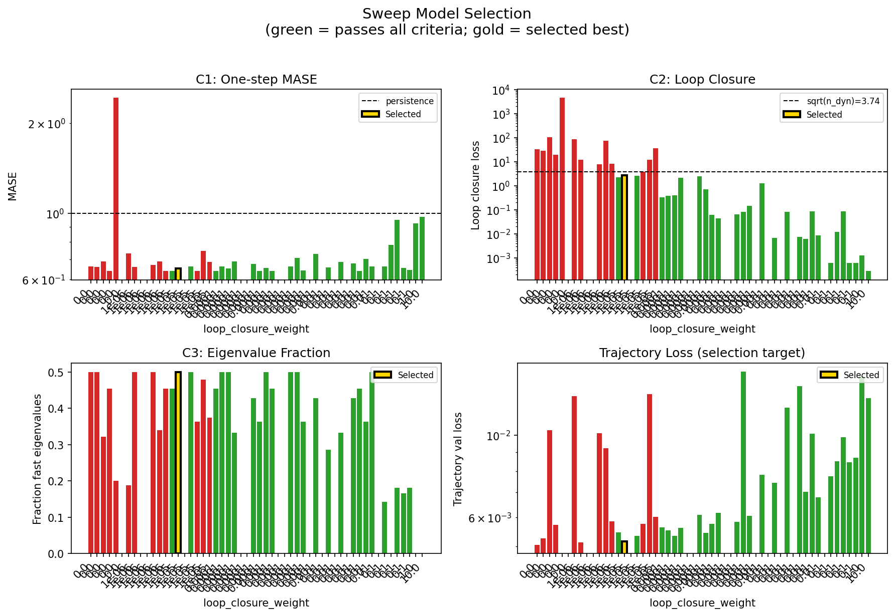

### sweep_pareto

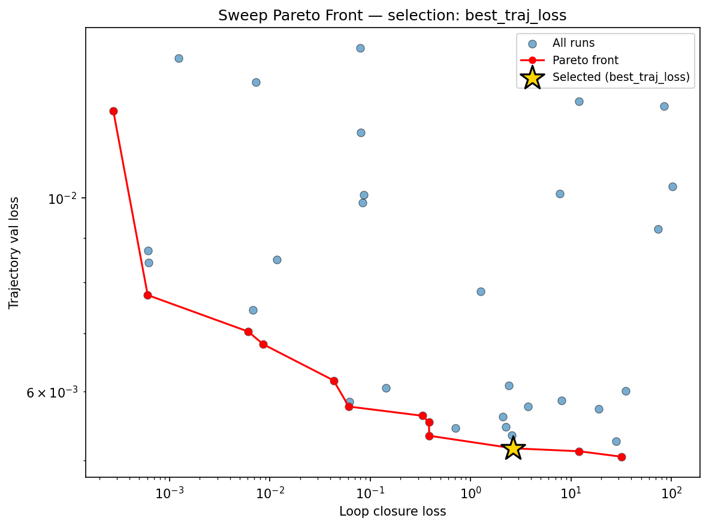

### reconstruction

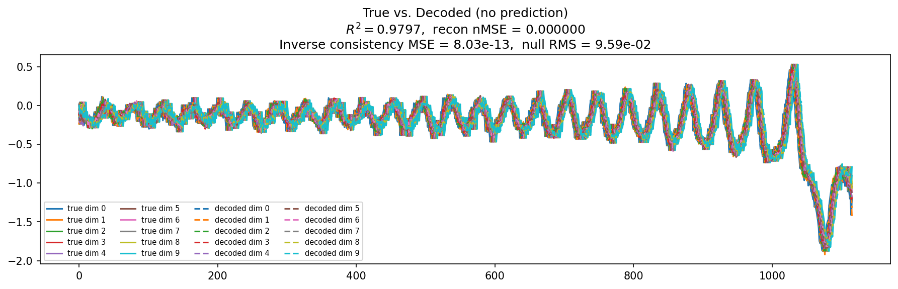

### prediction_windows

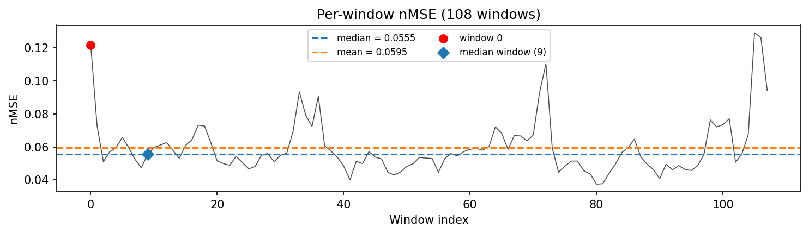

### long_trajectory

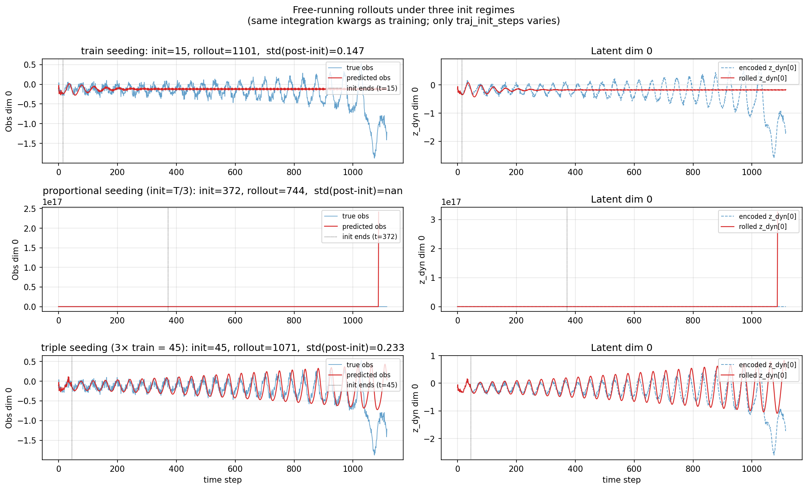

### mase

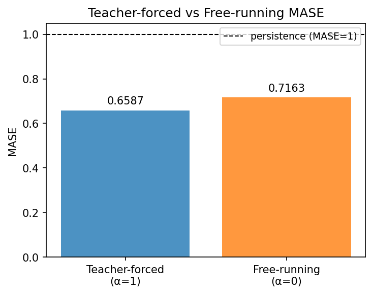

### latent_utilization

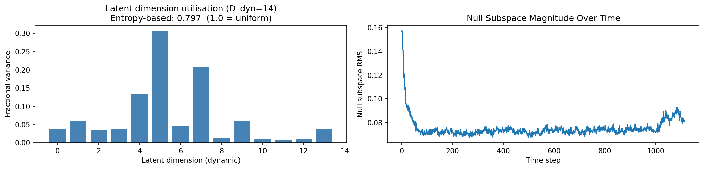

### lyapunov

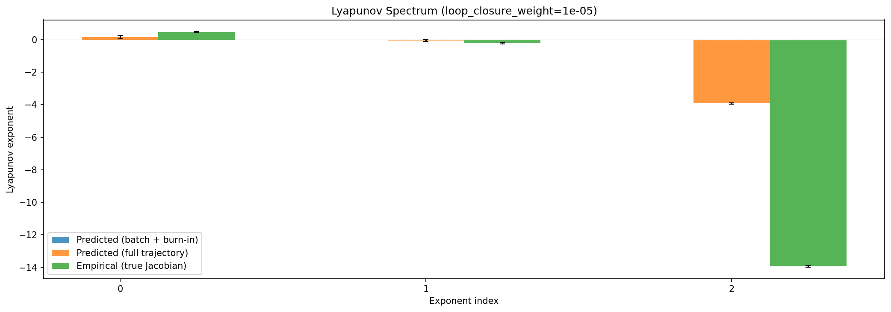

### kaplan_yorke

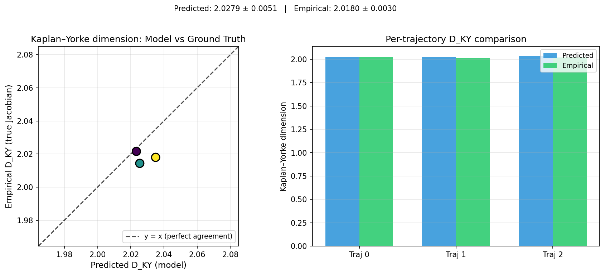

### per_run_lyapunov


### per_run_lyapunov_vs_true


### per_run_lyapunov_relerr


### encoder_decoder_jacobians

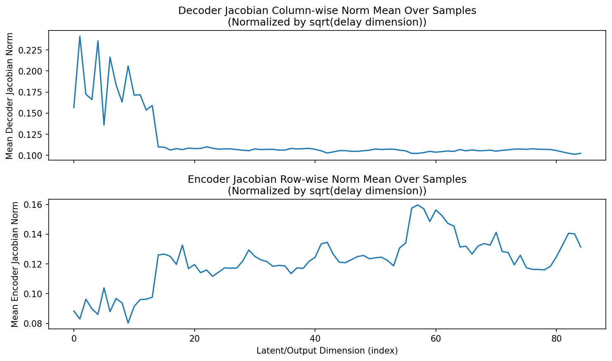

### amplification

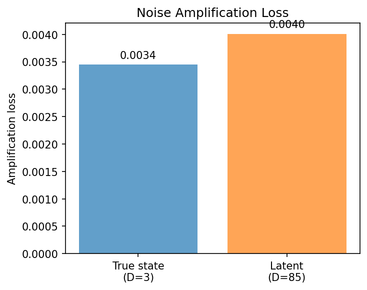

### kaplan_yorke_pca

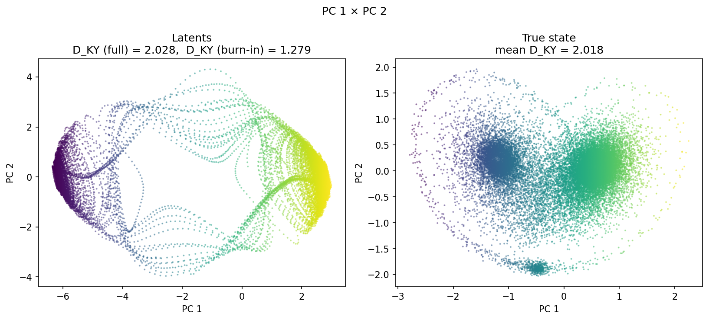

### prediction_detail_latent

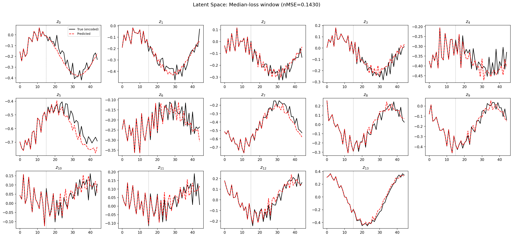

### prediction_detail_obs

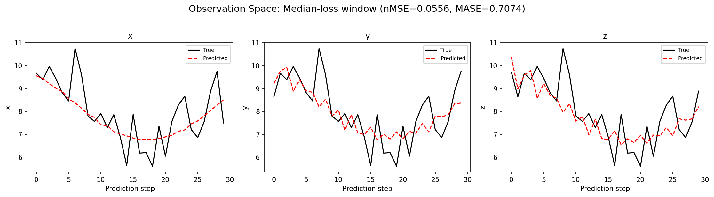

### tangent_spectrum

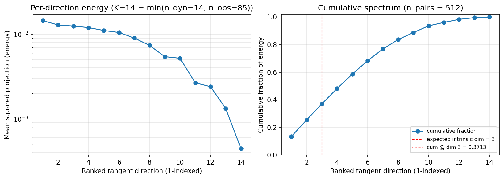

### per_run_tangent_spectrum


## Discussion

<!--
This section is intentionally left as a placeholder. A human reviewer
or Claude Code agent should fill it in based on the tables and figures
above, explicitly addressing each success criterion and comparing the
outcome to the stated hypothesis. Write the Discussion to
`discussion.md` in this directory and re-run `render_report`.
-->

_(to be written)_

## `run_analytics` stdout

<details><summary>Click to expand — full diagnostic output from <code>run_analytics</code></summary>

```
No run_id provided — selecting best run from group 'lorenz_partial_additive_splitmode_p30_obsnoise005_cayley_autodim_top3nd_v2__lc_obsnoisescale_sweep_20260503T045452Z__stage_b' ...
Found 54 total runs in JacobianODE/Lorenz_INDpartial_NDsweep_cayley_autodim_D1_NormTrue__JacobianODE (group=lorenz_partial_additive_splitmode_p30_obsnoise005_cayley_autodim_top3nd_v2__lc_obsnoisescale_sweep_20260503T045452Z__stage_b)
All runs (state, loop_closure_weight, tangent_entropy_weight, kl_dyn_weight):
  bqily7cx: state=crashed, lc=1e-05, te=0.0, kl_dyn=0.0
  p8o0xqw4: state=finished, lc=1e-06, te=0.0, kl_dyn=0.0
  sskpxk5g: state=crashed, lc=1e-06, te=0.0, kl_dyn=0.0
  0ew7quhf: state=crashed, lc=0.0, te=0.0, kl_dyn=0.0
  7t1nn4f9: state=finished, lc=0.0, te=0.0, kl_dyn=0.0
  hm5mu4jp: state=crashed, lc=1e-05, te=0.0, kl_dyn=0.0
  3u1igjv7: state=crashed, lc=1e-06, te=0.0, kl_dyn=0.0
  3jsrpg9i: state=finished, lc=1e-06, te=0.0, kl_dyn=0.0
  tee5b6pr: state=finished, lc=1e-05, te=0.0, kl_dyn=0.0
  urnd3a1t: state=crashed, lc=1e-05, te=0.0, kl_dyn=0.0
  uee2kb22: state=crashed, lc=0.0001, te=0.0, kl_dyn=0.0
  1dcg8yzx: state=crashed, lc=0.0001, te=0.0, kl_dyn=0.0
  50tuf37g: state=crashed, lc=0.0001, te=0.0, kl_dyn=0.0
  mt2b1l8y: state=finished, lc=0.0, te=0.0, kl_dyn=0.0
  7vbgsua8: state=crashed, lc=0.001, te=0.0, kl_dyn=0.0
  db6w4w0x: state=crashed, lc=1e-05, te=0.0, kl_dyn=0.0
  rpxypp2e: state=finished, lc=1e-05, te=0.0, kl_dyn=0.0
  u4snumwg: state=crashed, lc=0.001, te=0.0, kl_dyn=0.0
  2zpbe6q2: state=crashed, lc=0.0001, te=0.0, kl_dyn=0.0
  lsh57ek8: state=crashed, lc=0.001, te=0.0, kl_dyn=0.0
  7l8sz9za: state=crashed, lc=0.01, te=0.0, kl_dyn=0.0
  m268tv5i: state=finished, lc=0.0, te=0.0, kl_dyn=0.0
  vepkytu2: state=finished, lc=1e-06, te=0.0, kl_dyn=0.0
  f83bxnmc: state=crashed, lc=0.001, te=0.0, kl_dyn=0.0
  743e81hu: state=crashed, lc=0.0001, te=0.0, kl_dyn=0.0
  601fkiof: state=finished, lc=0.0, te=0.0, kl_dyn=0.0
  vnd51t40: state=crashed, lc=0.0001, te=0.0, kl_dyn=0.0
  pdww2su4: state=finished, lc=0.01, te=0.0, kl_dyn=0.0
  y5wxaf8u: state=crashed, lc=0.01, te=0.0, kl_dyn=0.0
  qkmdphwn: state=crashed, lc=0.01, te=0.0, kl_dyn=0.0
  qmz8kl51: state=crashed, lc=0.01, te=0.0, kl_dyn=0.0
  as44dcuz: state=finished, lc=0.01, te=0.0, kl_dyn=0.0
  jgrje8p7: state=finished, lc=1e-06, te=0.0, kl_dyn=0.0
  odrl2rgg: state=finished, lc=0.001, te=0.0, kl_dyn=0.0
  a4g0k3nw: state=finished, lc=0.001, te=0.0, kl_dyn=0.0
  by3y7iqz: state=finished, lc=0.001, te=0.0, kl_dyn=0.0
  o1knlzpw: state=finished, lc=0.0001, te=0.0, kl_dyn=0.0
  4ou5c9nd: state=finished, lc=0.01, te=0.0, kl_dyn=0.0
  v40vle4m: state=finished, lc=0.0, te=0.0, kl_dyn=0.0
  h27br3mt: state=finished, lc=1e-05, te=0.0, kl_dyn=0.0
  8d9kl89j: state=finished, lc=0.01, te=0.0, kl_dyn=0.0
  dujgjwpo: state=finished, lc=0.01, te=0.0, kl_dyn=0.0
  ikhwywnf: state=crashed, lc=1.0, te=0.0, kl_dyn=0.0
  9cqwq46q: state=finished, lc=0.0001, te=0.0, kl_dyn=0.0
  8zxwob7f: state=crashed, lc=0.1, te=0.0, kl_dyn=0.0
  wm4sawrt: state=crashed, lc=0.1, te=0.0, kl_dyn=0.0
  7ns5r5dr: state=finished, lc=0.1, te=0.0, kl_dyn=0.0
  9fl25efz: state=crashed, lc=0.1, te=0.0, kl_dyn=0.0
  awtrxkzp: state=crashed, lc=0.1, te=0.0, kl_dyn=0.0
  511uijl4: state=crashed, lc=10.0, te=0.0, kl_dyn=0.0
  ucotnnva: state=crashed, lc=0.1, te=0.0, kl_dyn=0.0
  mzneds6h: state=finished, lc=1e-06, te=0.0, kl_dyn=0.0
  9t9wui86: state=finished, lc=0.001, te=0.0, kl_dyn=0.0
  i8wgdlq0: state=finished, lc=0.001, te=0.0, kl_dyn=0.0

slurm_timeout_min not found in any run config — falling back to 180 min
  Including bqily7cx (lc=1e-05): use_all_runs=True (state=crashed)
  Including p8o0xqw4 (lc=1e-06): use_all_runs=True (state=finished)
  Including sskpxk5g (lc=1e-06): use_all_runs=True (state=crashed)
  Including 0ew7quhf (lc=0.0): use_all_runs=True (state=crashed)
  Including 7t1nn4f9 (lc=0.0): use_all_runs=True (state=finished)
  Including hm5mu4jp (lc=1e-05): use_all_runs=True (state=crashed)
  Including 3u1igjv7 (lc=1e-06): use_all_runs=True (state=crashed)
  Including 3jsrpg9i (lc=1e-06): use_all_runs=True (state=finished)
  Including tee5b6pr (lc=1e-05): use_all_runs=True (state=finished)
  Including urnd3a1t (lc=1e-05): use_all_runs=True (state=crashed)
  Including uee2kb22 (lc=0.0001): use_all_runs=True (state=crashed)
  Including 1dcg8yzx (lc=0.0001): use_all_runs=True (state=crashed)
  Including 50tuf37g (lc=0.0001): use_all_runs=True (state=crashed)
  Including mt2b1l8y (lc=0.0): use_all_runs=True (state=finished)
  Including 7vbgsua8 (lc=0.001): use_all_runs=True (state=crashed)
  Including db6w4w0x (lc=1e-05): use_all_runs=True (state=crashed)
  Including rpxypp2e (lc=1e-05): use_all_runs=True (state=finished)
  Including u4snumwg (lc=0.001): use_all_runs=True (state=crashed)
  Including 2zpbe6q2 (lc=0.0001): use_all_runs=True (state=crashed)
  Including lsh57ek8 (lc=0.001): use_all_runs=True (state=crashed)
  Including 7l8sz9za (lc=0.01): use_all_runs=True (state=crashed)
  Including m268tv5i (lc=0.0): use_all_runs=True (state=finished)
  Including vepkytu2 (lc=1e-06): use_all_runs=True (state=finished)
  Including f83bxnmc (lc=0.001): use_all_runs=True (state=crashed)
  Including 743e81hu (lc=0.0001): use_all_runs=True (state=crashed)
  Including 601fkiof (lc=0.0): use_all_runs=True (state=finished)
  Including vnd51t40 (lc=0.0001): use_all_runs=True (state=crashed)
  Including pdww2su4 (lc=0.01): use_all_runs=True (state=finished)
  Including y5wxaf8u (lc=0.01): use_all_runs=True (state=crashed)
  Including qkmdphwn (lc=0.01): use_all_runs=True (state=crashed)
  Including qmz8kl51 (lc=0.01): use_all_runs=True (state=crashed)
  Including as44dcuz (lc=0.01): use_all_runs=True (state=finished)
  Including jgrje8p7 (lc=1e-06): use_all_runs=True (state=finished)
  Including odrl2rgg (lc=0.001): use_all_runs=True (state=finished)
  Including a4g0k3nw (lc=0.001): use_all_runs=True (state=finished)
  Including by3y7iqz (lc=0.001): use_all_runs=True (state=finished)
  Including o1knlzpw (lc=0.0001): use_all_runs=True (state=finished)
  Including 4ou5c9nd (lc=0.01): use_all_runs=True (state=finished)
  Including v40vle4m (lc=0.0): use_all_runs=True (state=finished)
  Including h27br3mt (lc=1e-05): use_all_runs=True (state=finished)
  Including 8d9kl89j (lc=0.01): use_all_runs=True (state=finished)
  Including dujgjwpo (lc=0.01): use_all_runs=True (state=finished)
  Including ikhwywnf (lc=1.0): use_all_runs=True (state=crashed)
  Including 9cqwq46q (lc=0.0001): use_all_runs=True (state=finished)
  Including 8zxwob7f (lc=0.1): use_all_runs=True (state=crashed)
  Including wm4sawrt (lc=0.1): use_all_runs=True (state=crashed)
  Including 7ns5r5dr (lc=0.1): use_all_runs=True (state=finished)
  Including 9fl25efz (lc=0.1): use_all_runs=True (state=crashed)
  Including awtrxkzp (lc=0.1): use_all_runs=True (state=crashed)
  Including 511uijl4 (lc=10.0): use_all_runs=True (state=crashed)
  Including ucotnnva (lc=0.1): use_all_runs=True (state=crashed)
  Including mzneds6h (lc=1e-06): use_all_runs=True (state=finished)
  Including 9t9wui86 (lc=0.001): use_all_runs=True (state=finished)
  Including i8wgdlq0 (lc=0.001): use_all_runs=True (state=finished)
Found 54 effectively-done sweep runs:
  loop_closure_weight=0.0, tangent_entropy_weight=0.0, kl_dyn_weight=0.0 -> run_id=0ew7quhf
  loop_closure_weight=0.0, tangent_entropy_weight=0.0, kl_dyn_weight=0.0 -> run_id=601fkiof
  loop_closure_weight=0.0, tangent_entropy_weight=0.0, kl_dyn_weight=0.0 -> run_id=7t1nn4f9
  loop_closure_weight=0.0, tangent_entropy_weight=0.0, kl_dyn_weight=0.0 -> run_id=m268tv5i
  loop_closure_weight=0.0, tangent_entropy_weight=0.0, kl_dyn_weight=0.0 -> run_id=mt2b1l8y
  loop_closure_weight=0.0, tangent_entropy_weight=0.0, kl_dyn_weight=0.0 -> run_id=v40vle4m
  loop_closure_weight=1e-06, tangent_entropy_weight=0.0, kl_dyn_weight=0.0 -> run_id=3jsrpg9i
  loop_closure_weight=1e-06, tangent_entropy_weight=0.0, kl_dyn_weight=0.0 -> run_id=3u1igjv7
  loop_closure_weight=1e-06, tangent_entropy_weight=0.0, kl_dyn_weight=0.0 -> run_id=jgrje8p7
  loop_closure_weight=1e-06, tangent_entropy_weight=0.0, kl_dyn_weight=0.0 -> run_id=mzneds6h
  loop_closure_weight=1e-06, tangent_entropy_weight=0.0, kl_dyn_weight=0.0 -> run_id=p8o0xqw4
  loop_closure_weight=1e-06, tangent_entropy_weight=0.0, kl_dyn_weight=0.0 -> run_id=sskpxk5g
  loop_closure_weight=1e-06, tangent_entropy_weight=0.0, kl_dyn_weight=0.0 -> run_id=vepkytu2
  loop_closure_weight=1e-05, tangent_entropy_weight=0.0, kl_dyn_weight=0.0 -> run_id=bqily7cx
  loop_closure_weight=1e-05, tangent_entropy_weight=0.0, kl_dyn_weight=0.0 -> run_id=db6w4w0x
  loop_closure_weight=1e-05, tangent_entropy_weight=0.0, kl_dyn_weight=0.0 -> run_id=h27br3mt
  loop_closure_weight=1e-05, tangent_entropy_weight=0.0, kl_dyn_weight=0.0 -> run_id=hm5mu4jp
  loop_closure_weight=1e-05, tangent_entropy_weight=0.0, kl_dyn_weight=0.0 -> run_id=rpxypp2e
  loop_closure_weight=1e-05, tangent_entropy_weight=0.0, kl_dyn_weight=0.0 -> run_id=tee5b6pr
  loop_closure_weight=1e-05, tangent_entropy_weight=0.0, kl_dyn_weight=0.0 -> run_id=urnd3a1t
  loop_closure_weight=0.0001, tangent_entropy_weight=0.0, kl_dyn_weight=0.0 -> run_id=1dcg8yzx
  loop_closure_weight=0.0001, tangent_entropy_weight=0.0, kl_dyn_weight=0.0 -> run_id=2zpbe6q2
  loop_closure_weight=0.0001, tangent_entropy_weight=0.0, kl_dyn_weight=0.0 -> run_id=50tuf37g
  loop_closure_weight=0.0001, tangent_entropy_weight=0.0, kl_dyn_weight=0.0 -> run_id=743e81hu
  loop_closure_weight=0.0001, tangent_entropy_weight=0.0, kl_dyn_weight=0.0 -> run_id=9cqwq46q
  loop_closure_weight=0.0001, tangent_entropy_weight=0.0, kl_dyn_weight=0.0 -> run_id=o1knlzpw
  loop_closure_weight=0.0001, tangent_entropy_weight=0.0, kl_dyn_weight=0.0 -> run_id=uee2kb22
  loop_closure_weight=0.0001, tangent_entropy_weight=0.0, kl_dyn_weight=0.0 -> run_id=vnd51t40
  loop_closure_weight=0.001, tangent_entropy_weight=0.0, kl_dyn_weight=0.0 -> run_id=7vbgsua8
  loop_closure_weight=0.001, tangent_entropy_weight=0.0, kl_dyn_weight=0.0 -> run_id=9t9wui86
  loop_closure_weight=0.001, tangent_entropy_weight=0.0, kl_dyn_weight=0.0 -> run_id=a4g0k3nw
  loop_closure_weight=0.001, tangent_entropy_weight=0.0, kl_dyn_weight=0.0 -> run_id=by3y7iqz
  loop_closure_weight=0.001, tangent_entropy_weight=0.0, kl_dyn_weight=0.0 -> run_id=f83bxnmc
  loop_closure_weight=0.001, tangent_entropy_weight=0.0, kl_dyn_weight=0.0 -> run_id=i8wgdlq0
  loop_closure_weight=0.001, tangent_entropy_weight=0.0, kl_dyn_weight=0.0 -> run_id=lsh57ek8
  loop_closure_weight=0.001, tangent_entropy_weight=0.0, kl_dyn_weight=0.0 -> run_id=odrl2rgg
  loop_closure_weight=0.001, tangent_entropy_weight=0.0, kl_dyn_weight=0.0 -> run_id=u4snumwg
  loop_closure_weight=0.01, tangent_entropy_weight=0.0, kl_dyn_weight=0.0 -> run_id=4ou5c9nd
  loop_closure_weight=0.01, tangent_entropy_weight=0.0, kl_dyn_weight=0.0 -> run_id=7l8sz9za
  loop_closure_weight=0.01, tangent_entropy_weight=0.0, kl_dyn_weight=0.0 -> run_id=8d9kl89j
  loop_closure_weight=0.01, tangent_entropy_weight=0.0, kl_dyn_weight=0.0 -> run_id=as44dcuz
  loop_closure_weight=0.01, tangent_entropy_weight=0.0, kl_dyn_weight=0.0 -> run_id=dujgjwpo
  loop_closure_weight=0.01, tangent_entropy_weight=0.0, kl_dyn_weight=0.0 -> run_id=pdww2su4
  loop_closure_weight=0.01, tangent_entropy_weight=0.0, kl_dyn_weight=0.0 -> run_id=qkmdphwn
  loop_closure_weight=0.01, tangent_entropy_weight=0.0, kl_dyn_weight=0.0 -> run_id=qmz8kl51
  loop_closure_weight=0.01, tangent_entropy_weight=0.0, kl_dyn_weight=0.0 -> run_id=y5wxaf8u
  loop_closure_weight=0.1, tangent_entropy_weight=0.0, kl_dyn_weight=0.0 -> run_id=7ns5r5dr
  loop_closure_weight=0.1, tangent_entropy_weight=0.0, kl_dyn_weight=0.0 -> run_id=8zxwob7f
  loop_closure_weight=0.1, tangent_entropy_weight=0.0, kl_dyn_weight=0.0 -> run_id=9fl25efz
  loop_closure_weight=0.1, tangent_entropy_weight=0.0, kl_dyn_weight=0.0 -> run_id=awtrxkzp
  loop_closure_weight=0.1, tangent_entropy_weight=0.0, kl_dyn_weight=0.0 -> run_id=ucotnnva
  loop_closure_weight=0.1, tangent_entropy_weight=0.0, kl_dyn_weight=0.0 -> run_id=wm4sawrt
  loop_closure_weight=1.0, tangent_entropy_weight=0.0, kl_dyn_weight=0.0 -> run_id=ikhwywnf
  loop_closure_weight=10.0, tangent_entropy_weight=0.0, kl_dyn_weight=0.0 -> run_id=511uijl4
n_dims=85, n_latent=85, n_dyn=14, dt=0.0150
  run=0ew7quhf: DiagnosticMetrics(one_step_mase=0.6619001626968384, loop_closure_loss=32.14540481567383, fast_eigenvalue_fraction=0.5, trajectory_val_loss=0.005052566062659025) (from cache, n_batches=100)
  run=601fkiof: DiagnosticMetrics(one_step_mase=0.6592473983764648, loop_closure_loss=28.197553634643555, fast_eigenvalue_fraction=0.5, trajectory_val_loss=0.005261473823338747) (from cache, n_batches=100)
  run=7t1nn4f9: DiagnosticMetrics(one_step_mase=0.6887404918670654, loop_closure_loss=102.18049621582031, fast_eigenvalue_fraction=0.3214285671710968, trajectory_val_loss=0.010298551060259342) (from cache, n_batches=100)
  run=m268tv5i: DiagnosticMetrics(one_step_mase=0.6407605409622192, loop_closure_loss=18.990741729736328, fast_eigenvalue_fraction=0.4545454680919647, trajectory_val_loss=0.005730538163334131) (from cache, n_batches=100)
  run=mt2b1l8y: DiagnosticMetrics(one_step_mase=2.433638514095008, loop_closure_loss=4516.410163574219, fast_eigenvalue_fraction=0.20088425925925926, trajectory_val_loss=nan) (from cache, n_batches=100)
  run=v40vle4m: DiagnosticMetrics(one_step_mase=nan, loop_closure_loss=nan, fast_eigenvalue_fraction=0.0, trajectory_val_loss=nan) (from cache, n_batches=100)
  run=3jsrpg9i: DiagnosticMetrics(one_step_mase=0.7320995926856995, loop_closure_loss=84.53040313720703, fast_eigenvalue_fraction=0.1875, trajectory_val_loss=0.012736393138766289) (from cache, n_batches=100)
  run=3u1igjv7: DiagnosticMetrics(one_step_mase=0.6607595086097717, loop_closure_loss=12.055047988891602, fast_eigenvalue_fraction=0.5, trajectory_val_loss=0.005126327741891146) (from cache, n_batches=100)
  run=jgrje8p7: DiagnosticMetrics(one_step_mase=nan, loop_closure_loss=nan, fast_eigenvalue_fraction=0.0, trajectory_val_loss=nan) (from cache, n_batches=100)
  run=mzneds6h: DiagnosticMetrics(one_step_mase=nan, loop_closure_loss=nan, fast_eigenvalue_fraction=0.0, trajectory_val_loss=nan) (from cache, n_batches=100)
  run=p8o0xqw4: DiagnosticMetrics(one_step_mase=0.6696556210517883, loop_closure_loss=7.702804088592529, fast_eigenvalue_fraction=0.5, trajectory_val_loss=0.010107534937560558) (from cache, n_batches=100)
  run=sskpxk5g: DiagnosticMetrics(one_step_mase=0.6884762048721313, loop_closure_loss=74.18224334716797, fast_eigenvalue_fraction=0.3392857015132904, trajectory_val_loss=0.009212481789290905) (from cache, n_batches=100)
  run=vepkytu2: DiagnosticMetrics(one_step_mase=0.6406725645065308, loop_closure_loss=8.029727935791016, fast_eigenvalue_fraction=0.4545454680919647, trajectory_val_loss=0.005857246462255716) (from cache, n_batches=100)
  run=bqily7cx: DiagnosticMetrics(one_step_mase=0.6404058337211609, loop_closure_loss=2.24114727973938, fast_eigenvalue_fraction=0.4545454680919647, trajectory_val_loss=0.00546645000576973) (from cache, n_batches=100)
  run=db6w4w0x: DiagnosticMetrics(one_step_mase=0.6534757614135742, loop_closure_loss=2.6652743816375732, fast_eigenvalue_fraction=0.5, trajectory_val_loss=0.005166084039956331) (from cache, n_batches=100)
  run=h27br3mt: DiagnosticMetrics(one_step_mase=nan, loop_closure_loss=nan, fast_eigenvalue_fraction=0.0, trajectory_val_loss=nan) (from cache, n_batches=100)
  run=hm5mu4jp: DiagnosticMetrics(one_step_mase=0.6615885496139526, loop_closure_loss=2.593440055847168, fast_eigenvalue_fraction=0.5, trajectory_val_loss=0.005345338024199009) (from cache, n_batches=100)
  run=rpxypp2e: DiagnosticMetrics(one_step_mase=0.6405718922615051, loop_closure_loss=3.7544772624969482, fast_eigenvalue_fraction=0.3636363744735718, trajectory_val_loss=0.005764773115515709) (from cache, n_batches=100)
  run=tee5b6pr: DiagnosticMetrics(one_step_mase=0.7474859356880188, loop_closure_loss=11.992192268371582, fast_eigenvalue_fraction=0.4791666567325592, trajectory_val_loss=0.012898956425487995) (from cache, n_batches=100)
  run=urnd3a1t: DiagnosticMetrics(one_step_mase=0.6859975457191467, loop_closure_loss=35.22425842285156, fast_eigenvalue_fraction=0.375, trajectory_val_loss=0.006012548692524433) (from cache, n_batches=100)
  run=1dcg8yzx: DiagnosticMetrics(one_step_mase=0.6405085325241089, loop_closure_loss=0.3316112458705902, fast_eigenvalue_fraction=0.4545454680919647, trajectory_val_loss=0.005629196297377348) (from cache, n_batches=100)
  run=2zpbe6q2: DiagnosticMetrics(one_step_mase=0.6627455949783325, loop_closure_loss=0.3856922388076782, fast_eigenvalue_fraction=0.5, trajectory_val_loss=0.005532038398087025) (from cache, n_batches=100)
  run=50tuf37g: DiagnosticMetrics(one_step_mase=0.6535825729370117, loop_closure_loss=0.3871336877346039, fast_eigenvalue_fraction=0.5, trajectory_val_loss=0.0053403014317154884) (from cache, n_batches=100)
  run=743e81hu: DiagnosticMetrics(one_step_mase=0.6896141767501831, loop_closure_loss=2.084510564804077, fast_eigenvalue_fraction=0.3333333432674408, trajectory_val_loss=0.0056164502166211605) (from cache, n_batches=100)
  run=9cqwq46q: DiagnosticMetrics(one_step_mase=nan, loop_closure_loss=nan, fast_eigenvalue_fraction=0.0, trajectory_val_loss=nan) (from cache, n_batches=100)
  run=o1knlzpw: DiagnosticMetrics(one_step_mase=nan, loop_closure_loss=nan, fast_eigenvalue_fraction=0.0, trajectory_val_loss=nan) (from cache, n_batches=100)
  run=uee2kb22: DiagnosticMetrics(one_step_mase=0.6769188642501831, loop_closure_loss=2.4131364822387695, fast_eigenvalue_fraction=0.4285714328289032, trajectory_val_loss=0.006100900936871767) (from cache, n_batches=100)
  run=vnd51t40: DiagnosticMetrics(one_step_mase=0.639272928237915, loop_closure_loss=0.7118913531303406, fast_eigenvalue_fraction=0.3636363744735718, trajectory_val_loss=0.005445728078484535) (from cache, n_batches=100)
  run=7vbgsua8: DiagnosticMetrics(one_step_mase=0.6545278429985046, loop_closure_loss=0.06114966794848442, fast_eigenvalue_fraction=0.5, trajectory_val_loss=0.005767705384641886) (from cache, n_batches=100)
  run=9t9wui86: DiagnosticMetrics(one_step_mase=0.6408931612968445, loop_closure_loss=0.04322938621044159, fast_eigenvalue_fraction=0.4545454680919647, trajectory_val_loss=0.006178502459079027) (from cache, n_batches=100)
  run=a4g0k3nw: DiagnosticMetrics(one_step_mase=nan, loop_closure_loss=nan, fast_eigenvalue_fraction=0.0, trajectory_val_loss=nan) (from cache, n_batches=100)
  run=by3y7iqz: DiagnosticMetrics(one_step_mase=nan, loop_closure_loss=nan, fast_eigenvalue_fraction=0.0, trajectory_val_loss=nan) (from cache, n_batches=100)
  run=f83bxnmc: DiagnosticMetrics(one_step_mase=0.6633754968643188, loop_closure_loss=0.06233280152082443, fast_eigenvalue_fraction=0.5, trajectory_val_loss=0.005840842146426439) (from cache, n_batches=100)
  run=i8wgdlq0: DiagnosticMetrics(one_step_mase=0.7076228857040405, loop_closure_loss=0.08001719415187836, fast_eigenvalue_fraction=0.5, trajectory_val_loss=0.01484011672437191) (from cache, n_batches=100)
  run=lsh57ek8: DiagnosticMetrics(one_step_mase=0.6418033242225647, loop_closure_loss=0.14458893239498138, fast_eigenvalue_fraction=0.3636363744735718, trajectory_val_loss=0.006061430089175701) (from cache, n_batches=100)
  run=odrl2rgg: DiagnosticMetrics(one_step_mase=nan, loop_closure_loss=nan, fast_eigenvalue_fraction=0.0, trajectory_val_loss=nan) (from cache, n_batches=100)
  run=u4snumwg: DiagnosticMetrics(one_step_mase=0.7298907041549683, loop_closure_loss=1.2582032680511475, fast_eigenvalue_fraction=0.4285714328289032, trajectory_val_loss=0.007816347293555737) (from cache, n_batches=100)
  run=4ou5c9nd: DiagnosticMetrics(one_step_mase=nan, loop_closure_loss=nan, fast_eigenvalue_fraction=0.0, trajectory_val_loss=nan) (from cache, n_batches=100)
  run=7l8sz9za: DiagnosticMetrics(one_step_mase=0.657757580280304, loop_closure_loss=0.006780816707760096, fast_eigenvalue_fraction=0.2857142984867096, trajectory_val_loss=0.0074365693144500256) (from cache, n_batches=100)
  run=8d9kl89j: DiagnosticMetrics(one_step_mase=nan, loop_closure_loss=nan, fast_eigenvalue_fraction=0.0, trajectory_val_loss=nan) (from cache, n_batches=100)
  run=as44dcuz: DiagnosticMetrics(one_step_mase=0.6854671239852905, loop_closure_loss=0.08034011721611023, fast_eigenvalue_fraction=0.3333333432674408, trajectory_val_loss=0.01187878753989935) (from cache, n_batches=100)
  run=dujgjwpo: DiagnosticMetrics(one_step_mase=nan, loop_closure_loss=nan, fast_eigenvalue_fraction=0.0, trajectory_val_loss=nan) (from cache, n_batches=100)
  run=pdww2su4: DiagnosticMetrics(one_step_mase=0.6781821846961975, loop_closure_loss=0.007301377598196268, fast_eigenvalue_fraction=0.4285714328289032, trajectory_val_loss=0.013573826290667057) (from cache, n_batches=100)
  run=qkmdphwn: DiagnosticMetrics(one_step_mase=0.639866292476654, loop_closure_loss=0.006074661388993263, fast_eigenvalue_fraction=0.4545454680919647, trajectory_val_loss=0.007029195316135883) (from cache, n_batches=100)
  run=qmz8kl51: DiagnosticMetrics(one_step_mase=0.7011627554893494, loop_closure_loss=0.0867115780711174, fast_eigenvalue_fraction=0.3636363744735718, trajectory_val_loss=0.010080477222800255) (from cache, n_batches=100)
  run=y5wxaf8u: DiagnosticMetrics(one_step_mase=0.6627702713012695, loop_closure_loss=0.00862347986549139, fast_eigenvalue_fraction=0.5, trajectory_val_loss=0.0067953551188111305) (from cache, n_batches=100)
  run=7ns5r5dr: DiagnosticMetrics(one_step_mase=nan, loop_closure_loss=nan, fast_eigenvalue_fraction=0.0, trajectory_val_loss=nan) (from cache, n_batches=100)
  run=8zxwob7f: DiagnosticMetrics(one_step_mase=0.661852240562439, loop_closure_loss=0.000606815330684185, fast_eigenvalue_fraction=0.1428571492433548, trajectory_val_loss=0.007738121319562197) (from cache, n_batches=100)
  run=9fl25efz: DiagnosticMetrics(one_step_mase=0.782496988773346, loop_closure_loss=0.011784915812313557, fast_eigenvalue_fraction=0.0, trajectory_val_loss=0.008501876145601273) (from cache, n_batches=100)
  run=awtrxkzp: DiagnosticMetrics(one_step_mase=0.9511085152626038, loop_closure_loss=0.08444013446569443, fast_eigenvalue_fraction=0.1818181872367859, trajectory_val_loss=0.009876144118607044) (from cache, n_batches=100)
  run=ucotnnva: DiagnosticMetrics(one_step_mase=0.654123067855835, loop_closure_loss=0.000618260120972991, fast_eigenvalue_fraction=0.1666666716337204, trajectory_val_loss=0.0084364740177989) (from cache, n_batches=100)
  run=wm4sawrt: DiagnosticMetrics(one_step_mase=0.6445437073707581, loop_closure_loss=0.0006145132356323302, fast_eigenvalue_fraction=0.1818181872367859, trajectory_val_loss=0.008694451302289963) (from cache, n_batches=100)
  run=ikhwywnf: DiagnosticMetrics(one_step_mase=0.9254789352416992, loop_closure_loss=0.0012294808402657509, fast_eigenvalue_fraction=0.0, trajectory_val_loss=0.014451664872467518) (from cache, n_batches=100)
  run=511uijl4: DiagnosticMetrics(one_step_mase=0.9721693992614746, loop_closure_loss=0.00027600006433203816, fast_eigenvalue_fraction=0.0, trajectory_val_loss=0.012571645900607109) (from cache, n_batches=100)

Ranking method:           best_traj_loss
Best run ID:              db6w4w0x
Best loop_closure_weight: 1e-05
Best tangent_entropy_weight: 0.0
Best kl_dyn_weight:       0.0
Best traj loss:           0.005166
Criteria applied: ['C1', 'C2', 'C3']
Surviving: 41 / 54
Auto-selected run_id: db6w4w0x

======================================================================
PARETO FRONTIER RUNS (12 runs)
======================================================================
  Run ID               LC Loss   Traj Val Loss
  ------------  --------------  --------------
  511uijl4            0.000276        0.012572
  8zxwob7f            0.000607        0.007738
  qkmdphwn            0.006075        0.007029
  y5wxaf8u            0.008623        0.006795
  9t9wui86            0.043229        0.006179
  7vbgsua8            0.061150        0.005768
  1dcg8yzx            0.331611        0.005629
  2zpbe6q2            0.385692        0.005532
  50tuf37g            0.387134        0.005340
  db6w4w0x            2.665274        0.005166 <-- selected
  3u1igjv7           12.055048        0.005126
  0ew7quhf           32.145405        0.005053

======================================================================
RANKING METHOD COMPARISON (over 41 survivors)
======================================================================
  Method                  Run ID               LC Loss   Traj Val Loss
  ----------------------  ------------  --------------  --------------
  best_traj_loss          db6w4w0x            2.665274        0.005166 <-- active
  pareto_knee             50tuf37g            0.387134        0.005340
  geo_rank                511uijl4            0.000276        0.012572
  minimax_rank            7vbgsua8            0.061150        0.005768
  geo_log_score           db6w4w0x            2.665274        0.005166
  minimax_log_score       qkmdphwn            0.006075        0.007029
======================================================================

Loading run db6w4w0x from JacobianODE/Lorenz_INDpartial_NDsweep_cayley_autodim_D1_NormTrue__JacobianODE ...
Loading checkpoint epoch=107-step=21600.ckpt...
Train dataset shape: torch.Size([23562, 45, 85])
Validation dataset shape: torch.Size([7497, 45, 85])
Test dataset shape: torch.Size([3213, 45, 85])
Train trajectories dataset shape: torch.Size([22, 1116, 85])
Validation trajectories dataset shape: torch.Size([7, 1116, 85])
Test trajectories dataset shape: torch.Size([3, 1116, 85])
Loading checkpoint epoch=107-step=21600.ckpt...
Computing reconstruction ...
Computing MASE ...
Teacher-forced MASE: 0.6587
Free-running MASE:   0.7163
Computing latent utilization ...
Entropy-based utilization: 0.797
Null subspace mean RMS: 7.571357e-02
Computing Lyapunov exponents ...
  Computing full-trajectory Lyapunov (3 test trajs, T=1116) ...
Predicted Lyapunov exponents (batch+burn-in, 128 windowed trajs):
  λ_1 = +nan ± nan
  λ_2 = +nan ± nan
  λ_3 = +nan ± nan
  λ_4 = +nan ± nan
  λ_5 = +nan ± nan
  λ_6 = +nan ± nan
  λ_7 = +nan ± nan
  λ_8 = +nan ± nan
  λ_9 = +nan ± nan
  λ_10 = +nan ± nan
  λ_11 = +nan ± nan
  λ_12 = +nan ± nan
  λ_13 = +nan ± nan
  λ_14 = +nan ± nan
Predicted Lyapunov exponents (full-length, 3 test trajs):
  λ_1 = +0.1538 ± 0.0939
  λ_2 = -0.0442 ± 0.0747
  λ_3 = -3.9219 ± 0.0487
  λ_4 = -4.8788 ± 0.0238
  λ_5 = -5.2480 ± 0.0201
  λ_6 = -5.3303 ± 0.0077
  λ_7 = -5.7854 ± 0.0475
  λ_8 = -91.3211 ± 0.0336
  λ_9 = -98.0292 ± 0.0449
  λ_10 = -98.0915 ± 0.0440
  λ_11 = -121.4553 ± 0.0662
  λ_12 = -121.5827 ± 0.0454
  λ_13 = -138.1435 ± 0.0650
  λ_14 = -138.1854 ± 0.0520
Empirical Lyapunov exponents (mean ± std):
  λ_1 = +0.4677 ± 0.0259
  λ_2 = -0.2173 ± 0.0549
  λ_3 = -13.9174 ± 0.0513
Mean KY dim (predicted): 2.028 ± 0.005
Mean KY dim (empirical): 2.018 ± 0.003
Mean KY dim (burn-in):   1.279 ± 0.577
Computing prediction windows ...
Windows: 108 — nMSE min=0.0375, median=0.0555, mean=0.0595, max=0.1290
Computing long-trajectory free-running rollouts ...
Computing encoder/decoder Jacobians ...
encoder_jacobian: (128, 85, 85)
decoder_jacobian: (128, 85, 85)
Computing amplification loss ...
Amplification loss — True state: 0.003446
Amplification loss — Latent:     0.004011
Computing tangent space spectrum ...
```

</details>
