# mary_propofol_resting__Mary-Anesthesia-20160809-01__awake_maint__ds1__enc_only_2stage_pp09_n_delays__20260507T153513Z

- wandb group: [mary_propofol_resting__Mary-Anesthesia-20160809-01__awake_maint__ds1__enc_only_2stage_pp09_n_delays__20260507T153513Z](https://wandb.ai/JacobianODE/MindControl_Mary_propofol_resting/groups/mary_propofol_resting__Mary-Anesthesia-20160809-01__awake_maint__ds1__enc_only_2stage_pp09_n_delays__20260507T153513Z)
- chosen cell: **`n_delays_5`** (val/one_step_mase = 0.0056)
- cells reported: 4

**Description**: Encoder-only, awake + maintenance dose, ds=1 (1000 Hz). Two-stage PCA with first-stage=0.9, second-stage=0.99. n_delays grid: {5, 10, 20, 30}. Pure reconstruction loss (no dynamics MLP, no VAE).

**Hypothesis**

```
The 24-run sweep's 0.9-first-stage runs have suspiciously bad
reconstruction. Hypothesis: with only ~80 dims after first-stage
reduction, the encoder + autodim has too little signal to fit
well within walltime. By extending n_delays we increase the
encoder's input dimensionality (n_features × n_delays) and give
autodim more context to pick PCs that actually capture variance.
If reconstruction improves monotonically with n_delays, the issue
is capacity / context size. If it stays flat, the 0.9 first-stage
has discarded structure the encoder needs and the right fix is to
raise the first-stage threshold.
```

**Success criteria** (manual review until automated):

- [ ] All 4 cells finish within the 6-hour cap.
- [ ] val/recon_loss finite for all cells.
- [ ] Cells reach a clear plateau (no late divergence).

## Run picking

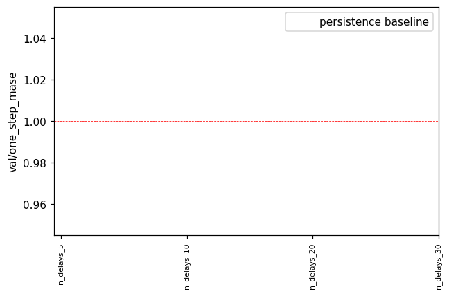

Chose `n_delays_5` (val/one_step_mase = 0.0056). `val/one_step_mase < 1` would mean beating persistence (predicting `x_{t+1} ≈ x_t`); on 1 kHz LFP the persistence baseline is hard to beat per-step even when 30-step R² is high.

## Chosen run trajectory prediction

`n_delays_5` cell params: `{'n_delays': 5}`

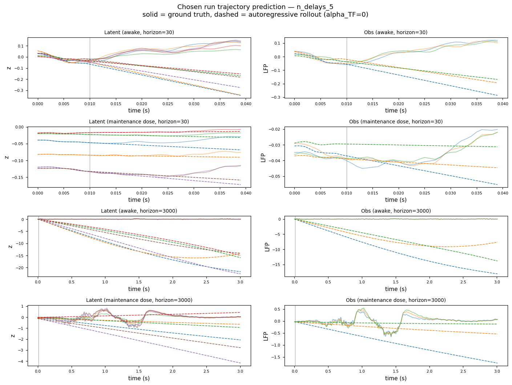

Solid = ground-truth, dashed = autoregressive rollout (`alpha_TF=0`). Top: latent space (top-6 dims). Bottom: observation space (top-3 LFP channels). Vertical line marks burn-in / start-of-rollout boundary.

## Chosen run Lyapunov spectrum (per condition)

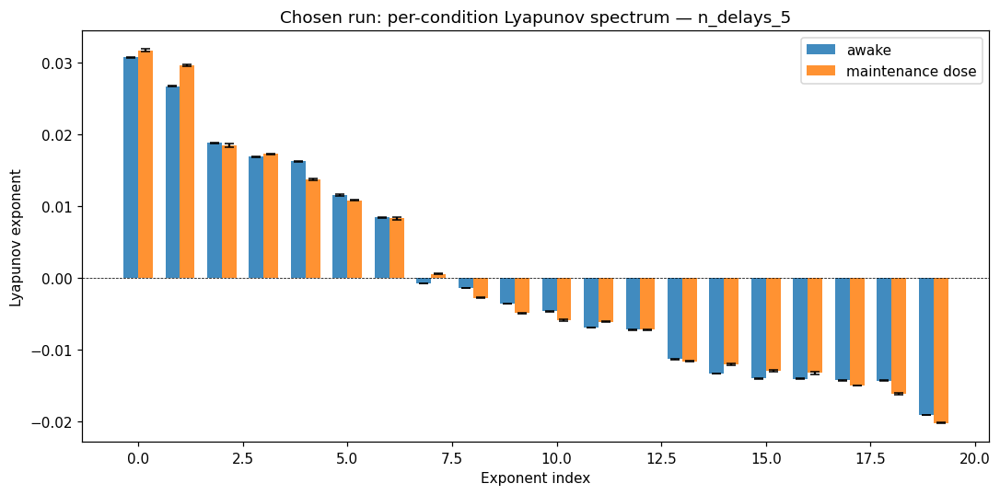

Bars = mean ± std across the chosen-cell's trajectories within each condition. No empirical / GT comparison — for neural data we only have model-predicted exponents.

## Per-cell Lyapunov spectra

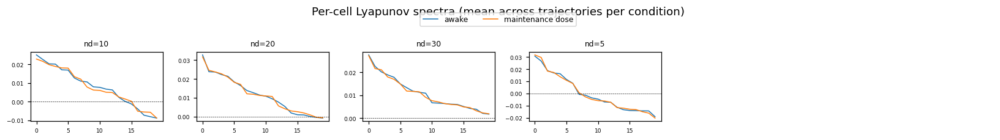

Each subplot is one cell's per-condition Lyapunov spectrum (mean across that cell's trajectories). Watch for monotone trends as `n_delays` increases and for any cell where the conditions cleanly separate.

## Chosen run cross-area block gramians (per pair)

For each ordered (source → target) area pair, we compute the reach / ctrl / obs gramians of the chosen run's predicted Jacobian's cross-area blocks. Bars show `log_trace` (top row) and `log_min_eig` (bottom row — the LOG of the SMALLEST eigenvalue, i.e. the bottleneck-dim energy) per condition, with SEM error bars across the cell's trajectories. Pure model side — no GT since neural data lacks a ground-truth dynamical model. `metric` mode is currently identical to `standard` (encoder-Jacobian B_factor / C_factor not yet plugged in).

### standard / full

#### 7b → CPB

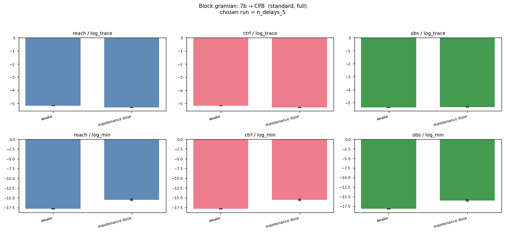

#### 7b → FEF


#### 7b → vlPFC

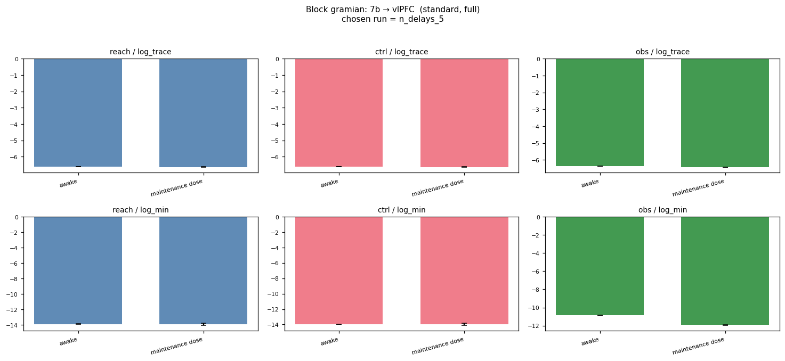

#### CPB → 7b

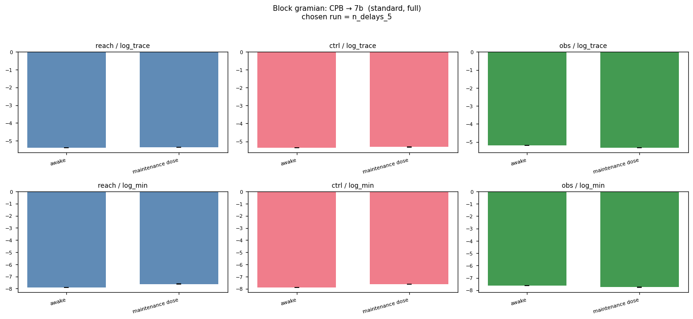

#### CPB → FEF

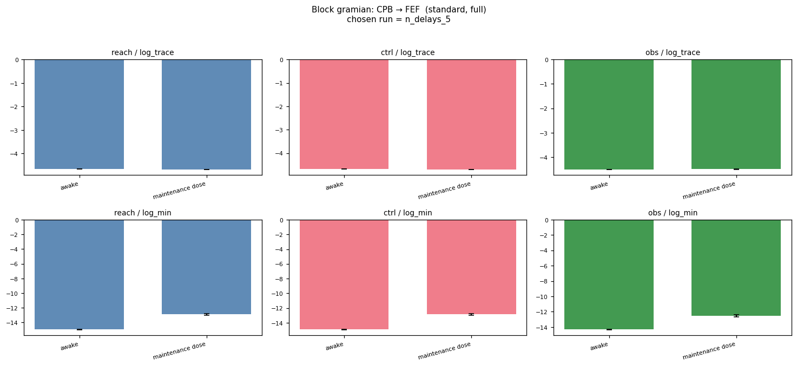

#### CPB → vlPFC

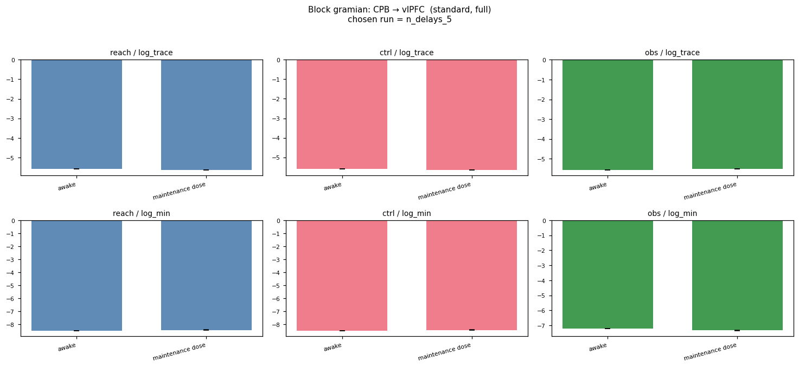

#### FEF → 7b

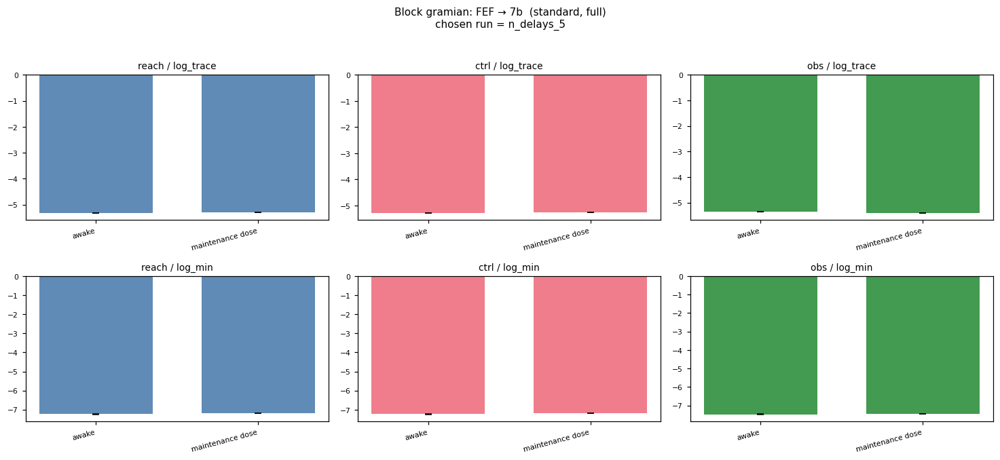

#### FEF → CPB


#### FEF → vlPFC

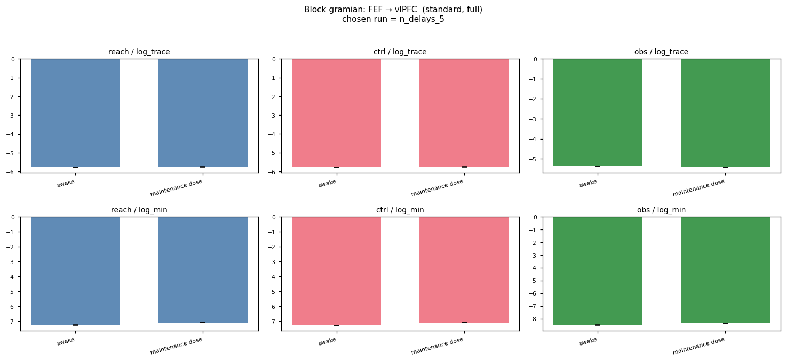

#### vlPFC → 7b


#### vlPFC → CPB

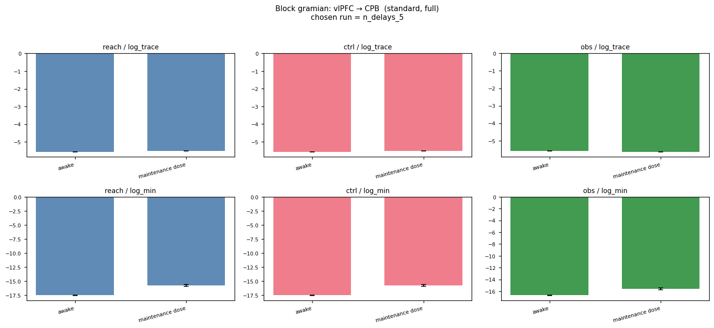

#### vlPFC → FEF

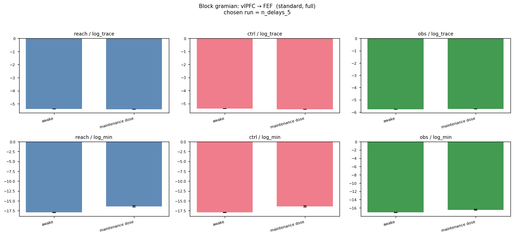

### standard / k20

#### 7b → CPB

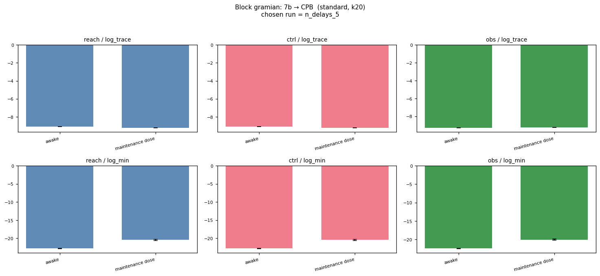

#### 7b → FEF

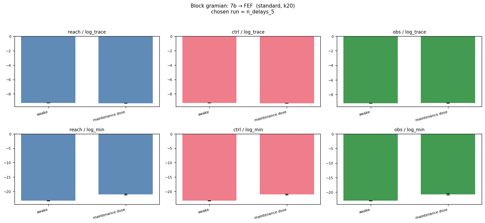

#### 7b → vlPFC


#### CPB → 7b

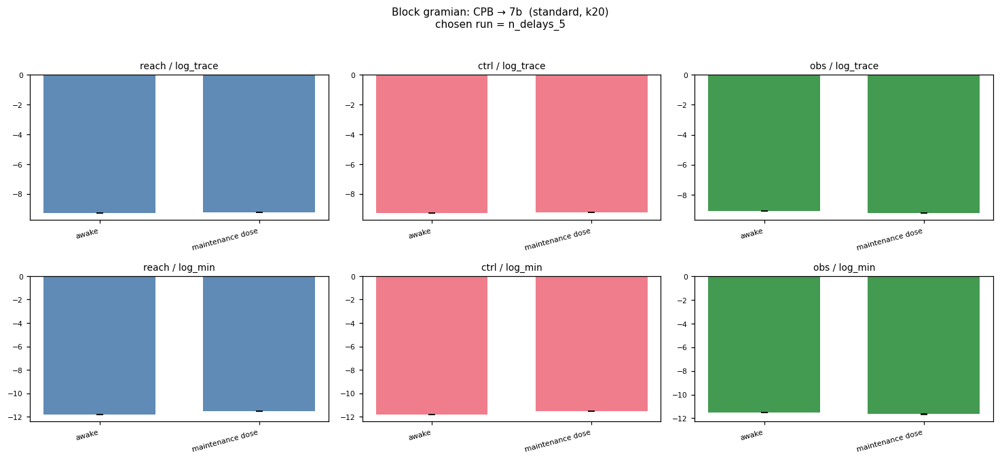

#### CPB → FEF

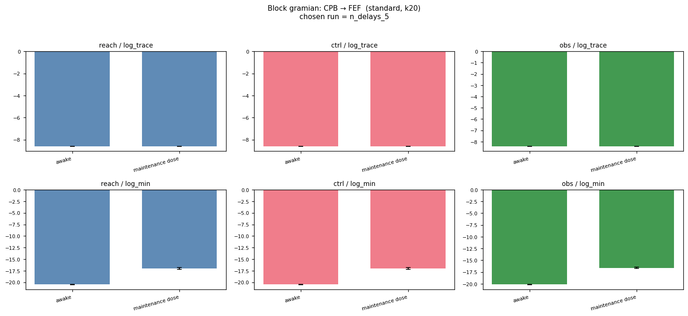

#### CPB → vlPFC

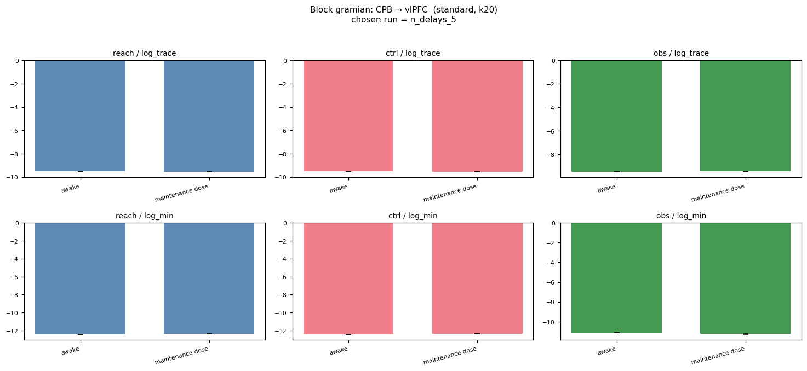

#### FEF → 7b


#### FEF → CPB

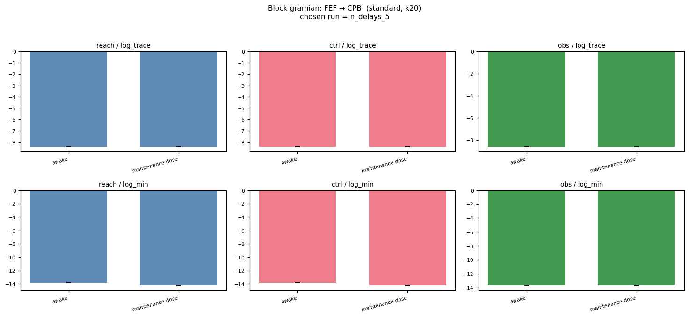

#### FEF → vlPFC

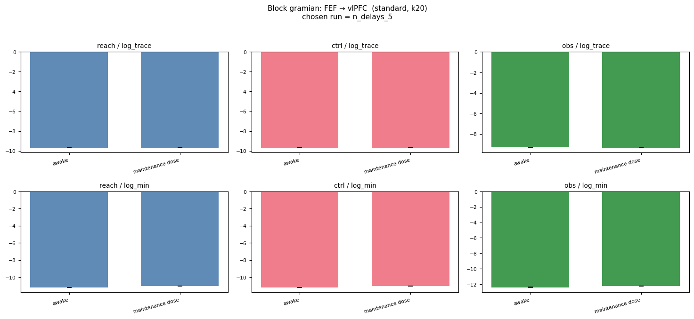

#### vlPFC → 7b

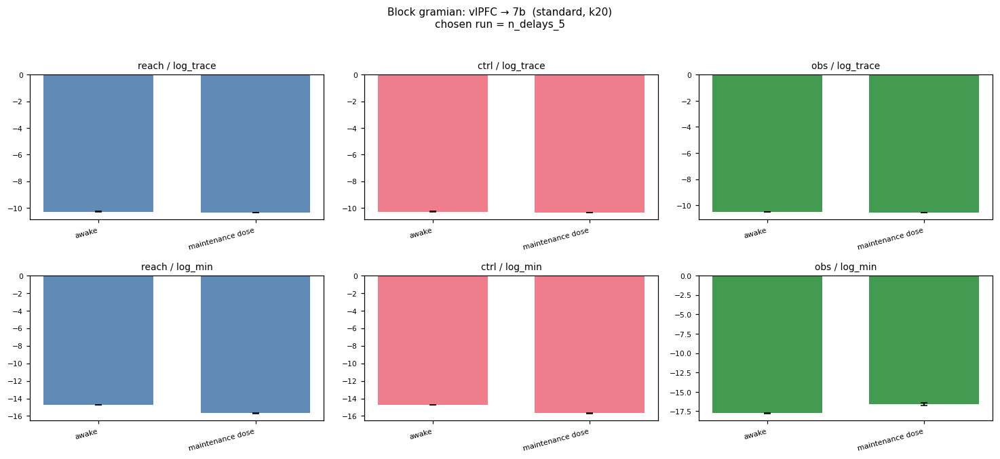

#### vlPFC → CPB

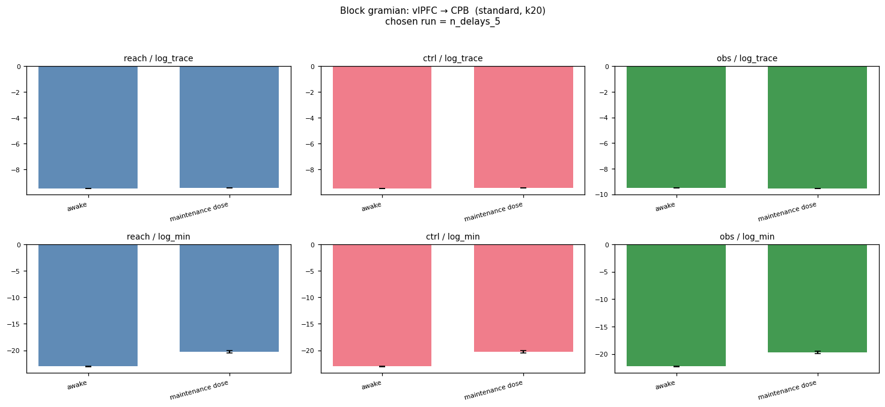

#### vlPFC → FEF


## Per-cell summary metrics

| run | n_delays | encoder_warmup | mean val loss | val/one_step_mase | val/total_loss | epoch |
|---|---|---|---|---|---|---|
| `n_delays_10` | 10 | ? | 0.0086 | — | 0.0086 | 20.0000 |
| `n_delays_20` | 20 | ? | 0.0079 | — | 0.0079 | 45.0000 |
| `n_delays_30` | 30 | ? | 0.0083 | — | 0.0083 | 65.0000 |
| `n_delays_5` | 5 | ? | 0.0056 | — | 0.0056 | 95.0000 |