# mary_propofol_resting__Mary-Anesthesia-20160809-01__awake_only__ds10__full_2stage_big_mlp__20260506T210013Z

- wandb group: [mary_propofol_resting__Mary-Anesthesia-20160809-01__awake_only__ds10__full_2stage_big_mlp__20260506T210013Z](https://wandb.ai/JacobianODE/MindControl_Mary_propofol_resting/groups/mary_propofol_resting__Mary-Anesthesia-20160809-01__awake_only__ds10__full_2stage_big_mlp__20260506T210013Z)
- chosen cell: **`single_cell`** (val/one_step_mase = 0.6287)
- cells reported: 1

**Description**: Full training: 16-layer encoder + dynamics MLP [2048, 2048, 4096, 4096] on awake-only ds10. Two-stage PCA (pre_pca_per_area=True at 99% on raw, then JacobianODE autodim PCA-99% on delay-embedded reduced obs). 15 encoder warmup epochs.

**Hypothesis**

```
The bigger dynamics MLP (~36-37M params at two-stage n_target_dims
≈ 42) gives the dynamics model real capacity to fit the awake LFP
forecast task. Encoder warmup gives the encoder time to settle
near its reconstruction floor before dynamics starts learning,
avoiding the chicken-and-egg problem where dynamics tries to fit
a moving latent.

Two-stage PCA reduces the input to the encoder by ~75% (from 1245
delay-embedded dims to ~300 reduced ones at n_delays=5), and
halves the second-stage autodim dim (~73 → ~42). Smaller MLP
output layer (42² = 1764 vs 73² = 5329), more tractable
optimization.
```

**Success criteria** (manual review until automated):

- [ ] Reconstruction loss tracks the encoder-only convergence in the first 15 epochs (~0.01 floor at PCA-99%, awake-only).
- [ ] val/one_step_mase drops below 1.0 (model beats persistence) by epoch 60.
- [ ] val/total_loss is monotonically decreasing across the warmup → dynamics transition (no divergence at epoch 15+).

## Run picking

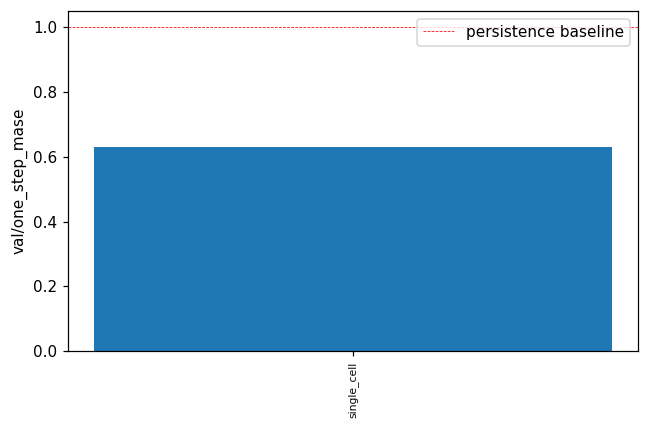

Chose `single_cell` (val/one_step_mase = 0.6287). `val/one_step_mase < 1` would mean beating persistence (predicting `x_{t+1} ≈ x_t`); on 1 kHz LFP the persistence baseline is hard to beat per-step even when 30-step R² is high.

## Chosen run trajectory prediction

`single_cell` cell params: `{}`

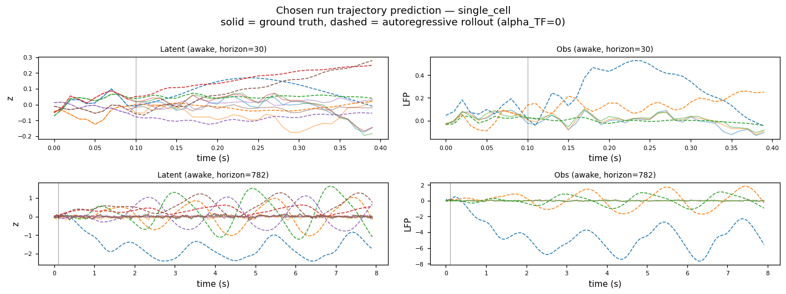

Solid = ground-truth, dashed = autoregressive rollout (`alpha_TF=0`). Top: latent space (top-6 dims). Bottom: observation space (top-3 LFP channels). Vertical line marks burn-in / start-of-rollout boundary.

## Chosen run Lyapunov spectrum (per condition)

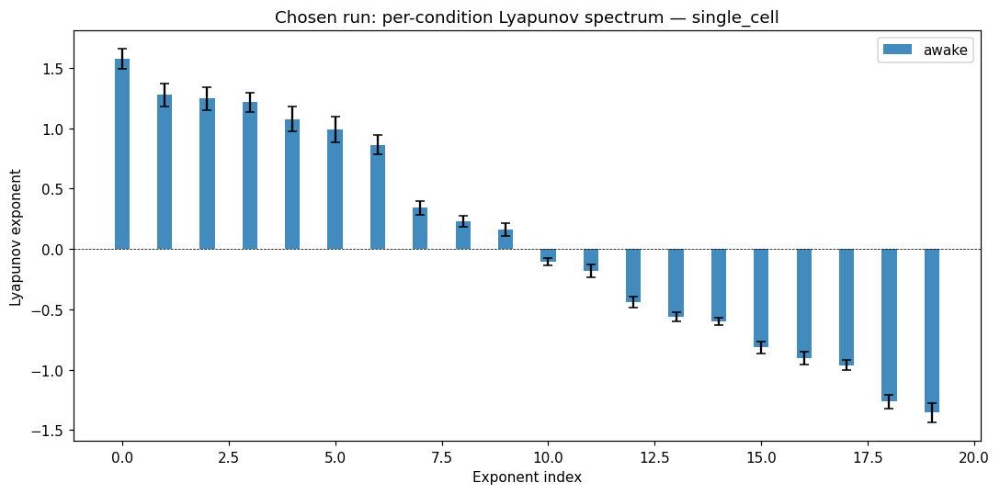

Bars = mean ± std across the chosen-cell's trajectories within each condition. No empirical / GT comparison — for neural data we only have model-predicted exponents.

## Per-cell Lyapunov spectra

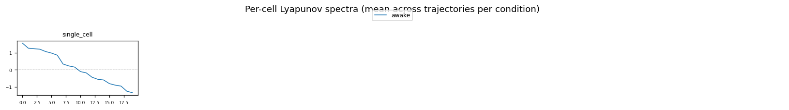

Each subplot is one cell's per-condition Lyapunov spectrum (mean across that cell's trajectories). Watch for monotone trends as `n_delays` increases and for any cell where the conditions cleanly separate.

## Chosen run cross-area block gramians (per pair)

For each ordered (source → target) area pair, we compute the reach / ctrl / obs gramians of the chosen run's predicted Jacobian's cross-area blocks. Bars show `log_trace` (top row) and `log_min_eig` (bottom row — the LOG of the SMALLEST eigenvalue, i.e. the bottleneck-dim energy) per condition, with SEM error bars across the cell's trajectories. Pure model side — no GT since neural data lacks a ground-truth dynamical model. `metric` mode is currently identical to `standard` (encoder-Jacobian B_factor / C_factor not yet plugged in).

### standard / full

#### 7b → CPB

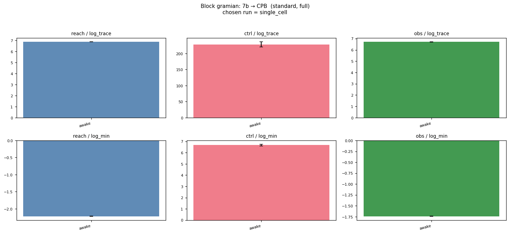

#### 7b → FEF

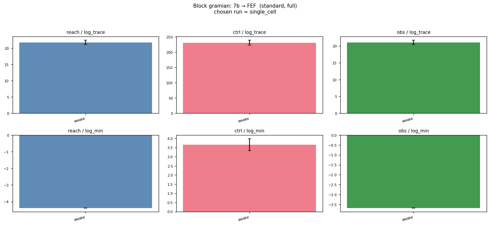

#### 7b → vlPFC


#### CPB → 7b

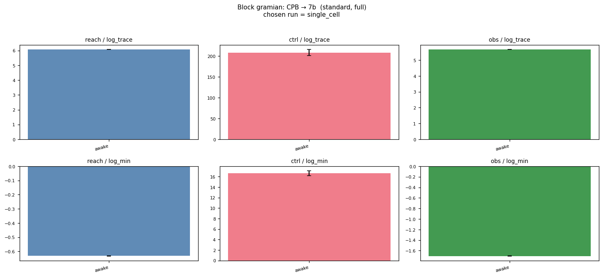

#### CPB → FEF

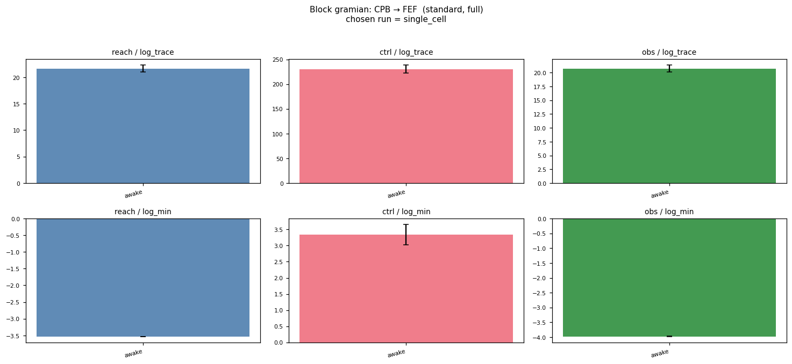

#### CPB → vlPFC

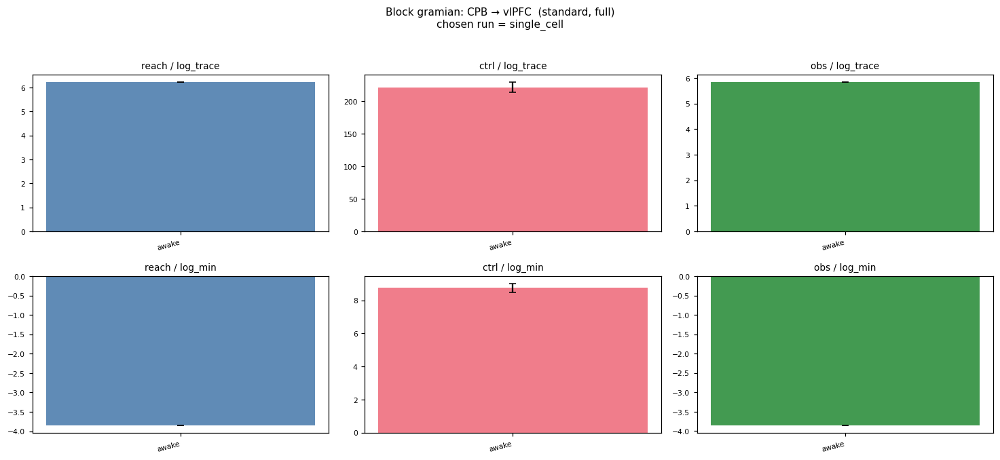

#### FEF → 7b

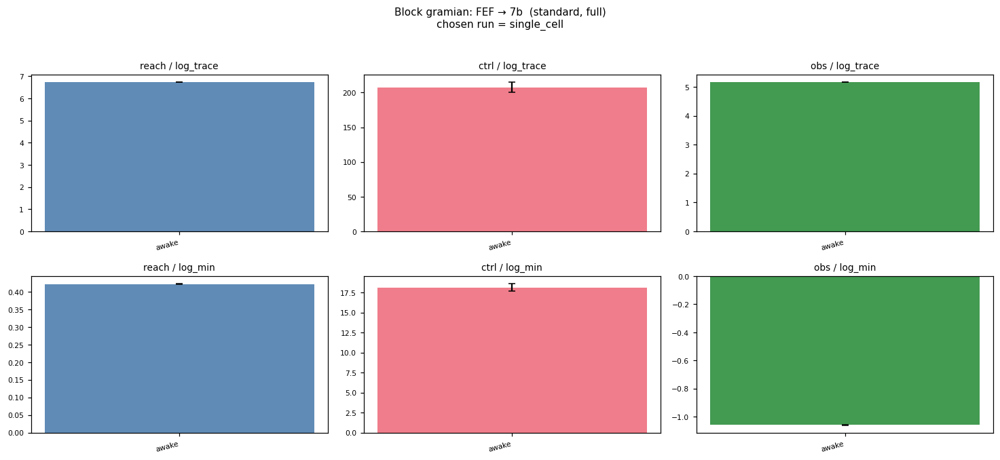

#### FEF → CPB

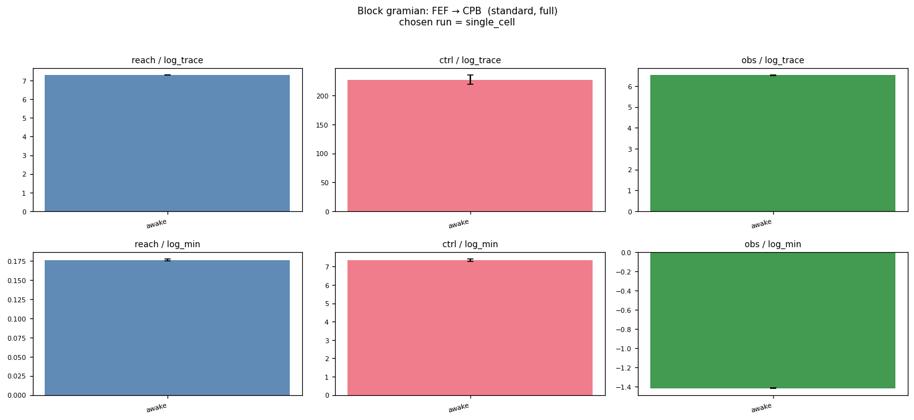

#### FEF → vlPFC


#### vlPFC → 7b

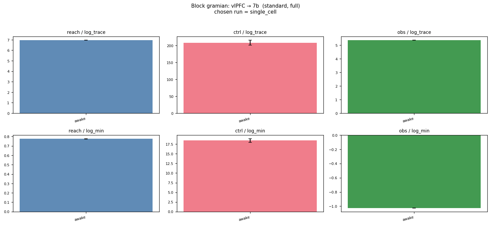

#### vlPFC → CPB

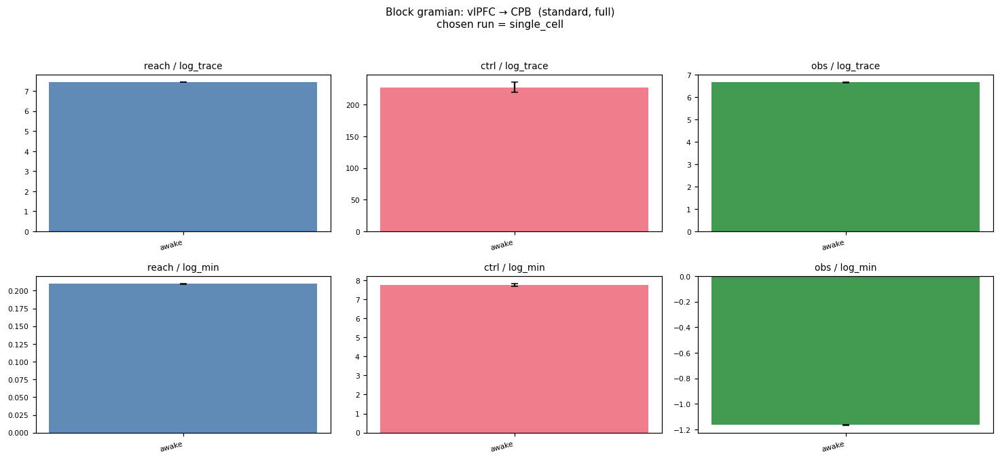

#### vlPFC → FEF

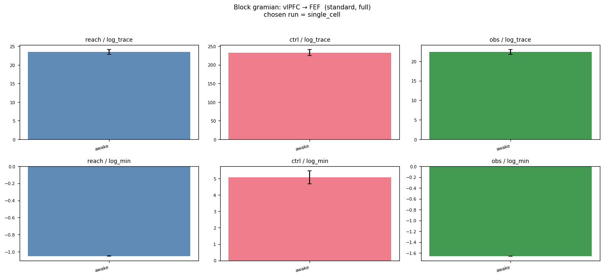

### standard / k20

#### 7b → CPB


#### 7b → FEF

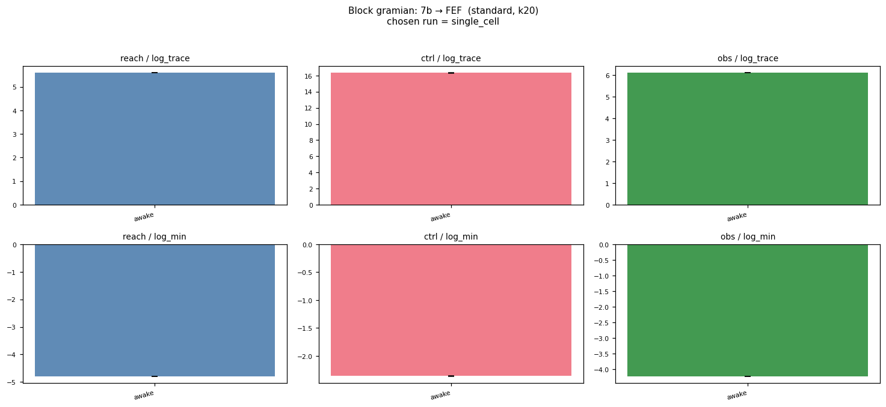

#### 7b → vlPFC

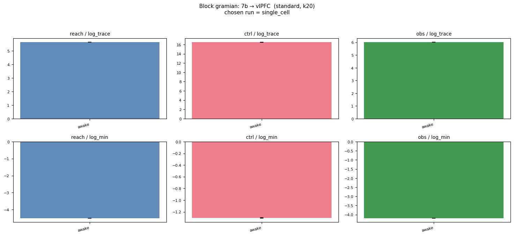

#### CPB → 7b

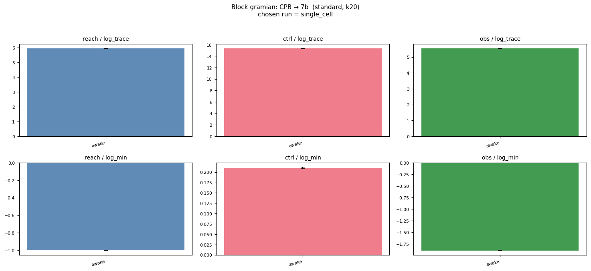

#### CPB → FEF

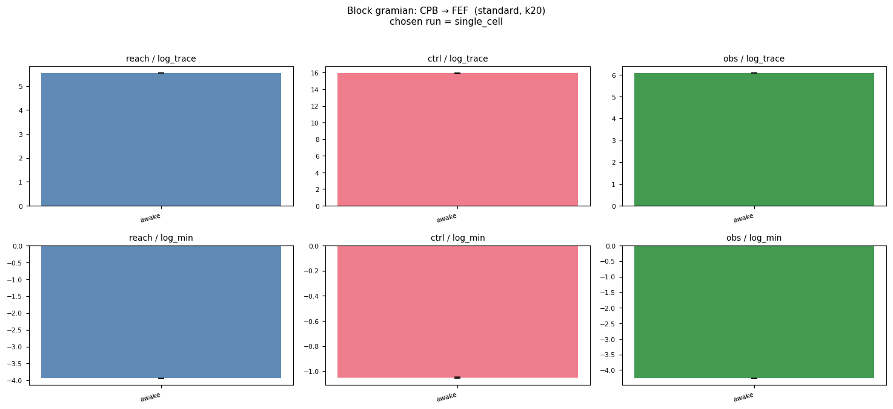

#### CPB → vlPFC


#### FEF → 7b

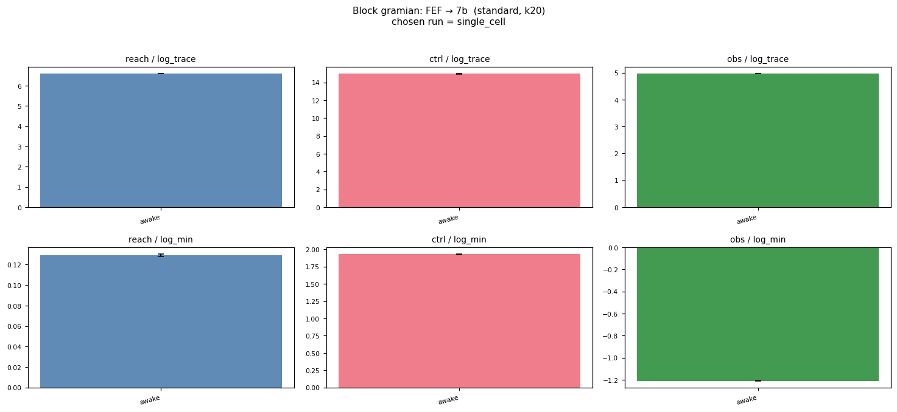

#### FEF → CPB


#### FEF → vlPFC


#### vlPFC → 7b

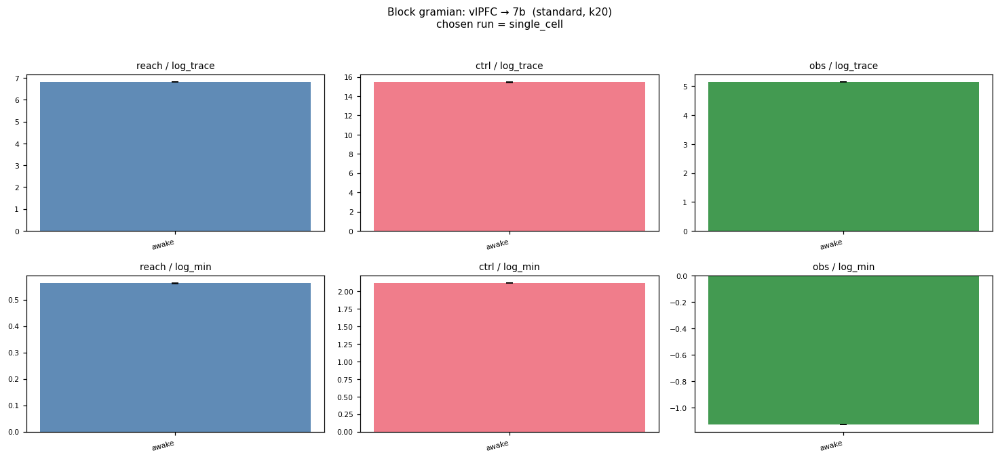

#### vlPFC → CPB

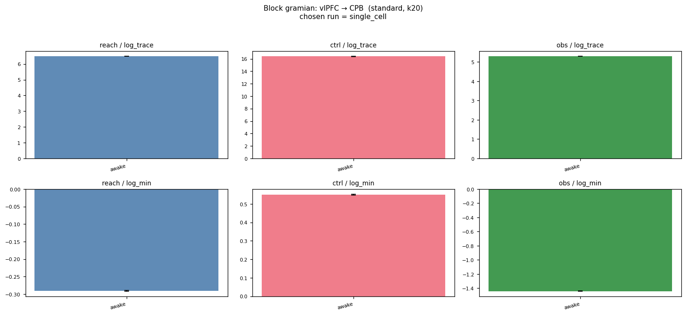

#### vlPFC → FEF

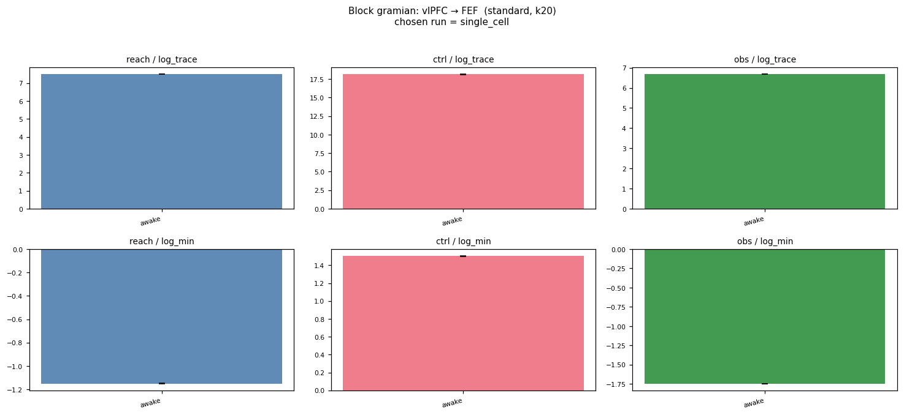

## Per-cell summary metrics

| run | n_delays | encoder_warmup | mean val loss | val/one_step_mase | val/total_loss | epoch |
|---|---|---|---|---|---|---|
| `single_cell` | 5 | ? | 2.6396 | 0.6287 | — | 62.0000 |