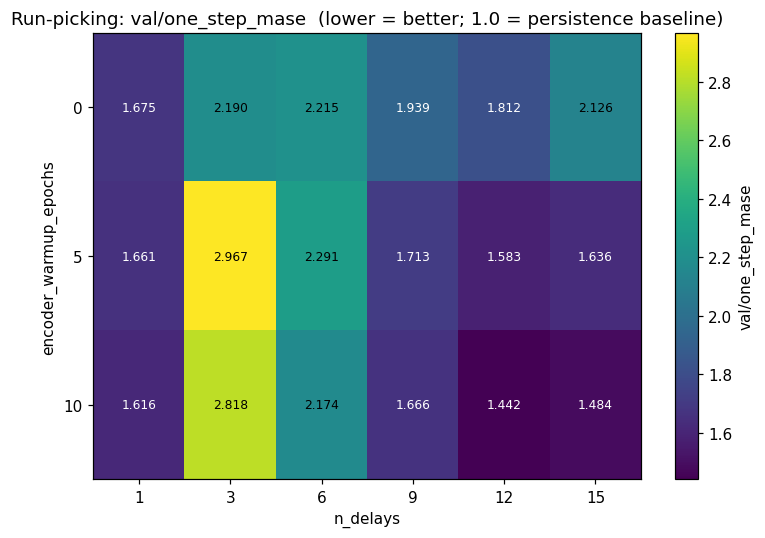
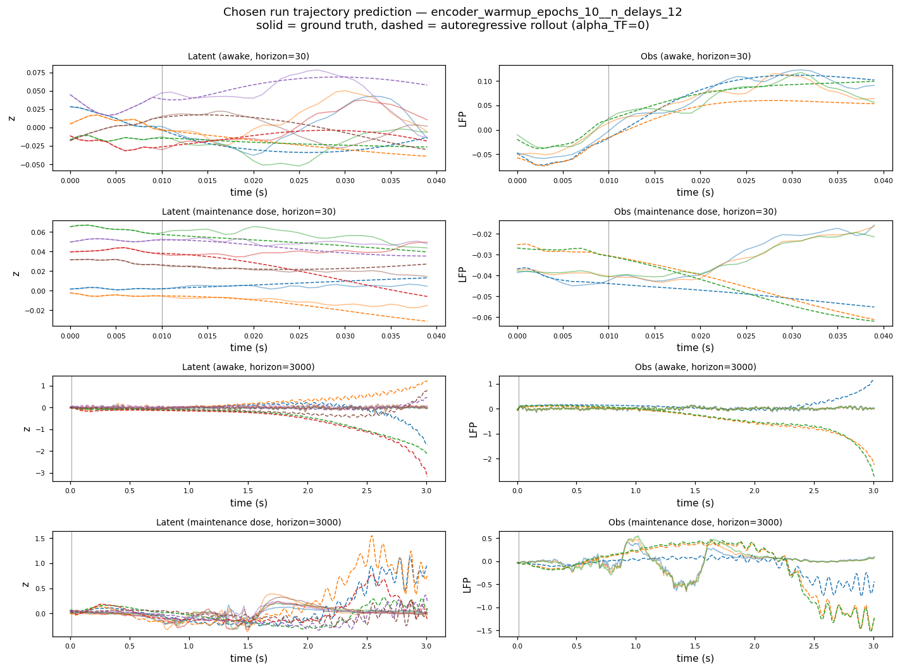
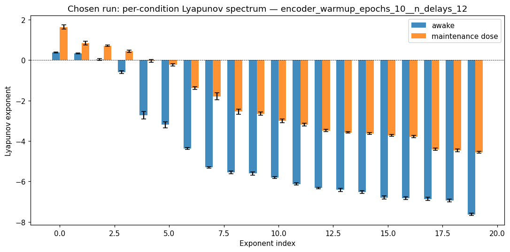
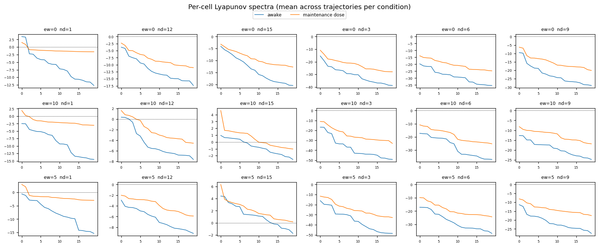
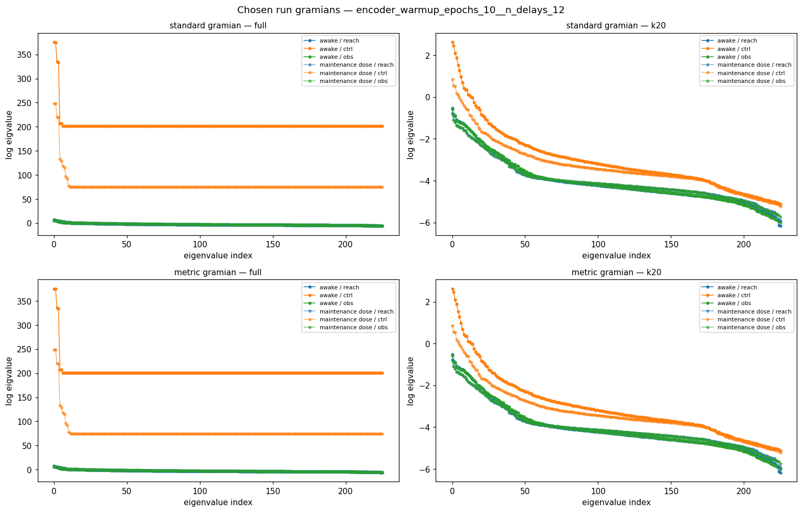

# mary_propofol_resting__Mary-Anesthesia-20160809-01__ndelays_x_warmup__20260506T052012Z

- wandb group: [mary_propofol_resting__Mary-Anesthesia-20160809-01__ndelays_x_warmup__20260506T052012Z](https://wandb.ai/JacobianODE/MindControl_Mary_propofol_resting/groups/mary_propofol_resting__Mary-Anesthesia-20160809-01__ndelays_x_warmup__20260506T052012Z)
- chosen cell: **`encoder_warmup_epochs_10__n_delays_12`** (val/one_step_mase = 1.4423)
- cells reported: 18

**Description**: Sweep n_delays × encoder_warmup_epochs on Mary propofol resting LFP (awake vs maintenance dose) to find the (delay-depth, warmup) regime that separates the two conditions in latent dynamics.

**Hypothesis**

```
Larger n_delays gives the encoder more state to disentangle the
(already-recurrent) network dynamics. We predict val/one_step_mase
monotonically improves with n_delays up to ~10 and then plateaus
or worsens (overfit on padded boundary). encoder_warmup_epochs > 0
should help in the n_delays >= 9 regime where the conditioner MLP
has more parameters and is harder to land near identity.

No ground-truth model exists for the LFP, so success is judged by
(a) absolute val/one_step_mase < 1.0 (model beats persistence baseline),
(b) per-condition Lyapunov spectra that differ between awake and
maintenance dose in the chosen-cell run.
```

**Success criteria** (manual review until automated):

- [ ] At least one cell achieves val/one_step_mase < 1.0 on each condition.
- [ ] The chosen-run per-condition Lyapunov spectra differ between awake and maintenance dose (largest exponent gap > 1 std across cell trajectories).
- [ ] n_delays * encoder_warmup_epochs interaction shows up in the heatmap of val/one_step_mase (i.e. not pure additive in the two axes).

## Run picking



Chose `encoder_warmup_epochs_10__n_delays_12` (val/one_step_mase = 1.4423). `val/one_step_mase < 1` would mean beating persistence (predicting `x_{t+1} ≈ x_t`); on 1 kHz LFP the persistence baseline is hard to beat per-step even when 30-step R² is high.

## Chosen run trajectory prediction

`encoder_warmup_epochs_10__n_delays_12` cell params: `{'encoder_warmup_epochs': 10, 'n_delays': 12}`



Solid = ground-truth, dashed = autoregressive rollout (`alpha_TF=0`). Top: latent space (top-6 dims). Bottom: observation space (top-3 LFP channels). Vertical line marks burn-in / start-of-rollout boundary.

## Chosen run Lyapunov spectrum (per condition)



Bars = mean ± std across the chosen-cell's trajectories within each condition. No empirical / GT comparison — for neural data we only have model-predicted exponents.

## Per-cell Lyapunov spectra



Each subplot is one cell's per-condition Lyapunov spectrum (mean across that cell's trajectories). Watch for monotone trends as `n_delays` increases and for any cell where the conditions cleanly separate.

## Chosen run gramians



2×2 of {`standard`, `metric`} × {`full`, `k20`}. Curves overlay {reach, ctrl, obs} per condition. `metric` uses encoder-Jacobian-weighted B/C (currently natural-metric placeholder; future iteration plugs in `B_factor = J_E^{-T}`).

## Per-cell summary metrics

| run | n_delays | encoder_warmup | mean val loss | val/one_step_mase | val/total_loss | epoch |
|---|---|---|---|---|---|---|
| `encoder_warmup_epochs_0__n_delays_1` | 1 | 0 | 0.6361 | 1.6751 | — | 28.0000 |
| `encoder_warmup_epochs_0__n_delays_12` | 12 | 0 | 0.3590 | 1.8120 | — | 31.0000 |
| `encoder_warmup_epochs_0__n_delays_15` | 15 | 0 | 0.3032 | 2.1258 | — | 49.0000 |
| `encoder_warmup_epochs_0__n_delays_3` | 3 | 0 | 0.3505 | 2.1904 | — | 38.0000 |
| `encoder_warmup_epochs_0__n_delays_6` | 6 | 0 | 0.3089 | 2.2152 | — | 47.0000 |
| `encoder_warmup_epochs_0__n_delays_9` | 9 | 0 | 0.3224 | 1.9389 | — | 40.0000 |
| `encoder_warmup_epochs_10__n_delays_1` | 1 | 10 | 0.5844 | 1.6164 | — | 37.0000 |
| `encoder_warmup_epochs_10__n_delays_12` | 12 | 10 | 0.4131 | 1.4423 | — | 36.0000 |
| `encoder_warmup_epochs_10__n_delays_15` | 15 | 10 | 0.4178 | 1.4842 | — | 32.0000 |
| `encoder_warmup_epochs_10__n_delays_3` | 3 | 10 | 0.3138 | 2.8177 | — | 88.0000 |
| `encoder_warmup_epochs_10__n_delays_6` | 6 | 10 | 0.3100 | 2.1742 | — | 57.0000 |
| `encoder_warmup_epochs_10__n_delays_9` | 9 | 10 | 0.3450 | 1.6665 | — | 47.0000 |
| `encoder_warmup_epochs_5__n_delays_1` | 1 | 5 | 1.0422 | 1.6614 | — | 37.0000 |
| `encoder_warmup_epochs_5__n_delays_12` | 12 | 5 | 0.3760 | 1.5834 | — | 34.0000 |
| `encoder_warmup_epochs_5__n_delays_15` | 15 | 5 | 0.4252 | 1.6356 | — | 27.0000 |
| `encoder_warmup_epochs_5__n_delays_3` | 3 | 5 | 0.3354 | 2.9668 | — | 64.0000 |
| `encoder_warmup_epochs_5__n_delays_6` | 6 | 5 | 0.3027 | 2.2911 | — | 56.0000 |
| `encoder_warmup_epochs_5__n_delays_9` | 9 | 5 | 0.3328 | 1.7131 | — | 44.0000 |