# Sweep Analysis: `wmtask_direct_sum_additive_p30_perareafnnautodim_nearid_tf__lc_x_obsnoisescale_sweep_20260429T234503Z__stage_a`

**Project**: [WMTask_identity_encoder_verification](https://wandb.ai/JacobianODE/WMTask_identity_encoder_verification/groups/wmtask_direct_sum_additive_p30_perareafnnautodim_nearid_tf__lc_x_obsnoisescale_sweep_20260429T234503Z__stage_a)  
**Launched**: 2026-04-29T23:45:35Z  
**Completed**: 2026-04-30T02:45:27Z  
**Outcome**: `complete_clean`  
**Git**: `latent-JacobianODE` @ `4cd9047`  
**Expected runs**: 21

## Experiment Context

### `wmtask_direct_sum_additive_p30_perareafnnautodim_nearid_tf__lc_x_obsnoisescale_sweep`

**Description**

WMTask fully-observed (N1=N2=64), latent JacobianODE with
DirectSumCouplingEncoder, FNN-based per-area autodim
(n_target_dim_method='fnn', threshold=0.01). Each area independently
picks its own n_target_dims via Kennel false-nearest-neighbor on its
own input dims; remaining dims become a per-area null subspace.
Additive coupling, 8 layers, hidden_dim=128. near_identity_std=1e-3,
final_perm_identity=true. 21-cell sweep over 7 LC x 3 obs_noise_scale.
Split-mode loss. TF-coupled LR schedule. Two-stage protocol with
dual-checkpoint (primary ES patience=5, shadow patience=2).

**Hypothesis**

Companion to the full-128 DirectSum sweep with the same TF-coupled
LR + near-id init recipe. The per-area null subspace gives loop
closure something structural to clamp (vs full-128 where z_dyn is
the entire latent and null is empty), and the FNN dim estimator
should pick a smaller per-area n_target_dims than the PCA-99% baseline
(FNN finds the minimum embedding dim for stable reconstruction; PCA
finds dims to explain a variance fraction). If the smaller dim helps
dynamics learning AND the null subspace + LC pressure is doing
useful regularization, this should match or beat full-128 on val
traj_loss while preserving cross-area Gramian asymmetry.

**Success criteria**

- All 21 cells train without divergence
- FNN auto-dim per area logged (n_target_dims_per_block_fnn_auto)
- es2-best.ckpt and es5-best.ckpt both saved per cell
- Best val traj_loss within 2x of full-128 DirectSum companion's best
- Cross-area Gramian asymmetry consistent with ground truth at best cell
- Loop closure loss at best cell < sqrt(n_target_dims)

## Results

**Swept axes** (3): `data.postprocessing.generalized_variance`, `training.lightning.loop_closure_weight`, `training.lightning.obs_noise_scale`

**Chosen run** (by `best_traj_loss`): `6ody0pke` — traj_loss=0.05236, MASE=1.6197, R²=0.9403, LC loss=116.099, epoch=19.0

Swept-axis values at chosen run: `data.postprocessing.generalized_variance`=0.00954705 · `training.lightning.loop_closure_weight`=0 · `training.lightning.obs_noise_scale`=0

**Runs analyzed**: 21 (expected 21)

### Per-run results

| run_idx | run_id | `data.postprocessing.generalized_variance` | `training.lightning.loop_closure_weight` | `training.lightning.obs_noise_scale` | best_traj_loss | best_MASE | R² | LC loss | epoch |
|---|---|---|---|---|---|---|---|---|---|
| 0 | `6ody0pke` | 0.00954705 | 0 | 0 | 0.05236 | 1.6197 | 0.9403 | 116.099 | 19.0 |
| 3 | `fb450tgn` | 0.00954705 | 1.0e-06 | 0 | 0.05239 | 1.6203 | 0.9403 | 60.625 | 19.0 |
| 6 | `rymgu7dv` | 0.00954705 | 1.0e-05 | 0 | 0.05250 | 1.6234 | 0.9402 | 19.299 | 19.0 |
| 9 | `ztddtzy3` | 0.00954705 | 1.0e-04 | 0 | 0.05314 | 1.6442 | 0.9394 | 3.250 | 19.0 |
| 12 | `7rxzb4gp` | 0.00954705 | 0.001 | 0 | 0.05577 | 1.7148 | 0.9364 | 0.370 | 19.0 |
| 2 | `mmqi388l` | 0.00954705 | 0 | 0.05 | 0.05619 | 1.7229 | 0.9359 | 255.207 | 19.0 |
| 4 | `xsw6tlq2` | 0.00954705 | 1.0e-06 | 0.01 | 0.05622 | 1.7239 | 0.9359 | 105.570 | 19.0 |
| 1 | `1acdz8t9` | 0.00954705 | 0 | 0.01 | 0.05622 | 1.7239 | 0.9359 | 223.126 | 19.0 |
| 7 | `04ymbtvo` | 0.00954705 | 1.0e-05 | 0.01 | 0.05623 | 1.7262 | 0.9359 | 29.366 | 19.0 |
| 5 | `dts0eqm5` | 0.00954705 | 1.0e-06 | 0.05 | 0.05631 | 1.7263 | 0.9358 | 115.540 | 19.0 |
| 8 | `aahsi3yr` | 0.00954705 | 1.0e-05 | 0.05 | 0.05639 | 1.7303 | 0.9357 | 32.243 | 19.0 |
| 10 | `cdw8o5zp` | 0.00954705 | 1.0e-04 | 0.01 | 0.05757 | 1.7648 | 0.9343 | 4.410 | 19.0 |
| 11 | `zk93z7va` | 0.00954705 | 1.0e-04 | 0.05 | 0.05809 | 1.7799 | 0.9337 | 5.054 | 19.0 |
| 15 | `jxwgptq2` | 0.00954705 | 0.01 | 0 | 0.06218 | 1.8630 | 0.9290 | 0.033 | 19.0 |
| 18 | `39rsmmt9` | 0.00954705 | 0.1 | 0 | 0.07155 | 2.0569 | 0.9182 | 0.001 | 19.0 |
| 13 | `qbrdatjw` | 0.00954705 | 0.001 | 0.01 | 0.26165 | 4.4553 | 0.7004 | 8.112 | 17.0 |
| 14 | `ibojdg8u` | 0.00954705 | 0.001 | 0.05 | 0.29249 | 4.8146 | 0.6642 | 0.533 | 1.0 |
| 20 | `f5ezymij` | 0.00954705 | 0.1 | 0.05 | 0.37609 | 5.2151 | 0.5683 | 0.075 | 2.0 |
| 19 | `nbbg17ga` | 0.00954705 | 0.1 | 0.01 | 0.38409 | 5.2708 | 0.5594 | 0.013 | 2.0 |
| 17 | `q42cr885` | 0.00954705 | 0.01 | 0.05 | 0.56352 | 6.1851 | 0.3571 | 0.271 | 1.0 |
| 16 | `be4ouakp` | 0.00954705 | 0.01 | 0.01 | 0.80143 | 6.8876 | 0.0804 | 0.033 | — |

### Best run per `obs_noise_scale`

| obs_noise_scale | Best LC weight | Best traj loss | MASE at best | R² | LC loss | epoch |
|---|---|---|---|---|---|---|
| 0.0 | 0.0e+00 | 0.05236 | 1.6197 | 0.9403 | 116.099 | 19.0 |
| 0.01 | 1.0e-06 | 0.05622 | 1.7239 | 0.9359 | 105.570 | 19.0 |
| 0.05 | 0.0e+00 | 0.05619 | 1.7229 | 0.9359 | 255.207 | 19.0 |

## Success-criteria verdicts (automated)

| Criterion | Verdict | Note |
|---|---|---|
| All 21 cells train without divergence | **Unknown** |  |
| FNN auto-dim per area logged (n_target_dims_per_block_fnn_auto) | **Unknown** |  |
| es2-best.ckpt and es5-best.ckpt both saved per cell | **Unknown** |  |
| Best val traj_loss within 2x of full-128 DirectSum companion's best | **Unknown** |  |
| Cross-area Gramian asymmetry consistent with ground truth at best cell | **Unknown** |  |
| Loop closure loss at best cell < sqrt(n_target_dims) | **Unknown** |  |

_Automated verdicts use simple numeric-threshold parsing and may mis-classify qualitative criteria. The Discussion section below takes precedence._

## Figures

### sweep_overview

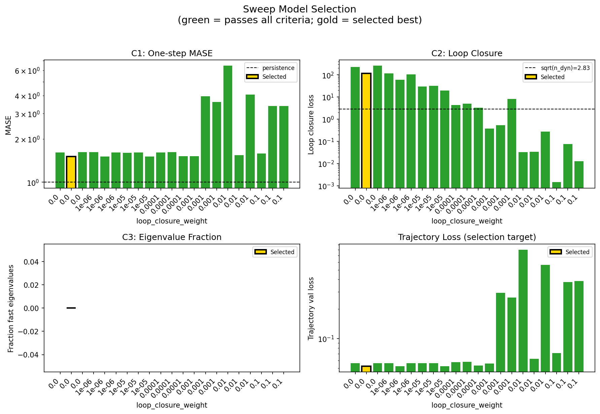

### sweep_pareto

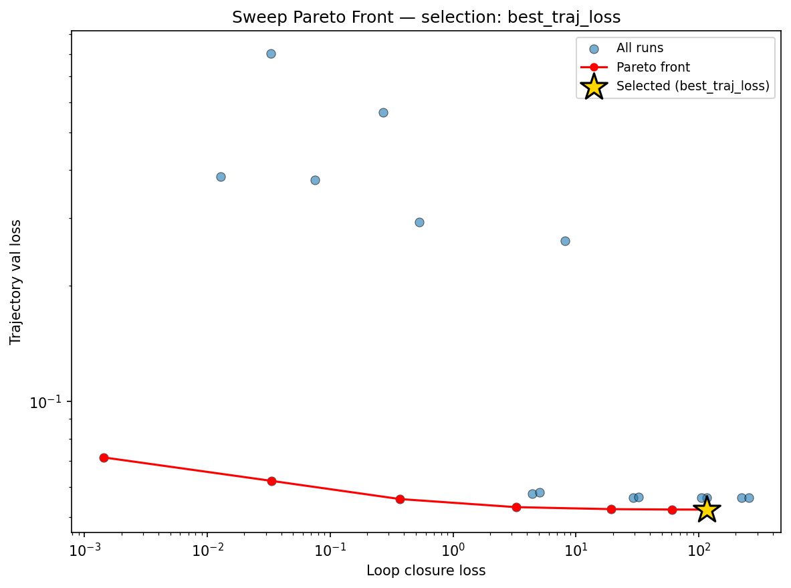

### reconstruction

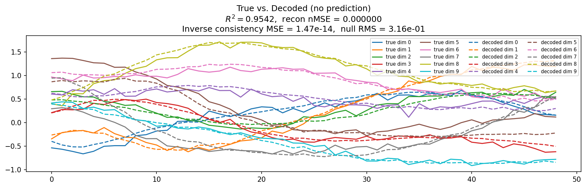

### prediction_windows

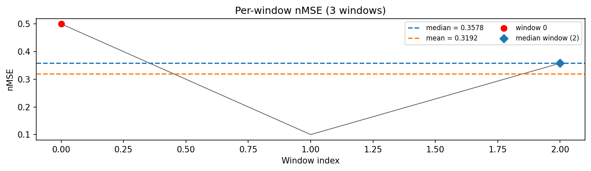

### long_trajectory

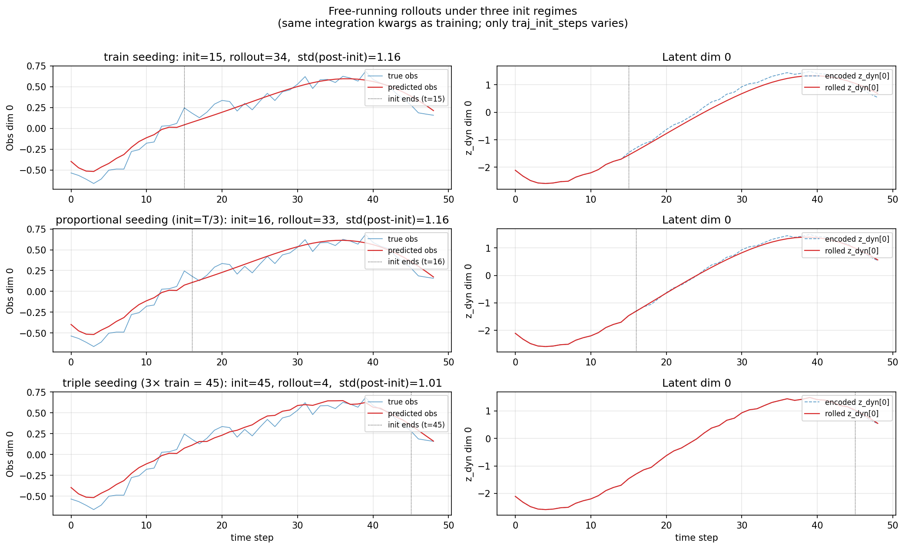

### mase

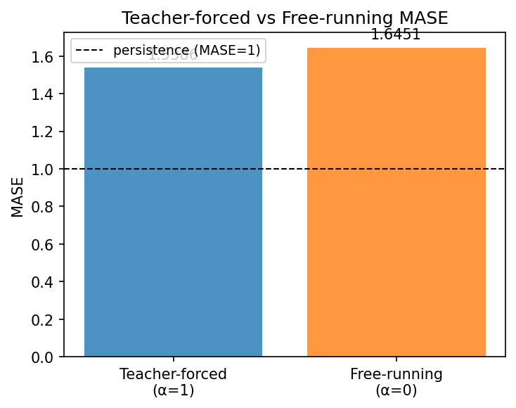

### latent_utilization

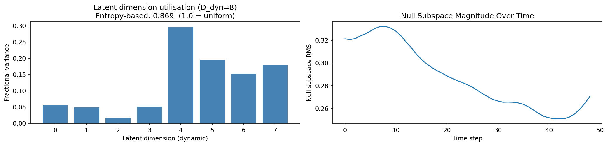

### lyapunov

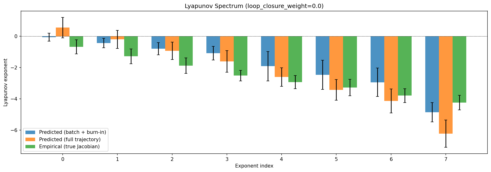

### kaplan_yorke

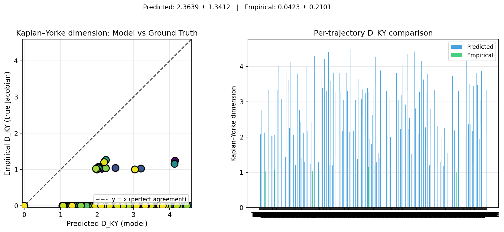

### per_run_lyapunov

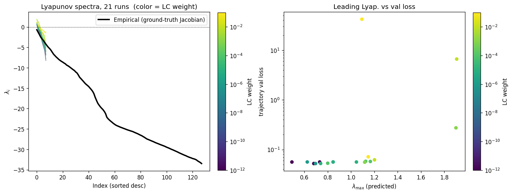

### per_run_lyapunov_vs_true

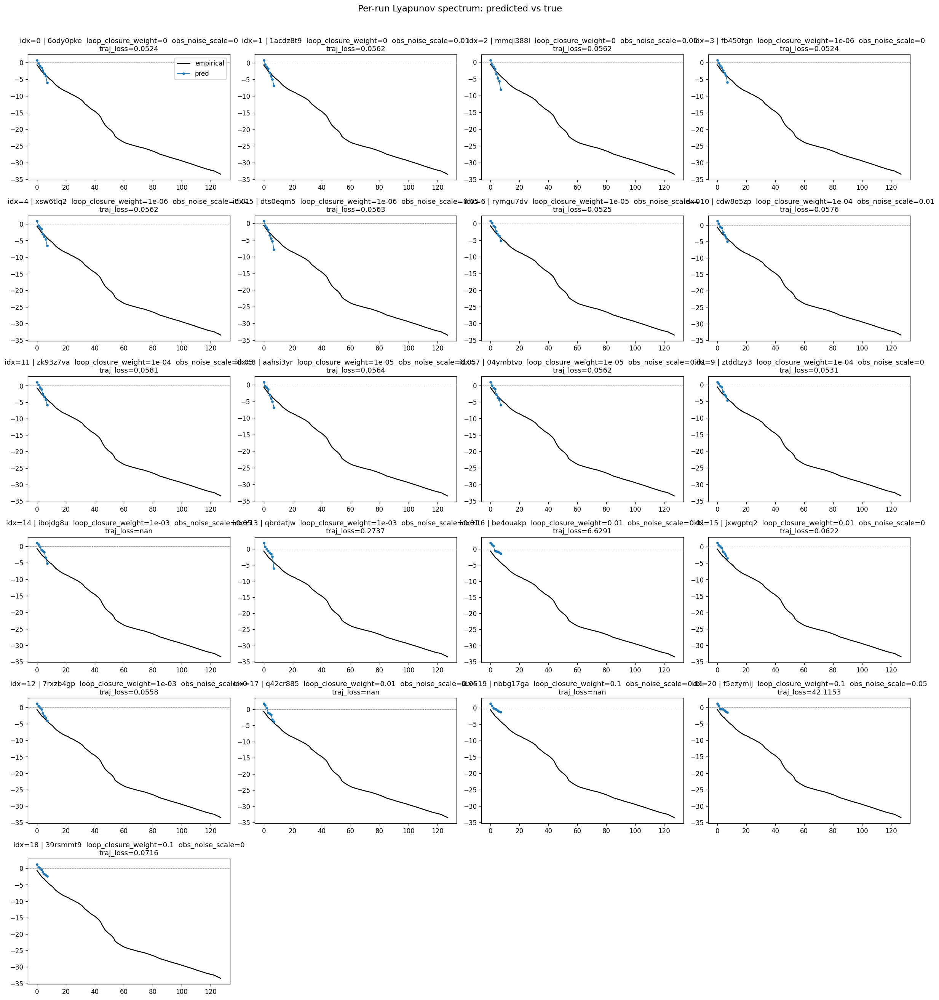

### per_run_lyapunov_relerr

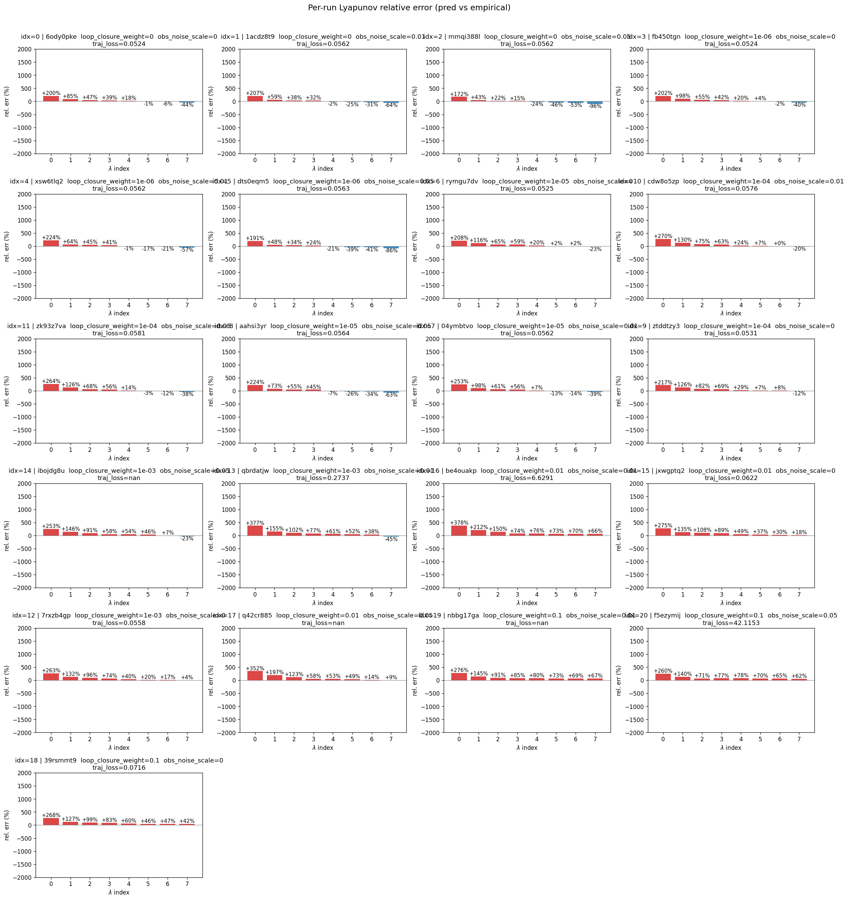

### encoder_decoder_jacobians

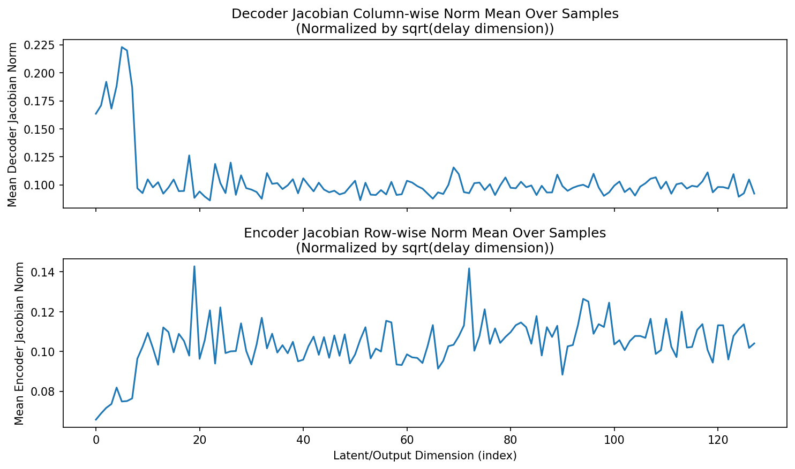

### amplification

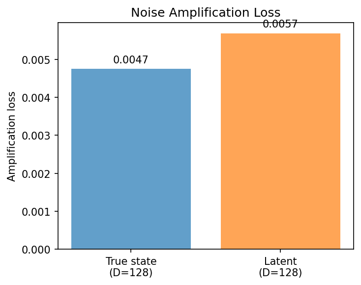

### kaplan_yorke_pca

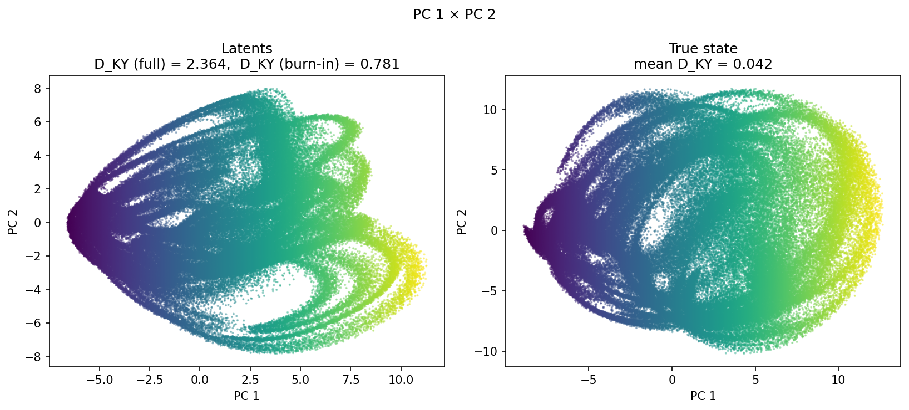

### prediction_detail_latent

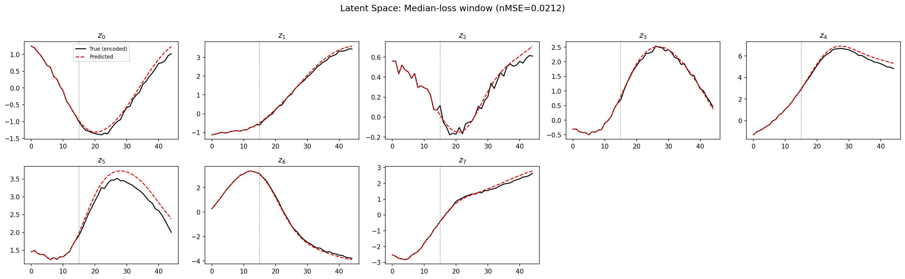

### prediction_detail_obs

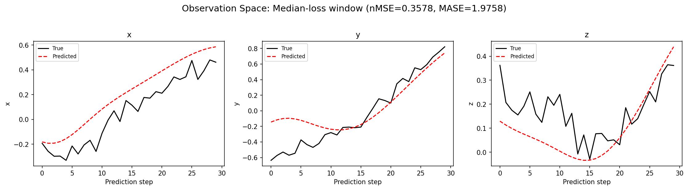

### tangent_spectrum

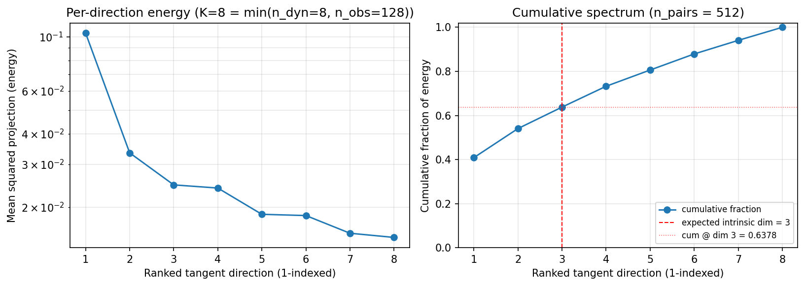

### per_run_tangent_spectrum

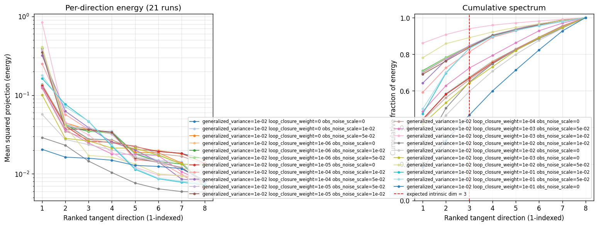

## Discussion

<!--
This section is intentionally left as a placeholder. A human reviewer
or Claude Code agent should fill it in based on the tables and figures
above, explicitly addressing each success criterion and comparing the
outcome to the stated hypothesis. Write the Discussion to
`discussion.md` in this directory and re-run `render_report`.
-->

_(to be written)_

## `run_analytics` stdout

<details><summary>Click to expand — full diagnostic output from <code>run_analytics</code></summary>

```
No run_id provided — selecting best run from group 'wmtask_direct_sum_additive_p30_perareafnnautodim_nearid_tf__lc_x_obsnoisescale_sweep_20260429T234503Z__stage_a' ...
Found 21 total runs in JacobianODE/WMTask_identity_encoder_verification (group=wmtask_direct_sum_additive_p30_perareafnnautodim_nearid_tf__lc_x_obsnoisescale_sweep_20260429T234503Z__stage_a)
All runs (state, loop_closure_weight, tangent_entropy_weight, kl_dyn_weight):
  6ody0pke: state=finished, lc=0.0, te=0.0, kl_dyn=0.0
  1acdz8t9: state=finished, lc=0.0, te=0.0, kl_dyn=0.0
  mmqi388l: state=finished, lc=0.0, te=0.0, kl_dyn=0.0
  fb450tgn: state=finished, lc=1e-06, te=0.0, kl_dyn=0.0
  xsw6tlq2: state=finished, lc=1e-06, te=0.0, kl_dyn=0.0
  dts0eqm5: state=finished, lc=1e-06, te=0.0, kl_dyn=0.0
  rymgu7dv: state=finished, lc=1e-05, te=0.0, kl_dyn=0.0
  cdw8o5zp: state=finished, lc=0.0001, te=0.0, kl_dyn=0.0
  zk93z7va: state=finished, lc=0.0001, te=0.0, kl_dyn=0.0
  aahsi3yr: state=finished, lc=1e-05, te=0.0, kl_dyn=0.0
  04ymbtvo: state=finished, lc=1e-05, te=0.0, kl_dyn=0.0
  ztddtzy3: state=finished, lc=0.0001, te=0.0, kl_dyn=0.0
  ibojdg8u: state=finished, lc=0.001, te=0.0, kl_dyn=0.0
  qbrdatjw: state=finished, lc=0.001, te=0.0, kl_dyn=0.0
  be4ouakp: state=finished, lc=0.01, te=0.0, kl_dyn=0.0
  jxwgptq2: state=finished, lc=0.01, te=0.0, kl_dyn=0.0
  7rxzb4gp: state=finished, lc=0.001, te=0.0, kl_dyn=0.0
  q42cr885: state=finished, lc=0.01, te=0.0, kl_dyn=0.0
  nbbg17ga: state=finished, lc=0.1, te=0.0, kl_dyn=0.0
  f5ezymij: state=finished, lc=0.1, te=0.0, kl_dyn=0.0
  39rsmmt9: state=finished, lc=0.1, te=0.0, kl_dyn=0.0

slurm_timeout_min not found in any run config — falling back to 180 min
  Including 6ody0pke (lc=0.0): use_all_runs=True (state=finished)
  Including 1acdz8t9 (lc=0.0): use_all_runs=True (state=finished)
  Including mmqi388l (lc=0.0): use_all_runs=True (state=finished)
  Including fb450tgn (lc=1e-06): use_all_runs=True (state=finished)
  Including xsw6tlq2 (lc=1e-06): use_all_runs=True (state=finished)
  Including dts0eqm5 (lc=1e-06): use_all_runs=True (state=finished)
  Including rymgu7dv (lc=1e-05): use_all_runs=True (state=finished)
  Including cdw8o5zp (lc=0.0001): use_all_runs=True (state=finished)
  Including zk93z7va (lc=0.0001): use_all_runs=True (state=finished)
  Including aahsi3yr (lc=1e-05): use_all_runs=True (state=finished)
  Including 04ymbtvo (lc=1e-05): use_all_runs=True (state=finished)
  Including ztddtzy3 (lc=0.0001): use_all_runs=True (state=finished)
  Including ibojdg8u (lc=0.001): use_all_runs=True (state=finished)
  Including qbrdatjw (lc=0.001): use_all_runs=True (state=finished)
  Including be4ouakp (lc=0.01): use_all_runs=True (state=finished)
  Including jxwgptq2 (lc=0.01): use_all_runs=True (state=finished)
  Including 7rxzb4gp (lc=0.001): use_all_runs=True (state=finished)
  Including q42cr885 (lc=0.01): use_all_runs=True (state=finished)
  Including nbbg17ga (lc=0.1): use_all_runs=True (state=finished)
  Including f5ezymij (lc=0.1): use_all_runs=True (state=finished)
  Including 39rsmmt9 (lc=0.1): use_all_runs=True (state=finished)
Found 21 effectively-done sweep runs:
  loop_closure_weight=0.0, tangent_entropy_weight=0.0, kl_dyn_weight=0.0 -> run_id=1acdz8t9
  loop_closure_weight=0.0, tangent_entropy_weight=0.0, kl_dyn_weight=0.0 -> run_id=6ody0pke
  loop_closure_weight=0.0, tangent_entropy_weight=0.0, kl_dyn_weight=0.0 -> run_id=mmqi388l
  loop_closure_weight=1e-06, tangent_entropy_weight=0.0, kl_dyn_weight=0.0 -> run_id=dts0eqm5
  loop_closure_weight=1e-06, tangent_entropy_weight=0.0, kl_dyn_weight=0.0 -> run_id=fb450tgn
  loop_closure_weight=1e-06, tangent_entropy_weight=0.0, kl_dyn_weight=0.0 -> run_id=xsw6tlq2
  loop_closure_weight=1e-05, tangent_entropy_weight=0.0, kl_dyn_weight=0.0 -> run_id=04ymbtvo
  loop_closure_weight=1e-05, tangent_entropy_weight=0.0, kl_dyn_weight=0.0 -> run_id=aahsi3yr
  loop_closure_weight=1e-05, tangent_entropy_weight=0.0, kl_dyn_weight=0.0 -> run_id=rymgu7dv
  loop_closure_weight=0.0001, tangent_entropy_weight=0.0, kl_dyn_weight=0.0 -> run_id=cdw8o5zp
  loop_closure_weight=0.0001, tangent_entropy_weight=0.0, kl_dyn_weight=0.0 -> run_id=zk93z7va
  loop_closure_weight=0.0001, tangent_entropy_weight=0.0, kl_dyn_weight=0.0 -> run_id=ztddtzy3
  loop_closure_weight=0.001, tangent_entropy_weight=0.0, kl_dyn_weight=0.0 -> run_id=7rxzb4gp
  loop_closure_weight=0.001, tangent_entropy_weight=0.0, kl_dyn_weight=0.0 -> run_id=ibojdg8u
  loop_closure_weight=0.001, tangent_entropy_weight=0.0, kl_dyn_weight=0.0 -> run_id=qbrdatjw
  loop_closure_weight=0.01, tangent_entropy_weight=0.0, kl_dyn_weight=0.0 -> run_id=be4ouakp
  loop_closure_weight=0.01, tangent_entropy_weight=0.0, kl_dyn_weight=0.0 -> run_id=jxwgptq2
  loop_closure_weight=0.01, tangent_entropy_weight=0.0, kl_dyn_weight=0.0 -> run_id=q42cr885
  loop_closure_weight=0.1, tangent_entropy_weight=0.0, kl_dyn_weight=0.0 -> run_id=39rsmmt9
  loop_closure_weight=0.1, tangent_entropy_weight=0.0, kl_dyn_weight=0.0 -> run_id=f5ezymij
  loop_closure_weight=0.1, tangent_entropy_weight=0.0, kl_dyn_weight=0.0 -> run_id=nbbg17ga
loaded wmtask RNN model checkpoint 41
Loading cached wmtask hiddens from /orcd/data/ekmiller/001/eisenaj/ControlJacobians/WMTaskModels/WMSelectionTask__cue_time_0.1__response_time_0.25__enforce_fixation_False/BiologicalRNN__cue_time_0.1__learning_rate_0.0005__max_epochs_42__N1_64__N2_64__tau_0.05__dt_0.02__eig_lower_bound_0.1__init_mode_random/_jacobianode_cache/hiddens__all__epoch41__trials4096__seed42.pt
n_dims=128, n_latent=128, n_dyn=8, dt=0.0200
  run=1acdz8t9: DiagnosticMetrics(one_step_mase=1.6072227954864502, loop_closure_loss=223.1259765625, fast_eigenvalue_fraction=0.0, trajectory_val_loss=0.05622228607535362) (from W&B history)
  run=6ody0pke: DiagnosticMetrics(one_step_mase=1.5120666027069092, loop_closure_loss=116.09891510009766, fast_eigenvalue_fraction=0.0, trajectory_val_loss=0.052357640117406845) (from W&B history)
  run=mmqi388l: DiagnosticMetrics(one_step_mase=1.6152331829071045, loop_closure_loss=255.20742797851562, fast_eigenvalue_fraction=0.0, trajectory_val_loss=0.05619381368160248) (from W&B history)
  run=dts0eqm5: DiagnosticMetrics(one_step_mase=1.6153531074523926, loop_closure_loss=115.54015350341797, fast_eigenvalue_fraction=0.0, trajectory_val_loss=0.05631328746676445) (from W&B history)
  run=fb450tgn: DiagnosticMetrics(one_step_mase=1.511879563331604, loop_closure_loss=60.625038146972656, fast_eigenvalue_fraction=0.0, trajectory_val_loss=0.052387967705726624) (from W&B history)
  run=xsw6tlq2: DiagnosticMetrics(one_step_mase=1.606675148010254, loop_closure_loss=105.56950378417969, fast_eigenvalue_fraction=0.0, trajectory_val_loss=0.0562177337706089) (from W&B history)
  run=04ymbtvo: DiagnosticMetrics(one_step_mase=1.6011470556259155, loop_closure_loss=29.36624526977539, fast_eigenvalue_fraction=0.0, trajectory_val_loss=0.056227315217256546) (from W&B history)
  run=aahsi3yr: DiagnosticMetrics(one_step_mase=1.6118755340576172, loop_closure_loss=32.24323654174805, fast_eigenvalue_fraction=0.0, trajectory_val_loss=0.05639386549592018) (from W&B history)
  run=rymgu7dv: DiagnosticMetrics(one_step_mase=1.5112218856811523, loop_closure_loss=19.29851531982422, fast_eigenvalue_fraction=0.0, trajectory_val_loss=0.05250140652060509) (from W&B history)
  run=cdw8o5zp: DiagnosticMetrics(one_step_mase=1.6056835651397705, loop_closure_loss=4.410496234893799, fast_eigenvalue_fraction=0.0, trajectory_val_loss=0.057573433965444565) (from W&B history)
  run=zk93z7va: DiagnosticMetrics(one_step_mase=1.6208031177520752, loop_closure_loss=5.054362773895264, fast_eigenvalue_fraction=0.0, trajectory_val_loss=0.058090999722480774) (from W&B history)
  run=ztddtzy3: DiagnosticMetrics(one_step_mase=1.5143721103668213, loop_closure_loss=3.2502939701080322, fast_eigenvalue_fraction=0.0, trajectory_val_loss=0.05313614010810852) (from W&B history)
  run=7rxzb4gp: DiagnosticMetrics(one_step_mase=1.5185697078704834, loop_closure_loss=0.3704445958137512, fast_eigenvalue_fraction=0.0, trajectory_val_loss=0.05576659366488457) (from W&B history)
  run=ibojdg8u: DiagnosticMetrics(one_step_mase=3.955979347229004, loop_closure_loss=0.5327838659286499, fast_eigenvalue_fraction=0.0, trajectory_val_loss=0.2924935817718506) (from W&B history)
  run=qbrdatjw: DiagnosticMetrics(one_step_mase=3.618335485458374, loop_closure_loss=8.111603736877441, fast_eigenvalue_fraction=0.0, trajectory_val_loss=0.2616497278213501) (from W&B history)
  run=be4ouakp: DiagnosticMetrics(one_step_mase=6.452699661254883, loop_closure_loss=0.0328182727098465, fast_eigenvalue_fraction=0.0, trajectory_val_loss=0.8014283776283264) (from W&B history)
  run=jxwgptq2: DiagnosticMetrics(one_step_mase=1.5451538562774658, loop_closure_loss=0.03332558274269104, fast_eigenvalue_fraction=0.0, trajectory_val_loss=0.0621815100312233) (from W&B history)
  run=q42cr885: DiagnosticMetrics(one_step_mase=4.060207366943359, loop_closure_loss=0.2713489234447479, fast_eigenvalue_fraction=0.0, trajectory_val_loss=0.5635162591934204) (from W&B history)
  run=39rsmmt9: DiagnosticMetrics(one_step_mase=1.5846925973892212, loop_closure_loss=0.0014347716933116317, fast_eigenvalue_fraction=0.0, trajectory_val_loss=0.0715513825416565) (from W&B history)
  run=f5ezymij: DiagnosticMetrics(one_step_mase=3.3915557861328125, loop_closure_loss=0.07472283393144608, fast_eigenvalue_fraction=0.0, trajectory_val_loss=0.3760906457901001) (from W&B history)
  run=nbbg17ga: DiagnosticMetrics(one_step_mase=3.3844339847564697, loop_closure_loss=0.012792177498340607, fast_eigenvalue_fraction=0.0, trajectory_val_loss=0.3840863108634949) (from W&B history)

Ranking method:           best_traj_loss
Best run ID:              6ody0pke
Best loop_closure_weight: 0.0
Best tangent_entropy_weight: 0.0
Best kl_dyn_weight:       0.0
Best traj loss:           0.052358
Criteria applied: ['C3']
Surviving: 21 / 21
Auto-selected run_id: 6ody0pke

======================================================================
PARETO FRONTIER RUNS (7 runs)
======================================================================
  Run ID               LC Loss   Traj Val Loss
  ------------  --------------  --------------
  39rsmmt9            0.001435        0.071551
  jxwgptq2            0.033326        0.062182
  7rxzb4gp            0.370445        0.055767
  ztddtzy3            3.250294        0.053136
  rymgu7dv           19.298515        0.052501
  fb450tgn           60.625038        0.052388
  6ody0pke          116.098915        0.052358 <-- selected

======================================================================
RANKING METHOD COMPARISON (over 21 survivors)
======================================================================
  Method                  Run ID               LC Loss   Traj Val Loss
  ----------------------  ------------  --------------  --------------
  best_traj_loss          6ody0pke          116.098915        0.052358 <-- active
  pareto_knee             ztddtzy3            3.250294        0.053136
  geo_rank                39rsmmt9            0.001435        0.071551
  minimax_rank            7rxzb4gp            0.370445        0.055767
  geo_log_score           6ody0pke          116.098915        0.052358
  minimax_log_score       39rsmmt9            0.001435        0.071551
======================================================================

Loading run 6ody0pke from JacobianODE/WMTask_identity_encoder_verification ...
loaded wmtask RNN model checkpoint 41
Loading cached wmtask hiddens from /orcd/data/ekmiller/001/eisenaj/ControlJacobians/WMTaskModels/WMSelectionTask__cue_time_0.1__response_time_0.25__enforce_fixation_False/BiologicalRNN__cue_time_0.1__learning_rate_0.0005__max_epochs_42__N1_64__N2_64__tau_0.05__dt_0.02__eig_lower_bound_0.1__init_mode_random/_jacobianode_cache/hiddens__all__epoch41__trials4096__seed42.pt
Loading checkpoint epoch=19-step=2500.ckpt...
Train dataset shape: torch.Size([11468, 45, 128])
Validation dataset shape: torch.Size([3280, 45, 128])
Test dataset shape: torch.Size([1636, 45, 128])
Train trajectories dataset shape: torch.Size([2867, 49, 128])
Validation trajectories dataset shape: torch.Size([820, 49, 128])
Test trajectories dataset shape: torch.Size([409, 49, 128])
Loading checkpoint epoch=19-step=2500.ckpt...
Computing reconstruction ...
Computing MASE ...
Teacher-forced MASE: 1.5386
Free-running MASE:   1.6451
Computing latent utilization ...
Entropy-based utilization: 0.869
Null subspace mean RMS: 2.882403e-01
Computing Lyapunov exponents ...
  Computing full-trajectory Lyapunov (409 test trajs, T=49) ...
Predicted Lyapunov exponents (batch+burn-in, 128 windowed trajs):
  λ_1 = -0.0576 ± 0.2554
  λ_2 = -0.4338 ± 0.3003
  λ_3 = -0.8051 ± 0.3913
  λ_4 = -1.0868 ± 0.4310
  λ_5 = -1.9148 ± 0.9390
  λ_6 = -2.4622 ± 0.9297
  λ_7 = -2.9452 ± 0.9084
  λ_8 = -4.8601 ± 0.6142
Predicted Lyapunov exponents (full-length, 409 test trajs):
  λ_1 = +0.5448 ± 0.6505
  λ_2 = -0.2067 ± 0.5765
  λ_3 = -0.9350 ± 0.5546
  λ_4 = -1.6130 ± 0.6855
  λ_5 = -2.6088 ± 0.5954
  λ_6 = -3.4302 ± 0.6588
  λ_7 = -4.1360 ± 0.7698
  λ_8 = -6.2157 ± 0.8684
Empirical Lyapunov exponents (mean ± std):
  λ_1 = -0.6836 ± 0.4470
  λ_2 = -1.2860 ± 0.4717
  λ_3 = -1.8796 ± 0.4983
  λ_4 = -2.5140 ± 0.3383
  λ_5 = -2.9329 ± 0.4143
  λ_6 = -3.2778 ± 0.5212
  λ_7 = -3.7948 ± 0.4446
  λ_8 = -4.2351 ± 0.4668
  λ_9 = -4.6672 ± 0.4583
  λ_10 = -5.0458 ± 0.4531
  λ_11 = -5.3534 ± 0.4185
  λ_12 = -5.7506 ± 0.4346
  λ_13 = -6.2355 ± 0.3491
  λ_14 = -6.7043 ± 0.5036
  λ_15 = -7.0414 ± 0.4554
  λ_16 = -7.3719 ± 0.4648
  λ_17 = -7.6725 ± 0.4415
  λ_18 = -7.9667 ± 0.4130
  λ_19 = -8.2155 ± 0.4290
  λ_20 = -8.4474 ± 0.4083
  λ_21 = -8.6400 ± 0.3667
  λ_22 = -8.8546 ± 0.3395
  λ_23 = -9.0471 ± 0.3366
  λ_24 = -9.3642 ± 0.2863
  λ_25 = -9.5403 ± 0.3009
  λ_26 = -9.7473 ± 0.3189
  λ_27 = -9.9780 ± 0.3514
  λ_28 = -10.2177 ± 0.4331
  λ_29 = -10.4760 ± 0.4197
  λ_30 = -10.6968 ± 0.4504
  λ_31 = -11.0538 ± 0.5425
  λ_32 = -11.3182 ± 0.5459
  λ_33 = -11.7806 ± 0.6071
  λ_34 = -12.3300 ± 0.5244
  λ_35 = -12.6464 ± 0.5369
  λ_36 = -13.0198 ± 0.6314
  λ_37 = -13.3795 ± 0.7073
  λ_38 = -13.7502 ± 0.7660
  λ_39 = -14.0682 ± 0.7579
  λ_40 = -14.3279 ± 0.7619
  λ_41 = -14.6206 ± 0.8778
  λ_42 = -15.0213 ± 0.8116
  λ_43 = -15.3487 ± 0.8488
  λ_44 = -15.7679 ± 0.8512
  λ_45 = -16.3535 ± 0.8105
  λ_46 = -17.2371 ± 0.8420
  λ_47 = -18.0172 ± 0.6551
  λ_48 = -18.7348 ± 0.4352
  λ_49 = -19.1920 ± 0.4388
  λ_50 = -19.6032 ± 0.3862
  λ_51 = -19.9849 ± 0.4171
  λ_52 = -20.2854 ± 0.3677
  λ_53 = -20.7129 ± 0.4088
  λ_54 = -21.2293 ± 0.4493
  λ_55 = -22.1518 ± 0.3711
  λ_56 = -22.5100 ± 0.3571
  λ_57 = -22.8264 ± 0.3133
  λ_58 = -23.1069 ± 0.3495
  λ_59 = -23.3589 ± 0.3337
  λ_60 = -23.6276 ± 0.2926
  λ_61 = -23.8603 ± 0.3155
  λ_62 = -24.0618 ± 0.3005
  λ_63 = -24.2152 ± 0.3129
  λ_64 = -24.3396 ± 0.3136
  λ_65 = -24.4895 ± 0.3210
  λ_66 = -24.6115 ± 0.3197
  λ_67 = -24.7359 ± 0.3269
  λ_68 = -24.8561 ± 0.3392
  λ_69 = -24.9753 ± 0.3426
  λ_70 = -25.1117 ± 0.3497
  λ_71 = -25.2226 ± 0.3734
  λ_72 = -25.3357 ± 0.4009
  λ_73 = -25.4353 ± 0.4172
  λ_74 = -25.5439 ± 0.4046
  λ_75 = -25.6332 ± 0.4116
  λ_76 = -25.7832 ± 0.4585
  λ_77 = -25.9142 ± 0.4799
  λ_78 = -26.0449 ± 0.4990
  λ_79 = -26.1810 ± 0.5037
  λ_80 = -26.3617 ± 0.4899
  λ_81 = -26.5171 ± 0.4864
  λ_82 = -26.6628 ± 0.4753
  λ_83 = -26.8617 ± 0.4795
  λ_84 = -27.0282 ± 0.5036
  λ_85 = -27.2607 ± 0.4846
  λ_86 = -27.4529 ± 0.4854
  λ_87 = -27.5733 ± 0.4725
  λ_88 = -27.7187 ± 0.4967
  λ_89 = -27.8617 ± 0.5003
  λ_90 = -27.9895 ± 0.4903
  λ_91 = -28.1274 ± 0.4923
  λ_92 = -28.2824 ± 0.4913
  λ_93 = -28.4072 ± 0.4914
  λ_94 = -28.5255 ± 0.4695
  λ_95 = -28.6477 ± 0.4521
  λ_96 = -28.7842 ± 0.4453
  λ_97 = -28.9001 ± 0.4403
  λ_98 = -29.0308 ± 0.4330
  λ_99 = -29.1511 ± 0.4295
  λ_100 = -29.2954 ± 0.4247
  λ_101 = -29.4503 ± 0.4217
  λ_102 = -29.5753 ± 0.4321
  λ_103 = -29.6956 ± 0.4539
  λ_104 = -29.8547 ± 0.4485
  λ_105 = -29.9992 ± 0.4490
  λ_106 = -30.1172 ± 0.4378
  λ_107 = -30.2615 ± 0.4426
  λ_108 = -30.4062 ± 0.3980
  λ_109 = -30.5554 ± 0.4003
  λ_110 = -30.7032 ± 0.3985
  λ_111 = -30.8743 ± 0.4228
  λ_112 = -31.0109 ± 0.4336
  λ_113 = -31.1492 ± 0.4292
  λ_114 = -31.3023 ± 0.3981
  λ_115 = -31.4396 ± 0.4097
  λ_116 = -31.5685 ± 0.3902
  λ_117 = -31.7302 ± 0.3526
  λ_118 = -31.8705 ± 0.3050
  λ_119 = -31.9948 ± 0.3040
  λ_120 = -32.0998 ± 0.2813
  λ_121 = -32.2401 ± 0.2718
  λ_122 = -32.3221 ± 0.2617
  λ_123 = -32.4282 ± 0.2531
  λ_124 = -32.5858 ± 0.2272
  λ_125 = -32.8296 ± 0.2629
  λ_126 = -33.0206 ± 0.2244
  λ_127 = -33.2132 ± 0.2160
  λ_128 = -33.4614 ± 0.3541
Mean KY dim (predicted): 2.364 ± 1.341
Mean KY dim (empirical): 0.042 ± 0.210
Mean KY dim (burn-in):   0.781 ± 0.973
Computing prediction windows ...
Windows: 3 — nMSE min=0.1004, median=0.3578, mean=0.3192, max=0.4994
Computing long-trajectory free-running rollouts ...
Computing encoder/decoder Jacobians ...
encoder_jacobian: (128, 128, 128)
decoder_jacobian: (128, 128, 128)
Computing amplification loss ...
Amplification loss — True state: 0.004748
Amplification loss — Latent:     0.005691
Computing tangent space spectrum ...
```

</details>
