# Sweep Analysis: `wmtask_direct_sum_additive_p30_perareafnnautodim_nearid_tf__lc_x_obsnoisescale_sweep_20260429T234503Z__stage_b`

**Project**: [WMTask_identity_encoder_verification](https://wandb.ai/JacobianODE/WMTask_identity_encoder_verification/groups/wmtask_direct_sum_additive_p30_perareafnnautodim_nearid_tf__lc_x_obsnoisescale_sweep_20260429T234503Z__stage_b)  
**Launched**: 2026-04-30T03:00:23Z  
**Completed**: 2026-04-30T03:25:44Z  
**Outcome**: `complete_with_failures`  
**Git**: `latent-JacobianODE` @ `4cd9047`  
**Expected runs**: 10

## Experiment Context

### `wmtask_direct_sum_additive_p30_perareafnnautodim_nearid_tf__lc_x_obsnoisescale_sweep`

**Description**

WMTask fully-observed (N1=N2=64), latent JacobianODE with
DirectSumCouplingEncoder, FNN-based per-area autodim
(n_target_dim_method='fnn', threshold=0.01). Each area independently
picks its own n_target_dims via Kennel false-nearest-neighbor on its
own input dims; remaining dims become a per-area null subspace.
Additive coupling, 8 layers, hidden_dim=128. near_identity_std=1e-3,
final_perm_identity=true. 21-cell sweep over 7 LC x 3 obs_noise_scale.
Split-mode loss. TF-coupled LR schedule. Two-stage protocol with
dual-checkpoint (primary ES patience=5, shadow patience=2).

**Hypothesis**

Companion to the full-128 DirectSum sweep with the same TF-coupled
LR + near-id init recipe. The per-area null subspace gives loop
closure something structural to clamp (vs full-128 where z_dyn is
the entire latent and null is empty), and the FNN dim estimator
should pick a smaller per-area n_target_dims than the PCA-99% baseline
(FNN finds the minimum embedding dim for stable reconstruction; PCA
finds dims to explain a variance fraction). If the smaller dim helps
dynamics learning AND the null subspace + LC pressure is doing
useful regularization, this should match or beat full-128 on val
traj_loss while preserving cross-area Gramian asymmetry.

**Success criteria**

- All 21 cells train without divergence
- FNN auto-dim per area logged (n_target_dims_per_block_fnn_auto)
- es2-best.ckpt and es5-best.ckpt both saved per cell
- Best val traj_loss within 2x of full-128 DirectSum companion's best
- Cross-area Gramian asymmetry consistent with ground truth at best cell
- Loop closure loss at best cell < sqrt(n_target_dims)

## Results

**Swept axes** (3): `training.ckpt_path`, `training.lightning.loop_closure_weight`, `training.lightning.obs_noise_scale`

**Chosen run** (by `best_traj_loss`): `elowvka3` — traj_loss=0.05036, MASE=1.5639, R²=0.9426, LC loss=59.664, epoch=24.0

Swept-axis values at chosen run: `training.ckpt_path`=/orcd/data/ekmiller/001/eisenaj/JacobianODE/sweeps/two_stage_ckpts/wmtask_direct_sum_additive_p30_perareafnnautodim_nearid_tf__lc_x_obsnoisescale_sweep_20260429T234503Z__stage_a/f9a20657e9f3ccd2/last.ckpt · `training.lightning.loop_closure_weight`=1.0e-06 · `training.lightning.obs_noise_scale`=0

**Runs analyzed**: 10 (expected 10)

### Per-run results

| run_idx | run_id | `training.ckpt_path` | `training.lightning.loop_closure_weight` | `training.lightning.obs_noise_scale` | best_traj_loss | best_MASE | R² | LC loss | epoch |
|---|---|---|---|---|---|---|---|---|---|
| 1 | `elowvka3` | /orcd/data/ekmiller/001/eisenaj/JacobianODE/sweeps/two_stage_ckpts/wmtask_direct_sum_additive_p30_perareafnnautodim_nearid_tf__lc_x_obsnoisescale_sweep_20260429T234503Z__stage_a/f9a20657e9f3ccd2/last.ckpt | 1.0e-06 | 0 | 0.05036 | 1.5639 | 0.9426 | 59.664 | 24.0 |
| 2 | `onmoe29e` | /orcd/data/ekmiller/001/eisenaj/JacobianODE/sweeps/two_stage_ckpts/wmtask_direct_sum_additive_p30_perareafnnautodim_nearid_tf__lc_x_obsnoisescale_sweep_20260429T234503Z__stage_a/d7a3ea34a2d5401c/last.ckpt | 1.0e-05 | 0 | 0.05037 | 1.5649 | 0.9426 | 20.073 | 24.0 |
| 0 | `tbcm1bkz` | /orcd/data/ekmiller/001/eisenaj/JacobianODE/sweeps/two_stage_ckpts/wmtask_direct_sum_additive_p30_perareafnnautodim_nearid_tf__lc_x_obsnoisescale_sweep_20260429T234503Z__stage_a/a08083641f8d8494/last.ckpt | 0 | 0 | 0.05044 | 1.5658 | 0.9425 | 111.461 | 24.0 |
| 3 | `dr5k2juk` | /orcd/data/ekmiller/001/eisenaj/JacobianODE/sweeps/two_stage_ckpts/wmtask_direct_sum_additive_p30_perareafnnautodim_nearid_tf__lc_x_obsnoisescale_sweep_20260429T234503Z__stage_a/a4e7a36e10c4eac1/last.ckpt | 1.0e-04 | 0 | 0.05166 | 1.5981 | 0.9411 | 3.399 | 23.0 |
| 4 | `dq7e95ur` | /orcd/data/ekmiller/001/eisenaj/JacobianODE/sweeps/two_stage_ckpts/wmtask_direct_sum_additive_p30_perareafnnautodim_nearid_tf__lc_x_obsnoisescale_sweep_20260429T234503Z__stage_a/94d54f219fa69833/last.ckpt | 0.001 | 0 | 0.05379 | 1.6572 | 0.9387 | 0.386 | 22.0 |
| 5 | `wbpa8j1x` | /orcd/data/ekmiller/001/eisenaj/JacobianODE/sweeps/two_stage_ckpts/wmtask_direct_sum_additive_p30_perareafnnautodim_nearid_tf__lc_x_obsnoisescale_sweep_20260429T234503Z__stage_a/b2b02557d16c691e/last.ckpt | 0 | 0.05 | 0.05442 | 1.6774 | 0.9379 | 264.422 | 23.0 |
| 6 | `dkex44fp` | /orcd/data/ekmiller/001/eisenaj/JacobianODE/sweeps/two_stage_ckpts/wmtask_direct_sum_additive_p30_perareafnnautodim_nearid_tf__lc_x_obsnoisescale_sweep_20260429T234503Z__stage_a/a0d0954aa2aebc4e/last.ckpt | 1.0e-06 | 0.01 | 0.05484 | 1.6892 | 0.9374 | 114.459 | 23.0 |
| 7 | `2b46y1bb` | /orcd/data/ekmiller/001/eisenaj/JacobianODE/sweeps/two_stage_ckpts/wmtask_direct_sum_additive_p30_perareafnnautodim_nearid_tf__lc_x_obsnoisescale_sweep_20260429T234503Z__stage_a/54426b7f2a8f1f3a/last.ckpt | 0 | 0.01 | 0.05487 | 1.6896 | 0.9374 | 232.893 | 23.0 |
| 8 | `q124a7gl` | /orcd/data/ekmiller/001/eisenaj/JacobianODE/sweeps/two_stage_ckpts/wmtask_direct_sum_additive_p30_perareafnnautodim_nearid_tf__lc_x_obsnoisescale_sweep_20260429T234503Z__stage_a/a421f95ba66ac4b7/last.ckpt | 1.0e-05 | 0.01 | 0.05508 | 1.6979 | 0.9372 | 32.210 | 22.0 |
| 9 | `tdce3jmn` | /orcd/data/ekmiller/001/eisenaj/JacobianODE/sweeps/two_stage_ckpts/wmtask_direct_sum_additive_p30_perareafnnautodim_nearid_tf__lc_x_obsnoisescale_sweep_20260429T234503Z__stage_a/536feb1e214ff933/last.ckpt | 1.0e-06 | 0.05 | 0.05508 | 1.6978 | 0.9372 | 121.749 | 22.0 |

### Best run per `obs_noise_scale`

| obs_noise_scale | Best LC weight | Best traj loss | MASE at best | R² | LC loss | epoch |
|---|---|---|---|---|---|---|
| 0.0 | 1.0e-06 | 0.05036 | 1.5639 | 0.9426 | 59.664 | 24.0 |
| 0.01 | 1.0e-06 | 0.05484 | 1.6892 | 0.9374 | 114.459 | 23.0 |
| 0.05 | 0.0e+00 | 0.05442 | 1.6774 | 0.9379 | 264.422 | 23.0 |

## Success-criteria verdicts (automated)

| Criterion | Verdict | Note |
|---|---|---|
| All 21 cells train without divergence | **Unknown** |  |
| FNN auto-dim per area logged (n_target_dims_per_block_fnn_auto) | **Unknown** |  |
| es2-best.ckpt and es5-best.ckpt both saved per cell | **Unknown** |  |
| Best val traj_loss within 2x of full-128 DirectSum companion's best | **Unknown** |  |
| Cross-area Gramian asymmetry consistent with ground truth at best cell | **Unknown** |  |
| Loop closure loss at best cell < sqrt(n_target_dims) | **Unknown** |  |

_Automated verdicts use simple numeric-threshold parsing and may mis-classify qualitative criteria. The Discussion section below takes precedence._

## Figures

### sweep_overview

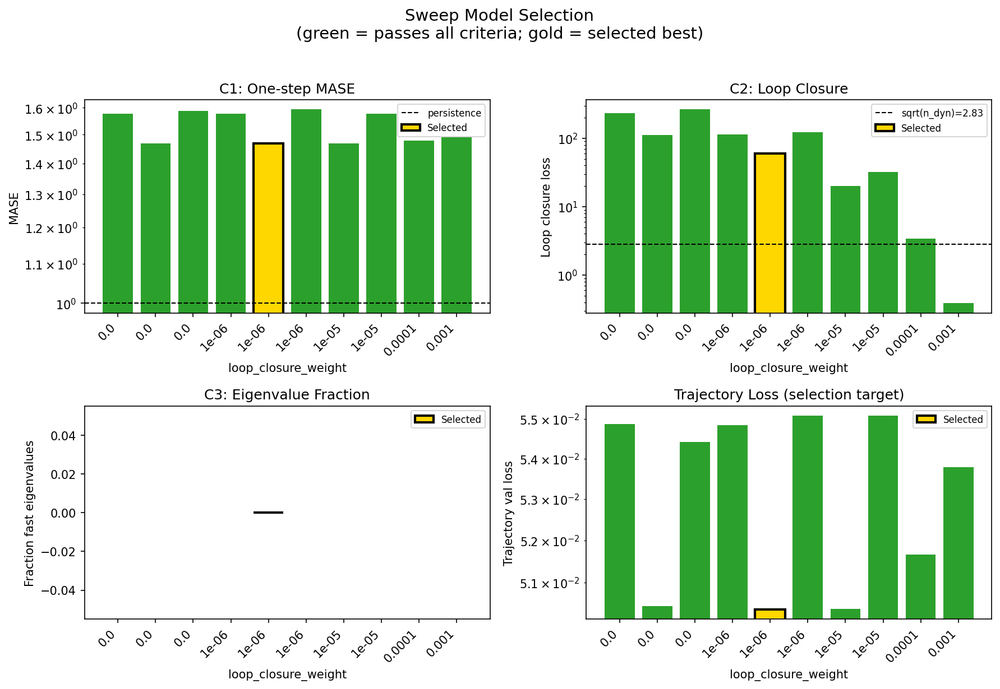

### sweep_pareto

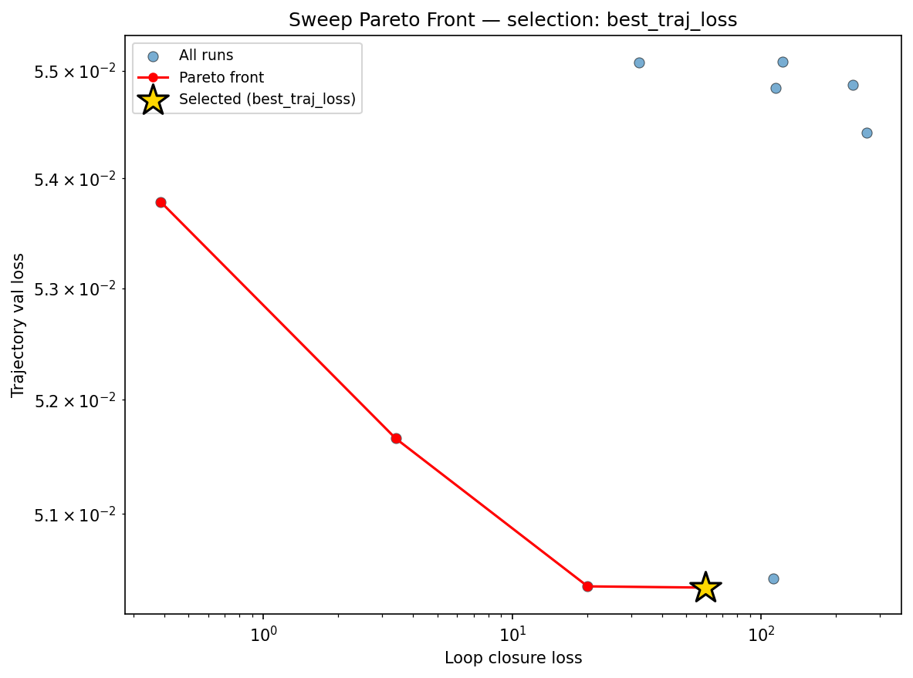

### reconstruction

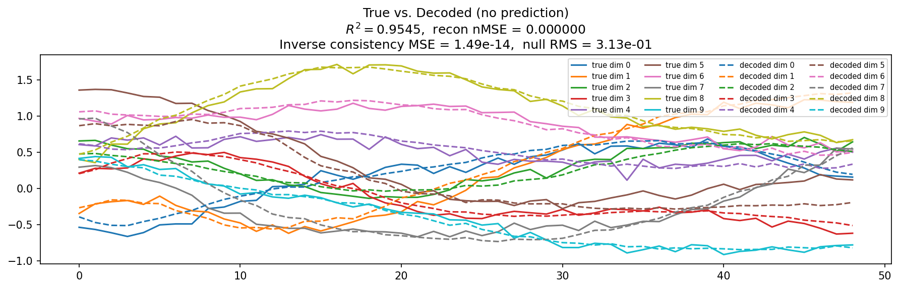

### prediction_windows

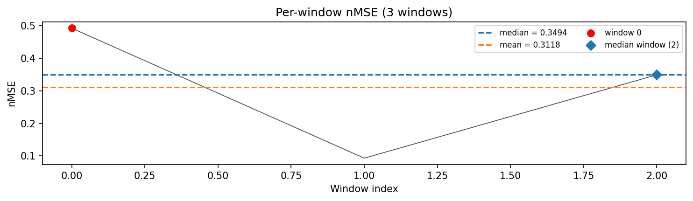

### long_trajectory

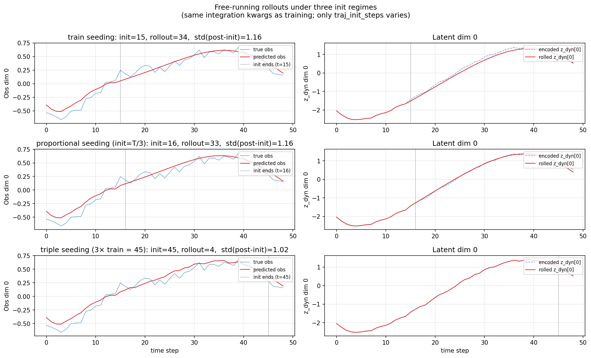

### mase

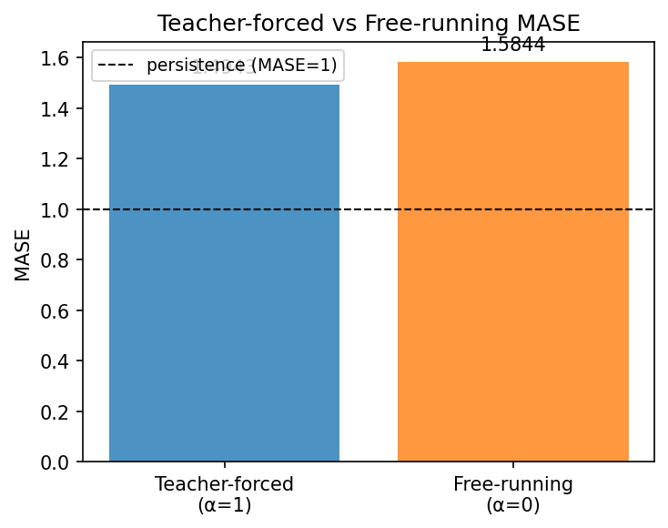

### latent_utilization

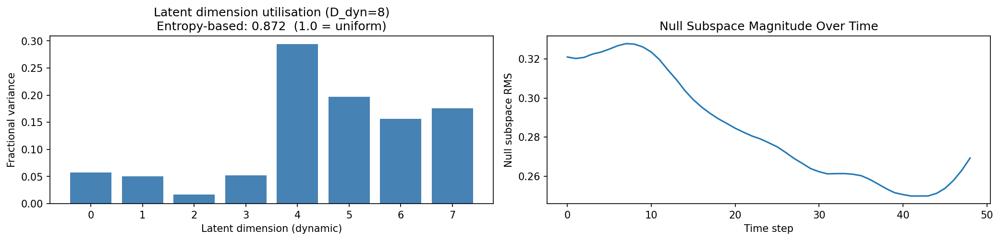

### lyapunov

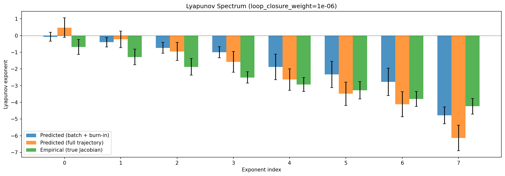

### kaplan_yorke

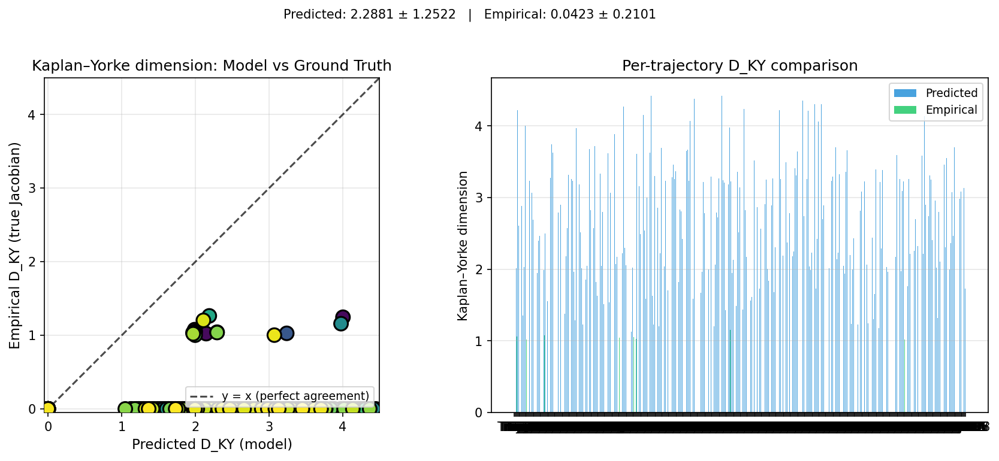

### per_run_lyapunov

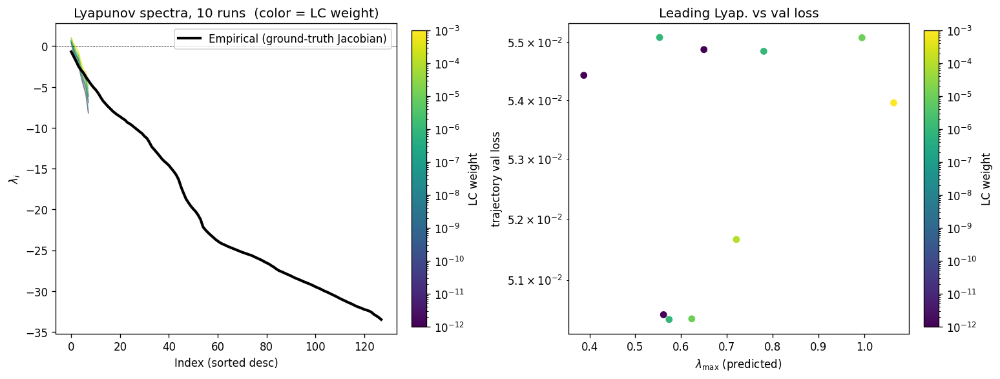

### per_run_lyapunov_vs_true

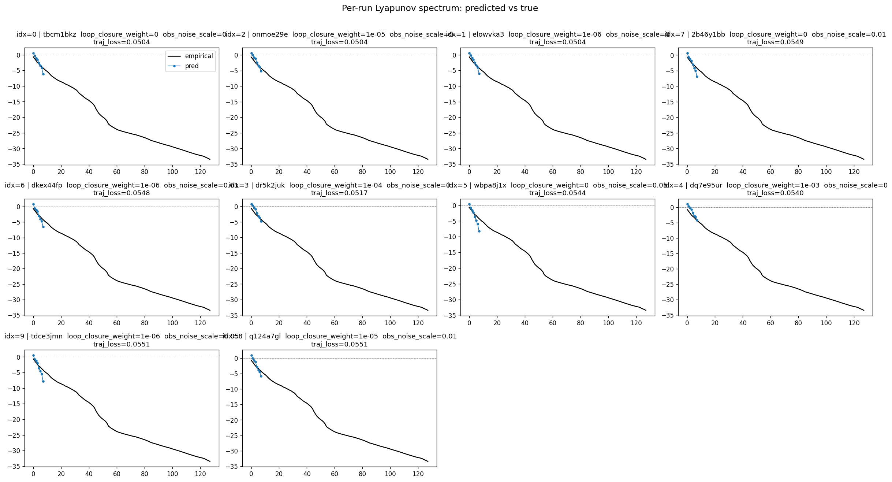

### per_run_lyapunov_relerr

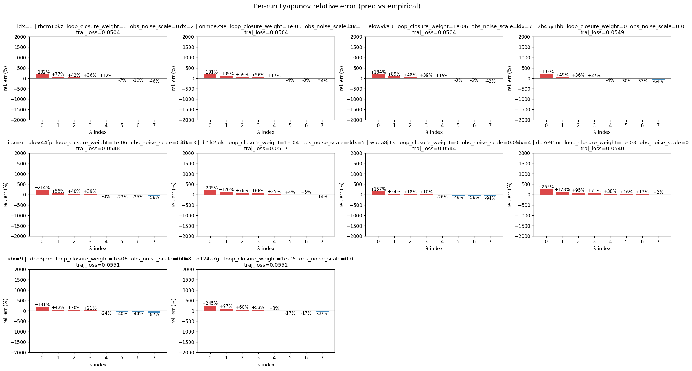

### encoder_decoder_jacobians

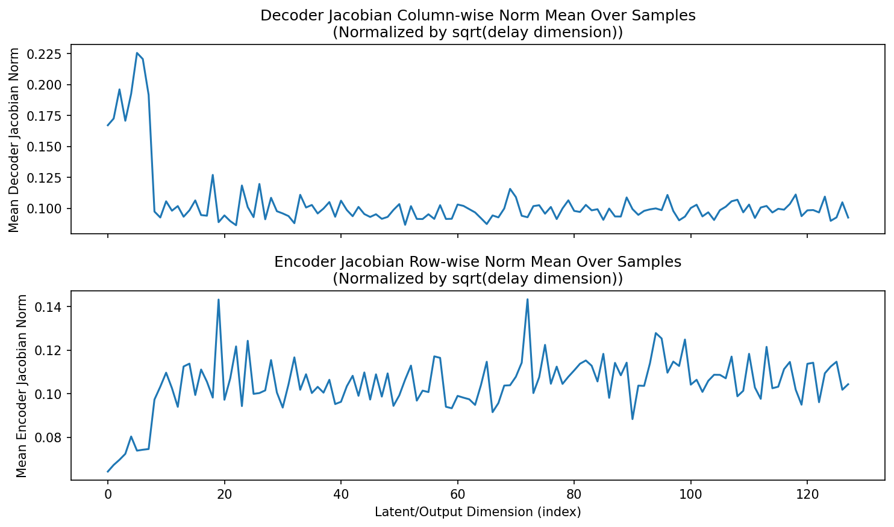

### amplification

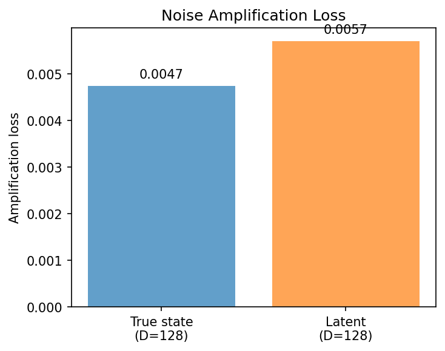

### kaplan_yorke_pca

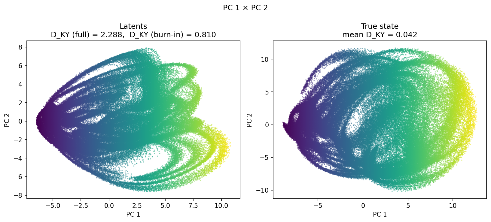

### prediction_detail_latent

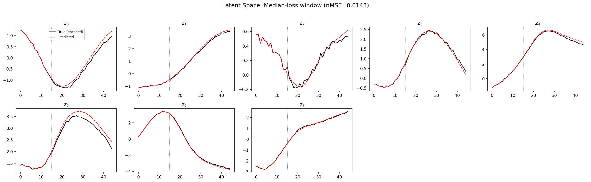

### prediction_detail_obs

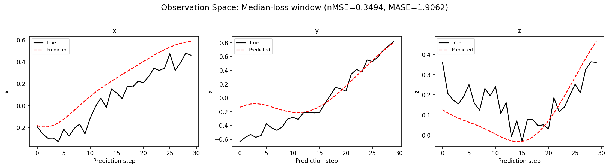

### tangent_spectrum

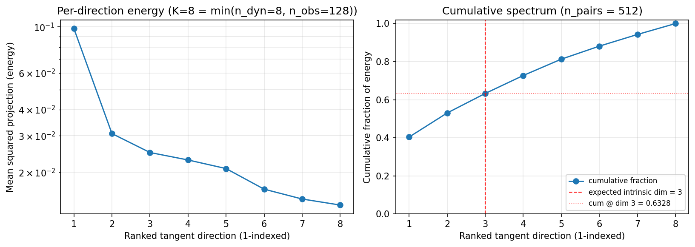

### per_run_tangent_spectrum

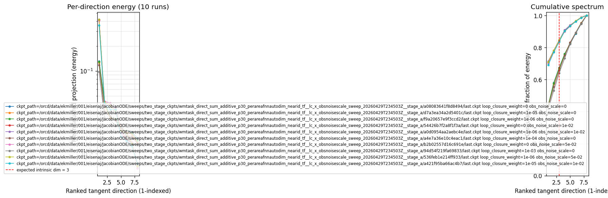

## Discussion

<!--
This section is intentionally left as a placeholder. A human reviewer
or Claude Code agent should fill it in based on the tables and figures
above, explicitly addressing each success criterion and comparing the
outcome to the stated hypothesis. Write the Discussion to
`discussion.md` in this directory and re-run `render_report`.
-->

_(to be written)_

## `run_analytics` stdout

<details><summary>Click to expand — full diagnostic output from <code>run_analytics</code></summary>

```
No run_id provided — selecting best run from group 'wmtask_direct_sum_additive_p30_perareafnnautodim_nearid_tf__lc_x_obsnoisescale_sweep_20260429T234503Z__stage_b' ...
Found 10 total runs in JacobianODE/WMTask_identity_encoder_verification (group=wmtask_direct_sum_additive_p30_perareafnnautodim_nearid_tf__lc_x_obsnoisescale_sweep_20260429T234503Z__stage_b)
All runs (state, loop_closure_weight, tangent_entropy_weight, kl_dyn_weight):
  tbcm1bkz: state=running, lc=0.0, te=0.0, kl_dyn=0.0
  onmoe29e: state=running, lc=1e-05, te=0.0, kl_dyn=0.0
  elowvka3: state=running, lc=1e-06, te=0.0, kl_dyn=0.0
  2b46y1bb: state=running, lc=0.0, te=0.0, kl_dyn=0.0
  dkex44fp: state=running, lc=1e-06, te=0.0, kl_dyn=0.0
  dr5k2juk: state=running, lc=0.0001, te=0.0, kl_dyn=0.0
  wbpa8j1x: state=running, lc=0.0, te=0.0, kl_dyn=0.0
  dq7e95ur: state=running, lc=0.001, te=0.0, kl_dyn=0.0
  tdce3jmn: state=running, lc=1e-06, te=0.0, kl_dyn=0.0
  q124a7gl: state=running, lc=1e-05, te=0.0, kl_dyn=0.0

slurm_timeout_min not found in any run config — falling back to 180 min
  Including tbcm1bkz (lc=0.0): use_all_runs=True (state=running)
  Including onmoe29e (lc=1e-05): use_all_runs=True (state=running)
  Including elowvka3 (lc=1e-06): use_all_runs=True (state=running)
  Including 2b46y1bb (lc=0.0): use_all_runs=True (state=running)
  Including dkex44fp (lc=1e-06): use_all_runs=True (state=running)
  Including dr5k2juk (lc=0.0001): use_all_runs=True (state=running)
  Including wbpa8j1x (lc=0.0): use_all_runs=True (state=running)
  Including dq7e95ur (lc=0.001): use_all_runs=True (state=running)
  Including tdce3jmn (lc=1e-06): use_all_runs=True (state=running)
  Including q124a7gl (lc=1e-05): use_all_runs=True (state=running)
Found 10 effectively-done sweep runs:
  loop_closure_weight=0.0, tangent_entropy_weight=0.0, kl_dyn_weight=0.0 -> run_id=2b46y1bb
  loop_closure_weight=0.0, tangent_entropy_weight=0.0, kl_dyn_weight=0.0 -> run_id=tbcm1bkz
  loop_closure_weight=0.0, tangent_entropy_weight=0.0, kl_dyn_weight=0.0 -> run_id=wbpa8j1x
  loop_closure_weight=1e-06, tangent_entropy_weight=0.0, kl_dyn_weight=0.0 -> run_id=dkex44fp
  loop_closure_weight=1e-06, tangent_entropy_weight=0.0, kl_dyn_weight=0.0 -> run_id=elowvka3
  loop_closure_weight=1e-06, tangent_entropy_weight=0.0, kl_dyn_weight=0.0 -> run_id=tdce3jmn
  loop_closure_weight=1e-05, tangent_entropy_weight=0.0, kl_dyn_weight=0.0 -> run_id=onmoe29e
  loop_closure_weight=1e-05, tangent_entropy_weight=0.0, kl_dyn_weight=0.0 -> run_id=q124a7gl
  loop_closure_weight=0.0001, tangent_entropy_weight=0.0, kl_dyn_weight=0.0 -> run_id=dr5k2juk
  loop_closure_weight=0.001, tangent_entropy_weight=0.0, kl_dyn_weight=0.0 -> run_id=dq7e95ur
loaded wmtask RNN model checkpoint 41
Loading cached wmtask hiddens from /orcd/data/ekmiller/001/eisenaj/ControlJacobians/WMTaskModels/WMSelectionTask__cue_time_0.1__response_time_0.25__enforce_fixation_False/BiologicalRNN__cue_time_0.1__learning_rate_0.0005__max_epochs_42__N1_64__N2_64__tau_0.05__dt_0.02__eig_lower_bound_0.1__init_mode_random/_jacobianode_cache/hiddens__all__epoch41__trials4096__seed42.pt
n_dims=128, n_latent=128, n_dyn=8, dt=0.0200
  run=2b46y1bb: DiagnosticMetrics(one_step_mase=1.577756643295288, loop_closure_loss=232.8925323486328, fast_eigenvalue_fraction=0.0, trajectory_val_loss=0.054871730506420135) (from W&B history)
  run=tbcm1bkz: DiagnosticMetrics(one_step_mase=1.469096302986145, loop_closure_loss=111.46107482910156, fast_eigenvalue_fraction=0.0, trajectory_val_loss=0.05043913051486015) (from W&B history)
  run=wbpa8j1x: DiagnosticMetrics(one_step_mase=1.5869005918502808, loop_closure_loss=264.4222412109375, fast_eigenvalue_fraction=0.0, trajectory_val_loss=0.054424628615379333) (from W&B history)
  run=dkex44fp: DiagnosticMetrics(one_step_mase=1.5778098106384277, loop_closure_loss=114.45892333984375, fast_eigenvalue_fraction=0.0, trajectory_val_loss=0.05484176054596901) (from W&B history)
  run=elowvka3: DiagnosticMetrics(one_step_mase=1.4690474271774292, loop_closure_loss=59.664207458496094, fast_eigenvalue_fraction=0.0, trajectory_val_loss=0.05036250129342079) (from W&B history)
  run=tdce3jmn: DiagnosticMetrics(one_step_mase=1.5935086011886597, loop_closure_loss=121.74895477294922, fast_eigenvalue_fraction=0.0, trajectory_val_loss=0.05508299171924591) (from W&B history)
  run=onmoe29e: DiagnosticMetrics(one_step_mase=1.4684423208236694, loop_closure_loss=20.072874069213867, fast_eigenvalue_fraction=0.0, trajectory_val_loss=0.05037321150302887) (from W&B history)
  run=q124a7gl: DiagnosticMetrics(one_step_mase=1.5774716138839722, loop_closure_loss=32.209632873535156, fast_eigenvalue_fraction=0.0, trajectory_val_loss=0.05507883429527283) (from W&B history)
  run=dr5k2juk: DiagnosticMetrics(one_step_mase=1.4788508415222168, loop_closure_loss=3.3991730213165283, fast_eigenvalue_fraction=0.0, trajectory_val_loss=0.05165942758321762) (from W&B history)
  run=dq7e95ur: DiagnosticMetrics(one_step_mase=1.4911553859710693, loop_closure_loss=0.3862934410572052, fast_eigenvalue_fraction=0.0, trajectory_val_loss=0.05378584563732147) (from W&B history)

Ranking method:           best_traj_loss
Best run ID:              elowvka3
Best loop_closure_weight: 1e-06
Best tangent_entropy_weight: 0.0
Best kl_dyn_weight:       0.0
Best traj loss:           0.050363
Criteria applied: ['C3']
Surviving: 10 / 10
Auto-selected run_id: elowvka3

======================================================================
PARETO FRONTIER RUNS (4 runs)
======================================================================
  Run ID               LC Loss   Traj Val Loss
  ------------  --------------  --------------
  dq7e95ur            0.386293        0.053786
  dr5k2juk            3.399173        0.051659
  onmoe29e           20.072874        0.050373
  elowvka3           59.664207        0.050363 <-- selected

======================================================================
RANKING METHOD COMPARISON (over 10 survivors)
======================================================================
  Method                  Run ID               LC Loss   Traj Val Loss
  ----------------------  ------------  --------------  --------------
  best_traj_loss          elowvka3           59.664207        0.050363 <-- active
  pareto_knee             onmoe29e           20.072874        0.050373
  geo_rank                elowvka3           59.664207        0.050363
  minimax_rank            onmoe29e           20.072874        0.050373
  geo_log_score           elowvka3           59.664207        0.050363
  minimax_log_score       dr5k2juk            3.399173        0.051659
======================================================================

Loading run elowvka3 from JacobianODE/WMTask_identity_encoder_verification ...
loaded wmtask RNN model checkpoint 41
Loading cached wmtask hiddens from /orcd/data/ekmiller/001/eisenaj/ControlJacobians/WMTaskModels/WMSelectionTask__cue_time_0.1__response_time_0.25__enforce_fixation_False/BiologicalRNN__cue_time_0.1__learning_rate_0.0005__max_epochs_42__N1_64__N2_64__tau_0.05__dt_0.02__eig_lower_bound_0.1__init_mode_random/_jacobianode_cache/hiddens__all__epoch41__trials4096__seed42.pt
Loading checkpoint epoch=24-step=3125.ckpt...
Train dataset shape: torch.Size([11468, 45, 128])
Validation dataset shape: torch.Size([3280, 45, 128])
Test dataset shape: torch.Size([1636, 45, 128])
Train trajectories dataset shape: torch.Size([2867, 49, 128])
Validation trajectories dataset shape: torch.Size([820, 49, 128])
Test trajectories dataset shape: torch.Size([409, 49, 128])
Loading checkpoint epoch=24-step=3125.ckpt...
Computing reconstruction ...
Computing MASE ...
Teacher-forced MASE: 1.4943
Free-running MASE:   1.5844
Computing latent utilization ...
Entropy-based utilization: 0.872
Null subspace mean RMS: 2.851929e-01
Computing Lyapunov exponents ...
  Computing full-trajectory Lyapunov (409 test trajs, T=49) ...
Predicted Lyapunov exponents (batch+burn-in, 128 windowed trajs):
  λ_1 = -0.0723 ± 0.2664
  λ_2 = -0.4007 ± 0.2789
  λ_3 = -0.7387 ± 0.3274
  λ_4 = -1.0027 ± 0.3302
  λ_5 = -1.8833 ± 0.7646
  λ_6 = -2.3346 ± 0.7865
  λ_7 = -2.7795 ± 0.8204
  λ_8 = -4.7788 ± 0.5052
Predicted Lyapunov exponents (full-length, 409 test trajs):
  λ_1 = +0.4726 ± 0.5859
  λ_2 = -0.2276 ± 0.4997
  λ_3 = -0.9517 ± 0.5419
  λ_4 = -1.5779 ± 0.6235
  λ_5 = -2.6341 ± 0.6392
  λ_6 = -3.4860 ± 0.6957
  λ_7 = -4.1186 ± 0.7487
  λ_8 = -6.1258 ± 0.7639
Empirical Lyapunov exponents (mean ± std):
  λ_1 = -0.6836 ± 0.4470
  λ_2 = -1.2860 ± 0.4717
  λ_3 = -1.8796 ± 0.4983
  λ_4 = -2.5140 ± 0.3383
  λ_5 = -2.9329 ± 0.4143
  λ_6 = -3.2778 ± 0.5212
  λ_7 = -3.7948 ± 0.4446
  λ_8 = -4.2351 ± 0.4668
  λ_9 = -4.6672 ± 0.4583
  λ_10 = -5.0458 ± 0.4531
  λ_11 = -5.3534 ± 0.4185
  λ_12 = -5.7506 ± 0.4346
  λ_13 = -6.2355 ± 0.3491
  λ_14 = -6.7043 ± 0.5036
  λ_15 = -7.0414 ± 0.4554
  λ_16 = -7.3719 ± 0.4648
  λ_17 = -7.6725 ± 0.4415
  λ_18 = -7.9667 ± 0.4130
  λ_19 = -8.2155 ± 0.4290
  λ_20 = -8.4474 ± 0.4083
  λ_21 = -8.6400 ± 0.3667
  λ_22 = -8.8546 ± 0.3395
  λ_23 = -9.0471 ± 0.3366
  λ_24 = -9.3642 ± 0.2863
  λ_25 = -9.5403 ± 0.3009
  λ_26 = -9.7473 ± 0.3189
  λ_27 = -9.9780 ± 0.3514
  λ_28 = -10.2177 ± 0.4331
  λ_29 = -10.4760 ± 0.4197
  λ_30 = -10.6968 ± 0.4504
  λ_31 = -11.0538 ± 0.5425
  λ_32 = -11.3182 ± 0.5459
  λ_33 = -11.7806 ± 0.6071
  λ_34 = -12.3300 ± 0.5244
  λ_35 = -12.6464 ± 0.5369
  λ_36 = -13.0198 ± 0.6314
  λ_37 = -13.3795 ± 0.7073
  λ_38 = -13.7502 ± 0.7660
  λ_39 = -14.0682 ± 0.7579
  λ_40 = -14.3279 ± 0.7619
  λ_41 = -14.6206 ± 0.8778
  λ_42 = -15.0213 ± 0.8116
  λ_43 = -15.3487 ± 0.8488
  λ_44 = -15.7679 ± 0.8512
  λ_45 = -16.3535 ± 0.8105
  λ_46 = -17.2371 ± 0.8420
  λ_47 = -18.0172 ± 0.6551
  λ_48 = -18.7348 ± 0.4352
  λ_49 = -19.1920 ± 0.4388
  λ_50 = -19.6032 ± 0.3862
  λ_51 = -19.9849 ± 0.4171
  λ_52 = -20.2854 ± 0.3677
  λ_53 = -20.7129 ± 0.4088
  λ_54 = -21.2293 ± 0.4493
  λ_55 = -22.1518 ± 0.3711
  λ_56 = -22.5100 ± 0.3571
  λ_57 = -22.8264 ± 0.3133
  λ_58 = -23.1069 ± 0.3495
  λ_59 = -23.3589 ± 0.3337
  λ_60 = -23.6276 ± 0.2926
  λ_61 = -23.8603 ± 0.3155
  λ_62 = -24.0618 ± 0.3005
  λ_63 = -24.2152 ± 0.3129
  λ_64 = -24.3396 ± 0.3136
  λ_65 = -24.4895 ± 0.3210
  λ_66 = -24.6115 ± 0.3197
  λ_67 = -24.7359 ± 0.3269
  λ_68 = -24.8561 ± 0.3392
  λ_69 = -24.9753 ± 0.3426
  λ_70 = -25.1117 ± 0.3497
  λ_71 = -25.2226 ± 0.3734
  λ_72 = -25.3357 ± 0.4009
  λ_73 = -25.4353 ± 0.4172
  λ_74 = -25.5439 ± 0.4046
  λ_75 = -25.6332 ± 0.4116
  λ_76 = -25.7832 ± 0.4585
  λ_77 = -25.9142 ± 0.4799
  λ_78 = -26.0449 ± 0.4990
  λ_79 = -26.1810 ± 0.5037
  λ_80 = -26.3617 ± 0.4899
  λ_81 = -26.5171 ± 0.4864
  λ_82 = -26.6628 ± 0.4753
  λ_83 = -26.8617 ± 0.4795
  λ_84 = -27.0282 ± 0.5036
  λ_85 = -27.2607 ± 0.4846
  λ_86 = -27.4529 ± 0.4854
  λ_87 = -27.5733 ± 0.4725
  λ_88 = -27.7187 ± 0.4967
  λ_89 = -27.8617 ± 0.5003
  λ_90 = -27.9895 ± 0.4903
  λ_91 = -28.1274 ± 0.4923
  λ_92 = -28.2824 ± 0.4913
  λ_93 = -28.4072 ± 0.4914
  λ_94 = -28.5255 ± 0.4695
  λ_95 = -28.6477 ± 0.4521
  λ_96 = -28.7842 ± 0.4453
  λ_97 = -28.9001 ± 0.4403
  λ_98 = -29.0308 ± 0.4330
  λ_99 = -29.1511 ± 0.4295
  λ_100 = -29.2954 ± 0.4247
  λ_101 = -29.4503 ± 0.4217
  λ_102 = -29.5753 ± 0.4321
  λ_103 = -29.6956 ± 0.4539
  λ_104 = -29.8547 ± 0.4485
  λ_105 = -29.9992 ± 0.4490
  λ_106 = -30.1172 ± 0.4378
  λ_107 = -30.2615 ± 0.4426
  λ_108 = -30.4062 ± 0.3980
  λ_109 = -30.5554 ± 0.4003
  λ_110 = -30.7032 ± 0.3985
  λ_111 = -30.8743 ± 0.4228
  λ_112 = -31.0109 ± 0.4336
  λ_113 = -31.1492 ± 0.4292
  λ_114 = -31.3023 ± 0.3981
  λ_115 = -31.4396 ± 0.4097
  λ_116 = -31.5685 ± 0.3902
  λ_117 = -31.7302 ± 0.3526
  λ_118 = -31.8705 ± 0.3050
  λ_119 = -31.9948 ± 0.3040
  λ_120 = -32.0998 ± 0.2813
  λ_121 = -32.2401 ± 0.2718
  λ_122 = -32.3221 ± 0.2617
  λ_123 = -32.4282 ± 0.2531
  λ_124 = -32.5858 ± 0.2272
  λ_125 = -32.8296 ± 0.2629
  λ_126 = -33.0206 ± 0.2244
  λ_127 = -33.2132 ± 0.2160
  λ_128 = -33.4614 ± 0.3541
Mean KY dim (predicted): 2.288 ± 1.252
Mean KY dim (empirical): 0.042 ± 0.210
Mean KY dim (burn-in):   0.810 ± 0.927
Computing prediction windows ...
Windows: 3 — nMSE min=0.0930, median=0.3494, mean=0.3118, max=0.4929
Computing long-trajectory free-running rollouts ...
Computing encoder/decoder Jacobians ...
encoder_jacobian: (128, 128, 128)
decoder_jacobian: (128, 128, 128)
Computing amplification loss ...
Amplification loss — True state: 0.004748
Amplification loss — Latent:     0.005709
Computing tangent space spectrum ...
```

</details>
