# Sweep Analysis: `wmtask_direct_sum_additive_p30_perareapcaautodim999_nearid_tf__lc_x_obsnoisescale_sweep_20260430T071435Z__stage_a`

**Project**: [WMTask_identity_encoder_verification](https://wandb.ai/JacobianODE/WMTask_identity_encoder_verification/groups/wmtask_direct_sum_additive_p30_perareapcaautodim999_nearid_tf__lc_x_obsnoisescale_sweep_20260430T071435Z__stage_a)  
**Launched**: 2026-04-30T07:15:25Z  
**Completed**: 2026-04-30T10:35:21Z  
**Outcome**: `complete_clean`  
**Git**: `latent-JacobianODE` @ `b50b306`  
**Expected runs**: 21

## Experiment Context

### `wmtask_direct_sum_additive_p30_perareapcaautodim999_nearid_tf__lc_x_obsnoisescale_sweep`

**Description**

WMTask fully-observed (N1=N2=64), DirectSum encoder with per-area PCA
autodim at threshold 0.999 (vs 0.99 in the baseline). Ordinary fixed
permutations (use_cayley_perms=false). Otherwise identical to
wmtask_direct_sum_additive_p30_perareapcaautodim_nearid_tf — same
near_identity_std=1e-3, final_perm_identity=true, additive coupling,
TF-coupled LR (k=1, 1e-4 → min 1e-6), 21-cell LC × obs_noise grid,
two-stage Stage A=20 → Stage B=100 with dual-checkpoint.

**Hypothesis**

Tightening the PCA threshold from 0.99 to 0.999 keeps an order of
magnitude more variance per area at the cost of a larger n_target_dims
(probably 30+ per area instead of 17/14). If the perareapcaautodim
failure mode was "PCA-99% throws away dynamics-relevant variance",
this should narrow the gap toward full-128. If instead the failure
mode was "encoder can't learn the rotation to align with z_dyn axes",
higher threshold won't help much (axes still need rotation, just to a
larger subspace).
Compared with the Cayley sweep:
  - 0.99 + ordinary  (baseline):    best_traj=0.0353
  - 0.99 + Cayley    (companion):   tests rotation expressivity
  - 0.999 + ordinary (this):        tests threshold tightness
  - full-128         (reference):   best_traj=0.0041
Whichever variant closes more of the gap to full-128 identifies the
bottleneck.

**Success criteria**

- All 21 cells train without divergence
- Per-area n_target_dims (PCA-99.9%) logged; expect ≥30 per area
- Best val traj_loss within 2x of full-128's 0.00406
- Recon loss converges below 0.5% (vs ~2% with 0.99 threshold)
- es2-best.ckpt and es5-best.ckpt both saved per cell

## Results

**Swept axes** (4): `data.postprocessing.generalized_variance`, `model.n_target_dims_per_block_pca_cum_var`, `training.lightning.loop_closure_weight`, `training.lightning.obs_noise_scale`

**Chosen run** (by `best_traj_loss`): `nd9097hq` — traj_loss=0.00577, MASE=0.7357, R²=0.9934, LC loss=27.359, epoch=19.0

Swept-axis values at chosen run: `data.postprocessing.generalized_variance`=0.00954705 · `model.n_target_dims_per_block_pca_cum_var`=[0.9990430559589768, 0.999001608739394] · `training.lightning.loop_closure_weight`=0 · `training.lightning.obs_noise_scale`=0.05

**Runs analyzed**: 21 (expected 21)

### Per-run results

| run_idx | run_id | `data.postprocessing.generalized_variance` | `model.n_target_dims_per_block_pca_cum_var` | `training.lightning.loop_closure_weight` | `training.lightning.obs_noise_scale` | best_traj_loss | best_MASE | R² | LC loss | epoch |
|---|---|---|---|---|---|---|---|---|---|---|
| 2 | `nd9097hq` | 0.00954705 | [0.9990430559589768, 0.999001608739394] | 0 | 0.05 | 0.00577 | 0.7357 | 0.9934 | 27.359 | 19.0 |
| 5 | `pjpy54em` | 0.00954705 | [0.999043055958977, 0.9990016087393936] | 1.0e-06 | 0.05 | 0.00580 | 0.7367 | 0.9933 | 17.690 | 19.0 |
| 8 | `h4htfcvl` | 0.00954705 | [0.999043055958977, 0.9990016087393936] | 1.0e-05 | 0.05 | 0.00590 | 0.7421 | 0.9932 | 6.093 | 19.0 |
| 11 | `lcxfik1f` | 0.00954705 | [0.999043055958977, 0.9990016087393936] | 1.0e-04 | 0.05 | 0.00642 | 0.7677 | 0.9926 | 1.327 | 19.0 |
| 6 | `mwpepl4j` | 0.00954705 | [0.999043055958977, 0.9990016087393936] | 1.0e-05 | 0 | 0.00648 | 0.7734 | 0.9926 | 3.485 | 17.0 |
| 3 | `zrh1kyzp` | 0.00954705 | [0.9990430559589768, 0.999001608739394] | 1.0e-06 | 0 | 0.00651 | 0.7742 | 0.9925 | 10.335 | 17.0 |
| 1 | `rd9khmnu` | 0.00954705 | [0.9990430559589768, 0.999001608739394] | 0 | 0.01 | 0.00652 | 0.7751 | 0.9925 | 20.969 | 19.0 |
| 0 | `hr7bjqdg` | 0.00954705 | [0.9990430559589764, 0.999001608739394] | 0 | 0 | 0.00655 | 0.7756 | 0.9925 | 16.548 | 17.0 |
| 4 | `k12d7ib8` | 0.00954705 | [0.999043055958977, 0.9990016087393936] | 1.0e-06 | 0.01 | 0.00659 | 0.7790 | 0.9924 | 13.611 | 19.0 |
| 7 | `7rvpdvly` | 0.00954705 | [0.999043055958977, 0.9990016087393936] | 1.0e-05 | 0.01 | 0.00672 | 0.7862 | 0.9923 | 4.857 | 19.0 |
| 9 | `gudcepb3` | 0.00954705 | [0.999043055958977, 0.9990016087393936] | 1.0e-04 | 0 | 0.00699 | 0.7984 | 0.9920 | 0.734 | 17.0 |
| 10 | `wgld223j` | 0.00954705 | [0.999043055958977, 0.9990016087393936] | 1.0e-04 | 0.01 | 0.00718 | 0.8098 | 0.9918 | 1.076 | 19.0 |
| 14 | `ojbcynxw` | 0.00954705 | [0.999043055958977, 0.9990016087393936] | 0.001 | 0.05 | 0.00744 | 0.8230 | 0.9915 | 0.233 | 19.0 |
| 12 | `h3jlzgdo` | 0.00954705 | [0.999043055958977, 0.9990016087393936] | 0.001 | 0 | 0.00832 | 0.8593 | 0.9905 | 0.108 | 19.0 |
| 13 | `n7fa5182` | 0.00954705 | [0.999043055958977, 0.9990016087393936] | 0.001 | 0.01 | 0.00866 | 0.8839 | 0.9901 | 0.251 | 19.0 |
| 15 | `yka7jj0n` | 0.00954705 | [0.999043055958977, 0.9990016087393936] | 0.01 | 0 | 0.01224 | 1.0169 | 0.9860 | 0.011 | 19.0 |
| 18 | `9q38ijds` | 0.00954705 | [0.9990430559589768, 0.999001608739394] | 0.1 | 0 | 0.02105 | 1.2810 | 0.9759 | 0.001 | 19.0 |
| 17 | `nvxo0043` | 0.00954705 | [0.9990430559589768, 0.999001608739394] | 0.01 | 0.05 | 0.03479 | 1.5732 | 0.9602 | 0.208 | 19.0 |
| 20 | `pxvposiw` | 0.00954705 | [0.999043055958977, 0.9990016087393936] | 0.1 | 0.05 | 0.03757 | 1.6709 | 0.9570 | 0.007 | 19.0 |
| 16 | `ois5sr06` | 0.00954705 | [0.999043055958977, 0.9990016087393936] | 0.01 | 0.01 | 0.04012 | 1.6730 | 0.9541 | 0.023 | 6.0 |
| 19 | `r2v4z2ha` | 0.00954705 | [0.9990430559589768, 0.999001608739394] | 0.1 | 0.01 | 0.07405 | 2.2756 | 0.9154 | 0.047 | 18.0 |

### Best run per `obs_noise_scale`

| obs_noise_scale | Best LC weight | Best traj loss | MASE at best | R² | LC loss | epoch |
|---|---|---|---|---|---|---|
| 0.0 | 1.0e-05 | 0.00648 | 0.7734 | 0.9926 | 3.485 | 17.0 |
| 0.01 | 0.0e+00 | 0.00652 | 0.7751 | 0.9925 | 20.969 | 19.0 |
| 0.05 | 0.0e+00 | 0.00577 | 0.7357 | 0.9934 | 27.359 | 19.0 |

## Success-criteria verdicts (automated)

| Criterion | Verdict | Note |
|---|---|---|
| All 21 cells train without divergence | **Unknown** |  |
| Per-area n_target_dims (PCA-99.9%) logged; expect ≥30 per area | **Unknown** |  |
| Best val traj_loss within 2x of full-128's 0.00406 | **Unknown** |  |
| Recon loss converges below 0.5% (vs ~2% with 0.99 threshold) | **Unknown** |  |
| es2-best.ckpt and es5-best.ckpt both saved per cell | **Unknown** |  |

_Automated verdicts use simple numeric-threshold parsing and may mis-classify qualitative criteria. The Discussion section below takes precedence._

## Figures

### sweep_overview

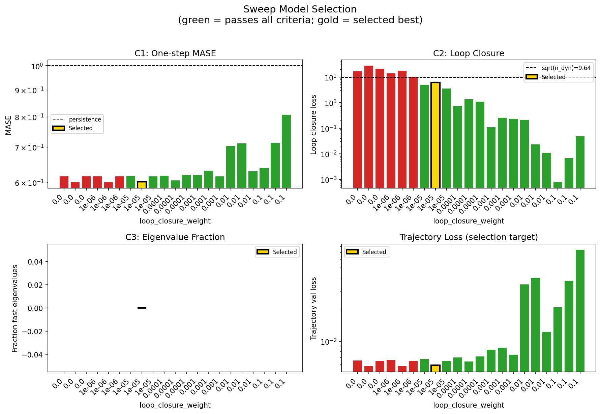

### sweep_pareto

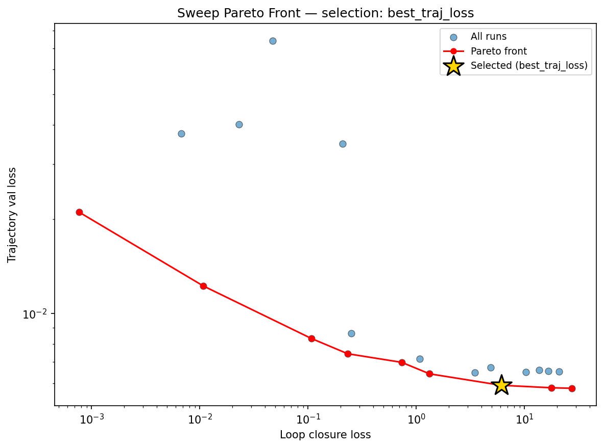

### reconstruction

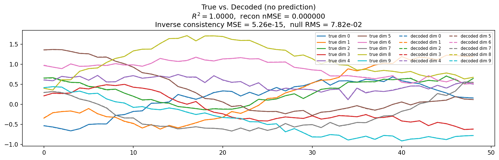

### prediction_windows

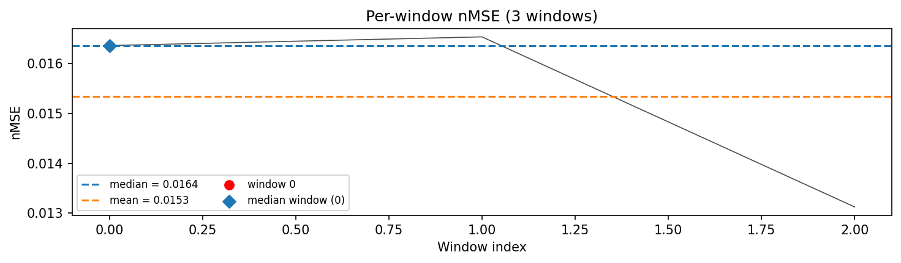

### long_trajectory

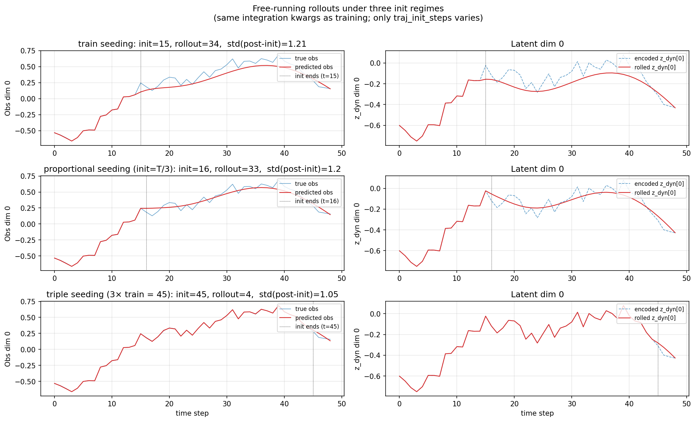

### mase

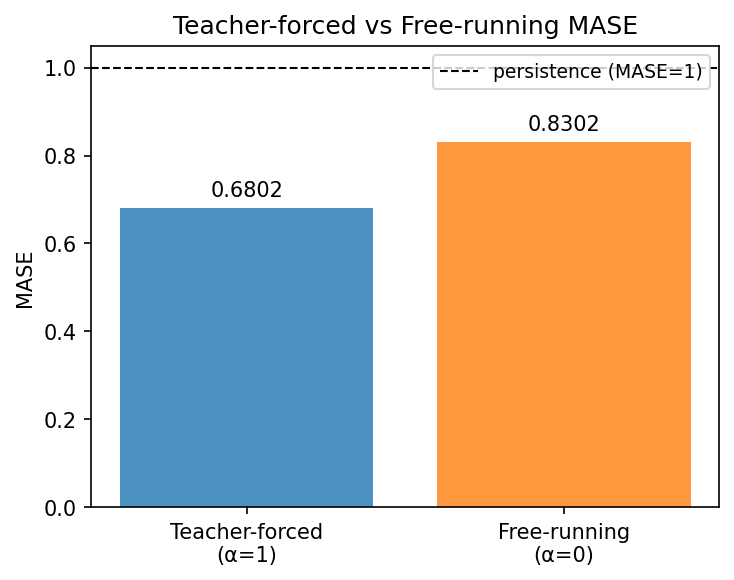

### latent_utilization

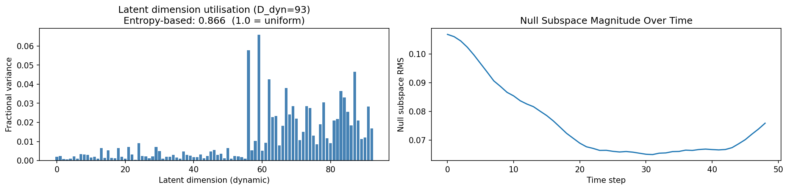

### lyapunov

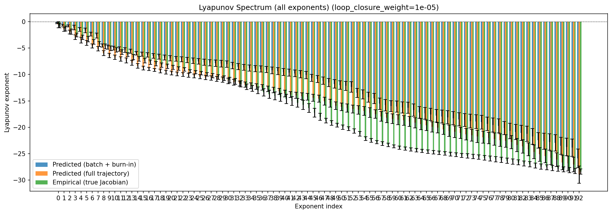

### lyapunov_top10

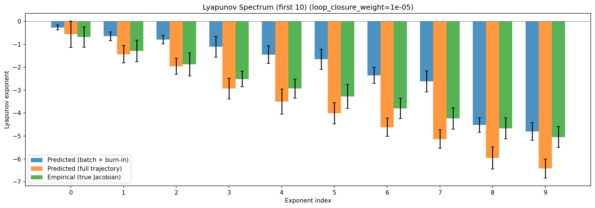

### kaplan_yorke

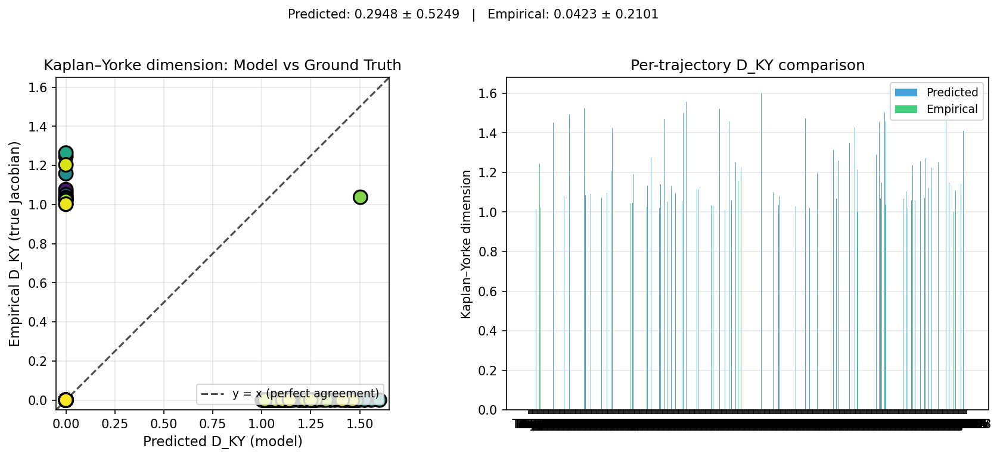

### per_run_lyapunov

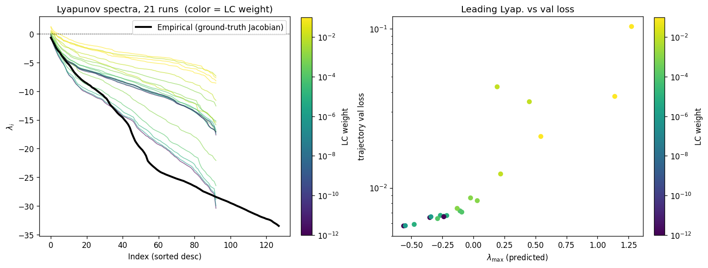

### per_run_lyapunov_vs_true

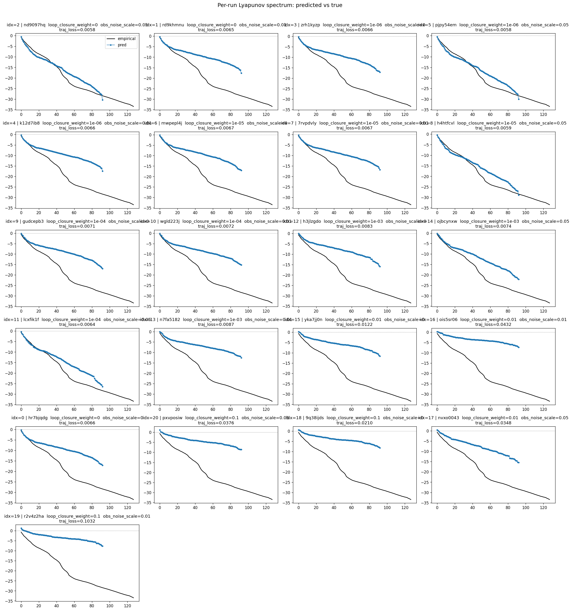

### per_run_lyapunov_relerr

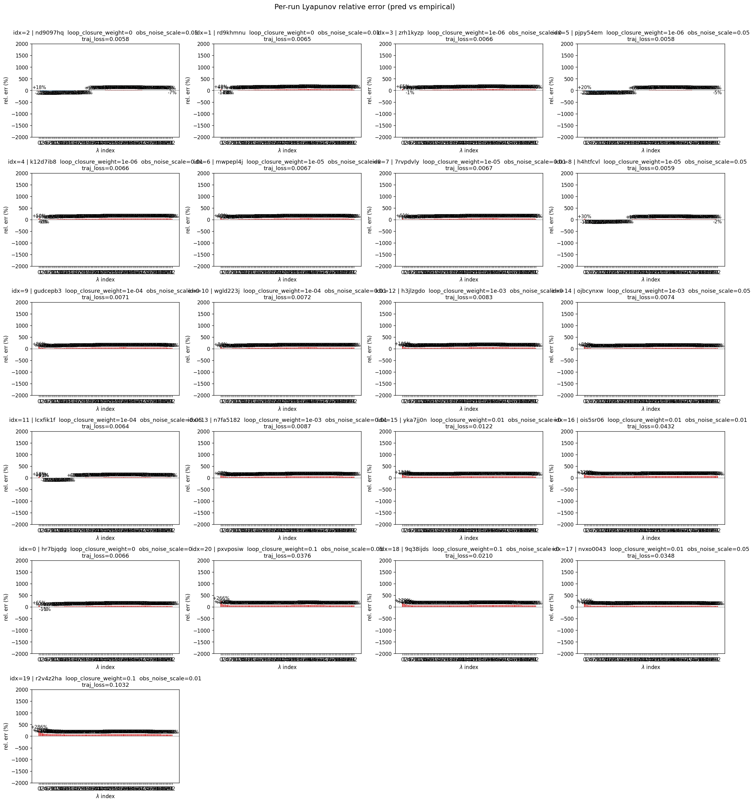

### encoder_decoder_jacobians

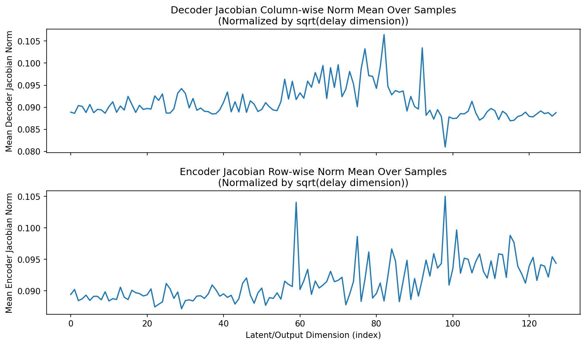

### amplification

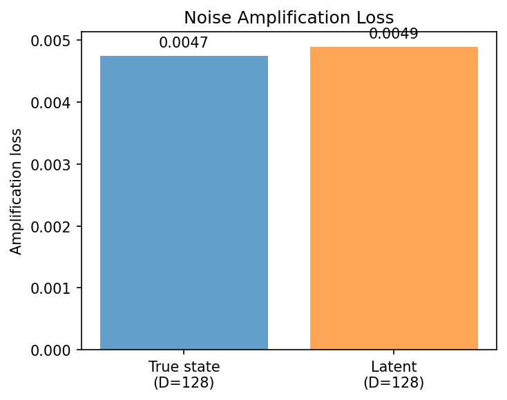

### kaplan_yorke_pca

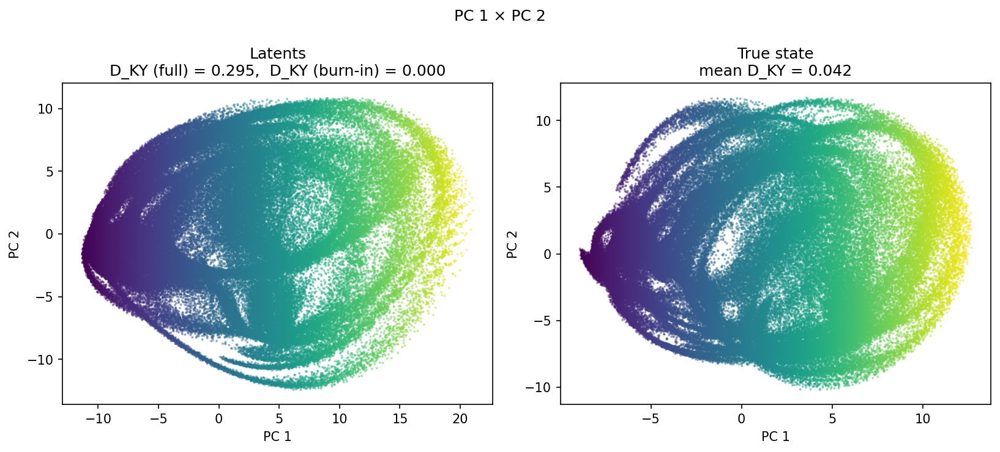

### prediction_detail_latent

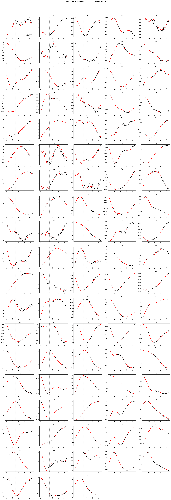

### prediction_detail_obs

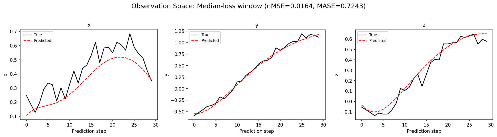

### tangent_spectrum

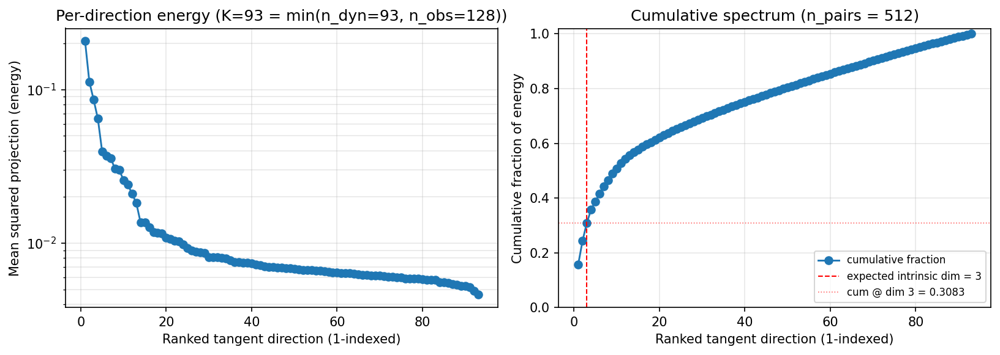

### per_run_tangent_spectrum

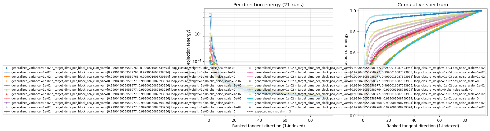

## Discussion

<!--
This section is intentionally left as a placeholder. A human reviewer
or Claude Code agent should fill it in based on the tables and figures
above, explicitly addressing each success criterion and comparing the
outcome to the stated hypothesis. Write the Discussion to
`discussion.md` in this directory and re-run `render_report`.
-->

_(to be written)_

## `run_analytics` stdout

<details><summary>Click to expand — full diagnostic output from <code>run_analytics</code></summary>

```
No run_id provided — selecting best run from group 'wmtask_direct_sum_additive_p30_perareapcaautodim999_nearid_tf__lc_x_obsnoisescale_sweep_20260430T071435Z__stage_a' ...
Found 21 total runs in JacobianODE/WMTask_identity_encoder_verification (group=wmtask_direct_sum_additive_p30_perareapcaautodim999_nearid_tf__lc_x_obsnoisescale_sweep_20260430T071435Z__stage_a)
All runs (state, loop_closure_weight, tangent_entropy_weight, kl_dyn_weight):
  nd9097hq: state=finished, lc=0.0, te=0.0, kl_dyn=0.0
  rd9khmnu: state=finished, lc=0.0, te=0.0, kl_dyn=0.0
  zrh1kyzp: state=finished, lc=1e-06, te=0.0, kl_dyn=0.0
  pjpy54em: state=finished, lc=1e-06, te=0.0, kl_dyn=0.0
  k12d7ib8: state=finished, lc=1e-06, te=0.0, kl_dyn=0.0
  mwpepl4j: state=finished, lc=1e-05, te=0.0, kl_dyn=0.0
  7rvpdvly: state=finished, lc=1e-05, te=0.0, kl_dyn=0.0
  h4htfcvl: state=finished, lc=1e-05, te=0.0, kl_dyn=0.0
  gudcepb3: state=finished, lc=0.0001, te=0.0, kl_dyn=0.0
  wgld223j: state=finished, lc=0.0001, te=0.0, kl_dyn=0.0
  h3jlzgdo: state=finished, lc=0.001, te=0.0, kl_dyn=0.0
  ojbcynxw: state=finished, lc=0.001, te=0.0, kl_dyn=0.0
  lcxfik1f: state=finished, lc=0.0001, te=0.0, kl_dyn=0.0
  n7fa5182: state=finished, lc=0.001, te=0.0, kl_dyn=0.0
  yka7jj0n: state=finished, lc=0.01, te=0.0, kl_dyn=0.0
  ois5sr06: state=finished, lc=0.01, te=0.0, kl_dyn=0.0
  hr7bjqdg: state=finished, lc=0.0, te=0.0, kl_dyn=0.0
  pxvposiw: state=finished, lc=0.1, te=0.0, kl_dyn=0.0
  9q38ijds: state=finished, lc=0.1, te=0.0, kl_dyn=0.0
  nvxo0043: state=finished, lc=0.01, te=0.0, kl_dyn=0.0
  r2v4z2ha: state=finished, lc=0.1, te=0.0, kl_dyn=0.0

slurm_timeout_min not found in any run config — falling back to 180 min
  Including nd9097hq (lc=0.0): use_all_runs=True (state=finished)
  Including rd9khmnu (lc=0.0): use_all_runs=True (state=finished)
  Including zrh1kyzp (lc=1e-06): use_all_runs=True (state=finished)
  Including pjpy54em (lc=1e-06): use_all_runs=True (state=finished)
  Including k12d7ib8 (lc=1e-06): use_all_runs=True (state=finished)
  Including mwpepl4j (lc=1e-05): use_all_runs=True (state=finished)
  Including 7rvpdvly (lc=1e-05): use_all_runs=True (state=finished)
  Including h4htfcvl (lc=1e-05): use_all_runs=True (state=finished)
  Including gudcepb3 (lc=0.0001): use_all_runs=True (state=finished)
  Including wgld223j (lc=0.0001): use_all_runs=True (state=finished)
  Including h3jlzgdo (lc=0.001): use_all_runs=True (state=finished)
  Including ojbcynxw (lc=0.001): use_all_runs=True (state=finished)
  Including lcxfik1f (lc=0.0001): use_all_runs=True (state=finished)
  Including n7fa5182 (lc=0.001): use_all_runs=True (state=finished)
  Including yka7jj0n (lc=0.01): use_all_runs=True (state=finished)
  Including ois5sr06 (lc=0.01): use_all_runs=True (state=finished)
  Including hr7bjqdg (lc=0.0): use_all_runs=True (state=finished)
  Including pxvposiw (lc=0.1): use_all_runs=True (state=finished)
  Including 9q38ijds (lc=0.1): use_all_runs=True (state=finished)
  Including nvxo0043 (lc=0.01): use_all_runs=True (state=finished)
  Including r2v4z2ha (lc=0.1): use_all_runs=True (state=finished)
Found 21 effectively-done sweep runs:
  loop_closure_weight=0.0, tangent_entropy_weight=0.0, kl_dyn_weight=0.0 -> run_id=hr7bjqdg
  loop_closure_weight=0.0, tangent_entropy_weight=0.0, kl_dyn_weight=0.0 -> run_id=nd9097hq
  loop_closure_weight=0.0, tangent_entropy_weight=0.0, kl_dyn_weight=0.0 -> run_id=rd9khmnu
  loop_closure_weight=1e-06, tangent_entropy_weight=0.0, kl_dyn_weight=0.0 -> run_id=k12d7ib8
  loop_closure_weight=1e-06, tangent_entropy_weight=0.0, kl_dyn_weight=0.0 -> run_id=pjpy54em
  loop_closure_weight=1e-06, tangent_entropy_weight=0.0, kl_dyn_weight=0.0 -> run_id=zrh1kyzp
  loop_closure_weight=1e-05, tangent_entropy_weight=0.0, kl_dyn_weight=0.0 -> run_id=7rvpdvly
  loop_closure_weight=1e-05, tangent_entropy_weight=0.0, kl_dyn_weight=0.0 -> run_id=h4htfcvl
  loop_closure_weight=1e-05, tangent_entropy_weight=0.0, kl_dyn_weight=0.0 -> run_id=mwpepl4j
  loop_closure_weight=0.0001, tangent_entropy_weight=0.0, kl_dyn_weight=0.0 -> run_id=gudcepb3
  loop_closure_weight=0.0001, tangent_entropy_weight=0.0, kl_dyn_weight=0.0 -> run_id=lcxfik1f
  loop_closure_weight=0.0001, tangent_entropy_weight=0.0, kl_dyn_weight=0.0 -> run_id=wgld223j
  loop_closure_weight=0.001, tangent_entropy_weight=0.0, kl_dyn_weight=0.0 -> run_id=h3jlzgdo
  loop_closure_weight=0.001, tangent_entropy_weight=0.0, kl_dyn_weight=0.0 -> run_id=n7fa5182
  loop_closure_weight=0.001, tangent_entropy_weight=0.0, kl_dyn_weight=0.0 -> run_id=ojbcynxw
  loop_closure_weight=0.01, tangent_entropy_weight=0.0, kl_dyn_weight=0.0 -> run_id=nvxo0043
  loop_closure_weight=0.01, tangent_entropy_weight=0.0, kl_dyn_weight=0.0 -> run_id=ois5sr06
  loop_closure_weight=0.01, tangent_entropy_weight=0.0, kl_dyn_weight=0.0 -> run_id=yka7jj0n
  loop_closure_weight=0.1, tangent_entropy_weight=0.0, kl_dyn_weight=0.0 -> run_id=9q38ijds
  loop_closure_weight=0.1, tangent_entropy_weight=0.0, kl_dyn_weight=0.0 -> run_id=pxvposiw
  loop_closure_weight=0.1, tangent_entropy_weight=0.0, kl_dyn_weight=0.0 -> run_id=r2v4z2ha
loaded wmtask RNN model checkpoint 41
Loading cached wmtask hiddens from /orcd/data/ekmiller/001/eisenaj/ControlJacobians/WMTaskModels/WMSelectionTask__cue_time_0.1__response_time_0.25__enforce_fixation_False/BiologicalRNN__cue_time_0.1__learning_rate_0.0005__max_epochs_42__N1_64__N2_64__tau_0.05__dt_0.02__eig_lower_bound_0.1__init_mode_random/_jacobianode_cache/hiddens__all__epoch41__trials4096__seed42.pt
n_dims=128, n_latent=128, n_dyn=93, dt=0.0200
  run=hr7bjqdg: DiagnosticMetrics(one_step_mase=0.6160164475440979, loop_closure_loss=16.5483455657959, fast_eigenvalue_fraction=0.0, trajectory_val_loss=0.006547241006046534) (from W&B history)
  run=nd9097hq: DiagnosticMetrics(one_step_mase=0.6001887321472168, loop_closure_loss=27.358552932739258, fast_eigenvalue_fraction=0.0, trajectory_val_loss=0.005774599965661764) (from W&B history)
  run=rd9khmnu: DiagnosticMetrics(one_step_mase=0.6158192753791809, loop_closure_loss=20.969284057617188, fast_eigenvalue_fraction=0.0, trajectory_val_loss=0.006521221250295639) (from W&B history)
  run=k12d7ib8: DiagnosticMetrics(one_step_mase=0.6160305142402649, loop_closure_loss=13.610953330993652, fast_eigenvalue_fraction=0.0, trajectory_val_loss=0.006593930069357157) (from W&B history)
  run=pjpy54em: DiagnosticMetrics(one_step_mase=0.6005412936210632, loop_closure_loss=17.68962287902832, fast_eigenvalue_fraction=0.0, trajectory_val_loss=0.005796719342470169) (from W&B history)
  run=zrh1kyzp: DiagnosticMetrics(one_step_mase=0.6158811450004578, loop_closure_loss=10.334515571594238, fast_eigenvalue_fraction=0.0, trajectory_val_loss=0.006510347593575716) (from W&B history)
  run=7rvpdvly: DiagnosticMetrics(one_step_mase=0.6168687343597412, loop_closure_loss=4.857263088226318, fast_eigenvalue_fraction=0.0, trajectory_val_loss=0.006724255625158548) (from W&B history)
  run=h4htfcvl: DiagnosticMetrics(one_step_mase=0.6014552116394043, loop_closure_loss=6.0925068855285645, fast_eigenvalue_fraction=0.0, trajectory_val_loss=0.005902382079511881) (from W&B history)
  run=mwpepl4j: DiagnosticMetrics(one_step_mase=0.6156925559043884, loop_closure_loss=3.485036611557007, fast_eigenvalue_fraction=0.0, trajectory_val_loss=0.0064816405065357685) (from W&B history)
  run=gudcepb3: DiagnosticMetrics(one_step_mase=0.6172024011611938, loop_closure_loss=0.7339698076248169, fast_eigenvalue_fraction=0.0, trajectory_val_loss=0.006986168213188648) (from W&B history)
  run=lcxfik1f: DiagnosticMetrics(one_step_mase=0.6046389937400818, loop_closure_loss=1.3273003101348877, fast_eigenvalue_fraction=0.0, trajectory_val_loss=0.0064205266535282135) (from W&B history)
  run=wgld223j: DiagnosticMetrics(one_step_mase=0.6195490956306458, loop_closure_loss=1.076382040977478, fast_eigenvalue_fraction=0.0, trajectory_val_loss=0.007178165949881077) (from W&B history)
  run=h3jlzgdo: DiagnosticMetrics(one_step_mase=0.6191152930259705, loop_closure_loss=0.10756607353687286, fast_eigenvalue_fraction=0.0, trajectory_val_loss=0.008322830311954021) (from W&B history)
  run=n7fa5182: DiagnosticMetrics(one_step_mase=0.6311312913894653, loop_closure_loss=0.2510617971420288, fast_eigenvalue_fraction=0.0, trajectory_val_loss=0.008657789789140224) (from W&B history)
  run=ojbcynxw: DiagnosticMetrics(one_step_mase=0.6158884763717651, loop_closure_loss=0.23280338943004608, fast_eigenvalue_fraction=0.0, trajectory_val_loss=0.007441092748194933) (from W&B history)
  run=nvxo0043: DiagnosticMetrics(one_step_mase=0.7029797434806824, loop_closure_loss=0.20810338854789734, fast_eigenvalue_fraction=0.0, trajectory_val_loss=0.03479314222931862) (from W&B history)
  run=ois5sr06: DiagnosticMetrics(one_step_mase=0.7113936543464661, loop_closure_loss=0.023124773055315018, fast_eigenvalue_fraction=0.0, trajectory_val_loss=0.04012465849518776) (from W&B history)
  run=yka7jj0n: DiagnosticMetrics(one_step_mase=0.6294609308242798, loop_closure_loss=0.01078422274440527, fast_eigenvalue_fraction=0.0, trajectory_val_loss=0.012242265976965427) (from W&B history)
  run=9q38ijds: DiagnosticMetrics(one_step_mase=0.638857901096344, loop_closure_loss=0.0007684936281293631, fast_eigenvalue_fraction=0.0, trajectory_val_loss=0.021048765629529953) (from W&B history)
  run=pxvposiw: DiagnosticMetrics(one_step_mase=0.7138227224349976, loop_closure_loss=0.006731340661644936, fast_eigenvalue_fraction=0.0, trajectory_val_loss=0.03756961226463318) (from W&B history)
  run=r2v4z2ha: DiagnosticMetrics(one_step_mase=0.8069095611572266, loop_closure_loss=0.0472540557384491, fast_eigenvalue_fraction=0.0, trajectory_val_loss=0.07405464351177216) (from W&B history)

Ranking method:           best_traj_loss
Best run ID:              h4htfcvl
Best loop_closure_weight: 1e-05
Best tangent_entropy_weight: 0.0
Best kl_dyn_weight:       0.0
Best traj loss:           0.005902
Criteria applied: ['C1', 'C2', 'C3']
Surviving: 15 / 21
Auto-selected run_id: h4htfcvl

======================================================================
PARETO FRONTIER RUNS (9 runs)
======================================================================
  Run ID               LC Loss   Traj Val Loss
  ------------  --------------  --------------
  9q38ijds            0.000768        0.021049
  yka7jj0n            0.010784        0.012242
  h3jlzgdo            0.107566        0.008323
  ojbcynxw            0.232803        0.007441
  gudcepb3            0.733970        0.006986
  lcxfik1f            1.327300        0.006421
  h4htfcvl            6.092507        0.005902 <-- selected
  pjpy54em           17.689623        0.005797
  nd9097hq           27.358553        0.005775

======================================================================
RANKING METHOD COMPARISON (over 15 survivors)
======================================================================
  Method                  Run ID               LC Loss   Traj Val Loss
  ----------------------  ------------  --------------  --------------
  best_traj_loss          h4htfcvl            6.092507        0.005902 <-- active
  pareto_knee             ojbcynxw            0.232803        0.007441
  geo_rank                9q38ijds            0.000768        0.021049
  minimax_rank            h3jlzgdo            0.107566        0.008323
  geo_log_score           h4htfcvl            6.092507        0.005902
  minimax_log_score       yka7jj0n            0.010784        0.012242
======================================================================

Loading run h4htfcvl from JacobianODE/WMTask_identity_encoder_verification ...
loaded wmtask RNN model checkpoint 41
Loading cached wmtask hiddens from /orcd/data/ekmiller/001/eisenaj/ControlJacobians/WMTaskModels/WMSelectionTask__cue_time_0.1__response_time_0.25__enforce_fixation_False/BiologicalRNN__cue_time_0.1__learning_rate_0.0005__max_epochs_42__N1_64__N2_64__tau_0.05__dt_0.02__eig_lower_bound_0.1__init_mode_random/_jacobianode_cache/hiddens__all__epoch41__trials4096__seed42.pt
Loading checkpoint epoch=19-step=2500.ckpt...
Train dataset shape: torch.Size([11468, 45, 128])
Validation dataset shape: torch.Size([3280, 45, 128])
Test dataset shape: torch.Size([1636, 45, 128])
Train trajectories dataset shape: torch.Size([2867, 49, 128])
Validation trajectories dataset shape: torch.Size([820, 49, 128])
Test trajectories dataset shape: torch.Size([409, 49, 128])
Loading checkpoint epoch=19-step=2500.ckpt...
Computing reconstruction ...
Computing MASE ...
Teacher-forced MASE: 0.6802
Free-running MASE:   0.8302
Computing latent utilization ...
Entropy-based utilization: 0.866
Null subspace mean RMS: 7.688337e-02
Computing Lyapunov exponents ...
  Computing full-trajectory Lyapunov (409 test trajs, T=49) ...
Predicted Lyapunov exponents (batch+burn-in, 128 windowed trajs):
  λ_1 = -0.2716 ± 0.1056
  λ_2 = -0.6495 ± 0.1899
  λ_3 = -0.7942 ± 0.1819
  λ_4 = -1.1109 ± 0.4470
  λ_5 = -1.4530 ± 0.3798
  λ_6 = -1.6546 ± 0.4361
  λ_7 = -2.3554 ± 0.3524
  λ_8 = -2.6176 ± 0.4634
  λ_9 = -4.5204 ± 0.3164
  λ_10 = -4.7965 ± 0.3845
  λ_11 = -5.0065 ± 0.3816
  λ_12 = -5.1768 ± 0.4311
  λ_13 = -5.3727 ± 0.4245
  λ_14 = -5.6018 ± 0.3921
  λ_15 = -5.9721 ± 0.3336
  λ_16 = -6.1428 ± 0.4008
  λ_17 = -6.3032 ± 0.4108
  λ_18 = -6.4706 ± 0.4342
  λ_19 = -6.6034 ± 0.4633
  λ_20 = -6.7957 ± 0.4818
  λ_21 = -6.9150 ± 0.4813
  λ_22 = -7.0316 ± 0.4601
  λ_23 = -7.1170 ± 0.4636
  λ_24 = -7.2645 ± 0.4979
  λ_25 = -7.3758 ± 0.5333
  λ_26 = -7.5170 ± 0.5407
  λ_27 = -7.6743 ± 0.5959
  λ_28 = -7.7779 ± 0.6014
  λ_29 = -7.8514 ± 0.6193
  λ_30 = -7.9410 ± 0.6201
  λ_31 = -8.0345 ± 0.6353
  λ_32 = -8.3142 ± 0.6035
  λ_33 = -8.5129 ± 0.5710
  λ_34 = -8.6447 ± 0.5671
  λ_35 = -8.7892 ± 0.5712
  λ_36 = -8.8905 ± 0.5665
  λ_37 = -8.9712 ± 0.5839
  λ_38 = -9.0610 ± 0.5978
  λ_39 = -9.2173 ± 0.6451
  λ_40 = -9.3445 ± 0.6579
  λ_41 = -9.5259 ± 0.6643
  λ_42 = -9.6463 ± 0.6577
  λ_43 = -9.7845 ± 0.6559
  λ_44 = -9.9553 ± 0.6844
  λ_45 = -10.0912 ± 0.6889
  λ_46 = -10.6491 ± 0.6573
  λ_47 = -10.8685 ± 0.6772
  λ_48 = -11.1739 ± 0.6937
  λ_49 = -11.5391 ± 0.7745
  λ_50 = -11.7872 ± 0.8098
  λ_51 = -12.0041 ± 0.8164
  λ_52 = -12.1511 ± 0.8528
  λ_53 = -12.3807 ± 1.0016
  λ_54 = -13.4880 ± 0.8666
  λ_55 = -13.7694 ± 0.8535
  λ_56 = -14.3198 ± 0.9517
  λ_57 = -14.5453 ± 0.9521
  λ_58 = -15.5464 ± 1.0733
  λ_59 = -15.8228 ± 1.0768
  λ_60 = -15.9856 ± 1.0437
  λ_61 = -16.0932 ± 1.0500
  λ_62 = -16.2256 ± 1.0603
  λ_63 = -16.3216 ± 1.0614
  λ_64 = -16.7444 ± 1.1767
  λ_65 = -17.2059 ± 1.1028
  λ_66 = -17.3440 ± 1.1060
  λ_67 = -17.5749 ± 1.1617
  λ_68 = -17.8127 ± 1.1863
  λ_69 = -17.9725 ± 1.2186
  λ_70 = -18.1167 ± 1.2588
  λ_71 = -18.2848 ± 1.2534
  λ_72 = -18.5034 ± 1.2391
  λ_73 = -18.6516 ± 1.2257
  λ_74 = -18.8281 ± 1.2790
  λ_75 = -18.9193 ± 1.2952
  λ_76 = -19.0348 ± 1.2903
  λ_77 = -19.3423 ± 1.2886
  λ_78 = -19.5532 ± 1.3327
  λ_79 = -19.7458 ± 1.3410
  λ_80 = -20.1542 ± 1.2617
  λ_81 = -20.7105 ± 1.4816
  λ_82 = -20.9218 ± 1.4423
  λ_83 = -21.0583 ± 1.4518
  λ_84 = -21.2213 ± 1.4413
  λ_85 = -21.7267 ± 1.4931
  λ_86 = -22.4845 ± 1.4916
  λ_87 = -22.6340 ± 1.5316
  λ_88 = -22.8018 ± 1.5373
  λ_89 = -22.9631 ± 1.5591
  λ_90 = -23.5269 ± 1.5945
  λ_91 = -23.7363 ± 1.6495
  λ_92 = -23.8710 ± 1.6479
  λ_93 = -25.8863 ± 1.7735
Predicted Lyapunov exponents (full-length, 409 test trajs):
  λ_1 = -0.5651 ± 0.5752
  λ_2 = -1.4371 ± 0.3800
  λ_3 = -1.9625 ± 0.3439
  λ_4 = -2.9301 ± 0.4513
  λ_5 = -3.4954 ± 0.5482
  λ_6 = -4.0031 ± 0.4564
  λ_7 = -4.6101 ± 0.3954
  λ_8 = -5.1324 ± 0.4023
  λ_9 = -5.9521 ± 0.4882
  λ_10 = -6.4133 ± 0.4140
  λ_11 = -6.7407 ± 0.4061
  λ_12 = -7.0492 ± 0.4047
  λ_13 = -7.3454 ± 0.4756
  λ_14 = -7.7812 ± 0.4841
  λ_15 = -8.3581 ± 0.4459
  λ_16 = -8.7740 ± 0.3546
  λ_17 = -8.9552 ± 0.3001
  λ_18 = -9.1520 ± 0.2677
  λ_19 = -9.3605 ± 0.3601
  λ_20 = -9.5487 ± 0.3727
  λ_21 = -9.7234 ± 0.3854
  λ_22 = -9.8839 ± 0.3617
  λ_23 = -9.9996 ± 0.3695
  λ_24 = -10.1463 ± 0.3660
  λ_25 = -10.2906 ± 0.3624
  λ_26 = -10.4067 ± 0.3726
  λ_27 = -10.5603 ± 0.4177
  λ_28 = -10.6606 ± 0.4185
  λ_29 = -10.8392 ± 0.4523
  λ_30 = -10.9991 ± 0.4996
  λ_31 = -11.2221 ± 0.5267
  λ_32 = -11.4772 ± 0.5368
  λ_33 = -11.7113 ± 0.4791
  λ_34 = -11.9142 ± 0.5152
  λ_35 = -12.1327 ± 0.5395
  λ_36 = -12.2851 ± 0.5343
  λ_37 = -12.4530 ± 0.5239
  λ_38 = -12.7063 ± 0.5193
  λ_39 = -12.9458 ± 0.5176
  λ_40 = -13.2051 ± 0.5879
  λ_41 = -13.6083 ± 0.6134
  λ_42 = -13.8083 ± 0.5766
  λ_43 = -13.9527 ± 0.5775
  λ_44 = -14.1134 ± 0.6248
  λ_45 = -14.2416 ± 0.6334
  λ_46 = -14.4179 ± 0.6538
  λ_47 = -14.5861 ± 0.6876
  λ_48 = -15.0596 ± 0.7487
  λ_49 = -15.4506 ± 0.7314
  λ_50 = -15.9091 ± 0.7371
  λ_51 = -16.1195 ± 0.7175
  λ_52 = -16.3621 ± 0.7588
  λ_53 = -16.5427 ± 0.7555
  λ_54 = -16.7096 ± 0.7900
  λ_55 = -16.9098 ± 0.8191
  λ_56 = -17.2174 ± 0.9066
  λ_57 = -17.5065 ± 0.8027
  λ_58 = -17.9416 ± 0.8956
  λ_59 = -18.2121 ± 0.9277
  λ_60 = -18.3891 ± 0.9297
  λ_61 = -18.5573 ± 0.9430
  λ_62 = -18.7052 ± 0.9256
  λ_63 = -18.9145 ± 0.9637
  λ_64 = -19.1448 ± 0.9805
  λ_65 = -19.4078 ± 1.0308
  λ_66 = -19.6169 ± 1.0004
  λ_67 = -19.9330 ± 0.9500
  λ_68 = -20.0808 ± 0.9738
  λ_69 = -20.3849 ± 0.9689
  λ_70 = -20.6612 ± 1.0637
  λ_71 = -20.8718 ± 1.1090
  λ_72 = -21.0724 ± 1.0752
  λ_73 = -21.3277 ± 1.1007
  λ_74 = -21.5359 ± 1.1109
  λ_75 = -21.7352 ± 1.1512
  λ_76 = -21.8814 ± 1.1304
  λ_77 = -22.0409 ± 1.1031
  λ_78 = -22.2437 ± 1.1558
  λ_79 = -22.4357 ± 1.1875
  λ_80 = -22.5917 ± 1.1850
  λ_81 = -22.8195 ± 1.2365
  λ_82 = -23.3587 ± 1.2394
  λ_83 = -23.6440 ± 1.2843
  λ_84 = -24.1744 ± 1.2417
  λ_85 = -24.6549 ± 1.2844
  λ_86 = -25.1507 ± 1.3139
  λ_87 = -25.4449 ± 1.3003
  λ_88 = -25.7895 ± 1.2923
  λ_89 = -26.1455 ± 1.3089
  λ_90 = -26.6534 ± 1.3892
  λ_91 = -26.8622 ± 1.4011
  λ_92 = -27.0519 ± 1.3816
  λ_93 = -28.9595 ± 1.6316
Empirical Lyapunov exponents (mean ± std):
  λ_1 = -0.6836 ± 0.4470
  λ_2 = -1.2860 ± 0.4717
  λ_3 = -1.8796 ± 0.4983
  λ_4 = -2.5140 ± 0.3383
  λ_5 = -2.9329 ± 0.4143
  λ_6 = -3.2778 ± 0.5212
  λ_7 = -3.7948 ± 0.4446
  λ_8 = -4.2351 ± 0.4668
  λ_9 = -4.6672 ± 0.4583
  λ_10 = -5.0458 ± 0.4531
  λ_11 = -5.3534 ± 0.4185
  λ_12 = -5.7506 ± 0.4346
  λ_13 = -6.2355 ± 0.3491
  λ_14 = -6.7043 ± 0.5036
  λ_15 = -7.0414 ± 0.4554
  λ_16 = -7.3719 ± 0.4648
  λ_17 = -7.6725 ± 0.4415
  λ_18 = -7.9667 ± 0.4130
  λ_19 = -8.2155 ± 0.4290
  λ_20 = -8.4474 ± 0.4083
  λ_21 = -8.6400 ± 0.3667
  λ_22 = -8.8546 ± 0.3395
  λ_23 = -9.0471 ± 0.3366
  λ_24 = -9.3642 ± 0.2863
  λ_25 = -9.5403 ± 0.3009
  λ_26 = -9.7473 ± 0.3189
  λ_27 = -9.9780 ± 0.3514
  λ_28 = -10.2177 ± 0.4331
  λ_29 = -10.4760 ± 0.4197
  λ_30 = -10.6968 ± 0.4504
  λ_31 = -11.0538 ± 0.5425
  λ_32 = -11.3182 ± 0.5459
  λ_33 = -11.7806 ± 0.6071
  λ_34 = -12.3300 ± 0.5244
  λ_35 = -12.6464 ± 0.5369
  λ_36 = -13.0198 ± 0.6314
  λ_37 = -13.3795 ± 0.7073
  λ_38 = -13.7502 ± 0.7660
  λ_39 = -14.0682 ± 0.7579
  λ_40 = -14.3279 ± 0.7619
  λ_41 = -14.6206 ± 0.8778
  λ_42 = -15.0213 ± 0.8116
  λ_43 = -15.3487 ± 0.8488
  λ_44 = -15.7679 ± 0.8512
  λ_45 = -16.3535 ± 0.8105
  λ_46 = -17.2371 ± 0.8420
  λ_47 = -18.0172 ± 0.6551
  λ_48 = -18.7348 ± 0.4352
  λ_49 = -19.1920 ± 0.4388
  λ_50 = -19.6032 ± 0.3862
  λ_51 = -19.9849 ± 0.4171
  λ_52 = -20.2854 ± 0.3677
  λ_53 = -20.7129 ± 0.4088
  λ_54 = -21.2293 ± 0.4493
  λ_55 = -22.1518 ± 0.3711
  λ_56 = -22.5100 ± 0.3571
  λ_57 = -22.8264 ± 0.3133
  λ_58 = -23.1069 ± 0.3495
  λ_59 = -23.3589 ± 0.3337
  λ_60 = -23.6276 ± 0.2926
  λ_61 = -23.8603 ± 0.3155
  λ_62 = -24.0618 ± 0.3005
  λ_63 = -24.2152 ± 0.3129
  λ_64 = -24.3396 ± 0.3136
  λ_65 = -24.4895 ± 0.3210
  λ_66 = -24.6115 ± 0.3197
  λ_67 = -24.7359 ± 0.3269
  λ_68 = -24.8561 ± 0.3392
  λ_69 = -24.9753 ± 0.3426
  λ_70 = -25.1117 ± 0.3497
  λ_71 = -25.2226 ± 0.3734
  λ_72 = -25.3357 ± 0.4009
  λ_73 = -25.4353 ± 0.4172
  λ_74 = -25.5439 ± 0.4046
  λ_75 = -25.6332 ± 0.4116
  λ_76 = -25.7832 ± 0.4585
  λ_77 = -25.9142 ± 0.4799
  λ_78 = -26.0449 ± 0.4990
  λ_79 = -26.1810 ± 0.5037
  λ_80 = -26.3617 ± 0.4899
  λ_81 = -26.5171 ± 0.4864
  λ_82 = -26.6628 ± 0.4753
  λ_83 = -26.8617 ± 0.4795
  λ_84 = -27.0282 ± 0.5036
  λ_85 = -27.2607 ± 0.4846
  λ_86 = -27.4529 ± 0.4854
  λ_87 = -27.5733 ± 0.4725
  λ_88 = -27.7187 ± 0.4967
  λ_89 = -27.8617 ± 0.5003
  λ_90 = -27.9895 ± 0.4903
  λ_91 = -28.1274 ± 0.4923
  λ_92 = -28.2824 ± 0.4913
  λ_93 = -28.4072 ± 0.4914
  λ_94 = -28.5255 ± 0.4695
  λ_95 = -28.6477 ± 0.4521
  λ_96 = -28.7842 ± 0.4453
  λ_97 = -28.9001 ± 0.4403
  λ_98 = -29.0308 ± 0.4330
  λ_99 = -29.1511 ± 0.4295
  λ_100 = -29.2954 ± 0.4247
  λ_101 = -29.4503 ± 0.4217
  λ_102 = -29.5753 ± 0.4321
  λ_103 = -29.6956 ± 0.4539
  λ_104 = -29.8547 ± 0.4485
  λ_105 = -29.9992 ± 0.4490
  λ_106 = -30.1172 ± 0.4378
  λ_107 = -30.2615 ± 0.4426
  λ_108 = -30.4062 ± 0.3980
  λ_109 = -30.5554 ± 0.4003
  λ_110 = -30.7032 ± 0.3985
  λ_111 = -30.8743 ± 0.4228
  λ_112 = -31.0109 ± 0.4336
  λ_113 = -31.1492 ± 0.4292
  λ_114 = -31.3023 ± 0.3981
  λ_115 = -31.4396 ± 0.4097
  λ_116 = -31.5685 ± 0.3902
  λ_117 = -31.7302 ± 0.3526
  λ_118 = -31.8705 ± 0.3050
  λ_119 = -31.9948 ± 0.3040
  λ_120 = -32.0998 ± 0.2813
  λ_121 = -32.2401 ± 0.2718
  λ_122 = -32.3221 ± 0.2617
  λ_123 = -32.4282 ± 0.2531
  λ_124 = -32.5858 ± 0.2272
  λ_125 = -32.8296 ± 0.2629
  λ_126 = -33.0206 ± 0.2244
  λ_127 = -33.2132 ± 0.2160
  λ_128 = -33.4614 ± 0.3541
Mean KY dim (predicted): 0.295 ± 0.525
Mean KY dim (empirical): 0.042 ± 0.210
Mean KY dim (burn-in):   0.000 ± 0.000
Computing prediction windows ...
Windows: 3 — nMSE min=0.0131, median=0.0164, mean=0.0153, max=0.0165
Computing long-trajectory free-running rollouts ...
Computing encoder/decoder Jacobians ...
encoder_jacobian: (128, 128, 128)
decoder_jacobian: (128, 128, 128)
Computing amplification loss ...
Amplification loss — True state: 0.004748
Amplification loss — Latent:     0.004895
Computing tangent space spectrum ...
```

</details>
