# Sweep Analysis: `wmtask_direct_sum_additive_p30_perareapcaautodim_cayley_nearid_tf__lc_x_obsnoisescale_sweep_20260430T071136Z__stage_a`

**Project**: [WMTask_identity_encoder_verification](https://wandb.ai/JacobianODE/WMTask_identity_encoder_verification/groups/wmtask_direct_sum_additive_p30_perareapcaautodim_cayley_nearid_tf__lc_x_obsnoisescale_sweep_20260430T071136Z__stage_a)  
**Launched**: 2026-04-30T07:15:17Z  
**Completed**: 2026-04-30T10:10:26Z  
**Outcome**: `complete_clean`  
**Git**: `latent-JacobianODE` @ `b50b306`  
**Expected runs**: 21

## Experiment Context

### `wmtask_direct_sum_additive_p30_perareapcaautodim_cayley_nearid_tf__lc_x_obsnoisescale_sweep`

**Description**

WMTask fully-observed (N1=N2=64), DirectSum encoder with per-area
PCA-99% autodim AND learnable Cayley-orthogonal inter-layer mixers
(use_cayley_perms=True). Each Cayley layer parameterises an
orthogonal Q ∈ SO(n) via Q = (I - A)(I + A)^{-1} with A = U - U^T
skew-symmetric. Initialised at U=0 → Q=I, so the encoder is
bit-equivalent to the fixed-perms variant at init; gradient is then
free to learn arbitrary inter-layer rotations.
Same recipe as wmtask_direct_sum_additive_p30_perareapcaautodim_nearid_tf
in every other respect.

**Hypothesis**

Standard FixedPermutation only allows axis-aligned mixing between
coupling layers. For partial-obs / autodim setups the encoder must
align the data's principal axes (NOT axis-aligned with the obs basis)
with the first n_target_dims latent axes. With fixed permutations,
the encoder achieves this only via the coupling-layer nonlinearity,
which is a roundabout path. Learnable orthogonal mixers should let
the encoder discover the right rotation directly.
If Cayley closes the gap from val_traj~0.035 to ~<0.010 (closer to
full-128's 0.0041), expressivity-of-mixing was the bottleneck. If
not, the fundamental issue is elsewhere (PCA threshold, MLP capacity)
and we'll bump threshold to 99.99% next.

**Success criteria**

- All 21 cells train without divergence
- Cayley layer params (U) trained to non-zero (logged via state_dict snapshot)
- Best val traj_loss within 2x of wmtask_direct_sum full-128's 0.00406
- Recon loss converges below 1.5% (vs ~2% with fixed perms)
- es2-best.ckpt and es5-best.ckpt both saved per cell

## Results

**Swept axes** (4): `data.postprocessing.generalized_variance`, `model.n_target_dims_per_block_pca_cum_var`, `training.lightning.loop_closure_weight`, `training.lightning.obs_noise_scale`

**Chosen run** (by `best_traj_loss`): `883rn6yw` — traj_loss=0.00498, MASE=0.6873, R²=0.9943, LC loss=15.988, epoch=18.0

Swept-axis values at chosen run: `data.postprocessing.generalized_variance`=0.00954705 · `model.n_target_dims_per_block_pca_cum_var`=[0.9904994838152053, 0.9915787192795026] · `training.lightning.loop_closure_weight`=1.0e-06 · `training.lightning.obs_noise_scale`=0

**Runs analyzed**: 21 (expected 21)

### Per-run results

| run_idx | run_id | `data.postprocessing.generalized_variance` | `model.n_target_dims_per_block_pca_cum_var` | `training.lightning.loop_closure_weight` | `training.lightning.obs_noise_scale` | best_traj_loss | best_MASE | R² | LC loss | epoch |
|---|---|---|---|---|---|---|---|---|---|---|
| 3 | `883rn6yw` | 0.00954705 | [0.9904994838152053, 0.9915787192795026] | 1.0e-06 | 0 | 0.00498 | 0.6873 | 0.9943 | 15.988 | 18.0 |
| 0 | `0ss7s6sr` | 0.00954705 | [0.9904994838152053, 0.9915787192795026] | 0 | 0 | 0.00500 | 0.6880 | 0.9943 | 31.861 | 18.0 |
| 6 | `3qhuxkxj` | 0.00954705 | [0.990499483815206, 0.9915787192795004] | 1.0e-05 | 0 | 0.00501 | 0.6889 | 0.9942 | 5.057 | 18.0 |
| 2 | `yuss65ko` | 0.00954705 | [0.9904994838152053, 0.9915787192795026] | 0 | 0.05 | 0.00506 | 0.6914 | 0.9942 | 42.747 | 19.0 |
| 5 | `9ncq1v2o` | 0.00954705 | [0.990499483815206, 0.9915787192795004] | 1.0e-06 | 0.05 | 0.00509 | 0.6932 | 0.9942 | 22.253 | 19.0 |
| 1 | `trp7h4fm` | 0.00954705 | [0.9904994838152053, 0.9915787192795026] | 0 | 0.01 | 0.00521 | 0.6982 | 0.9940 | 33.947 | 19.0 |
| 4 | `msxe2p3w` | 0.00954705 | [0.990499483815206, 0.9915787192795004] | 1.0e-06 | 0.01 | 0.00521 | 0.6989 | 0.9940 | 17.338 | 19.0 |
| 7 | `hb8ktudy` | 0.00954705 | [0.990499483815206, 0.9915787192795004] | 1.0e-05 | 0.01 | 0.00527 | 0.7016 | 0.9940 | 5.476 | 19.0 |
| 8 | `75y1fubw` | 0.00954705 | [0.990499483815206, 0.9915787192795004] | 1.0e-05 | 0.05 | 0.00527 | 0.7026 | 0.9940 | 6.464 | 16.0 |
| 9 | `9jxkbud4` | 0.00954705 | [0.990499483815206, 0.9915787192795004] | 1.0e-04 | 0 | 0.00534 | 0.7078 | 0.9939 | 1.004 | 18.0 |
| 10 | `ni6t39bf` | 0.00954705 | [0.990499483815206, 0.9915787192795004] | 1.0e-04 | 0.01 | 0.00558 | 0.7196 | 0.9936 | 1.111 | 19.0 |
| 11 | `r4edwt6h` | 0.00954705 | [0.990499483815206, 0.9915787192795004] | 1.0e-04 | 0.05 | 0.00561 | 0.7205 | 0.9936 | 1.300 | 18.0 |
| 12 | `6vqg89p7` | 0.00954705 | [0.990499483815206, 0.9915787192795004] | 0.001 | 0 | 0.00648 | 0.7700 | 0.9926 | 0.186 | 19.0 |
| 14 | `8mhoxrrr` | 0.00954705 | [0.990499483815206, 0.9915787192795004] | 0.001 | 0.05 | 0.00683 | 0.7873 | 0.9922 | 0.268 | 19.0 |
| 13 | `wmu07x6z` | 0.00954705 | [0.990499483815206, 0.9915787192795004] | 0.001 | 0.01 | 0.00704 | 0.7969 | 0.9919 | 0.250 | 19.0 |
| 15 | `7cbkx0qa` | 0.00954705 | [0.990499483815206, 0.9915787192795004] | 0.01 | 0 | 0.01049 | 0.9432 | 0.9880 | 0.028 | 19.0 |
| 18 | `m65a48s8` | 0.00954705 | [0.990499483815206, 0.9915787192795004] | 0.1 | 0 | 0.01691 | 1.1742 | 0.9806 | 0.002 | 19.0 |
| 17 | `bgihec7u` | 0.00954705 | [0.990499483815206, 0.9915787192795004] | 0.01 | 0.05 | 0.05317 | 1.9200 | 0.9390 | 0.069 | 6.0 |
| 16 | `vsjpvfhg` | 0.00954705 | [0.990499483815206, 0.9915787192795004] | 0.01 | 0.01 | 0.05579 | 1.9803 | 0.9360 | 0.069 | 6.0 |
| 19 | `6zqxn4yc` | 0.00954705 | [0.990499483815206, 0.9915787192795004] | 0.1 | 0.01 | 0.05981 | 2.1512 | 0.9314 | 0.021 | 19.0 |
| 20 | `pt1x8pwb` | 0.00954705 | [0.990499483815206, 0.9915787192795004] | 0.1 | 0.05 | 0.06088 | 2.1578 | 0.9303 | 0.016 | 19.0 |

### Best run per `obs_noise_scale`

| obs_noise_scale | Best LC weight | Best traj loss | MASE at best | R² | LC loss | epoch |
|---|---|---|---|---|---|---|
| 0.0 | 1.0e-06 | 0.00498 | 0.6873 | 0.9943 | 15.988 | 18.0 |
| 0.01 | 0.0e+00 | 0.00521 | 0.6982 | 0.9940 | 33.947 | 19.0 |
| 0.05 | 0.0e+00 | 0.00506 | 0.6914 | 0.9942 | 42.747 | 19.0 |

## Success-criteria verdicts (automated)

| Criterion | Verdict | Note |
|---|---|---|
| All 21 cells train without divergence | **Unknown** |  |
| Cayley layer params (U) trained to non-zero (logged via state_dict snapshot) | **Unknown** |  |
| Best val traj_loss within 2x of wmtask_direct_sum full-128's 0.00406 | **Unknown** |  |
| Recon loss converges below 1.5% (vs ~2% with fixed perms) | **Unknown** |  |
| es2-best.ckpt and es5-best.ckpt both saved per cell | **Unknown** |  |

_Automated verdicts use simple numeric-threshold parsing and may mis-classify qualitative criteria. The Discussion section below takes precedence._

## Figures

### sweep_overview

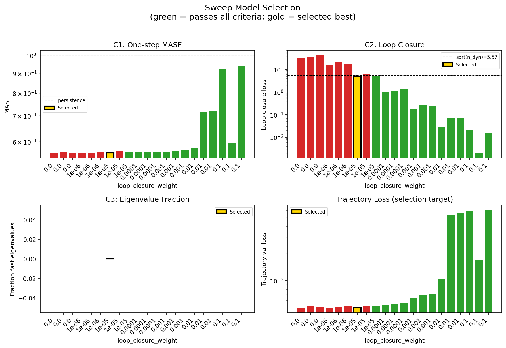

### sweep_pareto

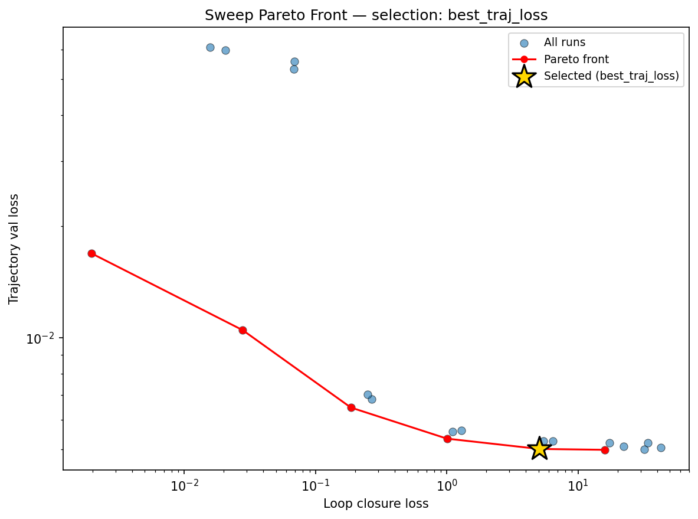

### reconstruction

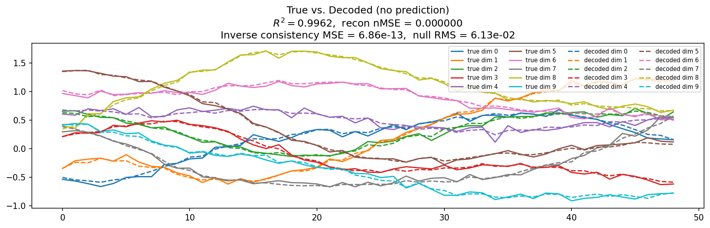

### prediction_windows

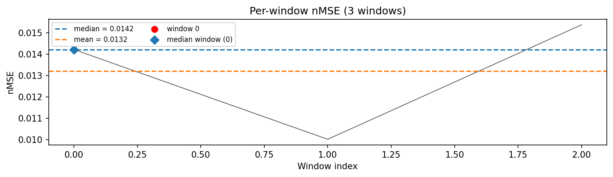

### long_trajectory

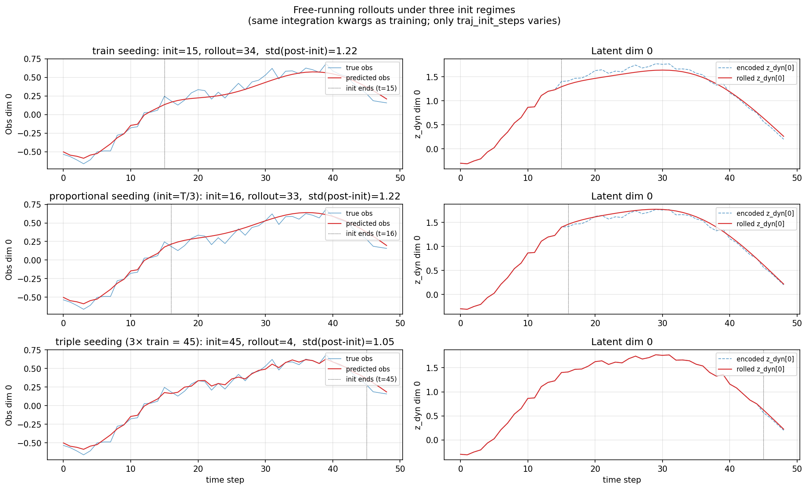

### mase

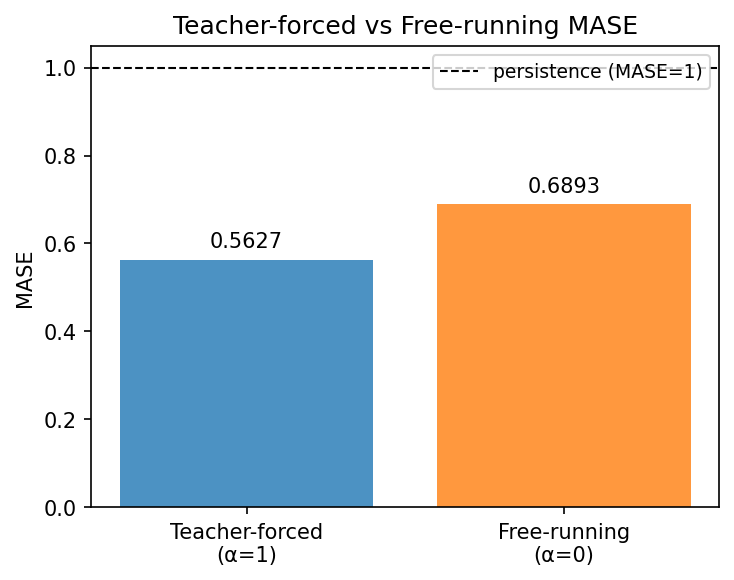

### latent_utilization

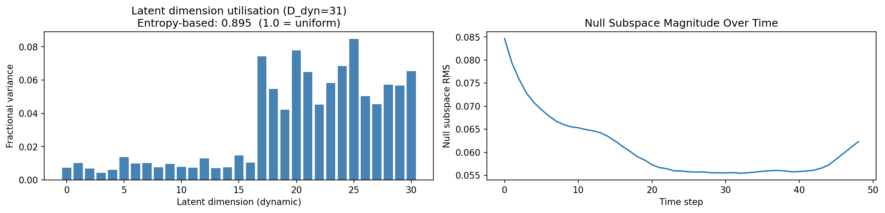

### lyapunov

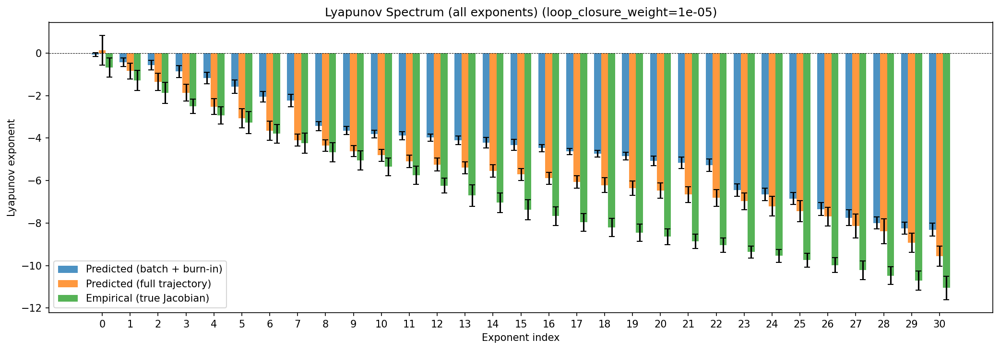

### lyapunov_top10

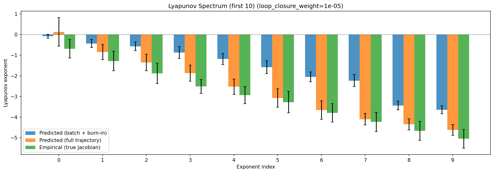

### kaplan_yorke

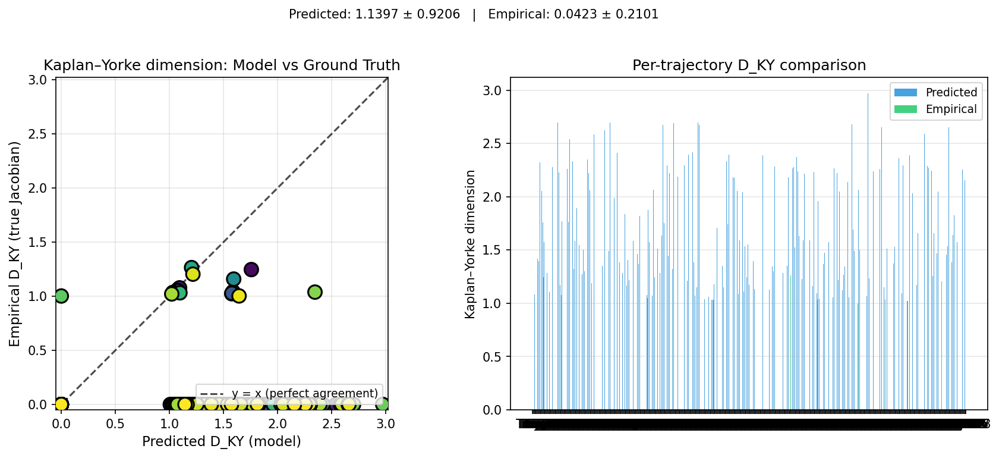

### per_run_lyapunov

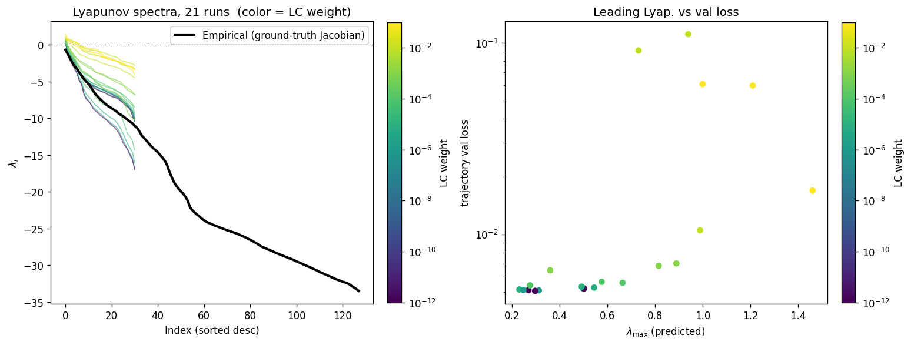

### per_run_lyapunov_vs_true

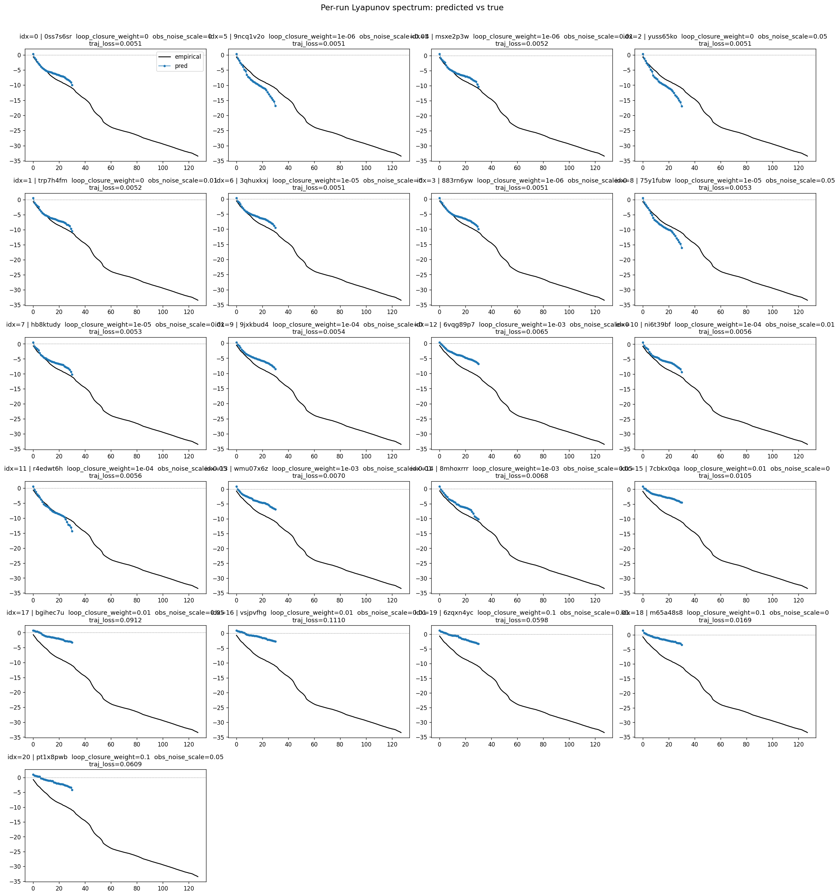

### per_run_lyapunov_relerr

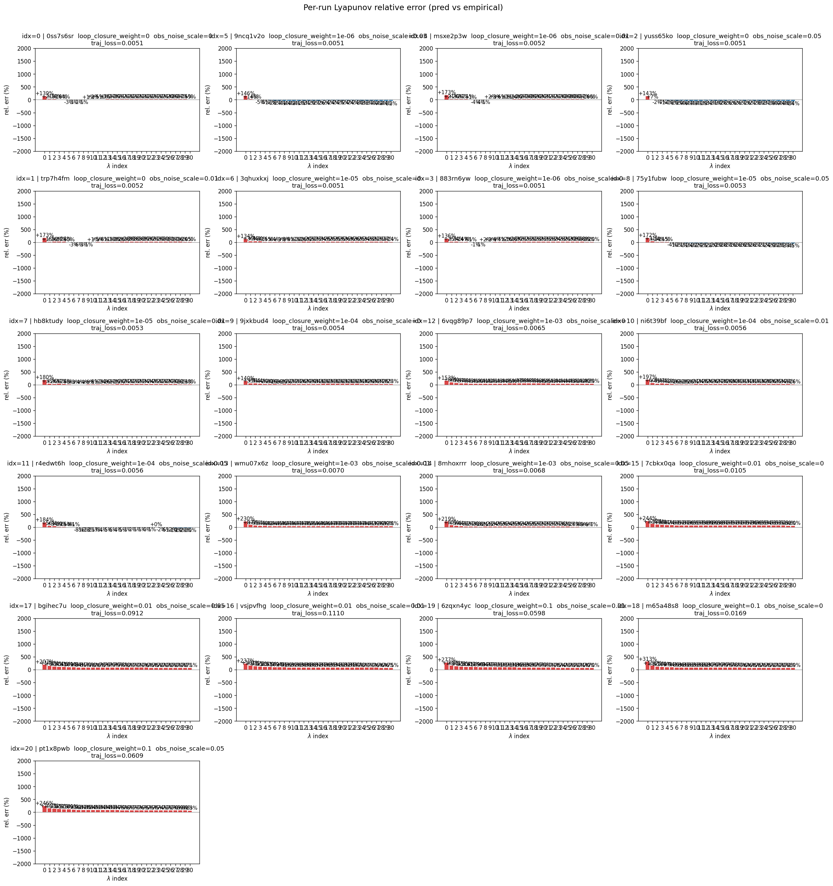

### encoder_decoder_jacobians

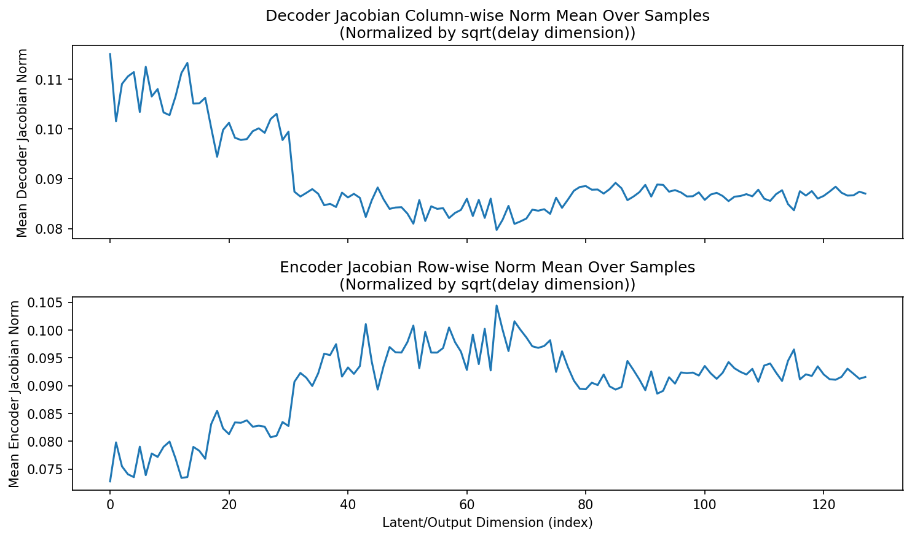

### amplification

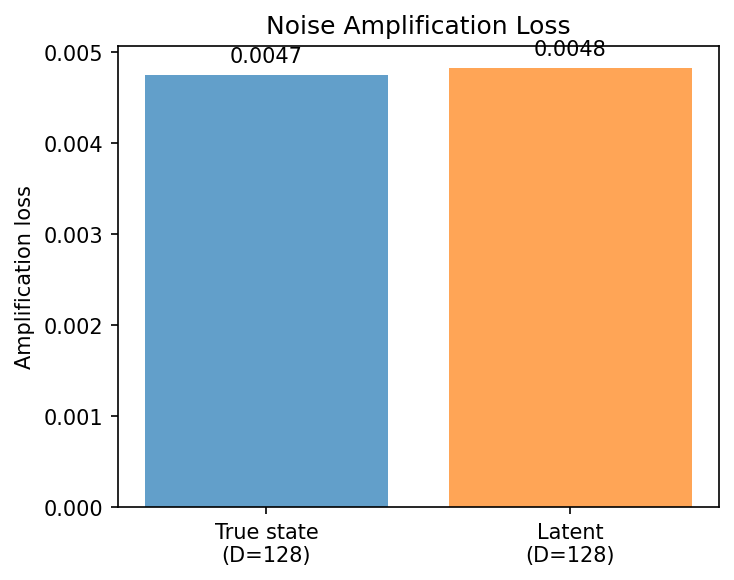

### kaplan_yorke_pca

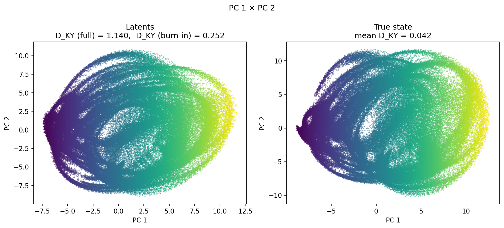

### prediction_detail_latent

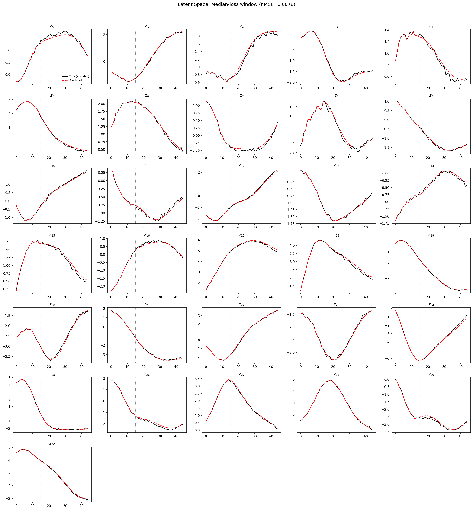

### prediction_detail_obs

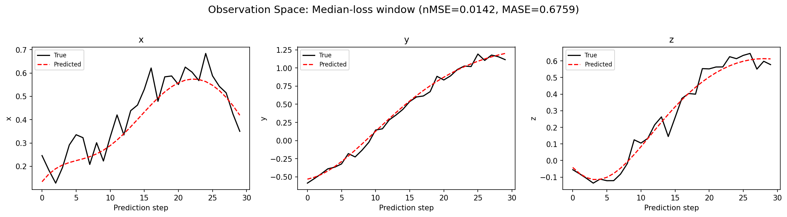

### tangent_spectrum

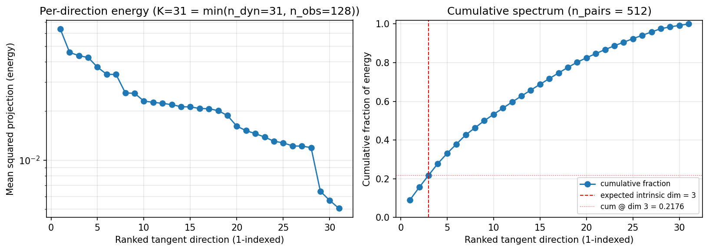

### per_run_tangent_spectrum

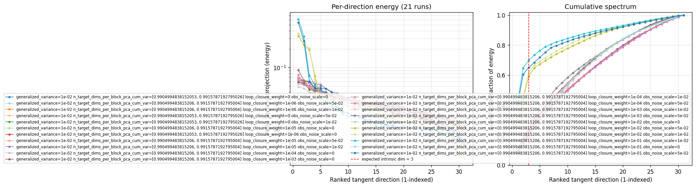

## Discussion

<!--
This section is intentionally left as a placeholder. A human reviewer
or Claude Code agent should fill it in based on the tables and figures
above, explicitly addressing each success criterion and comparing the
outcome to the stated hypothesis. Write the Discussion to
`discussion.md` in this directory and re-run `render_report`.
-->

_(to be written)_

## `run_analytics` stdout

<details><summary>Click to expand — full diagnostic output from <code>run_analytics</code></summary>

```
No run_id provided — selecting best run from group 'wmtask_direct_sum_additive_p30_perareapcaautodim_cayley_nearid_tf__lc_x_obsnoisescale_sweep_20260430T071136Z__stage_a' ...
Found 21 total runs in JacobianODE/WMTask_identity_encoder_verification (group=wmtask_direct_sum_additive_p30_perareapcaautodim_cayley_nearid_tf__lc_x_obsnoisescale_sweep_20260430T071136Z__stage_a)
All runs (state, loop_closure_weight, tangent_entropy_weight, kl_dyn_weight):
  0ss7s6sr: state=finished, lc=0.0, te=0.0, kl_dyn=0.0
  9ncq1v2o: state=finished, lc=1e-06, te=0.0, kl_dyn=0.0
  msxe2p3w: state=finished, lc=1e-06, te=0.0, kl_dyn=0.0
  yuss65ko: state=finished, lc=0.0, te=0.0, kl_dyn=0.0
  trp7h4fm: state=finished, lc=0.0, te=0.0, kl_dyn=0.0
  3qhuxkxj: state=finished, lc=1e-05, te=0.0, kl_dyn=0.0
  883rn6yw: state=finished, lc=1e-06, te=0.0, kl_dyn=0.0
  75y1fubw: state=finished, lc=1e-05, te=0.0, kl_dyn=0.0
  hb8ktudy: state=finished, lc=1e-05, te=0.0, kl_dyn=0.0
  9jxkbud4: state=finished, lc=0.0001, te=0.0, kl_dyn=0.0
  6vqg89p7: state=finished, lc=0.001, te=0.0, kl_dyn=0.0
  ni6t39bf: state=finished, lc=0.0001, te=0.0, kl_dyn=0.0
  r4edwt6h: state=finished, lc=0.0001, te=0.0, kl_dyn=0.0
  wmu07x6z: state=finished, lc=0.001, te=0.0, kl_dyn=0.0
  8mhoxrrr: state=finished, lc=0.001, te=0.0, kl_dyn=0.0
  7cbkx0qa: state=finished, lc=0.01, te=0.0, kl_dyn=0.0
  bgihec7u: state=finished, lc=0.01, te=0.0, kl_dyn=0.0
  vsjpvfhg: state=finished, lc=0.01, te=0.0, kl_dyn=0.0
  6zqxn4yc: state=finished, lc=0.1, te=0.0, kl_dyn=0.0
  m65a48s8: state=finished, lc=0.1, te=0.0, kl_dyn=0.0
  pt1x8pwb: state=finished, lc=0.1, te=0.0, kl_dyn=0.0

slurm_timeout_min not found in any run config — falling back to 180 min
  Including 0ss7s6sr (lc=0.0): use_all_runs=True (state=finished)
  Including 9ncq1v2o (lc=1e-06): use_all_runs=True (state=finished)
  Including msxe2p3w (lc=1e-06): use_all_runs=True (state=finished)
  Including yuss65ko (lc=0.0): use_all_runs=True (state=finished)
  Including trp7h4fm (lc=0.0): use_all_runs=True (state=finished)
  Including 3qhuxkxj (lc=1e-05): use_all_runs=True (state=finished)
  Including 883rn6yw (lc=1e-06): use_all_runs=True (state=finished)
  Including 75y1fubw (lc=1e-05): use_all_runs=True (state=finished)
  Including hb8ktudy (lc=1e-05): use_all_runs=True (state=finished)
  Including 9jxkbud4 (lc=0.0001): use_all_runs=True (state=finished)
  Including 6vqg89p7 (lc=0.001): use_all_runs=True (state=finished)
  Including ni6t39bf (lc=0.0001): use_all_runs=True (state=finished)
  Including r4edwt6h (lc=0.0001): use_all_runs=True (state=finished)
  Including wmu07x6z (lc=0.001): use_all_runs=True (state=finished)
  Including 8mhoxrrr (lc=0.001): use_all_runs=True (state=finished)
  Including 7cbkx0qa (lc=0.01): use_all_runs=True (state=finished)
  Including bgihec7u (lc=0.01): use_all_runs=True (state=finished)
  Including vsjpvfhg (lc=0.01): use_all_runs=True (state=finished)
  Including 6zqxn4yc (lc=0.1): use_all_runs=True (state=finished)
  Including m65a48s8 (lc=0.1): use_all_runs=True (state=finished)
  Including pt1x8pwb (lc=0.1): use_all_runs=True (state=finished)
Found 21 effectively-done sweep runs:
  loop_closure_weight=0.0, tangent_entropy_weight=0.0, kl_dyn_weight=0.0 -> run_id=0ss7s6sr
  loop_closure_weight=0.0, tangent_entropy_weight=0.0, kl_dyn_weight=0.0 -> run_id=trp7h4fm
  loop_closure_weight=0.0, tangent_entropy_weight=0.0, kl_dyn_weight=0.0 -> run_id=yuss65ko
  loop_closure_weight=1e-06, tangent_entropy_weight=0.0, kl_dyn_weight=0.0 -> run_id=883rn6yw
  loop_closure_weight=1e-06, tangent_entropy_weight=0.0, kl_dyn_weight=0.0 -> run_id=9ncq1v2o
  loop_closure_weight=1e-06, tangent_entropy_weight=0.0, kl_dyn_weight=0.0 -> run_id=msxe2p3w
  loop_closure_weight=1e-05, tangent_entropy_weight=0.0, kl_dyn_weight=0.0 -> run_id=3qhuxkxj
  loop_closure_weight=1e-05, tangent_entropy_weight=0.0, kl_dyn_weight=0.0 -> run_id=75y1fubw
  loop_closure_weight=1e-05, tangent_entropy_weight=0.0, kl_dyn_weight=0.0 -> run_id=hb8ktudy
  loop_closure_weight=0.0001, tangent_entropy_weight=0.0, kl_dyn_weight=0.0 -> run_id=9jxkbud4
  loop_closure_weight=0.0001, tangent_entropy_weight=0.0, kl_dyn_weight=0.0 -> run_id=ni6t39bf
  loop_closure_weight=0.0001, tangent_entropy_weight=0.0, kl_dyn_weight=0.0 -> run_id=r4edwt6h
  loop_closure_weight=0.001, tangent_entropy_weight=0.0, kl_dyn_weight=0.0 -> run_id=6vqg89p7
  loop_closure_weight=0.001, tangent_entropy_weight=0.0, kl_dyn_weight=0.0 -> run_id=8mhoxrrr
  loop_closure_weight=0.001, tangent_entropy_weight=0.0, kl_dyn_weight=0.0 -> run_id=wmu07x6z
  loop_closure_weight=0.01, tangent_entropy_weight=0.0, kl_dyn_weight=0.0 -> run_id=7cbkx0qa
  loop_closure_weight=0.01, tangent_entropy_weight=0.0, kl_dyn_weight=0.0 -> run_id=bgihec7u
  loop_closure_weight=0.01, tangent_entropy_weight=0.0, kl_dyn_weight=0.0 -> run_id=vsjpvfhg
  loop_closure_weight=0.1, tangent_entropy_weight=0.0, kl_dyn_weight=0.0 -> run_id=6zqxn4yc
  loop_closure_weight=0.1, tangent_entropy_weight=0.0, kl_dyn_weight=0.0 -> run_id=m65a48s8
  loop_closure_weight=0.1, tangent_entropy_weight=0.0, kl_dyn_weight=0.0 -> run_id=pt1x8pwb
loaded wmtask RNN model checkpoint 41
Loading cached wmtask hiddens from /orcd/data/ekmiller/001/eisenaj/ControlJacobians/WMTaskModels/WMSelectionTask__cue_time_0.1__response_time_0.25__enforce_fixation_False/BiologicalRNN__cue_time_0.1__learning_rate_0.0005__max_epochs_42__N1_64__N2_64__tau_0.05__dt_0.02__eig_lower_bound_0.1__init_mode_random/_jacobianode_cache/hiddens__all__epoch41__trials4096__seed42.pt
n_dims=128, n_latent=128, n_dyn=31, dt=0.0200
  run=0ss7s6sr: DiagnosticMetrics(one_step_mase=0.5616582632064819, loop_closure_loss=31.860557556152344, fast_eigenvalue_fraction=0.0, trajectory_val_loss=0.005000191740691662) (from W&B history)
  run=trp7h4fm: DiagnosticMetrics(one_step_mase=0.5628520250320435, loop_closure_loss=33.94696807861328, fast_eigenvalue_fraction=0.0, trajectory_val_loss=0.005206593312323093) (from W&B history)
  run=yuss65ko: DiagnosticMetrics(one_step_mase=0.5606964826583862, loop_closure_loss=42.74726867675781, fast_eigenvalue_fraction=0.0, trajectory_val_loss=0.005063551478087902) (from W&B history)
  run=883rn6yw: DiagnosticMetrics(one_step_mase=0.561652660369873, loop_closure_loss=15.988275527954102, fast_eigenvalue_fraction=0.0, trajectory_val_loss=0.004984624218195677) (from W&B history)
  run=9ncq1v2o: DiagnosticMetrics(one_step_mase=0.5607131123542786, loop_closure_loss=22.252538681030273, fast_eigenvalue_fraction=0.0, trajectory_val_loss=0.005092893727123737) (from W&B history)
  run=msxe2p3w: DiagnosticMetrics(one_step_mase=0.5628490447998047, loop_closure_loss=17.337970733642578, fast_eigenvalue_fraction=0.0, trajectory_val_loss=0.005214767064899206) (from W&B history)
  run=3qhuxkxj: DiagnosticMetrics(one_step_mase=0.5619792342185974, loop_closure_loss=5.05697774887085, fast_eigenvalue_fraction=0.0, trajectory_val_loss=0.005011554807424545) (from W&B history)
  run=75y1fubw: DiagnosticMetrics(one_step_mase=0.5677720308303833, loop_closure_loss=6.4639811515808105, fast_eigenvalue_fraction=0.0, trajectory_val_loss=0.005272200796753168) (from W&B history)
  run=hb8ktudy: DiagnosticMetrics(one_step_mase=0.5628312826156616, loop_closure_loss=5.4756760597229, fast_eigenvalue_fraction=0.0, trajectory_val_loss=0.005266109481453896) (from W&B history)
  run=9jxkbud4: DiagnosticMetrics(one_step_mase=0.5632203817367554, loop_closure_loss=1.0044777393341064, fast_eigenvalue_fraction=0.0, trajectory_val_loss=0.0053427089005708694) (from W&B history)
  run=ni6t39bf: DiagnosticMetrics(one_step_mase=0.5636308193206787, loop_closure_loss=1.1105254888534546, fast_eigenvalue_fraction=0.0, trajectory_val_loss=0.005579274147748947) (from W&B history)
  run=r4edwt6h: DiagnosticMetrics(one_step_mase=0.5638260245323181, loop_closure_loss=1.2996760606765747, fast_eigenvalue_fraction=0.0, trajectory_val_loss=0.005613152869045734) (from W&B history)
  run=6vqg89p7: DiagnosticMetrics(one_step_mase=0.5649417042732239, loop_closure_loss=0.18578515946865082, fast_eigenvalue_fraction=0.0, trajectory_val_loss=0.00648396136239171) (from W&B history)
  run=8mhoxrrr: DiagnosticMetrics(one_step_mase=0.5692247152328491, loop_closure_loss=0.2678469717502594, fast_eigenvalue_fraction=0.0, trajectory_val_loss=0.006833925843238831) (from W&B history)
  run=wmu07x6z: DiagnosticMetrics(one_step_mase=0.5705971717834473, loop_closure_loss=0.2504790425300598, fast_eigenvalue_fraction=0.0, trajectory_val_loss=0.007038051262497902) (from W&B history)
  run=7cbkx0qa: DiagnosticMetrics(one_step_mase=0.5768745541572571, loop_closure_loss=0.027846267446875572, fast_eigenvalue_fraction=0.0, trajectory_val_loss=0.010492132045328617) (from W&B history)
  run=bgihec7u: DiagnosticMetrics(one_step_mase=0.7163068652153015, loop_closure_loss=0.06865058839321136, fast_eigenvalue_fraction=0.0, trajectory_val_loss=0.05317480117082596) (from W&B history)
  run=vsjpvfhg: DiagnosticMetrics(one_step_mase=0.7207567095756531, loop_closure_loss=0.06932429224252701, fast_eigenvalue_fraction=0.0, trajectory_val_loss=0.055793166160583496) (from W&B history)
  run=6zqxn4yc: DiagnosticMetrics(one_step_mase=0.9209561944007874, loop_closure_loss=0.02063584141433239, fast_eigenvalue_fraction=0.0, trajectory_val_loss=0.05980965122580528) (from W&B history)
  run=m65a48s8: DiagnosticMetrics(one_step_mase=0.5953124165534973, loop_closure_loss=0.001962385606020689, fast_eigenvalue_fraction=0.0, trajectory_val_loss=0.016911806538701057) (from W&B history)
  run=pt1x8pwb: DiagnosticMetrics(one_step_mase=0.9380993247032166, loop_closure_loss=0.01570245809853077, fast_eigenvalue_fraction=0.0, trajectory_val_loss=0.060879405587911606) (from W&B history)

Ranking method:           best_traj_loss
Best run ID:              3qhuxkxj
Best loop_closure_weight: 1e-05
Best tangent_entropy_weight: 0.0
Best kl_dyn_weight:       0.0
Best traj loss:           0.005012
Criteria applied: ['C1', 'C2', 'C3']
Surviving: 14 / 21
Auto-selected run_id: 3qhuxkxj

======================================================================
PARETO FRONTIER RUNS (6 runs)
======================================================================
  Run ID               LC Loss   Traj Val Loss
  ------------  --------------  --------------
  m65a48s8            0.001962        0.016912
  7cbkx0qa            0.027846        0.010492
  6vqg89p7            0.185785        0.006484
  9jxkbud4            1.004478        0.005343
  3qhuxkxj            5.056978        0.005012 <-- selected
  883rn6yw           15.988276        0.004985

======================================================================
RANKING METHOD COMPARISON (over 14 survivors)
======================================================================
  Method                  Run ID               LC Loss   Traj Val Loss
  ----------------------  ------------  --------------  --------------
  best_traj_loss          3qhuxkxj            5.056978        0.005012 <-- active
  pareto_knee             9jxkbud4            1.004478        0.005343
  geo_rank                m65a48s8            0.001962        0.016912
  minimax_rank            6vqg89p7            0.185785        0.006484
  geo_log_score           3qhuxkxj            5.056978        0.005012
  minimax_log_score       7cbkx0qa            0.027846        0.010492
======================================================================

Loading run 3qhuxkxj from JacobianODE/WMTask_identity_encoder_verification ...
loaded wmtask RNN model checkpoint 41
Loading cached wmtask hiddens from /orcd/data/ekmiller/001/eisenaj/ControlJacobians/WMTaskModels/WMSelectionTask__cue_time_0.1__response_time_0.25__enforce_fixation_False/BiologicalRNN__cue_time_0.1__learning_rate_0.0005__max_epochs_42__N1_64__N2_64__tau_0.05__dt_0.02__eig_lower_bound_0.1__init_mode_random/_jacobianode_cache/hiddens__all__epoch41__trials4096__seed42.pt
Loading checkpoint epoch=18-step=2375.ckpt...
Train dataset shape: torch.Size([11468, 45, 128])
Validation dataset shape: torch.Size([3280, 45, 128])
Test dataset shape: torch.Size([1636, 45, 128])
Train trajectories dataset shape: torch.Size([2867, 49, 128])
Validation trajectories dataset shape: torch.Size([820, 49, 128])
Test trajectories dataset shape: torch.Size([409, 49, 128])
Loading checkpoint epoch=18-step=2375.ckpt...
Computing reconstruction ...
Computing MASE ...
Teacher-forced MASE: 0.5627
Free-running MASE:   0.6893
Computing latent utilization ...
Entropy-based utilization: 0.895
Null subspace mean RMS: 6.128221e-02
Computing Lyapunov exponents ...
  Computing full-trajectory Lyapunov (409 test trajs, T=49) ...
Predicted Lyapunov exponents (batch+burn-in, 128 windowed trajs):
  λ_1 = -0.0792 ± 0.0894
  λ_2 = -0.4319 ± 0.1989
  λ_3 = -0.5669 ± 0.2161
  λ_4 = -0.8688 ± 0.2858
  λ_5 = -1.1827 ± 0.2675
  λ_6 = -1.5812 ± 0.3111
  λ_7 = -2.0489 ± 0.2424
  λ_8 = -2.2317 ± 0.2896
  λ_9 = -3.4363 ± 0.2095
  λ_10 = -3.6492 ± 0.1960
  λ_11 = -3.8127 ± 0.1847
  λ_12 = -3.8897 ± 0.1849
  λ_13 = -3.9768 ± 0.1734
  λ_14 = -4.1050 ± 0.1991
  λ_15 = -4.2156 ± 0.2431
  λ_16 = -4.3215 ± 0.2518
  λ_17 = -4.4714 ± 0.1751
  λ_18 = -4.6282 ± 0.1426
  λ_19 = -4.7341 ± 0.1547
  λ_20 = -4.8553 ± 0.1818
  λ_21 = -5.0676 ± 0.2298
  λ_22 = -5.1661 ± 0.2755
  λ_23 = -5.2770 ± 0.2998
  λ_24 = -6.4504 ± 0.2924
  λ_25 = -6.6471 ± 0.2917
  λ_26 = -6.8454 ± 0.2828
  λ_27 = -7.3436 ± 0.3044
  λ_28 = -7.7465 ± 0.3670
  λ_29 = -8.0006 ± 0.2799
  λ_30 = -8.2430 ± 0.2783
  λ_31 = -8.3093 ± 0.2961
Predicted Lyapunov exponents (full-length, 409 test trajs):
  λ_1 = +0.1344 ± 0.6935
  λ_2 = -0.8459 ± 0.3717
  λ_3 = -1.3540 ± 0.4036
  λ_4 = -1.8632 ± 0.3890
  λ_5 = -2.5259 ± 0.3703
  λ_6 = -3.0724 ± 0.4460
  λ_7 = -3.6567 ± 0.4486
  λ_8 = -4.1024 ± 0.2797
  λ_9 = -4.3501 ± 0.2692
  λ_10 = -4.6211 ± 0.2602
  λ_11 = -4.8074 ± 0.2816
  λ_12 = -5.1018 ± 0.2971
  λ_13 = -5.2490 ± 0.2995
  λ_14 = -5.3997 ± 0.2845
  λ_15 = -5.5443 ± 0.2857
  λ_16 = -5.7148 ± 0.2786
  λ_17 = -5.8895 ± 0.2845
  λ_18 = -6.0668 ± 0.2981
  λ_19 = -6.2162 ± 0.3515
  λ_20 = -6.3512 ± 0.3420
  λ_21 = -6.4694 ± 0.3618
  λ_22 = -6.6563 ± 0.3743
  λ_23 = -6.8117 ± 0.3962
  λ_24 = -6.9698 ± 0.3927
  λ_25 = -7.2062 ± 0.4663
  λ_26 = -7.4369 ± 0.4903
  λ_27 = -7.6937 ± 0.4413
  λ_28 = -8.1363 ± 0.5622
  λ_29 = -8.3863 ± 0.5822
  λ_30 = -8.9231 ± 0.4452
  λ_31 = -9.5606 ± 0.4667
Empirical Lyapunov exponents (mean ± std):
  λ_1 = -0.6836 ± 0.4470
  λ_2 = -1.2860 ± 0.4717
  λ_3 = -1.8796 ± 0.4983
  λ_4 = -2.5140 ± 0.3383
  λ_5 = -2.9329 ± 0.4143
  λ_6 = -3.2778 ± 0.5212
  λ_7 = -3.7948 ± 0.4446
  λ_8 = -4.2351 ± 0.4668
  λ_9 = -4.6672 ± 0.4583
  λ_10 = -5.0458 ± 0.4531
  λ_11 = -5.3534 ± 0.4185
  λ_12 = -5.7506 ± 0.4346
  λ_13 = -6.2355 ± 0.3491
  λ_14 = -6.7043 ± 0.5036
  λ_15 = -7.0414 ± 0.4554
  λ_16 = -7.3719 ± 0.4648
  λ_17 = -7.6725 ± 0.4415
  λ_18 = -7.9667 ± 0.4130
  λ_19 = -8.2155 ± 0.4290
  λ_20 = -8.4474 ± 0.4083
  λ_21 = -8.6400 ± 0.3667
  λ_22 = -8.8546 ± 0.3395
  λ_23 = -9.0471 ± 0.3366
  λ_24 = -9.3642 ± 0.2863
  λ_25 = -9.5403 ± 0.3009
  λ_26 = -9.7473 ± 0.3189
  λ_27 = -9.9780 ± 0.3514
  λ_28 = -10.2177 ± 0.4331
  λ_29 = -10.4760 ± 0.4197
  λ_30 = -10.6968 ± 0.4504
  λ_31 = -11.0538 ± 0.5425
  λ_32 = -11.3182 ± 0.5459
  λ_33 = -11.7806 ± 0.6071
  λ_34 = -12.3300 ± 0.5244
  λ_35 = -12.6464 ± 0.5369
  λ_36 = -13.0198 ± 0.6314
  λ_37 = -13.3795 ± 0.7073
  λ_38 = -13.7502 ± 0.7660
  λ_39 = -14.0682 ± 0.7579
  λ_40 = -14.3279 ± 0.7619
  λ_41 = -14.6206 ± 0.8778
  λ_42 = -15.0213 ± 0.8116
  λ_43 = -15.3487 ± 0.8488
  λ_44 = -15.7679 ± 0.8512
  λ_45 = -16.3535 ± 0.8105
  λ_46 = -17.2371 ± 0.8420
  λ_47 = -18.0172 ± 0.6551
  λ_48 = -18.7348 ± 0.4352
  λ_49 = -19.1920 ± 0.4388
  λ_50 = -19.6032 ± 0.3862
  λ_51 = -19.9849 ± 0.4171
  λ_52 = -20.2854 ± 0.3677
  λ_53 = -20.7129 ± 0.4088
  λ_54 = -21.2293 ± 0.4493
  λ_55 = -22.1518 ± 0.3711
  λ_56 = -22.5100 ± 0.3571
  λ_57 = -22.8264 ± 0.3133
  λ_58 = -23.1069 ± 0.3495
  λ_59 = -23.3589 ± 0.3337
  λ_60 = -23.6276 ± 0.2926
  λ_61 = -23.8603 ± 0.3155
  λ_62 = -24.0618 ± 0.3005
  λ_63 = -24.2152 ± 0.3129
  λ_64 = -24.3396 ± 0.3136
  λ_65 = -24.4895 ± 0.3210
  λ_66 = -24.6115 ± 0.3197
  λ_67 = -24.7359 ± 0.3269
  λ_68 = -24.8561 ± 0.3392
  λ_69 = -24.9753 ± 0.3426
  λ_70 = -25.1117 ± 0.3497
  λ_71 = -25.2226 ± 0.3734
  λ_72 = -25.3357 ± 0.4009
  λ_73 = -25.4353 ± 0.4172
  λ_74 = -25.5439 ± 0.4046
  λ_75 = -25.6332 ± 0.4116
  λ_76 = -25.7832 ± 0.4585
  λ_77 = -25.9142 ± 0.4799
  λ_78 = -26.0449 ± 0.4990
  λ_79 = -26.1810 ± 0.5037
  λ_80 = -26.3617 ± 0.4899
  λ_81 = -26.5171 ± 0.4864
  λ_82 = -26.6628 ± 0.4753
  λ_83 = -26.8617 ± 0.4795
  λ_84 = -27.0282 ± 0.5036
  λ_85 = -27.2607 ± 0.4846
  λ_86 = -27.4529 ± 0.4854
  λ_87 = -27.5733 ± 0.4725
  λ_88 = -27.7187 ± 0.4967
  λ_89 = -27.8617 ± 0.5003
  λ_90 = -27.9895 ± 0.4903
  λ_91 = -28.1274 ± 0.4923
  λ_92 = -28.2824 ± 0.4913
  λ_93 = -28.4072 ± 0.4914
  λ_94 = -28.5255 ± 0.4695
  λ_95 = -28.6477 ± 0.4521
  λ_96 = -28.7842 ± 0.4453
  λ_97 = -28.9001 ± 0.4403
  λ_98 = -29.0308 ± 0.4330
  λ_99 = -29.1511 ± 0.4295
  λ_100 = -29.2954 ± 0.4247
  λ_101 = -29.4503 ± 0.4217
  λ_102 = -29.5753 ± 0.4321
  λ_103 = -29.6956 ± 0.4539
  λ_104 = -29.8547 ± 0.4485
  λ_105 = -29.9992 ± 0.4490
  λ_106 = -30.1172 ± 0.4378
  λ_107 = -30.2615 ± 0.4426
  λ_108 = -30.4062 ± 0.3980
  λ_109 = -30.5554 ± 0.4003
  λ_110 = -30.7032 ± 0.3985
  λ_111 = -30.8743 ± 0.4228
  λ_112 = -31.0109 ± 0.4336
  λ_113 = -31.1492 ± 0.4292
  λ_114 = -31.3023 ± 0.3981
  λ_115 = -31.4396 ± 0.4097
  λ_116 = -31.5685 ± 0.3902
  λ_117 = -31.7302 ± 0.3526
  λ_118 = -31.8705 ± 0.3050
  λ_119 = -31.9948 ± 0.3040
  λ_120 = -32.0998 ± 0.2813
  λ_121 = -32.2401 ± 0.2718
  λ_122 = -32.3221 ± 0.2617
  λ_123 = -32.4282 ± 0.2531
  λ_124 = -32.5858 ± 0.2272
  λ_125 = -32.8296 ± 0.2629
  λ_126 = -33.0206 ± 0.2244
  λ_127 = -33.2132 ± 0.2160
  λ_128 = -33.4614 ± 0.3541
Mean KY dim (predicted): 1.140 ± 0.921
Mean KY dim (empirical): 0.042 ± 0.210
Mean KY dim (burn-in):   0.252 ± 0.529
Computing prediction windows ...
Windows: 3 — nMSE min=0.0100, median=0.0142, mean=0.0132, max=0.0154
Computing long-trajectory free-running rollouts ...
Computing encoder/decoder Jacobians ...
encoder_jacobian: (128, 128, 128)
decoder_jacobian: (128, 128, 128)
Computing amplification loss ...
Amplification loss — True state: 0.004748
Amplification loss — Latent:     0.004828
Computing tangent space spectrum ...
```

</details>
