# Sweep Analysis: `wmtask_direct_sum_additive_p30_perareapcaautodim_nearid_tf__lc_x_obsnoisescale_sweep_20260430T032535Z__stage_a`

**Project**: [WMTask_identity_encoder_verification](https://wandb.ai/JacobianODE/WMTask_identity_encoder_verification/groups/wmtask_direct_sum_additive_p30_perareapcaautodim_nearid_tf__lc_x_obsnoisescale_sweep_20260430T032535Z__stage_a)  
**Launched**: 2026-04-30T03:30:21Z  
**Completed**: 2026-04-30T06:00:22Z  
**Outcome**: `complete_clean`  
**Git**: `latent-JacobianODE` @ `22606f9`  
**Expected runs**: 21

## Experiment Context

### `wmtask_direct_sum_additive_p30_perareapcaautodim_nearid_tf__lc_x_obsnoisescale_sweep`

**Description**

WMTask fully-observed (N1=N2=64), latent JacobianODE with
DirectSumCouplingEncoder, PCA-based per-area autodim
(n_target_var_threshold=0.99). Each area independently picks its
own n_target_dims as the smallest k such that the first k PCs
capture >= 99% of that area's variance; remaining dims become a
per-area null subspace. Additive coupling, 8 layers, hidden_dim=128.
near_identity_std=1e-3, final_perm_identity=true. 21-cell sweep over
7 LC x 3 obs_noise_scale. Split-mode loss. TF-coupled LR schedule
(k_scale=1, init 1e-4 -> min 1e-6 following TF alpha annealing).
Two-stage protocol with dual-checkpoint (primary ES patience=5,
shadow patience=2).

**Hypothesis**

Companion to the full-128 DirectSum sweep with the same TF-coupled
LR + near-id init recipe. The per-area null subspace gives loop
closure something structural to clamp (vs full-128 where z_dyn is
the entire latent and null is empty); PCA-99% picks a smaller
per-area n_target_dims (likely on the order of 10-30 per area for
the WMTask RNN's effective rank). If the smaller dim helps dynamics
learning AND the null subspace + LC pressure is doing useful
regularization, this should match or beat full-128 on val
traj_loss while preserving cross-area Gramian asymmetry. Replaces
the FNN-autodim variant which produced unusable per-area dim
estimates on this data.

**Success criteria**

- All 21 cells train without divergence
- Per-area n_target_dims log lines match the inferred RNN structure (real dim reduction)
- es2-best.ckpt and es5-best.ckpt both saved per cell
- Best val traj_loss within 2x of full-128 DirectSum companion's best
- Cross-area Gramian asymmetry consistent with ground truth at best cell
- Loop closure loss at best cell < sqrt(n_target_dims)

## Results

**Swept axes** (4): `data.postprocessing.generalized_variance`, `model.n_target_dims_per_block_pca_cum_var`, `training.lightning.loop_closure_weight`, `training.lightning.obs_noise_scale`

**Chosen run** (by `best_traj_loss`): `f0481isl` — traj_loss=0.03533, MASE=0.9921, R²=0.9600, LC loss=25.608, epoch=19.0

Swept-axis values at chosen run: `data.postprocessing.generalized_variance`=0.00954705 · `model.n_target_dims_per_block_pca_cum_var`=[0.9904994838152053, 0.9915787192795026] · `training.lightning.loop_closure_weight`=0 · `training.lightning.obs_noise_scale`=0

**Runs analyzed**: 21 (expected 21)

### Per-run results

| run_idx | run_id | `data.postprocessing.generalized_variance` | `model.n_target_dims_per_block_pca_cum_var` | `training.lightning.loop_closure_weight` | `training.lightning.obs_noise_scale` | best_traj_loss | best_MASE | R² | LC loss | epoch |
|---|---|---|---|---|---|---|---|---|---|---|
| 0 | `f0481isl` | 0.00954705 | [0.9904994838152053, 0.9915787192795026] | 0 | 0 | 0.03533 | 0.9921 | 0.9600 | 25.608 | 19.0 |
| 1 | `4sgqa34p` | 0.00954705 | [0.9904994838152053, 0.9915787192795026] | 0 | 0.01 | nan | nan | nan | 21.283 | — |
| 2 | `fijh8j78` | 0.00954705 | [0.9904994838152053, 0.9915787192795026] | 0 | 0.05 | nan | nan | nan | 21.089 | — |
| 3 | `ed6zb0i1` | 0.00954705 | [0.990499483815206, 0.9915787192795004] | 1.0e-06 | 0 | 0.03539 | 0.9947 | 0.9599 | 15.864 | 19.0 |
| 4 | `y2tbf7wx` | 0.00954705 | [0.990499483815206, 0.9915787192795004] | 1.0e-06 | 0.01 | nan | nan | nan | 19.543 | — |
| 5 | `55f337mh` | 0.00954705 | [0.990499483815206, 0.9915787192795004] | 1.0e-06 | 0.05 | nan | nan | nan | 19.391 | — |
| 6 | `z7hdp6u6` | 0.00954705 | [0.990499483815206, 0.9915787192795004] | 1.0e-05 | 0 | 0.03560 | 1.0043 | 0.9597 | 5.406 | 19.0 |
| 7 | `qkqw6bx3` | 0.00954705 | [0.990499483815206, 0.9915787192795004] | 1.0e-05 | 0.01 | nan | nan | nan | 11.573 | — |
| 8 | `cpbxpo1k` | 0.00954705 | [0.990499483815206, 0.9915787192795004] | 1.0e-05 | 0.05 | nan | nan | nan | 11.527 | — |
| 9 | `6nqq7lry` | 0.00954705 | [0.990499483815206, 0.9915787192795004] | 1.0e-04 | 0 | 0.03619 | 1.0313 | 0.9590 | 1.079 | 19.0 |
| 11 | `pt80wle9` | 0.00954705 | [0.990499483815206, 0.9915787192795004] | 1.0e-04 | 0.05 | 0.03637 | 1.0404 | 0.9588 | 1.820 | 19.0 |
| 10 | `9jolj6ie` | 0.00954705 | [0.990499483815206, 0.9915787192795004] | 1.0e-04 | 0.01 | 0.03680 | 1.0589 | 0.9583 | 1.538 | 18.0 |
| 12 | `te3wdz1d` | 0.00954705 | [0.9904994838152053, 0.9915787192795026] | 0.001 | 0 | 0.03778 | 1.0975 | 0.9572 | 0.167 | 19.0 |
| 14 | `dehl5q18` | 0.00954705 | [0.990499483815206, 0.9915787192795004] | 0.001 | 0.05 | 0.03804 | 1.1128 | 0.9569 | 0.312 | 19.0 |
| 13 | `dzyapila` | 0.00954705 | [0.9904994838152048, 0.9915787192795028] | 0.001 | 0.01 | 0.03861 | 1.1364 | 0.9562 | 0.271 | 19.0 |
| 15 | `asfcpy54` | 0.00954705 | [0.990499483815206, 0.9915787192795004] | 0.01 | 0 | 0.04245 | 1.2641 | 0.9518 | 0.018 | 19.0 |
| 18 | `3mhza3ep` | 0.00954705 | [0.9904994838152053, 0.9915787192795026] | 0.1 | 0 | 0.05283 | 1.5456 | 0.9399 | 0.001 | 19.0 |
| 20 | `wih5icwo` | 0.00954705 | [0.990499483815206, 0.9915787192795004] | 0.1 | 0.05 | 0.09340 | 2.3542 | 0.8935 | 0.027 | 19.0 |
| 19 | `1ld2x46k` | 0.00954705 | [0.990499483815206, 0.9915787192795004] | 0.1 | 0.01 | 0.12802 | 2.7148 | 0.8538 | 0.025 | 18.0 |
| 17 | `3e0xcylw` | 0.00954705 | [0.9904994838152053, 0.9915787192795026] | 0.01 | 0.05 | 0.21394 | 3.6208 | 0.7540 | 0.119 | 2.0 |
| 16 | `y3rmshqj` | 0.00954705 | [0.9904994838152053, 0.9915787192795026] | 0.01 | 0.01 | 0.23428 | 3.7514 | 0.7305 | 0.129 | 2.0 |

### Best run per `obs_noise_scale`

| obs_noise_scale | Best LC weight | Best traj loss | MASE at best | R² | LC loss | epoch |
|---|---|---|---|---|---|---|
| 0.0 | 0.0e+00 | 0.03533 | 0.9921 | 0.9600 | 25.608 | 19.0 |
| 0.01 | 0.0e+00 | nan | nan | nan | 21.283 | 0.0 |
| 0.05 | 0.0e+00 | nan | nan | nan | 21.089 | 0.0 |

## Success-criteria verdicts (automated)

| Criterion | Verdict | Note |
|---|---|---|
| All 21 cells train without divergence | **Unknown** |  |
| Per-area n_target_dims log lines match the inferred RNN structure (real dim reduction) | **Unknown** |  |
| es2-best.ckpt and es5-best.ckpt both saved per cell | **Unknown** |  |
| Best val traj_loss within 2x of full-128 DirectSum companion's best | **Unknown** |  |
| Cross-area Gramian asymmetry consistent with ground truth at best cell | **Unknown** |  |
| Loop closure loss at best cell < sqrt(n_target_dims) | **Unknown** |  |

_Automated verdicts use simple numeric-threshold parsing and may mis-classify qualitative criteria. The Discussion section below takes precedence._

## Figures

### sweep_overview

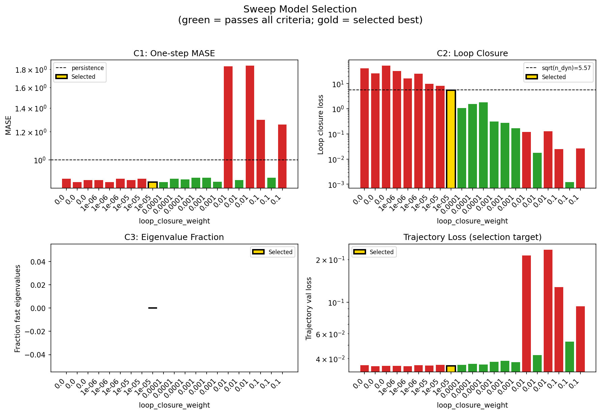

### sweep_pareto

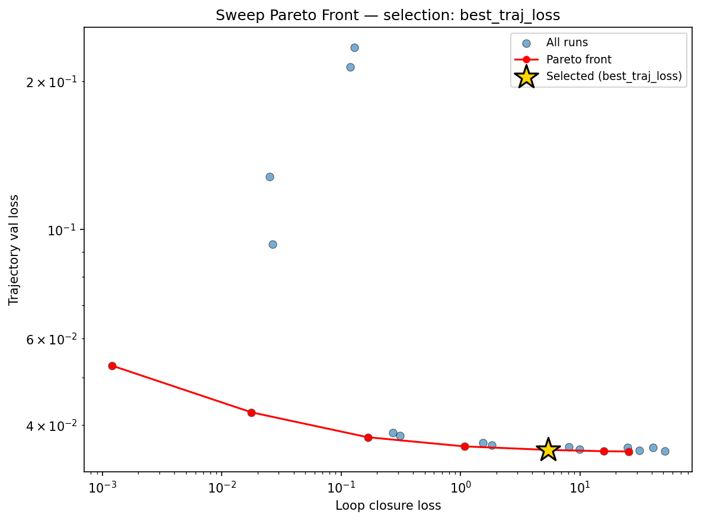

### reconstruction

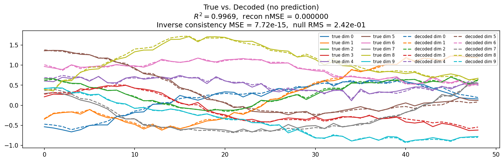

### prediction_windows

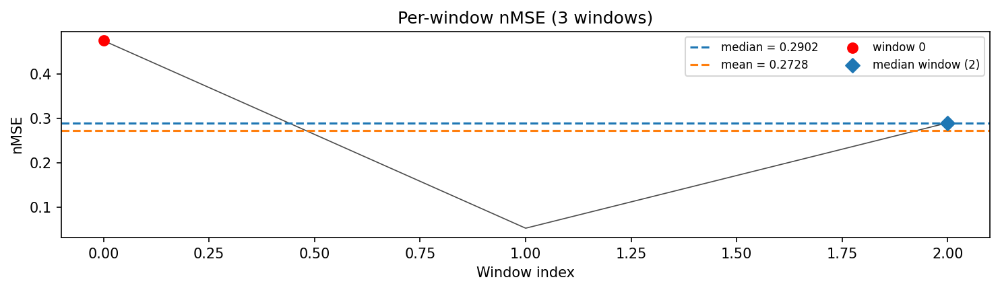

### long_trajectory

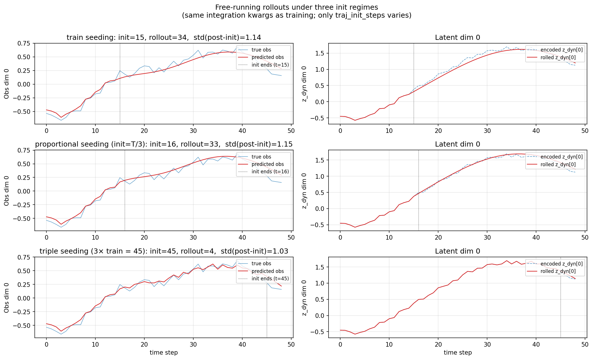

### mase

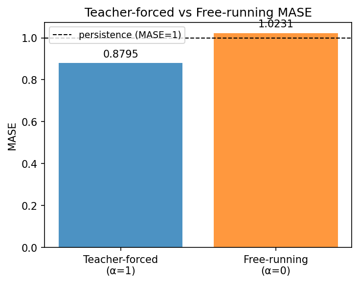

### latent_utilization

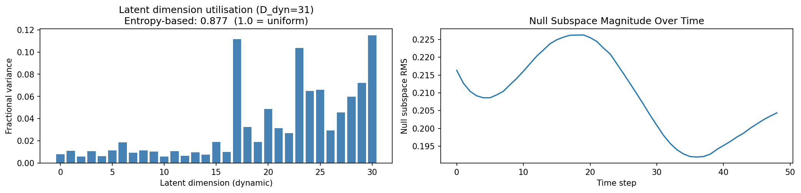

### lyapunov

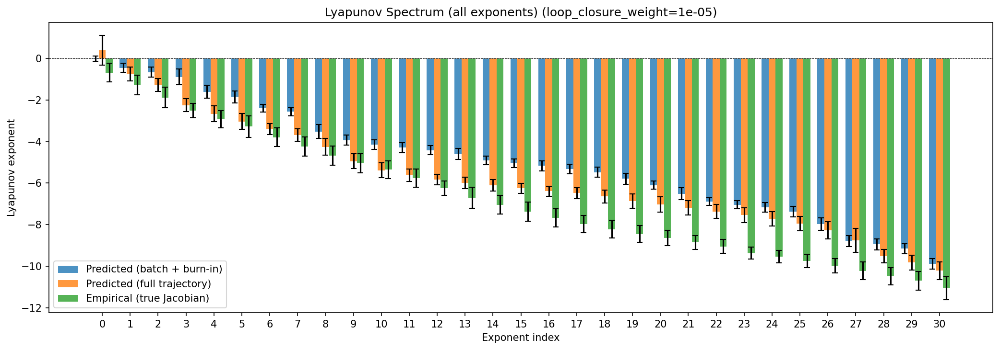

### lyapunov_top10

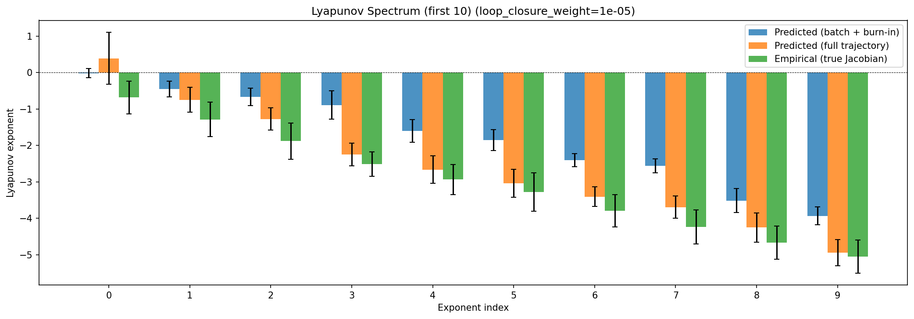

### kaplan_yorke

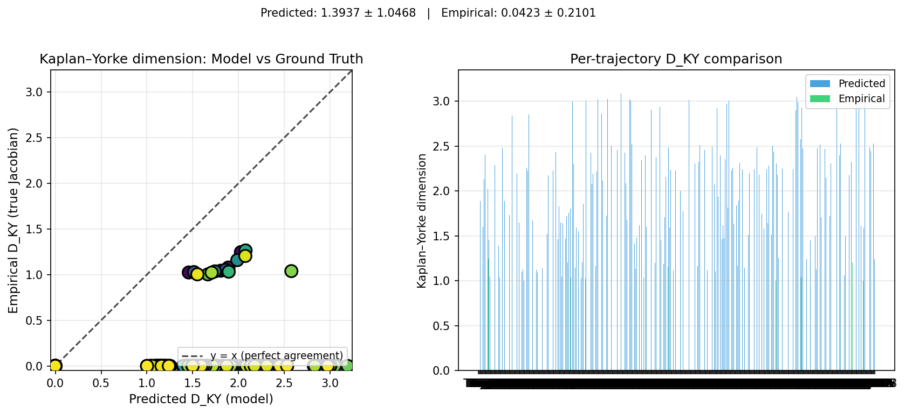

### per_run_lyapunov

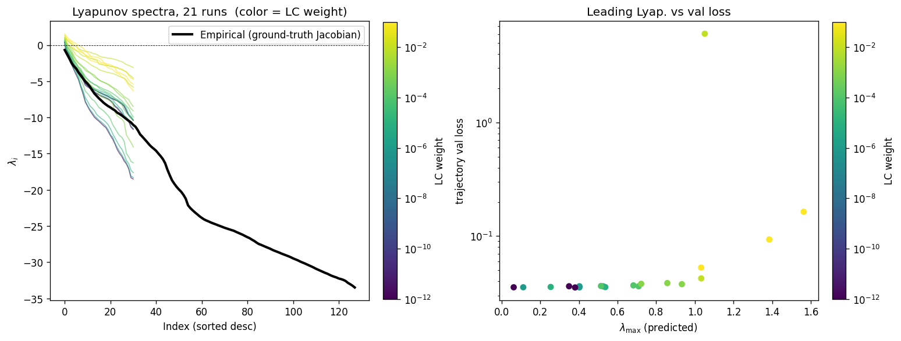

### per_run_lyapunov_vs_true

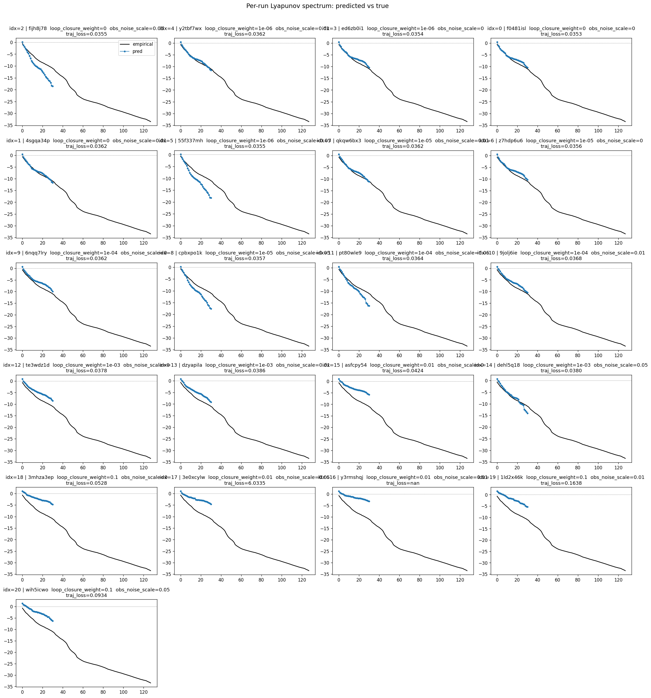

### per_run_lyapunov_relerr

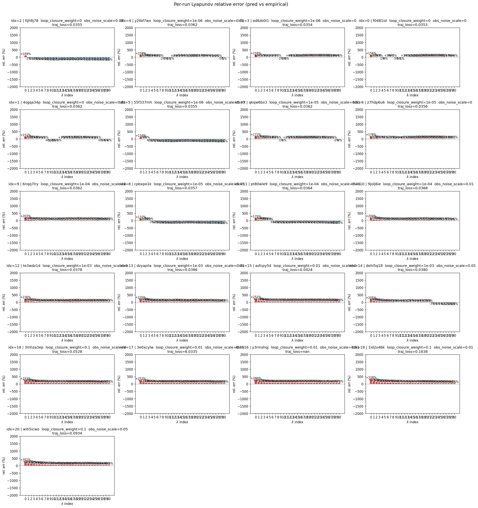

### encoder_decoder_jacobians

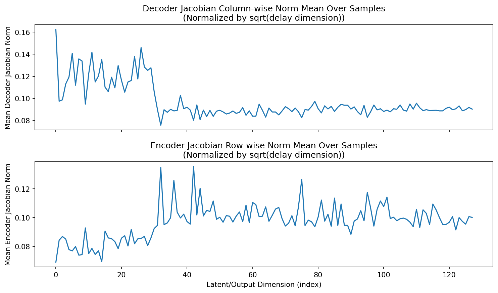

### amplification

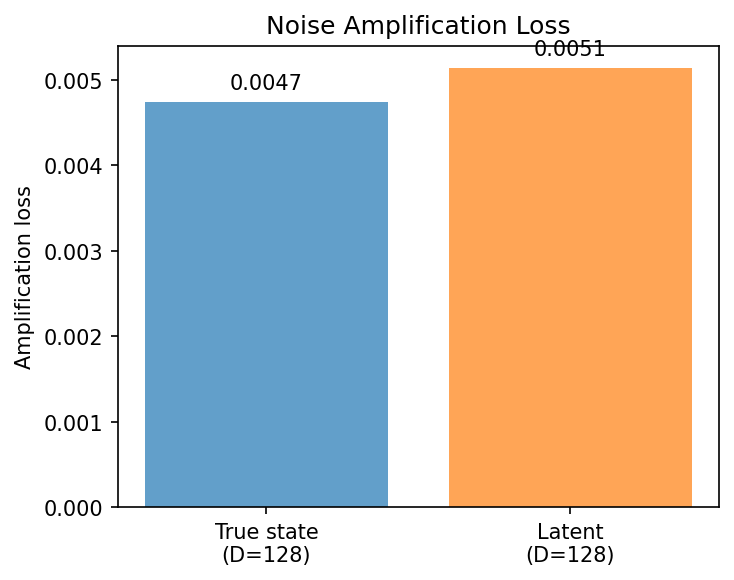

### kaplan_yorke_pca

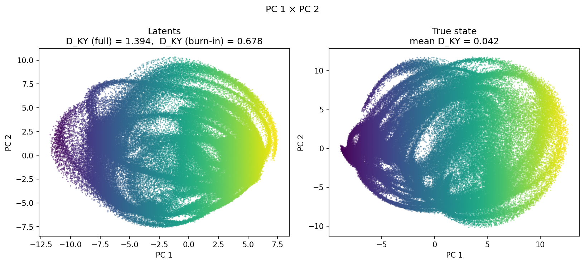

### prediction_detail_latent

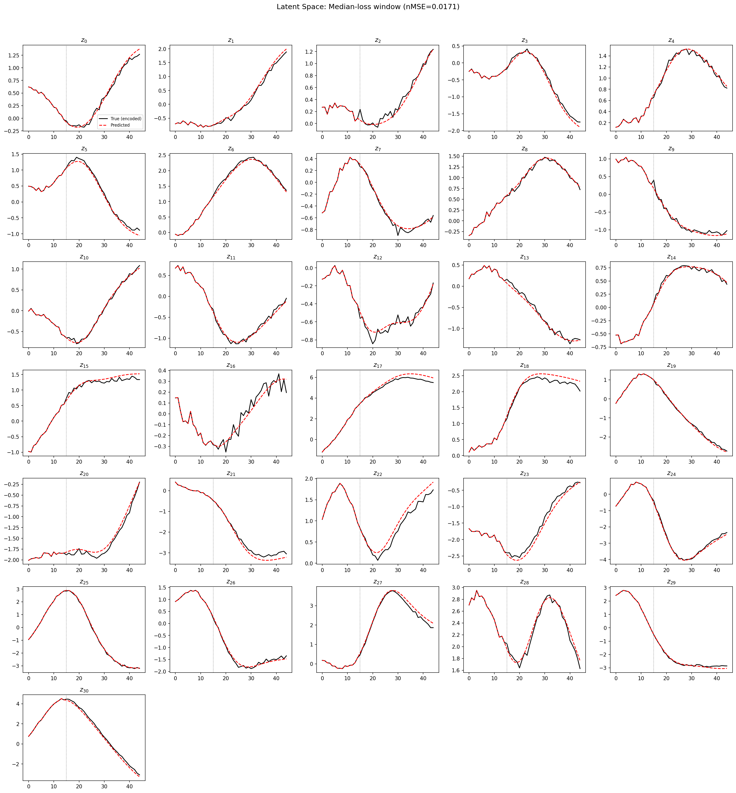

### prediction_detail_obs

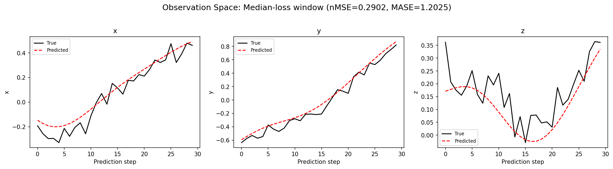

### tangent_spectrum

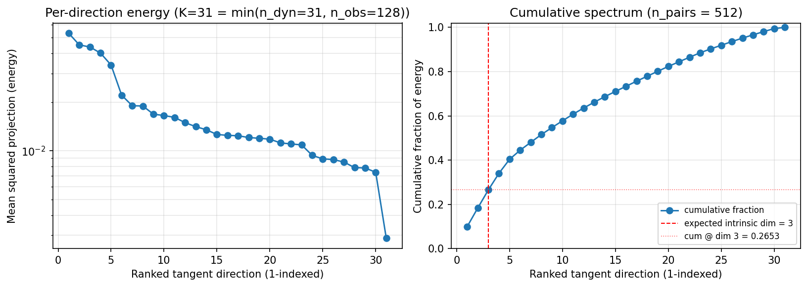

### per_run_tangent_spectrum

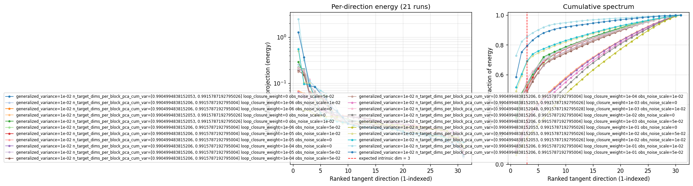

## Discussion

<!--
This section is intentionally left as a placeholder. A human reviewer
or Claude Code agent should fill it in based on the tables and figures
above, explicitly addressing each success criterion and comparing the
outcome to the stated hypothesis. Write the Discussion to
`discussion.md` in this directory and re-run `render_report`.
-->

_(to be written)_

## `run_analytics` stdout

<details><summary>Click to expand — full diagnostic output from <code>run_analytics</code></summary>

```
No run_id provided — selecting best run from group 'wmtask_direct_sum_additive_p30_perareapcaautodim_nearid_tf__lc_x_obsnoisescale_sweep_20260430T032535Z__stage_a' ...
Found 21 total runs in JacobianODE/WMTask_identity_encoder_verification (group=wmtask_direct_sum_additive_p30_perareapcaautodim_nearid_tf__lc_x_obsnoisescale_sweep_20260430T032535Z__stage_a)
All runs (state, loop_closure_weight, tangent_entropy_weight, kl_dyn_weight):
  fijh8j78: state=finished, lc=0.0, te=0.0, kl_dyn=0.0
  y2tbf7wx: state=finished, lc=1e-06, te=0.0, kl_dyn=0.0
  ed6zb0i1: state=finished, lc=1e-06, te=0.0, kl_dyn=0.0
  f0481isl: state=finished, lc=0.0, te=0.0, kl_dyn=0.0
  4sgqa34p: state=finished, lc=0.0, te=0.0, kl_dyn=0.0
  55f337mh: state=finished, lc=1e-06, te=0.0, kl_dyn=0.0
  qkqw6bx3: state=finished, lc=1e-05, te=0.0, kl_dyn=0.0
  z7hdp6u6: state=finished, lc=1e-05, te=0.0, kl_dyn=0.0
  6nqq7lry: state=finished, lc=0.0001, te=0.0, kl_dyn=0.0
  cpbxpo1k: state=finished, lc=1e-05, te=0.0, kl_dyn=0.0
  pt80wle9: state=finished, lc=0.0001, te=0.0, kl_dyn=0.0
  9jolj6ie: state=finished, lc=0.0001, te=0.0, kl_dyn=0.0
  te3wdz1d: state=finished, lc=0.001, te=0.0, kl_dyn=0.0
  dzyapila: state=finished, lc=0.001, te=0.0, kl_dyn=0.0
  asfcpy54: state=finished, lc=0.01, te=0.0, kl_dyn=0.0
  dehl5q18: state=finished, lc=0.001, te=0.0, kl_dyn=0.0
  3mhza3ep: state=finished, lc=0.1, te=0.0, kl_dyn=0.0
  3e0xcylw: state=finished, lc=0.01, te=0.0, kl_dyn=0.0
  y3rmshqj: state=finished, lc=0.01, te=0.0, kl_dyn=0.0
  1ld2x46k: state=finished, lc=0.1, te=0.0, kl_dyn=0.0
  wih5icwo: state=finished, lc=0.1, te=0.0, kl_dyn=0.0

slurm_timeout_min not found in any run config — falling back to 180 min
  Including fijh8j78 (lc=0.0): use_all_runs=True (state=finished)
  Including y2tbf7wx (lc=1e-06): use_all_runs=True (state=finished)
  Including ed6zb0i1 (lc=1e-06): use_all_runs=True (state=finished)
  Including f0481isl (lc=0.0): use_all_runs=True (state=finished)
  Including 4sgqa34p (lc=0.0): use_all_runs=True (state=finished)
  Including 55f337mh (lc=1e-06): use_all_runs=True (state=finished)
  Including qkqw6bx3 (lc=1e-05): use_all_runs=True (state=finished)
  Including z7hdp6u6 (lc=1e-05): use_all_runs=True (state=finished)
  Including 6nqq7lry (lc=0.0001): use_all_runs=True (state=finished)
  Including cpbxpo1k (lc=1e-05): use_all_runs=True (state=finished)
  Including pt80wle9 (lc=0.0001): use_all_runs=True (state=finished)
  Including 9jolj6ie (lc=0.0001): use_all_runs=True (state=finished)
  Including te3wdz1d (lc=0.001): use_all_runs=True (state=finished)
  Including dzyapila (lc=0.001): use_all_runs=True (state=finished)
  Including asfcpy54 (lc=0.01): use_all_runs=True (state=finished)
  Including dehl5q18 (lc=0.001): use_all_runs=True (state=finished)
  Including 3mhza3ep (lc=0.1): use_all_runs=True (state=finished)
  Including 3e0xcylw (lc=0.01): use_all_runs=True (state=finished)
  Including y3rmshqj (lc=0.01): use_all_runs=True (state=finished)
  Including 1ld2x46k (lc=0.1): use_all_runs=True (state=finished)
  Including wih5icwo (lc=0.1): use_all_runs=True (state=finished)
Found 21 effectively-done sweep runs:
  loop_closure_weight=0.0, tangent_entropy_weight=0.0, kl_dyn_weight=0.0 -> run_id=4sgqa34p
  loop_closure_weight=0.0, tangent_entropy_weight=0.0, kl_dyn_weight=0.0 -> run_id=f0481isl
  loop_closure_weight=0.0, tangent_entropy_weight=0.0, kl_dyn_weight=0.0 -> run_id=fijh8j78
  loop_closure_weight=1e-06, tangent_entropy_weight=0.0, kl_dyn_weight=0.0 -> run_id=55f337mh
  loop_closure_weight=1e-06, tangent_entropy_weight=0.0, kl_dyn_weight=0.0 -> run_id=ed6zb0i1
  loop_closure_weight=1e-06, tangent_entropy_weight=0.0, kl_dyn_weight=0.0 -> run_id=y2tbf7wx
  loop_closure_weight=1e-05, tangent_entropy_weight=0.0, kl_dyn_weight=0.0 -> run_id=cpbxpo1k
  loop_closure_weight=1e-05, tangent_entropy_weight=0.0, kl_dyn_weight=0.0 -> run_id=qkqw6bx3
  loop_closure_weight=1e-05, tangent_entropy_weight=0.0, kl_dyn_weight=0.0 -> run_id=z7hdp6u6
  loop_closure_weight=0.0001, tangent_entropy_weight=0.0, kl_dyn_weight=0.0 -> run_id=6nqq7lry
  loop_closure_weight=0.0001, tangent_entropy_weight=0.0, kl_dyn_weight=0.0 -> run_id=9jolj6ie
  loop_closure_weight=0.0001, tangent_entropy_weight=0.0, kl_dyn_weight=0.0 -> run_id=pt80wle9
  loop_closure_weight=0.001, tangent_entropy_weight=0.0, kl_dyn_weight=0.0 -> run_id=dehl5q18
  loop_closure_weight=0.001, tangent_entropy_weight=0.0, kl_dyn_weight=0.0 -> run_id=dzyapila
  loop_closure_weight=0.001, tangent_entropy_weight=0.0, kl_dyn_weight=0.0 -> run_id=te3wdz1d
  loop_closure_weight=0.01, tangent_entropy_weight=0.0, kl_dyn_weight=0.0 -> run_id=3e0xcylw
  loop_closure_weight=0.01, tangent_entropy_weight=0.0, kl_dyn_weight=0.0 -> run_id=asfcpy54
  loop_closure_weight=0.01, tangent_entropy_weight=0.0, kl_dyn_weight=0.0 -> run_id=y3rmshqj
  loop_closure_weight=0.1, tangent_entropy_weight=0.0, kl_dyn_weight=0.0 -> run_id=1ld2x46k
  loop_closure_weight=0.1, tangent_entropy_weight=0.0, kl_dyn_weight=0.0 -> run_id=3mhza3ep
  loop_closure_weight=0.1, tangent_entropy_weight=0.0, kl_dyn_weight=0.0 -> run_id=wih5icwo
loaded wmtask RNN model checkpoint 41
Loading cached wmtask hiddens from /orcd/data/ekmiller/001/eisenaj/ControlJacobians/WMTaskModels/WMSelectionTask__cue_time_0.1__response_time_0.25__enforce_fixation_False/BiologicalRNN__cue_time_0.1__learning_rate_0.0005__max_epochs_42__N1_64__N2_64__tau_0.05__dt_0.02__eig_lower_bound_0.1__init_mode_random/_jacobianode_cache/hiddens__all__epoch41__trials4096__seed42.pt
n_dims=128, n_latent=128, n_dyn=31, dt=0.0200
  run=4sgqa34p: DiagnosticMetrics(one_step_mase=0.8842331767082214, loop_closure_loss=40.98226547241211, fast_eigenvalue_fraction=0.0, trajectory_val_loss=0.03599448502063751) (from W&B history)
  run=f0481isl: DiagnosticMetrics(one_step_mase=0.8646661043167114, loop_closure_loss=25.608488082885742, fast_eigenvalue_fraction=0.0, trajectory_val_loss=0.03532988205552101) (from W&B history)
  run=fijh8j78: DiagnosticMetrics(one_step_mase=0.8775960803031921, loop_closure_loss=51.2413444519043, fast_eigenvalue_fraction=0.0, trajectory_val_loss=0.035457391291856766) (from W&B history)
  run=55f337mh: DiagnosticMetrics(one_step_mase=0.8774440884590149, loop_closure_loss=31.545663833618164, fast_eigenvalue_fraction=0.0, trajectory_val_loss=0.035469211637973785) (from W&B history)
  run=ed6zb0i1: DiagnosticMetrics(one_step_mase=0.8648654818534851, loop_closure_loss=15.863921165466309, fast_eigenvalue_fraction=0.0, trajectory_val_loss=0.03538630157709122) (from W&B history)
  run=y2tbf7wx: DiagnosticMetrics(one_step_mase=0.8840744495391846, loop_closure_loss=25.047239303588867, fast_eigenvalue_fraction=0.0, trajectory_val_loss=0.03599510341882706) (from W&B history)
  run=cpbxpo1k: DiagnosticMetrics(one_step_mase=0.8775380849838257, loop_closure_loss=9.931053161621094, fast_eigenvalue_fraction=0.0, trajectory_val_loss=0.03568137809634209) (from W&B history)
  run=qkqw6bx3: DiagnosticMetrics(one_step_mase=0.8838081359863281, loop_closure_loss=8.099224090576172, fast_eigenvalue_fraction=0.0, trajectory_val_loss=0.03614947572350502) (from W&B history)
  run=z7hdp6u6: DiagnosticMetrics(one_step_mase=0.8646847605705261, loop_closure_loss=5.405954360961914, fast_eigenvalue_fraction=0.0, trajectory_val_loss=0.03559940680861473) (from W&B history)
  run=6nqq7lry: DiagnosticMetrics(one_step_mase=0.8651354908943176, loop_closure_loss=1.0792646408081055, fast_eigenvalue_fraction=0.0, trajectory_val_loss=0.03619306907057762) (from W&B history)
  run=9jolj6ie: DiagnosticMetrics(one_step_mase=0.8853706121444702, loop_closure_loss=1.5376640558242798, fast_eigenvalue_fraction=0.0, trajectory_val_loss=0.03680355101823807) (from W&B history)
  run=pt80wle9: DiagnosticMetrics(one_step_mase=0.8796548247337341, loop_closure_loss=1.8202295303344727, fast_eigenvalue_fraction=0.0, trajectory_val_loss=0.03636888414621353) (from W&B history)
  run=dehl5q18: DiagnosticMetrics(one_step_mase=0.8908804059028625, loop_closure_loss=0.31186577677726746, fast_eigenvalue_fraction=0.0, trajectory_val_loss=0.03804250806570053) (from W&B history)
  run=dzyapila: DiagnosticMetrics(one_step_mase=0.8902822732925415, loop_closure_loss=0.27133503556251526, fast_eigenvalue_fraction=0.0, trajectory_val_loss=0.03860706463456154) (from W&B history)
  run=te3wdz1d: DiagnosticMetrics(one_step_mase=0.868122935295105, loop_closure_loss=0.16690193116664886, fast_eigenvalue_fraction=0.0, trajectory_val_loss=0.0377788171172142) (from W&B history)
  run=3e0xcylw: DiagnosticMetrics(one_step_mase=1.8363314867019653, loop_closure_loss=0.1189635768532753, fast_eigenvalue_fraction=0.0, trajectory_val_loss=0.2139362394809723) (from W&B history)
  run=asfcpy54: DiagnosticMetrics(one_step_mase=0.8771359324455261, loop_closure_loss=0.017753280699253082, fast_eigenvalue_fraction=0.0, trajectory_val_loss=0.042449623346328735) (from W&B history)
  run=y3rmshqj: DiagnosticMetrics(one_step_mase=1.8417019844055176, loop_closure_loss=0.12895074486732483, fast_eigenvalue_fraction=0.0, trajectory_val_loss=0.2342783361673355) (from W&B history)
  run=1ld2x46k: DiagnosticMetrics(one_step_mase=1.2972676753997803, loop_closure_loss=0.025042688474059105, fast_eigenvalue_fraction=0.0, trajectory_val_loss=0.12801989912986755) (from W&B history)
  run=3mhza3ep: DiagnosticMetrics(one_step_mase=0.8909153342247009, loop_closure_loss=0.00120428460650146, fast_eigenvalue_fraction=0.0, trajectory_val_loss=0.05282526835799217) (from W&B history)
  run=wih5icwo: DiagnosticMetrics(one_step_mase=1.2571516036987305, loop_closure_loss=0.026585236191749573, fast_eigenvalue_fraction=0.0, trajectory_val_loss=0.09340061247348785) (from W&B history)

Ranking method:           best_traj_loss
Best run ID:              z7hdp6u6
Best loop_closure_weight: 1e-05
Best tangent_entropy_weight: 0.0
Best kl_dyn_weight:       0.0
Best traj loss:           0.035599
Criteria applied: ['C1', 'C2', 'C3']
Surviving: 9 / 21
Auto-selected run_id: z7hdp6u6

======================================================================
PARETO FRONTIER RUNS (7 runs)
======================================================================
  Run ID               LC Loss   Traj Val Loss
  ------------  --------------  --------------
  3mhza3ep            0.001204        0.052825
  asfcpy54            0.017753        0.042450
  te3wdz1d            0.166902        0.037779
  6nqq7lry            1.079265        0.036193
  z7hdp6u6            5.405954        0.035599 <-- selected
  ed6zb0i1           15.863921        0.035386
  f0481isl           25.608488        0.035330

======================================================================
RANKING METHOD COMPARISON (over 9 survivors)
======================================================================
  Method                  Run ID               LC Loss   Traj Val Loss
  ----------------------  ------------  --------------  --------------
  best_traj_loss          z7hdp6u6            5.405954        0.035599 <-- active
  pareto_knee             te3wdz1d            0.166902        0.037779
  geo_rank                z7hdp6u6            5.405954        0.035599
  minimax_rank            te3wdz1d            0.166902        0.037779
  geo_log_score           z7hdp6u6            5.405954        0.035599
  minimax_log_score       asfcpy54            0.017753        0.042450
======================================================================

Loading run z7hdp6u6 from JacobianODE/WMTask_identity_encoder_verification ...
loaded wmtask RNN model checkpoint 41
Loading cached wmtask hiddens from /orcd/data/ekmiller/001/eisenaj/ControlJacobians/WMTaskModels/WMSelectionTask__cue_time_0.1__response_time_0.25__enforce_fixation_False/BiologicalRNN__cue_time_0.1__learning_rate_0.0005__max_epochs_42__N1_64__N2_64__tau_0.05__dt_0.02__eig_lower_bound_0.1__init_mode_random/_jacobianode_cache/hiddens__all__epoch41__trials4096__seed42.pt
Loading checkpoint epoch=19-step=2500.ckpt...
Train dataset shape: torch.Size([11468, 45, 128])
Validation dataset shape: torch.Size([3280, 45, 128])
Test dataset shape: torch.Size([1636, 45, 128])
Train trajectories dataset shape: torch.Size([2867, 49, 128])
Validation trajectories dataset shape: torch.Size([820, 49, 128])
Test trajectories dataset shape: torch.Size([409, 49, 128])
Loading checkpoint epoch=19-step=2500.ckpt...
Computing reconstruction ...
Computing MASE ...
Teacher-forced MASE: 0.8795
Free-running MASE:   1.0231
Computing latent utilization ...
Entropy-based utilization: 0.877
Null subspace mean RMS: 2.093961e-01
Computing Lyapunov exponents ...
  Computing full-trajectory Lyapunov (409 test trajs, T=49) ...
Predicted Lyapunov exponents (batch+burn-in, 128 windowed trajs):
  λ_1 = -0.0168 ± 0.1263
  λ_2 = -0.4560 ± 0.2135
  λ_3 = -0.6635 ± 0.2400
  λ_4 = -0.8903 ± 0.3856
  λ_5 = -1.6027 ± 0.3096
  λ_6 = -1.8530 ± 0.2888
  λ_7 = -2.3985 ± 0.1796
  λ_8 = -2.5604 ± 0.1948
  λ_9 = -3.5142 ± 0.3288
  λ_10 = -3.9313 ± 0.2478
  λ_11 = -4.1471 ± 0.2262
  λ_12 = -4.2874 ± 0.2438
  λ_13 = -4.4118 ± 0.2205
  λ_14 = -4.5979 ± 0.2562
  λ_15 = -4.9004 ± 0.2082
  λ_16 = -5.0392 ± 0.2052
  λ_17 = -5.1680 ± 0.2365
  λ_18 = -5.3200 ± 0.2382
  λ_19 = -5.4773 ± 0.2393
  λ_20 = -5.7923 ± 0.2691
  λ_21 = -6.0932 ± 0.1940
  λ_22 = -6.5176 ± 0.2873
  λ_23 = -6.8918 ± 0.1846
  λ_24 = -7.0393 ± 0.1961
  λ_25 = -7.1613 ± 0.2218
  λ_26 = -7.3628 ± 0.2552
  λ_27 = -7.9721 ± 0.2991
  λ_28 = -8.7848 ± 0.2732
  λ_29 = -8.9456 ± 0.2723
  λ_30 = -9.1513 ± 0.2487
  λ_31 = -9.8791 ± 0.2519
Predicted Lyapunov exponents (full-length, 409 test trajs):
  λ_1 = +0.3897 ± 0.7125
  λ_2 = -0.7497 ± 0.3413
  λ_3 = -1.2732 ± 0.3067
  λ_4 = -2.2522 ± 0.3124
  λ_5 = -2.6648 ± 0.3746
  λ_6 = -3.0393 ± 0.3784
  λ_7 = -3.4051 ± 0.2693
  λ_8 = -3.6920 ± 0.3015
  λ_9 = -4.2529 ± 0.3976
  λ_10 = -4.9426 ± 0.3629
  λ_11 = -5.3856 ± 0.3525
  λ_12 = -5.6281 ± 0.2993
  λ_13 = -5.8292 ± 0.2559
  λ_14 = -5.9973 ± 0.2773
  λ_15 = -6.1058 ± 0.2832
  λ_16 = -6.2521 ± 0.2329
  λ_17 = -6.3874 ± 0.2428
  λ_18 = -6.4815 ± 0.2656
  λ_19 = -6.6426 ± 0.3140
  λ_20 = -6.8672 ± 0.3498
  λ_21 = -7.0317 ± 0.3651
  λ_22 = -7.1860 ± 0.3522
  λ_23 = -7.3592 ± 0.3332
  λ_24 = -7.5404 ± 0.3552
  λ_25 = -7.7152 ± 0.3486
  λ_26 = -7.9466 ± 0.3384
  λ_27 = -8.2639 ± 0.4091
  λ_28 = -8.7540 ± 0.5818
  λ_29 = -9.5105 ± 0.3255
  λ_30 = -9.8208 ± 0.3624
  λ_31 = -10.2137 ± 0.4287
Empirical Lyapunov exponents (mean ± std):
  λ_1 = -0.6836 ± 0.4470
  λ_2 = -1.2860 ± 0.4717
  λ_3 = -1.8796 ± 0.4983
  λ_4 = -2.5140 ± 0.3383
  λ_5 = -2.9329 ± 0.4143
  λ_6 = -3.2778 ± 0.5212
  λ_7 = -3.7948 ± 0.4446
  λ_8 = -4.2351 ± 0.4668
  λ_9 = -4.6672 ± 0.4583
  λ_10 = -5.0458 ± 0.4531
  λ_11 = -5.3534 ± 0.4185
  λ_12 = -5.7506 ± 0.4346
  λ_13 = -6.2355 ± 0.3491
  λ_14 = -6.7043 ± 0.5036
  λ_15 = -7.0414 ± 0.4554
  λ_16 = -7.3719 ± 0.4648
  λ_17 = -7.6725 ± 0.4415
  λ_18 = -7.9667 ± 0.4130
  λ_19 = -8.2155 ± 0.4290
  λ_20 = -8.4474 ± 0.4083
  λ_21 = -8.6400 ± 0.3667
  λ_22 = -8.8546 ± 0.3395
  λ_23 = -9.0471 ± 0.3366
  λ_24 = -9.3642 ± 0.2863
  λ_25 = -9.5403 ± 0.3009
  λ_26 = -9.7473 ± 0.3189
  λ_27 = -9.9780 ± 0.3514
  λ_28 = -10.2177 ± 0.4331
  λ_29 = -10.4760 ± 0.4197
  λ_30 = -10.6968 ± 0.4504
  λ_31 = -11.0538 ± 0.5425
  λ_32 = -11.3182 ± 0.5459
  λ_33 = -11.7806 ± 0.6071
  λ_34 = -12.3300 ± 0.5244
  λ_35 = -12.6464 ± 0.5369
  λ_36 = -13.0198 ± 0.6314
  λ_37 = -13.3795 ± 0.7073
  λ_38 = -13.7502 ± 0.7660
  λ_39 = -14.0682 ± 0.7579
  λ_40 = -14.3279 ± 0.7619
  λ_41 = -14.6206 ± 0.8778
  λ_42 = -15.0213 ± 0.8116
  λ_43 = -15.3487 ± 0.8488
  λ_44 = -15.7679 ± 0.8512
  λ_45 = -16.3535 ± 0.8105
  λ_46 = -17.2371 ± 0.8420
  λ_47 = -18.0172 ± 0.6551
  λ_48 = -18.7348 ± 0.4352
  λ_49 = -19.1920 ± 0.4388
  λ_50 = -19.6032 ± 0.3862
  λ_51 = -19.9849 ± 0.4171
  λ_52 = -20.2854 ± 0.3677
  λ_53 = -20.7129 ± 0.4088
  λ_54 = -21.2293 ± 0.4493
  λ_55 = -22.1518 ± 0.3711
  λ_56 = -22.5100 ± 0.3571
  λ_57 = -22.8264 ± 0.3133
  λ_58 = -23.1069 ± 0.3495
  λ_59 = -23.3589 ± 0.3337
  λ_60 = -23.6276 ± 0.2926
  λ_61 = -23.8603 ± 0.3155
  λ_62 = -24.0618 ± 0.3005
  λ_63 = -24.2152 ± 0.3129
  λ_64 = -24.3396 ± 0.3136
  λ_65 = -24.4895 ± 0.3210
  λ_66 = -24.6115 ± 0.3197
  λ_67 = -24.7359 ± 0.3269
  λ_68 = -24.8561 ± 0.3392
  λ_69 = -24.9753 ± 0.3426
  λ_70 = -25.1117 ± 0.3497
  λ_71 = -25.2226 ± 0.3734
  λ_72 = -25.3357 ± 0.4009
  λ_73 = -25.4353 ± 0.4172
  λ_74 = -25.5439 ± 0.4046
  λ_75 = -25.6332 ± 0.4116
  λ_76 = -25.7832 ± 0.4585
  λ_77 = -25.9142 ± 0.4799
  λ_78 = -26.0449 ± 0.4990
  λ_79 = -26.1810 ± 0.5037
  λ_80 = -26.3617 ± 0.4899
  λ_81 = -26.5171 ± 0.4864
  λ_82 = -26.6628 ± 0.4753
  λ_83 = -26.8617 ± 0.4795
  λ_84 = -27.0282 ± 0.5036
  λ_85 = -27.2607 ± 0.4846
  λ_86 = -27.4529 ± 0.4854
  λ_87 = -27.5733 ± 0.4725
  λ_88 = -27.7187 ± 0.4967
  λ_89 = -27.8617 ± 0.5003
  λ_90 = -27.9895 ± 0.4903
  λ_91 = -28.1274 ± 0.4923
  λ_92 = -28.2824 ± 0.4913
  λ_93 = -28.4072 ± 0.4914
  λ_94 = -28.5255 ± 0.4695
  λ_95 = -28.6477 ± 0.4521
  λ_96 = -28.7842 ± 0.4453
  λ_97 = -28.9001 ± 0.4403
  λ_98 = -29.0308 ± 0.4330
  λ_99 = -29.1511 ± 0.4295
  λ_100 = -29.2954 ± 0.4247
  λ_101 = -29.4503 ± 0.4217
  λ_102 = -29.5753 ± 0.4321
  λ_103 = -29.6956 ± 0.4539
  λ_104 = -29.8547 ± 0.4485
  λ_105 = -29.9992 ± 0.4490
  λ_106 = -30.1172 ± 0.4378
  λ_107 = -30.2615 ± 0.4426
  λ_108 = -30.4062 ± 0.3980
  λ_109 = -30.5554 ± 0.4003
  λ_110 = -30.7032 ± 0.3985
  λ_111 = -30.8743 ± 0.4228
  λ_112 = -31.0109 ± 0.4336
  λ_113 = -31.1492 ± 0.4292
  λ_114 = -31.3023 ± 0.3981
  λ_115 = -31.4396 ± 0.4097
  λ_116 = -31.5685 ± 0.3902
  λ_117 = -31.7302 ± 0.3526
  λ_118 = -31.8705 ± 0.3050
  λ_119 = -31.9948 ± 0.3040
  λ_120 = -32.0998 ± 0.2813
  λ_121 = -32.2401 ± 0.2718
  λ_122 = -32.3221 ± 0.2617
  λ_123 = -32.4282 ± 0.2531
  λ_124 = -32.5858 ± 0.2272
  λ_125 = -32.8296 ± 0.2629
  λ_126 = -33.0206 ± 0.2244
  λ_127 = -33.2132 ± 0.2160
  λ_128 = -33.4614 ± 0.3541
Mean KY dim (predicted): 1.394 ± 1.047
Mean KY dim (empirical): 0.042 ± 0.210
Mean KY dim (burn-in):   0.678 ± 0.731
Computing prediction windows ...
Windows: 3 — nMSE min=0.0530, median=0.2902, mean=0.2728, max=0.4752
Computing long-trajectory free-running rollouts ...
Computing encoder/decoder Jacobians ...
encoder_jacobian: (128, 128, 128)
decoder_jacobian: (128, 128, 128)
Computing amplification loss ...
Amplification loss — True state: 0.004748
Amplification loss — Latent:     0.005146
Computing tangent space spectrum ...
```

</details>
