# Sweep Analysis: `wmtask_epoch_compare__direct_sum_cayley_perareaautodim__lc_x_obsnoisescale_sweep`

**Project**: [WMTask_identity_encoder_verification](https://wandb.ai/JacobianODE/WMTask_identity_encoder_verification/groups/wmtask_epoch_compare__direct_sum_cayley_perareaautodim__lc_x_obsnoisescale_sweep)  
**Launched**: 2026-05-04T06:00:27Z  
**Completed**: 2026-05-04T14:38:35Z  
**Outcome**: `complete_clean`  
**Git**: `latent-JacobianODE` @ `c28bed8`  
**Expected runs**: 21

## Experiment Context

### `wmtask_epoch_compare`

**Description**

WMTask fully-observed (N1=N2=64), DirectSum coupling encoder with
per-area PCA-autodim, additive coupling + Cayley orthogonal mixers +
near-identity init, TF-coupled LR. Combined dataloader pools
trajectories from epoch=1 and epoch='final' checkpoints of the same
BiologicalRNN; condition_dim=1 with values {-1: epoch=1, +1: final}
threaded through encoder conditioners + dynamics MLP. Normalization
+ obs_noise_scale calibration computed on the concatenated data.
Single-stage; sweep over loop_closure_weight + obs_noise_scale.

**Hypothesis**

A single JacobianODE that conditions on training-stage should be able
to capture both the epoch-1 and final-epoch dynamics of the same
biological RNN with one shared encoder + dynamics MLP, exposing the
difference between the two as a function of c. This validates the
multi-condition framework end-to-end and gives us a comparison axis
where we know the underlying system is "the same network with
different weights" — a controlled instance of within-system change.

**Success criteria**

- All cells train without divergence (no NaN train loss)
- val/trajectory_loss within ~2x of the existing single-checkpoint wmtask_direct_sum_additive Cayley sweep at the matching cell
- Latent trajectories at c=-1 and c=+1 are visibly different on the same trial (encoder respects the condition)
- Encoder & dynamics MLP weights both have nonzero condition-input gradients (the conditioning is actually learned)

## Results

**Swept axes** (4): `data.postprocessing.generalized_variance`, `model.n_target_dims_per_block_pca_cum_var`, `training.lightning.loop_closure_weight`, `training.lightning.obs_noise_scale`

**Chosen run** (by `best_traj_loss`): `44yjbq6x` — traj_loss=0.00256, MASE=0.6732, R²=0.9950, LC loss=12.016, epoch=50.0

Swept-axis values at chosen run: `data.postprocessing.generalized_variance`=0.0065177 · `model.n_target_dims_per_block_pca_cum_var`=[0.9908354217288812, 0.9910537774958704] · `training.lightning.loop_closure_weight`=1.0e-06 · `training.lightning.obs_noise_scale`=0.05

**Runs analyzed**: 21 (expected 21)

### Per-run results

| run_idx | run_id | `data.postprocessing.generalized_variance` | `model.n_target_dims_per_block_pca_cum_var` | `training.lightning.loop_closure_weight` | `training.lightning.obs_noise_scale` | best_traj_loss | best_MASE | R² | LC loss | epoch |
|---|---|---|---|---|---|---|---|---|---|---|
| 5 | `44yjbq6x` | 0.0065177 | [0.9908354217288812, 0.9910537774958704] | 1.0e-06 | 0.05 | 0.00256 | 0.6732 | 0.9950 | 12.016 | 50.0 |
| 6 | `5qq2ih61` | 0.0065177 | [0.9908354217288812, 0.9910537774958704] | 1.0e-05 | 0 | 0.00261 | 0.6805 | 0.9949 | 3.876 | 53.0 |
| 7 | `tk1isw7j` | 0.0065177 | [0.9908354217288812, 0.9910537774958704] | 1.0e-05 | 0.01 | 0.00268 | 0.6874 | 0.9947 | 4.624 | 49.0 |
| 8 | `cpb2xljt` | 0.0065177 | [0.9908354217288816, 0.9910537774958708] | 1.0e-05 | 0.05 | 0.00274 | 0.6914 | 0.9946 | 4.869 | 35.0 |
| 3 | `hjf2dkkq` | 0.0065177 | [0.9908354217288816, 0.9910537774958708] | 1.0e-06 | 0 | 0.00280 | 0.6998 | 0.9945 | 8.569 | 36.0 |
| 2 | `62dkknxe` | 0.0065177 | [0.9908354217288816, 0.9910537774958708] | 0 | 0.05 | 0.00280 | 0.6989 | 0.9945 | 16.065 | 31.0 |
| 1 | `bv0qk4ah` | 0.0065177 | [0.9908354217288816, 0.9910537774958708] | 0 | 0.01 | 0.00282 | 0.7036 | 0.9944 | 15.788 | 37.0 |
| 9 | `7lqmrnlb` | 0.0065177 | [0.9908354217288816, 0.9910537774958708] | 1.0e-04 | 0 | 0.00284 | 0.7047 | 0.9944 | 0.971 | 36.0 |
| 11 | `21uo87i5` | 0.0065177 | [0.9908354217288816, 0.9910537774958708] | 1.0e-04 | 0.05 | 0.00284 | 0.7018 | 0.9944 | 1.286 | 35.0 |
| 0 | `pw1120fm` | 0.0065177 | [0.9908354217288816, 0.9910537774958708] | 0 | 0 | 0.00284 | 0.7043 | 0.9944 | 13.205 | 34.0 |
| 4 | `ov6v517m` | 0.0065177 | [0.9908354217288816, 0.9910537774958708] | 1.0e-06 | 0.01 | 0.00288 | 0.7074 | 0.9943 | 10.206 | 36.0 |
| 10 | `7hassahu` | 0.0065177 | [0.9908354217288816, 0.9910537774958708] | 1.0e-04 | 0.01 | 0.00297 | 0.7178 | 0.9942 | 1.150 | 34.0 |
| 12 | `xlcjrnoa` | 0.0065177 | [0.9908354217288816, 0.9910537774958708] | 0.001 | 0 | 0.00333 | 0.7554 | 0.9935 | 0.200 | 36.0 |
| 14 | `yuo9l1gn` | 0.0065177 | [0.9908354217288816, 0.9910537774958708] | 0.001 | 0.05 | 0.00345 | 0.7659 | 0.9932 | 0.290 | 34.0 |
| 13 | `6lr54gri` | 0.0065177 | [0.9908354217288816, 0.9910537774958708] | 0.001 | 0.01 | 0.00367 | 0.7885 | 0.9928 | 0.262 | 32.0 |
| 15 | `nbzpddye` | 0.0065177 | [0.9908354217288816, 0.9910537774958708] | 0.01 | 0 | 0.00534 | 0.9270 | 0.9895 | 0.037 | 33.0 |
| 16 | `amchzs04` | 0.0065177 | [0.9908354217288812, 0.9910537774958704] | 0.01 | 0.01 | 0.00763 | 1.1064 | 0.9851 | 0.138 | 52.0 |
| 18 | `lczdbkf3` | 0.0065177 | [0.9908354217288816, 0.9910537774958708] | 0.1 | 0 | 0.00799 | 1.1037 | 0.9844 | 0.003 | 37.0 |
| 17 | `5v6vplqq` | 0.0065177 | [0.9908354217288816, 0.9910537774958708] | 0.01 | 0.05 | 0.00869 | 1.1613 | 0.9830 | 0.111 | 34.0 |
| 20 | `h8f1x5b5` | 0.0065177 | [0.9908354217288816, 0.9910537774958708] | 0.1 | 0.05 | 0.05666 | 2.5585 | 0.8912 | 0.026 | 10.0 |
| 19 | `xo7u9le6` | 0.0065177 | [0.9908354217288816, 0.9910537774958708] | 0.1 | 0.01 | 0.05806 | 2.6000 | 0.8885 | 0.048 | 10.0 |

### Best run per `obs_noise_scale`

| obs_noise_scale | Best LC weight | Best traj loss | MASE at best | R² | LC loss | epoch |
|---|---|---|---|---|---|---|
| 0.0 | 1.0e-05 | 0.00261 | 0.6805 | 0.9949 | 3.876 | 53.0 |
| 0.01 | 1.0e-05 | 0.00268 | 0.6874 | 0.9947 | 4.624 | 49.0 |
| 0.05 | 1.0e-06 | 0.00256 | 0.6732 | 0.9950 | 12.016 | 50.0 |

## Success-criteria verdicts (automated)

| Criterion | Verdict | Note |
|---|---|---|
| All cells train without divergence (no NaN train loss) | **Unknown** |  |
| val/trajectory_loss within ~2x of the existing single-checkpoint wmtask_direct_sum_additive Cayley sweep at the matching cell | **Unknown** |  |
| Latent trajectories at c=-1 and c=+1 are visibly different on the same trial (encoder respects the condition) | **Unknown** |  |
| Encoder & dynamics MLP weights both have nonzero condition-input gradients (the conditioning is actually learned) | **Unknown** |  |

_Automated verdicts use simple numeric-threshold parsing and may mis-classify qualitative criteria. The Discussion section below takes precedence._

## Figures

### sweep_overview

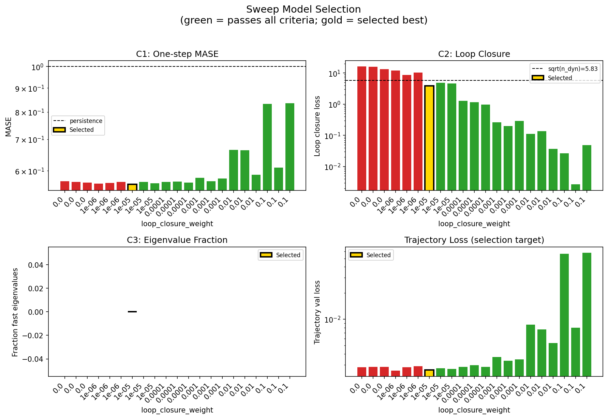

### sweep_pareto

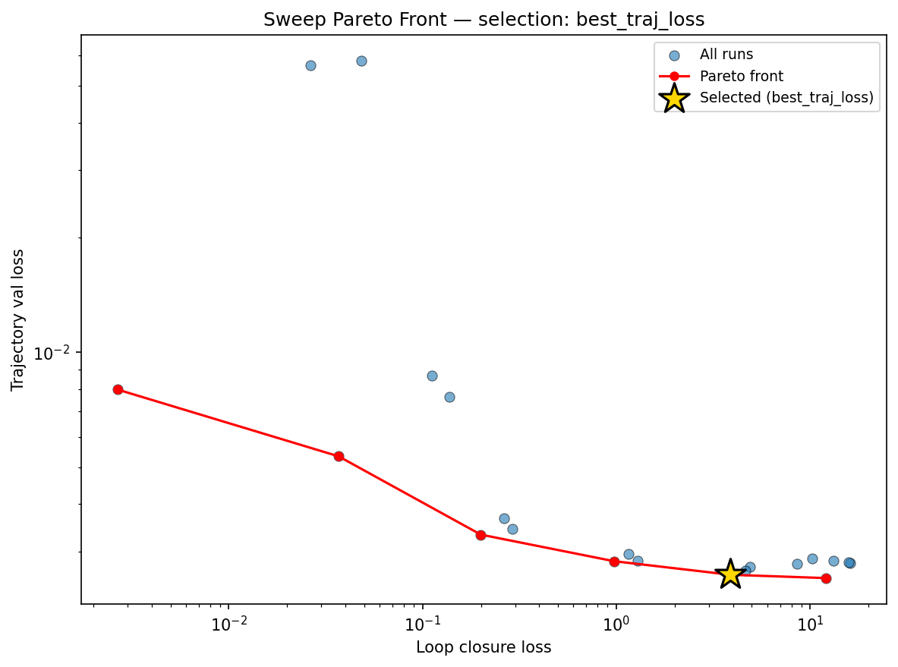

### reconstruction

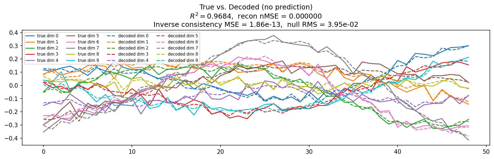

### prediction_windows

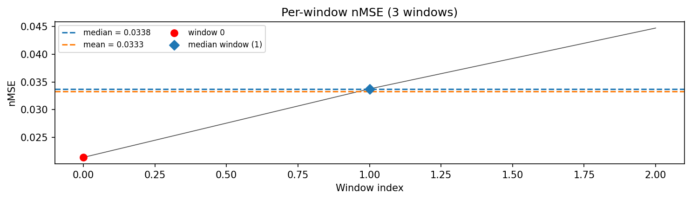

### long_trajectory

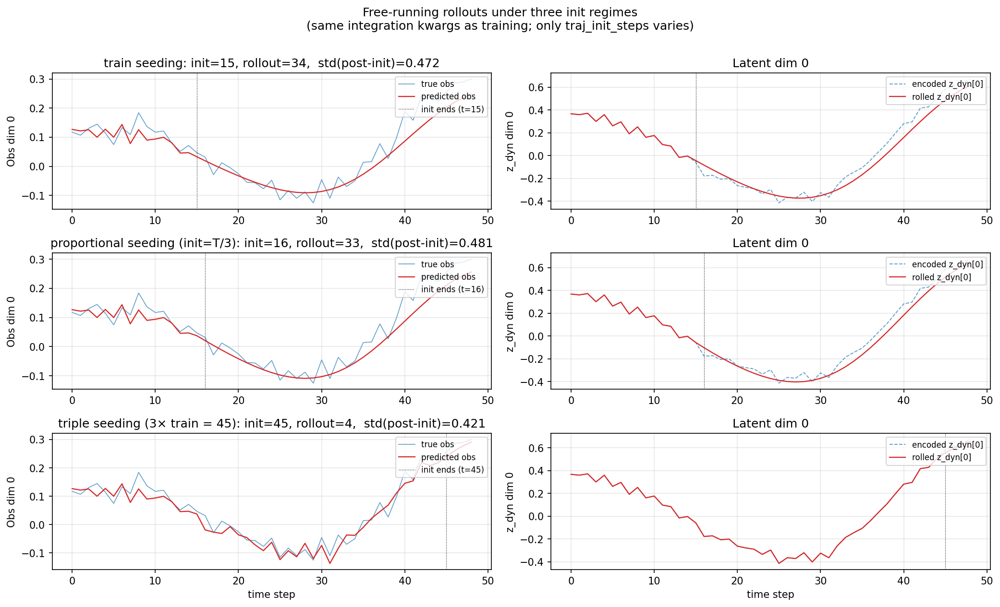

### mase

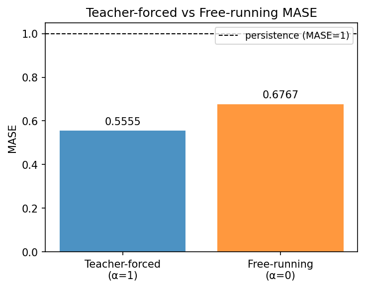

### latent_utilization

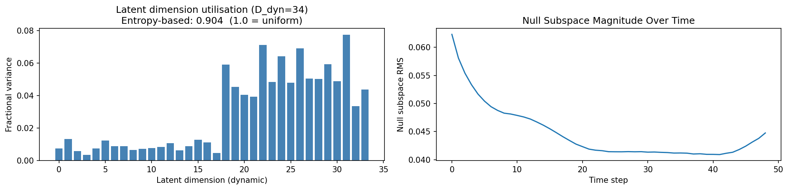

### lyapunov

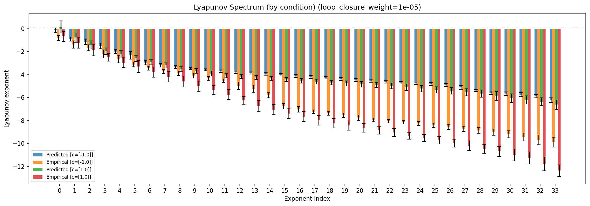

### lyapunov_top10

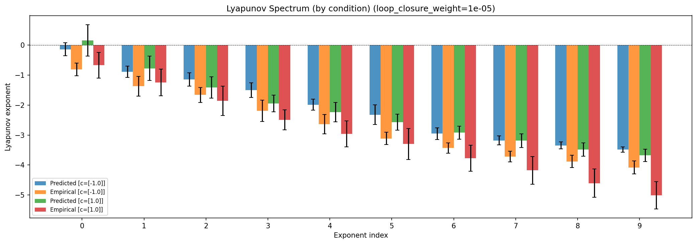

### kaplan_yorke

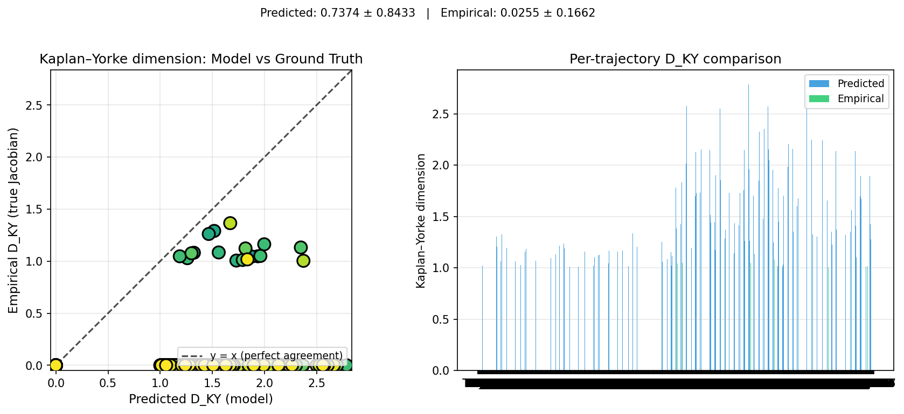

### per_run_lyapunov

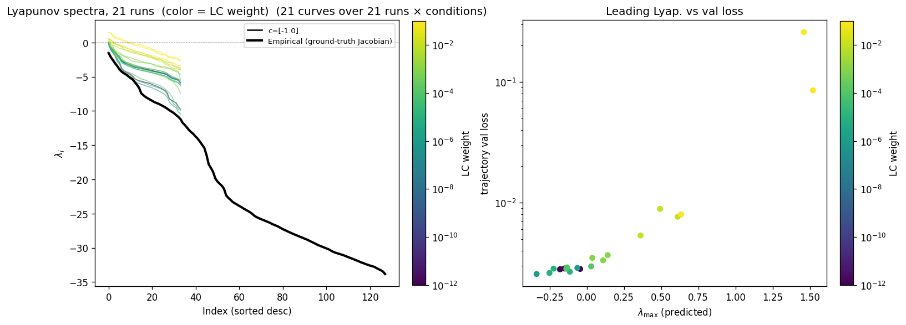

### per_run_lyapunov_vs_true

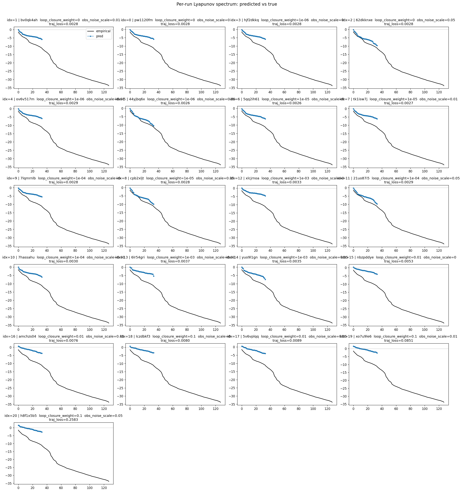

### per_run_lyapunov_relerr

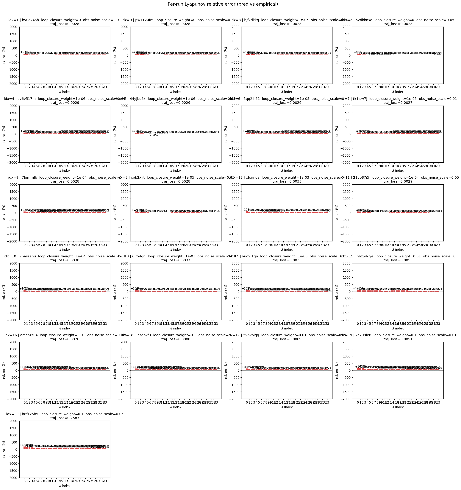

### prediction_detail_obs

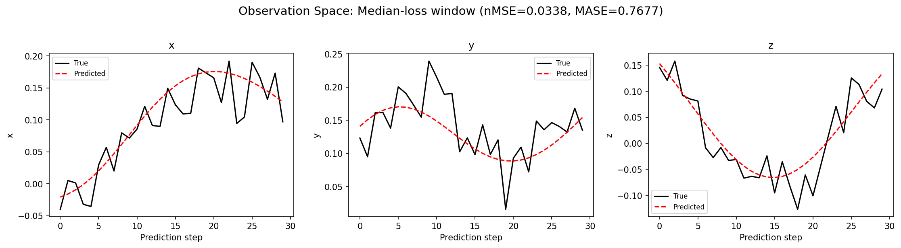

### prediction_detail_latent

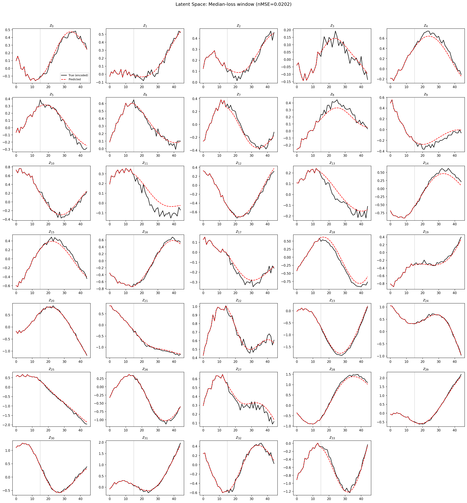

### kaplan_yorke_pca

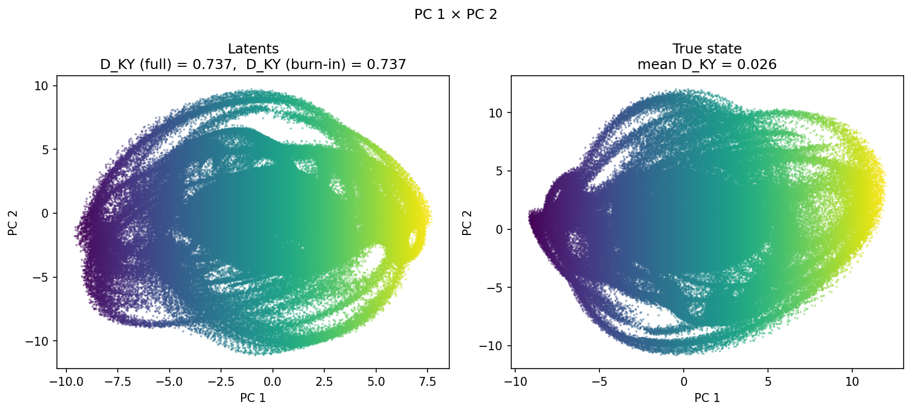

## Discussion

<!--
This section is intentionally left as a placeholder. A human reviewer
or Claude Code agent should fill it in based on the tables and figures
above, explicitly addressing each success criterion and comparing the
outcome to the stated hypothesis. Write the Discussion to
`discussion.md` in this directory and re-run `render_report`.
-->

_(to be written)_
