# Sweep Analysis: `wmtask_epoch_compare_partialobs16_pcaautodim_cayley_perconditionnorm__ndelays_sweep_20260505T020105Z__stage_a`

**Project**: [WMTask_identity_encoder_verification](https://wandb.ai/JacobianODE/WMTask_identity_encoder_verification/groups/wmtask_epoch_compare_partialobs16_pcaautodim_cayley_perconditionnorm__ndelays_sweep_20260505T020105Z__stage_a)  
**Launched**: 2026-05-05T02:05:21Z  
**Completed**: 2026-05-05T03:50:27Z  
**Outcome**: `complete_with_failures`  
**Git**: `latent-JacobianODE` @ `8d8de88`  
**Expected runs**: 5

## Experiment Context

### `wmtask_epoch_compare_partialobs16_pcaautodim_cayley_perconditionnorm__ndelays_sweep`

**Description**

WMTask conditioned (epoch=1 vs final) partial-obs n_delays scout.
Combined loader + 16-random-channel-per-area partial obs (seed=42,
same channels both conditions). Per-area PCA-99 autodim + Cayley
orthogonal mixers + near-identity init + TF-coupled LR + split-mode
loss. Per-condition normalization. Two-stage: 5-cell n_delays sweep
at Stage A (short, 20 ep), survivors resumed to full convergence at
Stage B (200 ep). LC=0 throughout (kept clean for n_delays scouting).

**Hypothesis**

n_delays controls how much state info delay-embedding can recover
from 16 obs per area. The scout identifies the n_delays that gives
the cleanest dynamics under conditioning; survivors carry into the
Stage B convergence and become the candidates for downstream LC×
obs_noise grids.

**Success criteria**

- All 5 Stage A cells train without divergence (no NaN train loss)
- Per-area autodim n_target_dims logged for each n_delays cell
- Two_stage_cull keeps top survivors (cull_fraction=0.5)
- Stage B winner: best val traj_loss within 5x of full-obs Cayley conditioned winner (~0.005 from epoch_compare_perconditionnorm)

## Results

**Swept axes** (6): `data.train_test_params.delay_embedding_params.n_delays`, `model.n_target_dims`, `model.n_target_dims_per_block_pca_auto`, `model.n_target_dims_per_block_pca_cum_var`, `model.params.input_dim`, `model.params.output_dim`

**Chosen run** (by `best_traj_loss`): `2noumq79` — traj_loss=0.00560, MASE=0.6934, R²=0.9945, LC loss=53.065, epoch=19.0

Swept-axis values at chosen run: `data.train_test_params.delay_embedding_params.n_delays`=15 · `model.n_target_dims`=41 · `model.n_target_dims_per_block_pca_auto`=[25, 16] · `model.n_target_dims_per_block_pca_cum_var`=[0.9900411020927828, 0.9907630722157746] · `model.params.input_dim`=41 · `model.params.output_dim`=1681

### Integrity checks

⚠️ **4 run_idx slot(s) had multiple matching wandb runs** — the best by `best_traj_loss` was kept; the others are listed below for audit:
  - run_idx=**0**: chose `33ze3p2o`, dropped `8dy8lu4j`, `c5cqw75d`
  - run_idx=**1**: chose `psqcex1n`, dropped `gqpu0g4k`, `3e4zorpd`
  - run_idx=**2**: chose `i48fv2oe`, dropped `oj5367cx`, `7kq6mq69`
  - run_idx=**3**: chose `zndtnte9`, dropped `wtdnq4t5`, `pp54omtb`

**Runs analyzed**: 5 (expected 5)

### Per-run results

| run_idx | run_id | `data.train_test_params.delay_embedding_params.n_delays` | `model.n_target_dims` | `model.n_target_dims_per_block_pca_auto` | `model.n_target_dims_per_block_pca_cum_var` | `model.params.input_dim` | `model.params.output_dim` | best_traj_loss | best_MASE | R² | LC loss | epoch |
|---|---|---|---|---|---|---|---|---|---|---|---|---|
| 4 | `2noumq79` | 15 | 41 | [25, 16] | [0.9900411020927828, 0.9907630722157746] | 41 | 1681 | 0.00560 | 0.6934 | 0.9945 | 53.065 | 19.0 |
| 1 | `psqcex1n` | 6 | 29 | [17, 12] | [0.9902608766168368, 0.9919741165444216] | 29 | 841 | 0.00760 | 0.7946 | 0.9922 | 53.929 | 7.0 |
| 2 | `i48fv2oe` | 9 | 33 | [20, 13] | [0.9901722465285276, 0.9905418872477084] | 33 | 1089 | 0.00764 | 0.7944 | 0.9922 | 55.277 | 7.0 |
| 0 | `33ze3p2o` | 3 | 23 | [13, 10] | [0.990065705193834, 0.990045924822203] | 23 | 529 | 0.00768 | 0.7927 | 0.9918 | 39.902 | 8.0 |
| 3 | `zndtnte9` | 12 | 37 | [23, 14] | [0.9902654313095508, 0.990024507336198] | 37 | 1369 | 0.00876 | 0.8475 | 0.9912 | 56.944 | 6.0 |

## Success-criteria verdicts (automated)

| Criterion | Verdict | Note |
|---|---|---|
| All 5 Stage A cells train without divergence (no NaN train loss) | **Unknown** |  |
| Per-area autodim n_target_dims logged for each n_delays cell | **Unknown** |  |
| Two_stage_cull keeps top survivors (cull_fraction=0.5) | **Unknown** |  |
| Stage B winner: best val traj_loss within 5x of full-obs Cayley conditioned winner (~0.005 from epoch_compare_perconditionnorm) | **Unknown** |  |

_Automated verdicts use simple numeric-threshold parsing and may mis-classify qualitative criteria. The Discussion section below takes precedence._

## Figures

### sweep_overview

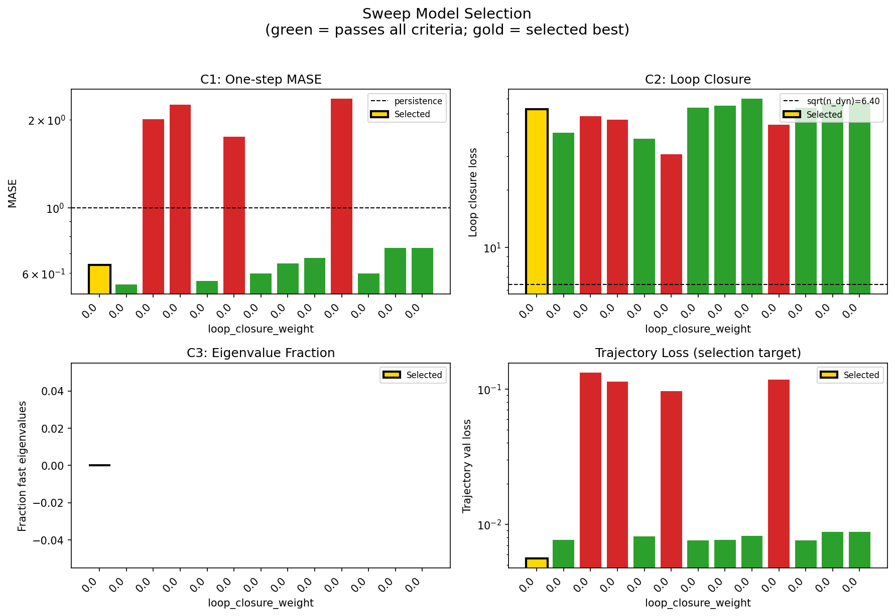

### sweep_pareto

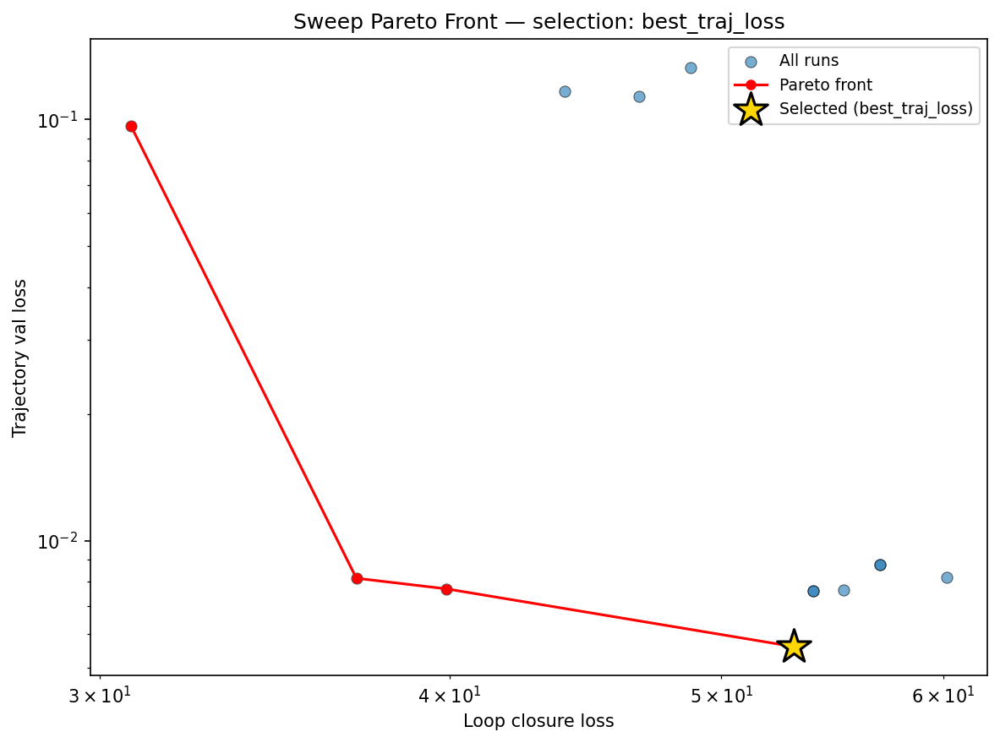

### reconstruction

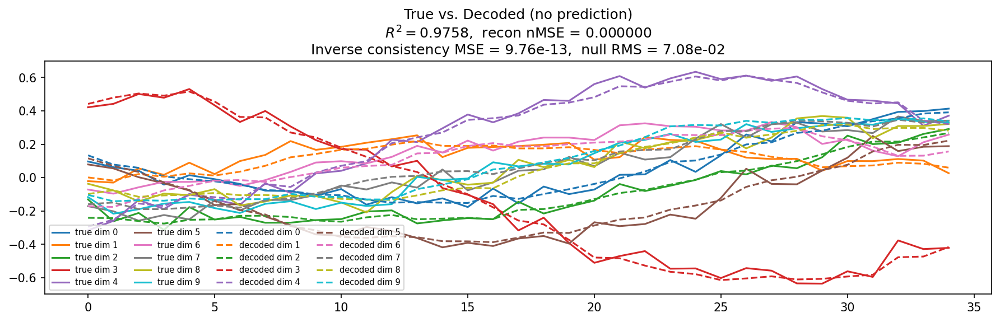

### prediction_windows

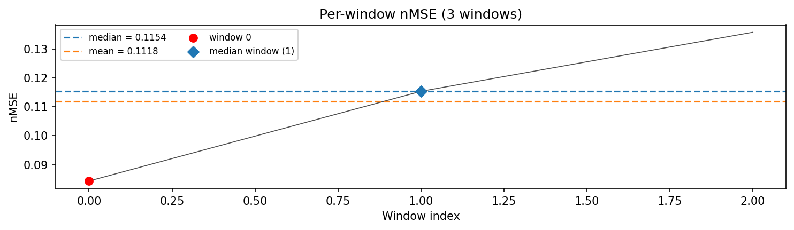

### long_trajectory

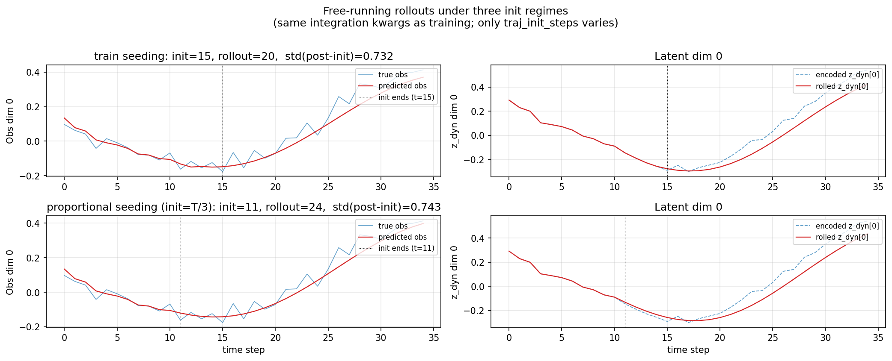

### mase

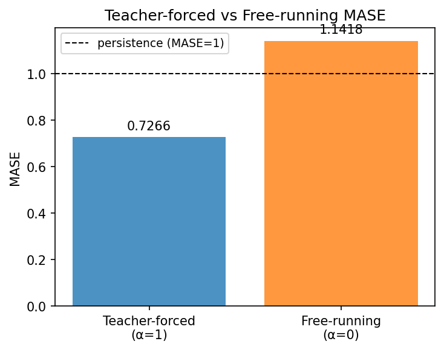

### latent_utilization

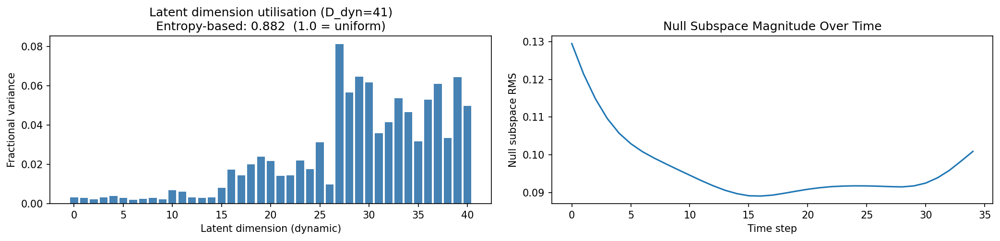

### lyapunov

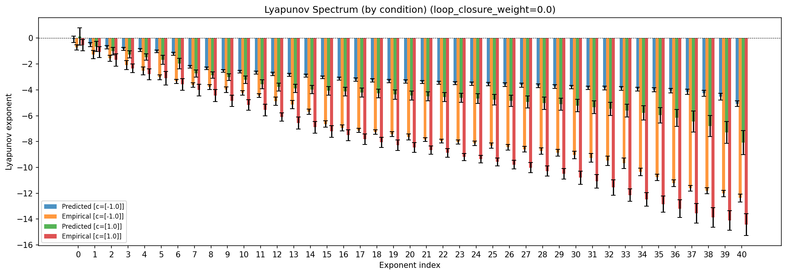

### lyapunov_top10

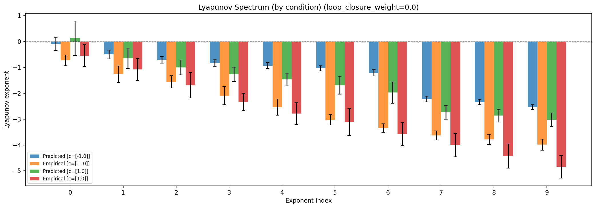

### kaplan_yorke

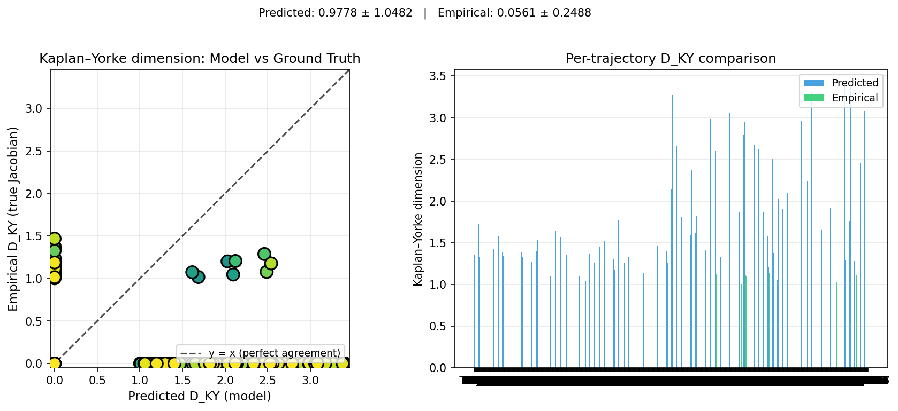

### amplification

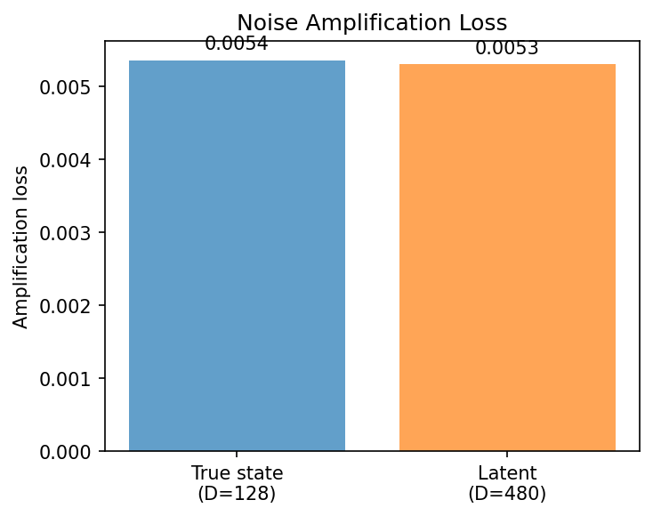

### kaplan_yorke_pca

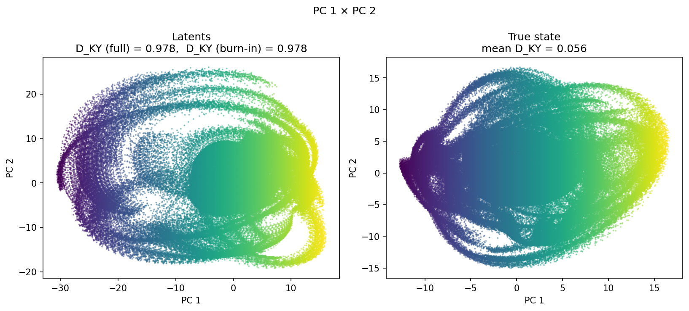

### prediction_detail_latent

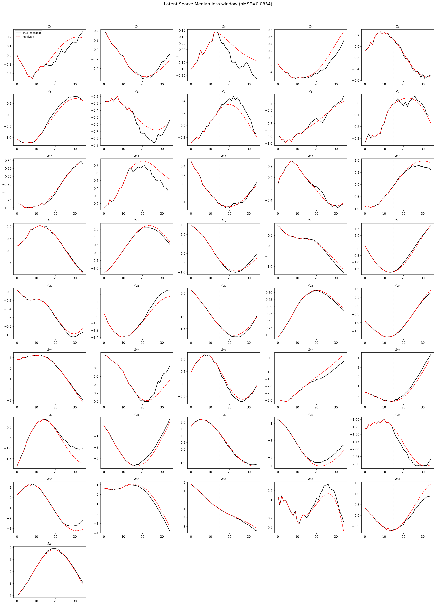

### prediction_detail_obs

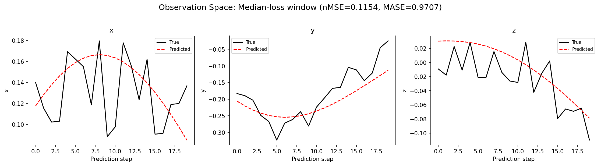

## Discussion

<!--
This section is intentionally left as a placeholder. A human reviewer
or Claude Code agent should fill it in based on the tables and figures
above, explicitly addressing each success criterion and comparing the
outcome to the stated hypothesis. Write the Discussion to
`discussion.md` in this directory and re-run `render_report`.
-->

_(to be written)_

## `run_analytics` stdout

<details><summary>Click to expand — full diagnostic output from <code>run_analytics</code></summary>

```
No run_id provided — selecting best run from group 'wmtask_epoch_compare_partialobs16_pcaautodim_cayley_perconditionnorm__ndelays_sweep_20260505T020105Z__stage_a' ...
Found 13 total runs in JacobianODE/WMTask_identity_encoder_verification (group=wmtask_epoch_compare_partialobs16_pcaautodim_cayley_perconditionnorm__ndelays_sweep_20260505T020105Z__stage_a)
All runs (state, loop_closure_weight, tangent_entropy_weight, kl_dyn_weight):
  2noumq79: state=finished, lc=0.0, te=0.0, kl_dyn=0.0
  33ze3p2o: state=crashed, lc=0.0, te=0.0, kl_dyn=0.0
  i48fv2oe: state=crashed, lc=0.0, te=0.0, kl_dyn=0.0
  psqcex1n: state=crashed, lc=0.0, te=0.0, kl_dyn=0.0
  zndtnte9: state=crashed, lc=0.0, te=0.0, kl_dyn=0.0
  8dy8lu4j: state=crashed, lc=0.0, te=0.0, kl_dyn=0.0
  gqpu0g4k: state=crashed, lc=0.0, te=0.0, kl_dyn=0.0
  oj5367cx: state=crashed, lc=0.0, te=0.0, kl_dyn=0.0
  wtdnq4t5: state=crashed, lc=0.0, te=0.0, kl_dyn=0.0
  3e4zorpd: state=running, lc=0.0, te=0.0, kl_dyn=0.0
  c5cqw75d: state=running, lc=0.0, te=0.0, kl_dyn=0.0
  pp54omtb: state=running, lc=0.0, te=0.0, kl_dyn=0.0
  7kq6mq69: state=running, lc=0.0, te=0.0, kl_dyn=0.0

slurm_timeout_min not found in any run config — falling back to 180 min
  Including 2noumq79 (lc=0.0): use_all_runs=True (state=finished)
  Including 33ze3p2o (lc=0.0): use_all_runs=True (state=crashed)
  Including i48fv2oe (lc=0.0): use_all_runs=True (state=crashed)
  Including psqcex1n (lc=0.0): use_all_runs=True (state=crashed)
  Including zndtnte9 (lc=0.0): use_all_runs=True (state=crashed)
  Including 8dy8lu4j (lc=0.0): use_all_runs=True (state=crashed)
  Including gqpu0g4k (lc=0.0): use_all_runs=True (state=crashed)
  Including oj5367cx (lc=0.0): use_all_runs=True (state=crashed)
  Including wtdnq4t5 (lc=0.0): use_all_runs=True (state=crashed)
  Including 3e4zorpd (lc=0.0): use_all_runs=True (state=running)
  Including c5cqw75d (lc=0.0): use_all_runs=True (state=running)
  Including pp54omtb (lc=0.0): use_all_runs=True (state=running)
  Including 7kq6mq69 (lc=0.0): use_all_runs=True (state=running)
Found 13 effectively-done sweep runs:
  loop_closure_weight=0.0, tangent_entropy_weight=0.0, kl_dyn_weight=0.0 -> run_id=2noumq79
  loop_closure_weight=0.0, tangent_entropy_weight=0.0, kl_dyn_weight=0.0 -> run_id=33ze3p2o
  loop_closure_weight=0.0, tangent_entropy_weight=0.0, kl_dyn_weight=0.0 -> run_id=3e4zorpd
  loop_closure_weight=0.0, tangent_entropy_weight=0.0, kl_dyn_weight=0.0 -> run_id=7kq6mq69
  loop_closure_weight=0.0, tangent_entropy_weight=0.0, kl_dyn_weight=0.0 -> run_id=8dy8lu4j
  loop_closure_weight=0.0, tangent_entropy_weight=0.0, kl_dyn_weight=0.0 -> run_id=c5cqw75d
  loop_closure_weight=0.0, tangent_entropy_weight=0.0, kl_dyn_weight=0.0 -> run_id=gqpu0g4k
  loop_closure_weight=0.0, tangent_entropy_weight=0.0, kl_dyn_weight=0.0 -> run_id=i48fv2oe
  loop_closure_weight=0.0, tangent_entropy_weight=0.0, kl_dyn_weight=0.0 -> run_id=oj5367cx
  loop_closure_weight=0.0, tangent_entropy_weight=0.0, kl_dyn_weight=0.0 -> run_id=pp54omtb
  loop_closure_weight=0.0, tangent_entropy_weight=0.0, kl_dyn_weight=0.0 -> run_id=psqcex1n
  loop_closure_weight=0.0, tangent_entropy_weight=0.0, kl_dyn_weight=0.0 -> run_id=wtdnq4t5
  loop_closure_weight=0.0, tangent_entropy_weight=0.0, kl_dyn_weight=0.0 -> run_id=zndtnte9
loaded wmtask RNN model checkpoint 1
Loading cached wmtask hiddens from /orcd/data/ekmiller/001/eisenaj/ControlJacobians/WMTaskModels/WMSelectionTask__cue_time_0.1__response_time_0.25__enforce_fixation_False/BiologicalRNN__cue_time_0.1__learning_rate_0.0005__max_epochs_42__N1_64__N2_64__tau_0.05__dt_0.02__eig_lower_bound_0.1__init_mode_random/_jacobianode_cache/hiddens__all__epoch1__trials4096__seed42.pt
loaded wmtask RNN model checkpoint 41
Loading cached wmtask hiddens from /orcd/data/ekmiller/001/eisenaj/ControlJacobians/WMTaskModels/WMSelectionTask__cue_time_0.1__response_time_0.25__enforce_fixation_False/BiologicalRNN__cue_time_0.1__learning_rate_0.0005__max_epochs_42__N1_64__N2_64__tau_0.05__dt_0.02__eig_lower_bound_0.1__init_mode_random/_jacobianode_cache/hiddens__all__epoch41__trials4096__seed42.pt
n_dims=480, n_latent=480, n_dyn=41, dt=0.0200
  run=2noumq79: DiagnosticMetrics(one_step_mase=0.6402350664138794, loop_closure_loss=53.064693450927734, fast_eigenvalue_fraction=0.0, trajectory_val_loss=0.005600690841674805) (from W&B history)
  run=33ze3p2o: DiagnosticMetrics(one_step_mase=0.5485043525695801, loop_closure_loss=39.902259826660156, fast_eigenvalue_fraction=0.0, trajectory_val_loss=0.007680501323193312) (from W&B history)
  run=3e4zorpd: DiagnosticMetrics(one_step_mase=2.0029096603393555, loop_closure_loss=48.76763153076172, fast_eigenvalue_fraction=0.0, trajectory_val_loss=0.13255465030670166) (from W&B history)
  run=7kq6mq69: DiagnosticMetrics(one_step_mase=2.2477190494537354, loop_closure_loss=46.733089447021484, fast_eigenvalue_fraction=0.0, trajectory_val_loss=0.11330011487007141) (from W&B history)
  run=8dy8lu4j: DiagnosticMetrics(one_step_mase=0.5637521147727966, loop_closure_loss=37.04872131347656, fast_eigenvalue_fraction=0.0, trajectory_val_loss=0.008140502497553825) (from W&B history)
  run=c5cqw75d: DiagnosticMetrics(one_step_mase=1.7453385591506958, loop_closure_loss=30.7893009185791, fast_eigenvalue_fraction=0.0, trajectory_val_loss=0.0964728519320488) (from W&B history)
  run=gqpu0g4k: DiagnosticMetrics(one_step_mase=0.5975724458694458, loop_closure_loss=53.92934036254883, fast_eigenvalue_fraction=0.0, trajectory_val_loss=0.007596047129482031) (from W&B history)
  run=i48fv2oe: DiagnosticMetrics(one_step_mase=0.6483664512634277, loop_closure_loss=55.276756286621094, fast_eigenvalue_fraction=0.0, trajectory_val_loss=0.007643557153642178) (from W&B history)
  run=oj5367cx: DiagnosticMetrics(one_step_mase=0.6765678524971008, loop_closure_loss=60.167232513427734, fast_eigenvalue_fraction=0.0, trajectory_val_loss=0.008187892846763134) (from W&B history)
  run=pp54omtb: DiagnosticMetrics(one_step_mase=2.35671067237854, loop_closure_loss=43.961360931396484, fast_eigenvalue_fraction=0.0, trajectory_val_loss=0.11695043742656708) (from W&B history)
  run=psqcex1n: DiagnosticMetrics(one_step_mase=0.5975724458694458, loop_closure_loss=53.92934036254883, fast_eigenvalue_fraction=0.0, trajectory_val_loss=0.007596047129482031) (from W&B history)
  run=wtdnq4t5: DiagnosticMetrics(one_step_mase=0.7309650778770447, loop_closure_loss=56.944149017333984, fast_eigenvalue_fraction=0.0, trajectory_val_loss=0.008759723044931889) (from W&B history)
  run=zndtnte9: DiagnosticMetrics(one_step_mase=0.7309650778770447, loop_closure_loss=56.944149017333984, fast_eigenvalue_fraction=0.0, trajectory_val_loss=0.008759723044931889) (from W&B history)

Ranking method:           best_traj_loss
Best run ID:              2noumq79
Best loop_closure_weight: 0.0
Best tangent_entropy_weight: 0.0
Best kl_dyn_weight:       0.0
Best traj loss:           0.005601
Criteria applied: ['C1', 'C3']
Surviving: 9 / 13
Auto-selected run_id: 2noumq79

======================================================================
PARETO FRONTIER RUNS (4 runs)
======================================================================
  Run ID               LC Loss   Traj Val Loss
  ------------  --------------  --------------
  c5cqw75d           30.789301        0.096473
  8dy8lu4j           37.048721        0.008141
  33ze3p2o           39.902260        0.007681
  2noumq79           53.064693        0.005601 <-- selected

======================================================================
RANKING METHOD COMPARISON (over 9 survivors)
======================================================================
  Method                  Run ID               LC Loss   Traj Val Loss
  ----------------------  ------------  --------------  --------------
  best_traj_loss          2noumq79           53.064693        0.005601 <-- active
  pareto_knee             33ze3p2o           39.902260        0.007681
  geo_rank                2noumq79           53.064693        0.005601
  minimax_rank            2noumq79           53.064693        0.005601
  geo_log_score           2noumq79           53.064693        0.005601
  minimax_log_score       33ze3p2o           39.902260        0.007681
======================================================================

Loading run 2noumq79 from JacobianODE/WMTask_identity_encoder_verification ...
loaded wmtask RNN model checkpoint 1
Loading cached wmtask hiddens from /orcd/data/ekmiller/001/eisenaj/ControlJacobians/WMTaskModels/WMSelectionTask__cue_time_0.1__response_time_0.25__enforce_fixation_False/BiologicalRNN__cue_time_0.1__learning_rate_0.0005__max_epochs_42__N1_64__N2_64__tau_0.05__dt_0.02__eig_lower_bound_0.1__init_mode_random/_jacobianode_cache/hiddens__all__epoch1__trials4096__seed42.pt
loaded wmtask RNN model checkpoint 41
Loading cached wmtask hiddens from /orcd/data/ekmiller/001/eisenaj/ControlJacobians/WMTaskModels/WMSelectionTask__cue_time_0.1__response_time_0.25__enforce_fixation_False/BiologicalRNN__cue_time_0.1__learning_rate_0.0005__max_epochs_42__N1_64__N2_64__tau_0.05__dt_0.02__eig_lower_bound_0.1__init_mode_random/_jacobianode_cache/hiddens__all__epoch41__trials4096__seed42.pt
Loading checkpoint epoch=19-step=1800.ckpt...
Loading checkpoint epoch=19-step=1800.ckpt...
Computing reconstruction ...
Computing MASE ...
Teacher-forced MASE: 0.7266
Free-running MASE:   1.1418
Computing latent utilization ...
Entropy-based utilization: 0.882
Null subspace mean RMS: 9.704995e-02
Computing Lyapunov exponents ...
  Computing full-trajectory Lyapunov (818 test trajs, T=35) ...
Predicted Lyapunov exponents (batch+burn-in, 128 windowed trajs):
  λ_1 = +0.0205 ± 0.5143
  λ_2 = -0.5735 ± 0.3162
  λ_3 = -0.8542 ± 0.2658
  λ_4 = -1.0470 ± 0.3034
  λ_5 = -1.1991 ± 0.3304
  λ_6 = -1.3627 ± 0.4156
  λ_7 = -1.5926 ± 0.4888
  λ_8 = -2.4758 ± 0.3308
  λ_9 = -2.6037 ± 0.3225
  λ_10 = -2.7770 ± 0.3118
  λ_11 = -2.9128 ± 0.3753
  λ_12 = -3.1199 ± 0.5258
  λ_13 = -3.2782 ± 0.5578
  λ_14 = -3.3669 ± 0.5724
  λ_15 = -3.4477 ± 0.5910
  λ_16 = -3.5472 ± 0.5825
  λ_17 = -3.6315 ± 0.5635
  λ_18 = -3.7123 ± 0.5622
  λ_19 = -3.7757 ± 0.5694
  λ_20 = -3.8487 ± 0.5858
  λ_21 = -3.9025 ± 0.6025
  λ_22 = -3.9548 ± 0.6098
  λ_23 = -3.9987 ± 0.6159
  λ_24 = -4.0434 ± 0.6188
  λ_25 = -4.0944 ± 0.6400
  λ_26 = -4.1582 ± 0.6735
  λ_27 = -4.2187 ± 0.7018
  λ_28 = -4.2865 ± 0.7332
  λ_29 = -4.3600 ± 0.7577
  λ_30 = -4.4270 ± 0.7652
  λ_31 = -4.5058 ± 0.8027
  λ_32 = -4.5872 ± 0.8403
  λ_33 = -4.6679 ± 0.8864
  λ_34 = -4.7512 ± 0.9281
  λ_35 = -4.8655 ± 1.0033
  λ_36 = -4.9864 ± 1.0745
  λ_37 = -5.1227 ± 1.1509
  λ_38 = -5.3057 ± 1.2937
  λ_39 = -5.5380 ± 1.3951
  λ_40 = -5.9234 ± 1.5192
  λ_41 = -6.5760 ± 1.6451
Predicted Lyapunov exponents (full-length, 818 test trajs):
  λ_1 = +0.0205 ± 0.5143
  λ_2 = -0.5735 ± 0.3162
  λ_3 = -0.8542 ± 0.2658
  λ_4 = -1.0470 ± 0.3034
  λ_5 = -1.1991 ± 0.3304
  λ_6 = -1.3627 ± 0.4156
  λ_7 = -1.5926 ± 0.4888
  λ_8 = -2.4758 ± 0.3308
  λ_9 = -2.6037 ± 0.3225
  λ_10 = -2.7770 ± 0.3118
  λ_11 = -2.9128 ± 0.3753
  λ_12 = -3.1199 ± 0.5258
  λ_13 = -3.2782 ± 0.5578
  λ_14 = -3.3669 ± 0.5724
  λ_15 = -3.4477 ± 0.5910
  λ_16 = -3.5472 ± 0.5825
  λ_17 = -3.6315 ± 0.5635
  λ_18 = -3.7123 ± 0.5622
  λ_19 = -3.7757 ± 0.5694
  λ_20 = -3.8487 ± 0.5858
  λ_21 = -3.9025 ± 0.6025
  λ_22 = -3.9548 ± 0.6098
  λ_23 = -3.9987 ± 0.6159
  λ_24 = -4.0434 ± 0.6188
  λ_25 = -4.0944 ± 0.6400
  λ_26 = -4.1582 ± 0.6735
  λ_27 = -4.2187 ± 0.7018
  λ_28 = -4.2865 ± 0.7332
  λ_29 = -4.3600 ± 0.7577
  λ_30 = -4.4270 ± 0.7652
  λ_31 = -4.5058 ± 0.8027
  λ_32 = -4.5872 ± 0.8403
  λ_33 = -4.6679 ± 0.8864
  λ_34 = -4.7512 ± 0.9281
  λ_35 = -4.8655 ± 1.0033
  λ_36 = -4.9864 ± 1.0745
  λ_37 = -5.1227 ± 1.1509
  λ_38 = -5.3057 ± 1.2937
  λ_39 = -5.5380 ± 1.3951
  λ_40 = -5.9234 ± 1.5192
  λ_41 = -6.5760 ± 1.6451
Empirical Lyapunov exponents (mean ± std, all trajectories):
  λ_1 = -0.6353 ± 0.3465
  λ_2 = -1.1737 ± 0.3881
  λ_3 = -1.6231 ± 0.3900
  λ_4 = -2.2124 ± 0.3684
  λ_5 = -2.6625 ± 0.3953
  λ_6 = -3.0691 ± 0.3950
  λ_7 = -3.4613 ± 0.3543
  λ_8 = -3.8197 ± 0.3905
  λ_9 = -4.1081 ± 0.4824
  λ_10 = -4.4143 ± 0.5487
  λ_11 = -4.7030 ± 0.5551
  λ_12 = -5.0074 ± 0.6444
  λ_13 = -5.4875 ± 0.6903
  λ_14 = -5.8604 ± 0.8181
  λ_15 = -6.2924 ± 0.6951
  λ_16 = -6.9284 ± 0.4605
  λ_17 = -7.2216 ± 0.4465
  λ_18 = -7.4797 ± 0.4574
  λ_19 = -7.6652 ± 0.4995
  λ_20 = -7.8578 ± 0.5279
  λ_21 = -8.0532 ± 0.5162
  λ_22 = -8.2598 ± 0.4827
  λ_23 = -8.4152 ± 0.5256
  λ_24 = -8.6150 ± 0.6191
  λ_25 = -8.7509 ± 0.6531
  λ_26 = -8.9435 ± 0.6761
  λ_27 = -9.1106 ± 0.7327
  λ_28 = -9.3066 ± 0.7789
  λ_29 = -9.5068 ± 0.8401
  λ_30 = -9.6792 ± 0.8841
  λ_31 = -9.9201 ± 0.9749
  λ_32 = -10.1668 ± 1.0064
  λ_33 = -10.5224 ± 1.1476
  λ_34 = -10.9142 ± 1.3092
  λ_35 = -11.4060 ± 1.1424
  λ_36 = -11.8052 ± 1.1426
  λ_37 = -12.2050 ± 1.1134
  λ_38 = -12.5768 ± 1.1176
  λ_39 = -12.8330 ± 1.1696
  λ_40 = -13.0615 ± 1.1851
  λ_41 = -13.3863 ± 1.2057
  λ_42 = -13.7144 ± 1.1818
  λ_43 = -14.1195 ± 1.1784
  λ_44 = -14.5715 ± 1.1662
  λ_45 = -15.0996 ± 1.2147
  λ_46 = -16.2075 ± 1.1518
  λ_47 = -17.5372 ± 0.6701
  λ_48 = -18.1930 ± 0.5876
  λ_49 = -18.7837 ± 0.4517
  λ_50 = -19.6473 ± 0.3763
  λ_51 = -20.0017 ± 0.3288
  λ_52 = -20.3280 ± 0.3108
  λ_53 = -20.6549 ± 0.3182
  λ_54 = -21.1145 ± 0.3769
  λ_55 = -22.2697 ± 0.3648
  λ_56 = -22.6857 ± 0.3070
  λ_57 = -23.0476 ± 0.3336
  λ_58 = -23.3982 ± 0.3753
  λ_59 = -23.6251 ± 0.3416
  λ_60 = -23.8476 ± 0.3017
  λ_61 = -24.0640 ± 0.3039
  λ_62 = -24.2836 ± 0.2954
  λ_63 = -24.5149 ± 0.3479
  λ_64 = -24.6883 ± 0.3695
  λ_65 = -24.8755 ± 0.3696
  λ_66 = -25.0269 ± 0.3894
  λ_67 = -25.2158 ± 0.4374
  λ_68 = -25.5075 ± 0.5625
  λ_69 = -25.6488 ± 0.5770
  λ_70 = -25.7848 ± 0.5823
  λ_71 = -25.9102 ± 0.5912
  λ_72 = -26.0255 ± 0.6052
  λ_73 = -26.1459 ± 0.6176
  λ_74 = -26.2626 ± 0.6282
  λ_75 = -26.4016 ± 0.6706
  λ_76 = -26.6179 ± 0.7431
  λ_77 = -26.7730 ± 0.7788
  λ_78 = -26.9160 ± 0.7833
  λ_79 = -27.0809 ± 0.7865
  λ_80 = -27.2758 ± 0.8021
  λ_81 = -27.4458 ± 0.8276
  λ_82 = -27.5865 ± 0.8324
  λ_83 = -27.7870 ± 0.8352
  λ_84 = -27.9605 ± 0.8251
  λ_85 = -28.1614 ± 0.8110
  λ_86 = -28.3325 ± 0.7907
  λ_87 = -28.4719 ± 0.8032
  λ_88 = -28.6079 ± 0.8138
  λ_89 = -28.7489 ± 0.8112
  λ_90 = -28.8710 ± 0.7946
  λ_91 = -28.9854 ± 0.7935
  λ_92 = -29.1186 ± 0.7767
  λ_93 = -29.2522 ± 0.7927
  λ_94 = -29.3821 ± 0.7810
  λ_95 = -29.5324 ± 0.7773
  λ_96 = -29.6540 ± 0.7694
  λ_97 = -29.8267 ± 0.8190
  λ_98 = -29.9552 ± 0.8232
  λ_99 = -30.0740 ± 0.8228
  λ_100 = -30.2080 ± 0.8069
  λ_101 = -30.3406 ± 0.7963
  λ_102 = -30.4832 ± 0.7976
  λ_103 = -30.6420 ± 0.8363
  λ_104 = -30.8079 ± 0.8398
  λ_105 = -30.9375 ± 0.8177
  λ_106 = -31.0411 ± 0.8038
  λ_107 = -31.1422 ± 0.7734
  λ_108 = -31.2421 ± 0.7336
  λ_109 = -31.3550 ± 0.6998
  λ_110 = -31.4809 ± 0.6882
  λ_111 = -31.6144 ± 0.6658
  λ_112 = -31.7371 ± 0.6622
  λ_113 = -31.8809 ± 0.6716
  λ_114 = -32.0030 ± 0.6546
  λ_115 = -32.1282 ± 0.6528
  λ_116 = -32.2557 ± 0.6494
  λ_117 = -32.4058 ± 0.6211
  λ_118 = -32.5309 ± 0.5913
  λ_119 = -32.6509 ± 0.5925
  λ_120 = -32.7307 ± 0.5701
  λ_121 = -32.8411 ± 0.5351
  λ_122 = -32.9175 ± 0.5277
  λ_123 = -33.0191 ± 0.5177
  λ_124 = -33.2099 ± 0.5575
  λ_125 = -33.4094 ± 0.5186
  λ_126 = -33.5531 ± 0.4827
  λ_127 = -33.7664 ± 0.4953
  λ_128 = -34.0341 ± 0.5345
Empirical Lyapunov per condition:
  c=[-1.0]:
    λ_1 = -0.7264 ± 0.2062
    λ_2 = -1.2654 ± 0.3226
    λ_3 = -1.5573 ± 0.2403
    λ_4 = -2.0863 ± 0.3531
    λ_5 = -2.5367 ± 0.3184
    λ_6 = -3.0274 ± 0.1980
    λ_7 = -3.3426 ± 0.1653
    λ_8 = -3.6314 ± 0.1750
    λ_9 = -3.7846 ± 0.1948
    λ_10 = -3.9868 ± 0.2175
    λ_11 = -4.2429 ± 0.1731
    λ_12 = -4.4527 ± 0.1445
    λ_13 = -4.8775 ± 0.3185
    λ_14 = -5.1479 ± 0.3151
    λ_15 = -5.6953 ± 0.2148
    λ_16 = -6.6399 ± 0.2371
    λ_17 = -6.9322 ± 0.2347
    λ_18 = -7.1369 ± 0.1550
    λ_19 = -7.2704 ± 0.1753
    λ_20 = -7.4349 ± 0.1926
    λ_21 = -7.6427 ± 0.2283
    λ_22 = -7.8503 ± 0.1553
    λ_23 = -7.9575 ± 0.1517
    λ_24 = -8.0384 ± 0.1586
    λ_25 = -8.1460 ± 0.1715
    λ_26 = -8.3200 ± 0.2010
    λ_27 = -8.4350 ± 0.2160
    λ_28 = -8.5990 ± 0.2224
    λ_29 = -8.7311 ± 0.2386
    λ_30 = -8.8670 ± 0.2619
    λ_31 = -9.0407 ± 0.3035
    λ_32 = -9.2627 ± 0.3361
    λ_33 = -9.4901 ± 0.3772
    λ_34 = -9.6855 ± 0.4066
    λ_35 = -10.3473 ± 0.3001
    λ_36 = -10.7686 ± 0.2443
    λ_37 = -11.2220 ± 0.2621
    λ_38 = -11.6036 ± 0.2220
    λ_39 = -11.8069 ± 0.2351
    λ_40 = -12.0204 ± 0.2595
    λ_41 = -12.3606 ± 0.3080
    λ_42 = -12.7107 ± 0.3902
    λ_43 = -13.1254 ± 0.3418
    λ_44 = -13.5861 ± 0.3044
    λ_45 = -14.0153 ± 0.2752
    λ_46 = -15.3154 ± 0.6518
    λ_47 = -17.1978 ± 0.4545
    λ_48 = -17.7830 ± 0.3508
    λ_49 = -18.4810 ± 0.2202
    λ_50 = -19.7867 ± 0.3377
    λ_51 = -20.1334 ± 0.1876
    λ_52 = -20.4607 ± 0.1976
    λ_53 = -20.6887 ± 0.1962
    λ_54 = -21.0423 ± 0.2688
    λ_55 = -22.4210 ± 0.2868
    λ_56 = -22.7879 ± 0.2309
    λ_57 = -23.2138 ± 0.2655
    λ_58 = -23.6314 ± 0.2396
    λ_59 = -23.8489 ± 0.1909
    λ_60 = -24.0222 ± 0.1891
    λ_61 = -24.2094 ± 0.2165
    λ_62 = -24.4002 ± 0.2494
    λ_63 = -24.6918 ± 0.3013
    λ_64 = -24.9140 ± 0.2892
    λ_65 = -25.1275 ± 0.2519
    λ_66 = -25.3093 ± 0.2336
    λ_67 = -25.5510 ± 0.2458
    λ_68 = -25.9887 ± 0.2367
    λ_69 = -26.1544 ± 0.2086
    λ_70 = -26.3032 ± 0.1657
    λ_71 = -26.4371 ± 0.1543
    λ_72 = -26.5658 ± 0.1405
    λ_73 = -26.6965 ± 0.1296
    λ_74 = -26.8203 ± 0.1375
    λ_75 = -27.0007 ± 0.1686
    λ_76 = -27.2765 ± 0.1831
    λ_77 = -27.4672 ± 0.1484
    λ_78 = -27.6048 ± 0.1759
    λ_79 = -27.7678 ± 0.2117
    λ_80 = -27.9876 ± 0.2272
    λ_81 = -28.1836 ± 0.2564
    λ_82 = -28.3277 ± 0.2590
    λ_83 = -28.5268 ± 0.2645
    λ_84 = -28.6954 ± 0.2112
    λ_85 = -28.8812 ± 0.2421
    λ_86 = -29.0294 ± 0.2607
    λ_87 = -29.1802 ± 0.2924
    λ_88 = -29.3218 ± 0.2982
    λ_89 = -29.4610 ± 0.2708
    λ_90 = -29.5741 ± 0.2550
    λ_91 = -29.6847 ± 0.2500
    λ_92 = -29.7949 ± 0.2559
    λ_93 = -29.9370 ± 0.2952
    λ_94 = -30.0633 ± 0.2881
    λ_95 = -30.2209 ± 0.2619
    λ_96 = -30.3373 ± 0.2507
    λ_97 = -30.5692 ± 0.2232
    λ_98 = -30.7046 ± 0.2081
    λ_99 = -30.8249 ± 0.1976
    λ_100 = -30.9457 ± 0.1881
    λ_101 = -31.0663 ± 0.1904
    λ_102 = -31.2034 ± 0.2055
    λ_103 = -31.3953 ± 0.2275
    λ_104 = -31.5734 ± 0.1843
    λ_105 = -31.6854 ± 0.1598
    λ_106 = -31.7745 ± 0.1514
    λ_107 = -31.8437 ± 0.1462
    λ_108 = -31.9083 ± 0.1510
    λ_109 = -31.9848 ± 0.1553
    λ_110 = -32.0977 ± 0.1758
    λ_111 = -32.2021 ± 0.1650
    λ_112 = -32.3055 ± 0.1704
    λ_113 = -32.4576 ± 0.1998
    λ_114 = -32.5686 ± 0.2206
    λ_115 = -32.6861 ± 0.2272
    λ_116 = -32.8183 ± 0.2366
    λ_117 = -32.9583 ± 0.2041
    λ_118 = -33.0708 ± 0.1866
    λ_119 = -33.1947 ± 0.1578
    λ_120 = -33.2557 ± 0.1537
    λ_121 = -33.3288 ± 0.1524
    λ_122 = -33.4019 ± 0.1463
    λ_123 = -33.4969 ± 0.1384
    λ_124 = -33.7285 ± 0.1950
    λ_125 = -33.8683 ± 0.2114
    λ_126 = -33.9820 ± 0.2101
    λ_127 = -34.2037 ± 0.2425
    λ_128 = -34.4915 ± 0.1924
  c=[1.0]:
    λ_1 = -0.5442 ± 0.4258
    λ_2 = -1.0820 ± 0.4251
    λ_3 = -1.6890 ± 0.4880
    λ_4 = -2.3384 ± 0.3395
    λ_5 = -2.7883 ± 0.4241
    λ_6 = -3.1107 ± 0.5194
    λ_7 = -3.5800 ± 0.4426
    λ_8 = -4.0079 ± 0.4513
    λ_9 = -4.4317 ± 0.4671
    λ_10 = -4.8417 ± 0.4350
    λ_11 = -5.1632 ± 0.4031
    λ_12 = -5.5621 ± 0.4401
    λ_13 = -6.0975 ± 0.3268
    λ_14 = -6.5729 ± 0.4723
    λ_15 = -6.8896 ± 0.4543
    λ_16 = -7.2168 ± 0.4491
    λ_17 = -7.5110 ± 0.4197
    λ_18 = -7.8225 ± 0.3991
    λ_19 = -8.0599 ± 0.3955
    λ_20 = -8.2807 ± 0.4031
    λ_21 = -8.4637 ± 0.3789
    λ_22 = -8.6693 ± 0.3261
    λ_23 = -8.8730 ± 0.3318
    λ_24 = -9.1916 ± 0.2755
    λ_25 = -9.3558 ± 0.3019
    λ_26 = -9.5670 ± 0.3088
    λ_27 = -9.7862 ± 0.3367
    λ_28 = -10.0143 ± 0.4015
    λ_29 = -10.2826 ± 0.3871
    λ_30 = -10.4915 ± 0.4167
    λ_31 = -10.7995 ± 0.5106
    λ_32 = -11.0708 ± 0.5261
    λ_33 = -11.5548 ± 0.5986
    λ_34 = -12.1428 ± 0.4901
    λ_35 = -12.4647 ± 0.5256
    λ_36 = -12.8417 ± 0.6327
    λ_37 = -13.1881 ± 0.6900
    λ_38 = -13.5500 ± 0.7438
    λ_39 = -13.8592 ± 0.7567
    λ_40 = -14.1026 ± 0.7561
    λ_41 = -14.4121 ± 0.8405
    λ_42 = -14.7180 ± 0.7906
    λ_43 = -15.1137 ± 0.8259
    λ_44 = -15.5569 ± 0.8270
    λ_45 = -16.1839 ± 0.7223
    λ_46 = -17.0995 ± 0.7977
    λ_47 = -17.8767 ± 0.6795
    λ_48 = -18.6031 ± 0.4807
    λ_49 = -19.0863 ± 0.4200
    λ_50 = -19.5079 ± 0.3612
    λ_51 = -19.8699 ± 0.3827
    λ_52 = -20.1953 ± 0.3452
    λ_53 = -20.6211 ± 0.4025
    λ_54 = -21.1867 ± 0.4491
    λ_55 = -22.1184 ± 0.3719
    λ_56 = -22.5835 ± 0.3383
    λ_57 = -22.8813 ± 0.3114
    λ_58 = -23.1651 ± 0.3401
    λ_59 = -23.4014 ± 0.3112
    λ_60 = -23.6730 ± 0.2922
    λ_61 = -23.9187 ± 0.3093
    λ_62 = -24.1671 ± 0.2920
    λ_63 = -24.3381 ± 0.2980
    λ_64 = -24.4625 ± 0.2961
    λ_65 = -24.6234 ± 0.2876
    λ_66 = -24.7445 ± 0.2985
    λ_67 = -24.8805 ± 0.3121
    λ_68 = -25.0262 ± 0.3364
    λ_69 = -25.1432 ± 0.3327
    λ_70 = -25.2663 ± 0.3354
    λ_71 = -25.3833 ± 0.3457
    λ_72 = -25.4851 ± 0.3580
    λ_73 = -25.5953 ± 0.3732
    λ_74 = -25.7049 ± 0.3842
    λ_75 = -25.8025 ± 0.3905
    λ_76 = -25.9593 ± 0.4502
    λ_77 = -26.0788 ± 0.4759
    λ_78 = -26.2272 ± 0.4965
    λ_79 = -26.3940 ± 0.4979
    λ_80 = -26.5639 ± 0.4700
    λ_81 = -26.7081 ± 0.4633
    λ_82 = -26.8452 ± 0.4677
    λ_83 = -27.0472 ± 0.4790
    λ_84 = -27.2257 ± 0.4858
    λ_85 = -27.4415 ± 0.4684
    λ_86 = -27.6357 ± 0.4588
    λ_87 = -27.7636 ± 0.4476
    λ_88 = -27.8940 ± 0.4641
    λ_89 = -28.0368 ± 0.4772
    λ_90 = -28.1679 ± 0.4563
    λ_91 = -28.2862 ± 0.4668
    λ_92 = -28.4423 ± 0.4748
    λ_93 = -28.5673 ± 0.4805
    λ_94 = -28.7009 ± 0.4562
    λ_95 = -28.8440 ± 0.4371
    λ_96 = -28.9707 ± 0.4320
    λ_97 = -29.0843 ± 0.4340
    λ_98 = -29.2058 ± 0.4333
    λ_99 = -29.3232 ± 0.4317
    λ_100 = -29.4704 ± 0.4210
    λ_101 = -29.6148 ± 0.4215
    λ_102 = -29.7629 ± 0.4376
    λ_103 = -29.8888 ± 0.4596
    λ_104 = -30.0424 ± 0.4510
    λ_105 = -30.1896 ± 0.4381
    λ_106 = -30.3077 ± 0.4387
    λ_107 = -30.4407 ± 0.4357
    λ_108 = -30.5759 ± 0.4065
    λ_109 = -30.7253 ± 0.4015
    λ_110 = -30.8640 ± 0.3932
    λ_111 = -31.0266 ± 0.4098
    λ_112 = -31.1687 ± 0.4488
    λ_113 = -31.3041 ± 0.4432
    λ_114 = -31.4374 ± 0.4099
    λ_115 = -31.5704 ± 0.4217
    λ_116 = -31.6930 ± 0.3921
    λ_117 = -31.8533 ± 0.3447
    λ_118 = -31.9910 ± 0.2844
    λ_119 = -32.1072 ± 0.2920
    λ_120 = -32.2057 ± 0.2734
    λ_121 = -32.3533 ± 0.2704
    λ_122 = -32.4332 ± 0.2565
    λ_123 = -32.5412 ± 0.2446
    λ_124 = -32.6914 ± 0.2128
    λ_125 = -32.9506 ± 0.2681
    λ_126 = -33.1242 ± 0.2318
    λ_127 = -33.3292 ± 0.2214
    λ_128 = -33.5768 ± 0.3401
Mean KY dim (predicted): 0.978 ± 1.048
Mean KY dim (empirical): 0.056 ± 0.249
Mean KY dim (burn-in):   0.978 ± 1.048
Computing prediction windows ...
Windows: 3 — nMSE min=0.0844, median=0.1154, mean=0.1118, max=0.1358
Computing long-trajectory free-running rollouts ...
Skipping 'encoder_decoder_jacobians' for conditioned model: vmap+jacrev OOMs on DirectSum + condition (TODO: rewrite without vmap or wait for index_copy_ batching rule).
Computing amplification loss ...
Amplification loss — True state: 0.005363
Amplification loss — Latent:     0.005308
Skipping 'tangent_spectrum' for conditioned model: compute_tangent_spectrum needs c plumbing through _encoder_jacobian_at's vmap+jacrev (TODO).
Computing gramians_overlay ...
  gramians_overlay failed: CUDA error: device-side assert triggered
Search for `cudaErrorAssert' in https://docs.nvidia.com/cuda/cuda-runtime-api/group__CUDART__TYPES.html for more information.
CUDA kernel errors might be asynchronously reported at some other API call, so the stacktrace below might be incorrect.
For debugging consider passing CUDA_LAUNCH_BLOCKING=1
Compile with `TORCH_USE_CUDA_DSA` to enable device-side assertions.

Skipping 'gramians_metric_overlay': requires DirectSum 2-block encoder.
```

</details>
