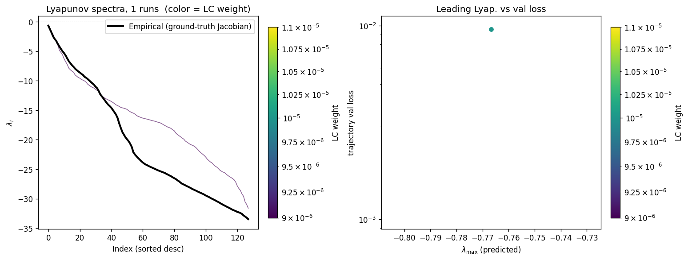
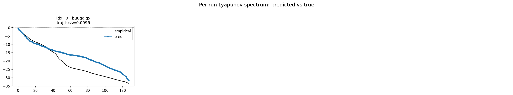
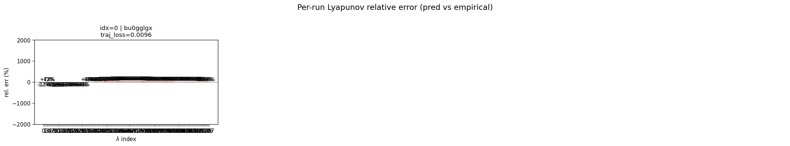
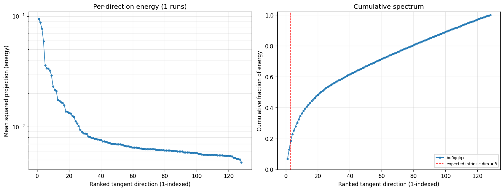

# Sweep Analysis: `wmtask_latent_additive_mse_p30_permidentity_replication`

**Project**: [WMTask_identity_encoder_verification](https://wandb.ai/JacobianODE/WMTask_identity_encoder_verification/groups/wmtask_latent_additive_mse_p30_permidentity_replication)  
**Launched**: 2026-04-27T03:45:11Z  
**Completed**: 2026-04-27T04:00:18Z  
**Outcome**: `complete_with_failures`  
**Git**: `latent-JacobianODE` @ `42e46ba`  
**Expected runs**: 1

## Experiment Context

### `wmtask_latent_additive_mse_p30_permidentity_replication`

**Description**

Same as wmtask_latent_additive_mse_p30_dualckpt_replication except
encoder.final_perm_identity=true. Single run, LC=1e-5,
obs_noise_scale=0.05, dual checkpoint (patience=5 + shadow=2).

**Hypothesis**

Trained monolithic with final_perm_identity=true should reach
similar best_traj_loss as the original (i73jwojr ~0.0105) and
produce a clean Lyapunov spectrum (Δλ_min ≈ 0). The diagnostic on
its trained best.ckpt should give the apples-to-apples gradient-
signal numbers we need to compare against DirectSum.

**Success criteria**

- Run trains without divergence
- Both es2-best.ckpt and (epoch-best) best.ckpt saved
- best_traj_loss within ~2x of i73jwojr's 0.0105

## Results

**Chosen run** (by `best_traj_loss`): `bu0gglgx` — traj_loss=0.00961, MASE=0.9073, R²=0.9890, LC loss=3.952, epoch=8.0

**Runs analyzed**: 1 (expected 1)

### Per-run results

| run_idx | run_id | best_traj_loss | best_MASE | R² | LC loss | epoch |
|---|---|---|---|---|---|---|
| 0 | `bu0gglgx` | 0.00961 | 0.9073 | 0.9890 | 3.952 | 8.0 |

## Success-criteria verdicts (automated)

| Criterion | Verdict | Note |
|---|---|---|
| Run trains without divergence | **Unknown** |  |
| Both es2-best.ckpt and (epoch-best) best.ckpt saved | **Unknown** |  |
| best_traj_loss within ~2x of i73jwojr's 0.0105 | **Unknown** |  |

_Automated verdicts use simple numeric-threshold parsing and may mis-classify qualitative criteria. The Discussion section below takes precedence._

## Figures

### per_run_lyapunov

### per_run_lyapunov_vs_true

### per_run_lyapunov_relerr

### per_run_tangent_spectrum

## Discussion

<!--
This section is intentionally left as a placeholder. A human reviewer
or Claude Code agent should fill it in based on the tables and figures
above, explicitly addressing each success criterion and comparing the
outcome to the stated hypothesis. Write the Discussion to
`discussion.md` in this directory and re-run `render_report`.
-->

_(to be written)_
