# Sweep Analysis: `wmtask_pobs16_cayley_top3nd_lcobs_20260501T163325Z__stage_b`

**Project**: [WMTask_identity_encoder_verification](https://wandb.ai/JacobianODE/WMTask_identity_encoder_verification/groups/wmtask_pobs16_cayley_top3nd_lcobs_20260501T163325Z__stage_b)  
**Launched**: 2026-05-01T22:25:18Z  
**Completed**: 2026-05-02T02:30:29Z  
**Outcome**: `complete_clean`  
**Git**: `latent-JacobianODE` @ `db13c30`  
**Expected runs**: 32

## Experiment Context

### `wmtask_direct_sum_additive_p20_perareapcaautodim_cayley_partialobs16_splitmode_top3nd_nearid_tf__lc_x_obsnoisescale_sweep`

**Description**

WMTask partial-obs (16 random per area, partial_obs_seed=42) full grid
sweep: 3 n_delays (top-3 from sweep 1) × 7 LC × 3 obs_noise_scale = 63
cells, with two-stage Stage A → Stage B culling. Same encoder recipe
as the full-obs Cayley pca_999 winner (DirectSum + per-area PCA-99
autodim + Cayley orthogonal mixers + near-identity init + TF-coupled
LR + split-mode losses), with prediction_steps=20 and seq_length=35
so n_delays up to 15 fits the 49-frame delay2 window.

**Hypothesis**

With the top-3 n_delays already identified, this grid is the partial-obs
analogue of the full-obs Cayley LC × obs_noise sweep that identified
pjiw0cab (LC=1e-4, obs=0, traj=0.0042). Expectation: best partial-obs
cell within ~3x of pjiw0cab if the recipe ports cleanly. If best is
much worse, the partial-obs sufficient-statistic hypothesis (memory:
project_partial_obs_sufficient_statistic.md) needs revisiting at this
n_observed level.

**Success criteria**

- All 63 Stage A cells train without divergence
- Stage A → Stage B cull keeps approximately 32 cells (cull_fraction=0.5)
- Stage B survivors all reach es2-best.ckpt and es5-best.ckpt
- Best Stage B val traj_loss within 3x of full-obs Cayley pjiw0cab (~0.0042)
- At least one (LC, obs_noise) cell passes C1/C2/C3 validity at each of the 3 n_delays

## Results

**Swept axes** (10): `data.postprocessing.generalized_variance`, `data.train_test_params.delay_embedding_params.n_delays`, `model.n_target_dims`, `model.n_target_dims_per_block_pca_auto`, `model.n_target_dims_per_block_pca_cum_var`, `model.params.input_dim`, `model.params.output_dim`, `training.ckpt_path`, `training.lightning.loop_closure_weight`, `training.lightning.obs_noise_scale`

**Chosen run** (by `best_traj_loss`): `4a41gs3b` — traj_loss=0.00337, MASE=0.5958, R²=0.9959, LC loss=40.940, epoch=40.0

Swept-axis values at chosen run: `data.postprocessing.generalized_variance`=0.0197462 · `data.train_test_params.delay_embedding_params.n_delays`=12 · `model.n_target_dims`=33 · `model.n_target_dims_per_block_pca_auto`=[19, 14] · `model.n_target_dims_per_block_pca_cum_var`=[0.990466904603792, 0.9907145482737882] · `model.params.input_dim`=33 · `model.params.output_dim`=1089 · `training.ckpt_path`=/orcd/data/ekmiller/001/eisenaj/JacobianODE/sweeps/two_stage_ckpts/wmtask_pobs16_cayley_top3nd_lcobs_20260501T163325Z__stage_a/7ec67a42d1c5dfae/last.ckpt · `training.lightning.loop_closure_weight`=1.0e-06 · `training.lightning.obs_noise_scale`=0

**Runs analyzed**: 32 (expected 32)

### Per-run results

| run_idx | run_id | `data.postprocessing.generalized_variance` | `data.train_test_params.delay_embedding_params.n_delays` | `model.n_target_dims` | `model.n_target_dims_per_block_pca_auto` | `model.n_target_dims_per_block_pca_cum_var` | `model.params.input_dim` | `model.params.output_dim` | `training.ckpt_path` | `training.lightning.loop_closure_weight` | `training.lightning.obs_noise_scale` | best_traj_loss | best_MASE | R² | LC loss | epoch |
|---|---|---|---|---|---|---|---|---|---|---|---|---|---|---|---|---|
| 4 | `4a41gs3b` | 0.0197462 | 12 | 33 | [19, 14] | [0.990466904603792, 0.9907145482737882] | 33 | 1089 | /orcd/data/ekmiller/001/eisenaj/JacobianODE/sweeps/two_stage_ckpts/wmtask_pobs16_cayley_top3nd_lcobs_20260501T163325Z__stage_a/7ec67a42d1c5dfae/last.ckpt | 1.0e-06 | 0 | 0.00337 | 0.5958 | 0.9959 | 40.940 | 40.0 |
| 5 | `bya5fspy` | 0.0197462 | 6 | 25 | [14, 11] | [0.9903351849713868, 0.9900285479042218] | 25 | 625 | /orcd/data/ekmiller/001/eisenaj/JacobianODE/sweeps/two_stage_ckpts/wmtask_pobs16_cayley_top3nd_lcobs_20260501T163325Z__stage_a/e04d172d7c19542d/last.ckpt | 1.0e-05 | 0 | 0.00337 | 0.5926 | 0.9959 | 11.108 | 43.0 |
| 3 | `fpj534gw` | 0.0197462 | 9 | 30 | [17, 13] | [0.9905957045468444, 0.9910578856637212] | 30 | 900 | /orcd/data/ekmiller/001/eisenaj/JacobianODE/sweeps/two_stage_ckpts/wmtask_pobs16_cayley_top3nd_lcobs_20260501T163325Z__stage_a/5cea1ce00769376b/last.ckpt | 1.0e-06 | 0 | 0.00338 | 0.5913 | 0.9960 | 39.861 | 38.0 |
| 7 | `thzq0fk3` | 0.0197462 | 12 | 33 | [19, 14] | [0.990466904603792, 0.9907145482737882] | 33 | 1089 | /orcd/data/ekmiller/001/eisenaj/JacobianODE/sweeps/two_stage_ckpts/wmtask_pobs16_cayley_top3nd_lcobs_20260501T163325Z__stage_a/f79da651d0874c6e/last.ckpt | 0 | 0 | 0.00338 | 0.5964 | 0.9959 | 101.784 | 40.0 |
| 2 | `es7u8bok` | 0.0197462 | 9 | 30 | [17, 13] | [0.9905957045468444, 0.9910578856637212] | 30 | 900 | /orcd/data/ekmiller/001/eisenaj/JacobianODE/sweeps/two_stage_ckpts/wmtask_pobs16_cayley_top3nd_lcobs_20260501T163325Z__stage_a/250ba3e607efe585/last.ckpt | 0 | 0 | 0.00338 | 0.5915 | 0.9960 | 97.237 | 38.0 |
| 8 | `c3uk2npp` | 0.0197462 | 12 | 33 | [19, 14] | [0.990466904603792, 0.9907145482737882] | 33 | 1089 | /orcd/data/ekmiller/001/eisenaj/JacobianODE/sweeps/two_stage_ckpts/wmtask_pobs16_cayley_top3nd_lcobs_20260501T163325Z__stage_a/0911511d700e9cd7/last.ckpt | 1.0e-05 | 0 | 0.00339 | 0.5974 | 0.9958 | 11.131 | 40.0 |
| 6 | `wu8b6svd` | 0.0197462 | 9 | 30 | [17, 13] | [0.9905957045468436, 0.99105788566372] | 30 | 900 | /orcd/data/ekmiller/001/eisenaj/JacobianODE/sweeps/two_stage_ckpts/wmtask_pobs16_cayley_top3nd_lcobs_20260501T163325Z__stage_a/2bcdc935dc22d3a8/last.ckpt | 1.0e-05 | 0 | 0.00339 | 0.5926 | 0.9959 | 10.827 | 37.0 |
| 1 | `hiiwuy1d` | 0.0197462 | 6 | 25 | [14, 11] | [0.9903351849713868, 0.9900285479042212] | 25 | 625 | /orcd/data/ekmiller/001/eisenaj/JacobianODE/sweeps/two_stage_ckpts/wmtask_pobs16_cayley_top3nd_lcobs_20260501T163325Z__stage_a/4bdadbe914dfd0cb/last.ckpt | 1.0e-06 | 0 | 0.00342 | 0.5962 | 0.9959 | 37.053 | 36.0 |
| 0 | `a8pp6sqt` | 0.0197462 | 6 | 25 | [14, 11] | [0.9903351849713868, 0.9900285479042212] | 25 | 625 | /orcd/data/ekmiller/001/eisenaj/JacobianODE/sweeps/two_stage_ckpts/wmtask_pobs16_cayley_top3nd_lcobs_20260501T163325Z__stage_a/ea5b8ea7676f1e4e/last.ckpt | 0 | 0 | 0.00342 | 0.5964 | 0.9959 | 91.541 | 36.0 |
| 15 | `gagriild` | 0.0197462 | 6 | 25 | [14, 11] | [0.9903351849713868, 0.9900285479042218] | 25 | 625 | /orcd/data/ekmiller/001/eisenaj/JacobianODE/sweeps/two_stage_ckpts/wmtask_pobs16_cayley_top3nd_lcobs_20260501T163325Z__stage_a/0e5af2045a0589ab/last.ckpt | 1.0e-04 | 0 | 0.00351 | 0.6033 | 0.9958 | 2.121 | 43.0 |
| 13 | `geqp9qaf` | 0.0197462 | 6 | 25 | [14, 11] | [0.9903351849713868, 0.9900285479042218] | 25 | 625 | /orcd/data/ekmiller/001/eisenaj/JacobianODE/sweeps/two_stage_ckpts/wmtask_pobs16_cayley_top3nd_lcobs_20260501T163325Z__stage_a/95d7b552fb866dc3/last.ckpt | 0 | 0.01 | 0.00352 | 0.6047 | 0.9957 | 112.804 | 43.0 |
| 16 | `ebdr4x97` | 0.0197462 | 6 | 25 | [14, 11] | [0.9903351849713868, 0.9900285479042218] | 25 | 625 | /orcd/data/ekmiller/001/eisenaj/JacobianODE/sweeps/two_stage_ckpts/wmtask_pobs16_cayley_top3nd_lcobs_20260501T163325Z__stage_a/3860ebb0ca4ed993/last.ckpt | 1.0e-06 | 0.01 | 0.00352 | 0.6051 | 0.9957 | 55.339 | 43.0 |
| 20 | `8cupshuw` | 0.0197462 | 9 | 30 | [17, 13] | [0.9905957045468436, 0.99105788566372] | 30 | 900 | /orcd/data/ekmiller/001/eisenaj/JacobianODE/sweeps/two_stage_ckpts/wmtask_pobs16_cayley_top3nd_lcobs_20260501T163325Z__stage_a/ded53340dfe5edd1/last.ckpt | 0 | 0.05 | 0.00352 | 0.6025 | 0.9958 | 197.668 | 42.0 |
| 18 | `9ha8yy28` | 0.0197462 | 9 | 30 | [17, 13] | [0.9905957045468436, 0.99105788566372] | 30 | 900 | /orcd/data/ekmiller/001/eisenaj/JacobianODE/sweeps/two_stage_ckpts/wmtask_pobs16_cayley_top3nd_lcobs_20260501T163325Z__stage_a/52b2fcee3de921a8/last.ckpt | 1.0e-05 | 0.05 | 0.00352 | 0.6026 | 0.9958 | 31.662 | 42.0 |
| 19 | `bkqmijeu` | 0.0197462 | 9 | 30 | [17, 13] | [0.9905957045468436, 0.99105788566372] | 30 | 900 | /orcd/data/ekmiller/001/eisenaj/JacobianODE/sweeps/two_stage_ckpts/wmtask_pobs16_cayley_top3nd_lcobs_20260501T163325Z__stage_a/b9424ddc769a7242/last.ckpt | 1.0e-06 | 0.05 | 0.00352 | 0.6026 | 0.9958 | 105.388 | 42.0 |
| 17 | `u0c0hfy7` | 0.0197462 | 6 | 25 | [14, 11] | [0.9903351849713868, 0.9900285479042218] | 25 | 625 | /orcd/data/ekmiller/001/eisenaj/JacobianODE/sweeps/two_stage_ckpts/wmtask_pobs16_cayley_top3nd_lcobs_20260501T163325Z__stage_a/b0e54c0f6e7d4591/last.ckpt | 1.0e-05 | 0.01 | 0.00353 | 0.6056 | 0.9957 | 16.836 | 43.0 |
| 12 | `bnb97vf9` | 0.0197462 | 9 | 30 | [17, 13] | [0.9905957045468436, 0.99105788566372] | 30 | 900 | /orcd/data/ekmiller/001/eisenaj/JacobianODE/sweeps/two_stage_ckpts/wmtask_pobs16_cayley_top3nd_lcobs_20260501T163325Z__stage_a/677ea3f14ae34a5b/last.ckpt | 1.0e-04 | 0 | 0.00353 | 0.6033 | 0.9958 | 2.014 | 36.0 |
| 11 | `0inmp2c4` | 0.0197462 | 6 | 25 | [14, 11] | [0.9903351849713868, 0.9900285479042218] | 25 | 625 | /orcd/data/ekmiller/001/eisenaj/JacobianODE/sweeps/two_stage_ckpts/wmtask_pobs16_cayley_top3nd_lcobs_20260501T163325Z__stage_a/2dac5b03ce137a4b/last.ckpt | 1.0e-05 | 0.05 | 0.00354 | 0.6061 | 0.9957 | 18.635 | 33.0 |
| 10 | `mka5g97h` | 0.0197462 | 6 | 25 | [14, 11] | [0.9903351849713868, 0.9900285479042218] | 25 | 625 | /orcd/data/ekmiller/001/eisenaj/JacobianODE/sweeps/two_stage_ckpts/wmtask_pobs16_cayley_top3nd_lcobs_20260501T163325Z__stage_a/e2666e227508e141/last.ckpt | 1.0e-06 | 0.05 | 0.00355 | 0.6063 | 0.9957 | 62.041 | 33.0 |
| 9 | `4mxen7im` | 0.0197462 | 6 | 25 | [14, 11] | [0.9903351849713868, 0.9900285479042212] | 25 | 625 | /orcd/data/ekmiller/001/eisenaj/JacobianODE/sweeps/two_stage_ckpts/wmtask_pobs16_cayley_top3nd_lcobs_20260501T163325Z__stage_a/973df263777ea90a/last.ckpt | 0 | 0.05 | 0.00355 | 0.6064 | 0.9957 | 120.421 | 30.0 |
| 21 | `bcwx5q0x` | 0.0197462 | 6 | 25 | [14, 11] | [0.9903351849713868, 0.9900285479042218] | 25 | 625 | /orcd/data/ekmiller/001/eisenaj/JacobianODE/sweeps/two_stage_ckpts/wmtask_pobs16_cayley_top3nd_lcobs_20260501T163325Z__stage_a/da21574d853db0e7/last.ckpt | 1.0e-04 | 0.05 | 0.00357 | 0.6081 | 0.9957 | 4.242 | 38.0 |
| 14 | `yq93l1q2` | 0.0197462 | 12 | 33 | [19, 14] | [0.9904669046037916, 0.990714548273788] | 33 | 1089 | /orcd/data/ekmiller/001/eisenaj/JacobianODE/sweeps/two_stage_ckpts/wmtask_pobs16_cayley_top3nd_lcobs_20260501T163325Z__stage_a/da99c88a3601a925/last.ckpt | 1.0e-04 | 0 | 0.00360 | 0.6147 | 0.9956 | 1.755 | 33.0 |
| 22 | `939cyltj` | 0.0197462 | 6 | 25 | [14, 11] | [0.9903351849713868, 0.9900285479042218] | 25 | 625 | /orcd/data/ekmiller/001/eisenaj/JacobianODE/sweeps/two_stage_ckpts/wmtask_pobs16_cayley_top3nd_lcobs_20260501T163325Z__stage_a/0d4942c70fc7f83c/last.ckpt | 1.0e-04 | 0.01 | 0.00367 | 0.6163 | 0.9956 | 3.605 | 41.0 |
| 23 | `jcrbzbht` | 0.0197462 | 9 | 30 | [17, 13] | [0.9905957045468444, 0.9910578856637212] | 30 | 900 | /orcd/data/ekmiller/001/eisenaj/JacobianODE/sweeps/two_stage_ckpts/wmtask_pobs16_cayley_top3nd_lcobs_20260501T163325Z__stage_a/204146faf00a2c7e/last.ckpt | 1.0e-05 | 0.01 | 0.00370 | 0.6178 | 0.9956 | 28.308 | 42.0 |
| 26 | `9vehhef6` | 0.0197462 | 9 | 30 | [17, 13] | [0.9905957045468436, 0.99105788566372] | 30 | 900 | /orcd/data/ekmiller/001/eisenaj/JacobianODE/sweeps/two_stage_ckpts/wmtask_pobs16_cayley_top3nd_lcobs_20260501T163325Z__stage_a/ff9ca99adc72a6e3/last.ckpt | 1.0e-04 | 0.05 | 0.00371 | 0.6174 | 0.9956 | 7.610 | 42.0 |
| 25 | `px3o1zut` | 0.0197462 | 9 | 30 | [17, 13] | [0.9905957045468436, 0.99105788566372] | 30 | 900 | /orcd/data/ekmiller/001/eisenaj/JacobianODE/sweeps/two_stage_ckpts/wmtask_pobs16_cayley_top3nd_lcobs_20260501T163325Z__stage_a/834b0ee94afe8d90/last.ckpt | 0 | 0.01 | 0.00384 | 0.6284 | 0.9954 | 176.204 | 34.0 |
| 24 | `w4dmbcc0` | 0.0197462 | 9 | 30 | [17, 13] | [0.9905957045468436, 0.99105788566372] | 30 | 900 | /orcd/data/ekmiller/001/eisenaj/JacobianODE/sweeps/two_stage_ckpts/wmtask_pobs16_cayley_top3nd_lcobs_20260501T163325Z__stage_a/38764eb8fd379476/last.ckpt | 1.0e-06 | 0.01 | 0.00384 | 0.6286 | 0.9954 | 88.521 | 33.0 |
| 28 | `jhtjo038` | 0.0197462 | 12 | 33 | [19, 14] | [0.990466904603792, 0.9907145482737882] | 33 | 1089 | /orcd/data/ekmiller/001/eisenaj/JacobianODE/sweeps/two_stage_ckpts/wmtask_pobs16_cayley_top3nd_lcobs_20260501T163325Z__stage_a/87b53ac0da7ee584/last.ckpt | 0.001 | 0 | 0.00391 | 0.6380 | 0.9952 | 0.271 | 40.0 |
| 31 | `vskt18d2` | 0.0197462 | 12 | 33 | [19, 14] | [0.9904669046037916, 0.990714548273788] | 33 | 1089 | /orcd/data/ekmiller/001/eisenaj/JacobianODE/sweeps/two_stage_ckpts/wmtask_pobs16_cayley_top3nd_lcobs_20260501T163325Z__stage_a/8f3f1fe599223be4/last.ckpt | 0 | 0.05 | 0.00392 | 0.6375 | 0.9952 | 417.561 | 49.0 |
| 29 | `vx29kcmh` | 0.0197462 | 9 | 30 | [17, 13] | [0.9905957045468436, 0.99105788566372] | 30 | 900 | /orcd/data/ekmiller/001/eisenaj/JacobianODE/sweeps/two_stage_ckpts/wmtask_pobs16_cayley_top3nd_lcobs_20260501T163325Z__stage_a/d28399ecd4f7fe2d/last.ckpt | 0.001 | 0 | 0.00392 | 0.6330 | 0.9953 | 0.311 | 39.0 |
| 27 | `oklubokp` | 0.0197462 | 9 | 30 | [17, 13] | [0.9905957045468436, 0.99105788566372] | 30 | 900 | /orcd/data/ekmiller/001/eisenaj/JacobianODE/sweeps/two_stage_ckpts/wmtask_pobs16_cayley_top3nd_lcobs_20260501T163325Z__stage_a/a5ed59334538761b/last.ckpt | 1.0e-04 | 0.01 | 0.00392 | 0.6339 | 0.9953 | 6.736 | 42.0 |
| 30 | `xam0gu7r` | 0.0197462 | 6 | 25 | [14, 11] | [0.9903351849713868, 0.9900285479042212] | 25 | 625 | /orcd/data/ekmiller/001/eisenaj/JacobianODE/sweeps/two_stage_ckpts/wmtask_pobs16_cayley_top3nd_lcobs_20260501T163325Z__stage_a/80d3ffebc62a6fd5/last.ckpt | 0.001 | 0 | 0.00398 | 0.6388 | 0.9952 | 0.325 | 41.0 |

### Best run per `obs_noise_scale`

| obs_noise_scale | Best LC weight | Best traj loss | MASE at best | R² | LC loss | epoch |
|---|---|---|---|---|---|---|
| 0.0 | 1.0e-06 | 0.00337 | 0.5958 | 0.9959 | 40.940 | 40.0 |
| 0.01 | 0.0e+00 | 0.00352 | 0.6047 | 0.9957 | 112.804 | 43.0 |
| 0.05 | 0.0e+00 | 0.00352 | 0.6025 | 0.9958 | 197.668 | 42.0 |

## Success-criteria verdicts (automated)

| Criterion | Verdict | Note |
|---|---|---|
| All 63 Stage A cells train without divergence | **Unknown** |  |
| Stage A → Stage B cull keeps approximately 32 cells (cull_fraction=0.5) | **Unknown** |  |
| Stage B survivors all reach es2-best.ckpt and es5-best.ckpt | **Unknown** |  |
| Best Stage B val traj_loss within 3x of full-obs Cayley pjiw0cab (~0.0042) | **Unknown** |  |
| At least one (LC, obs_noise) cell passes C1/C2/C3 validity at each of the 3 n_delays | **Unknown** |  |

_Automated verdicts use simple numeric-threshold parsing and may mis-classify qualitative criteria. The Discussion section below takes precedence._

## Figures

### sweep_overview

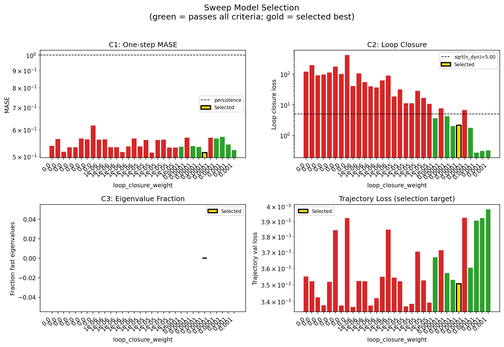

### sweep_pareto

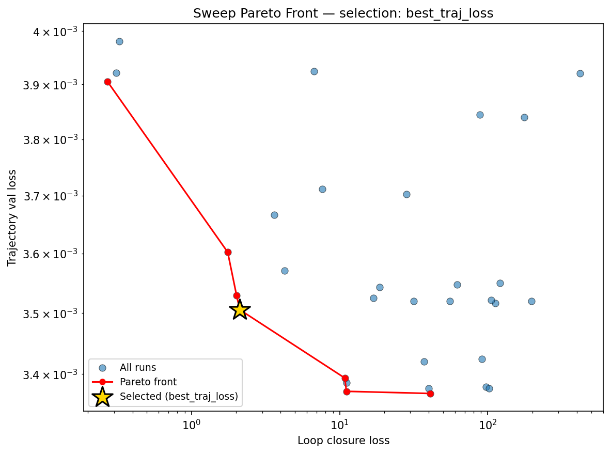

### reconstruction

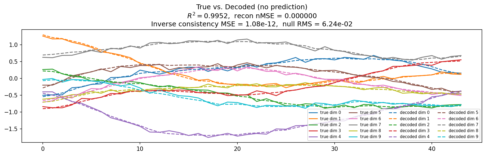

### prediction_windows

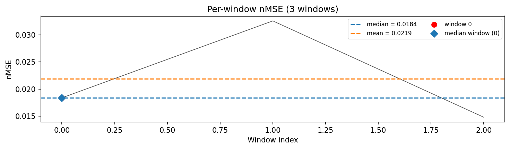

### long_trajectory

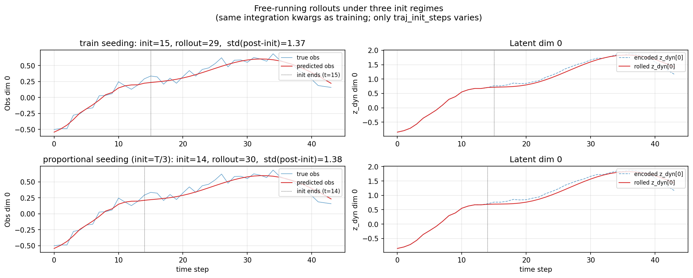

### mase

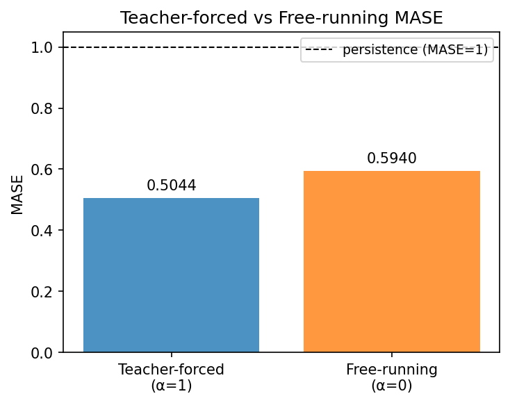

### latent_utilization

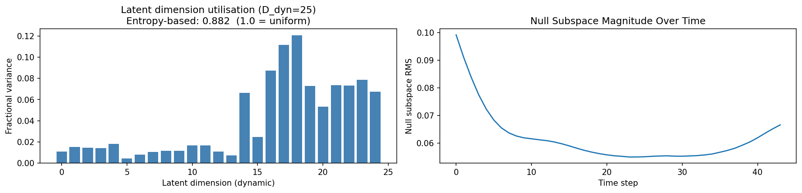

### lyapunov

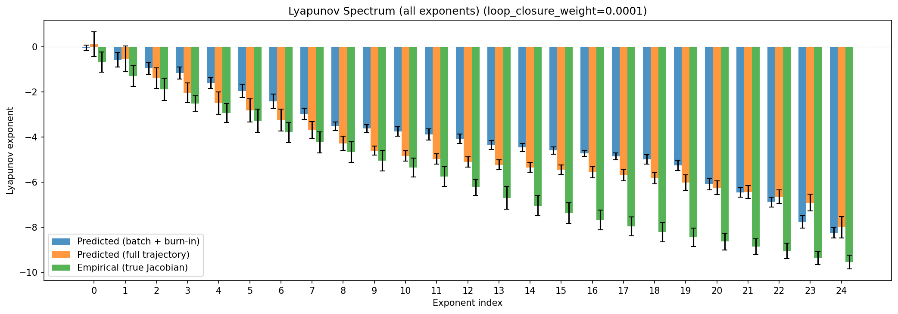

### lyapunov_top10

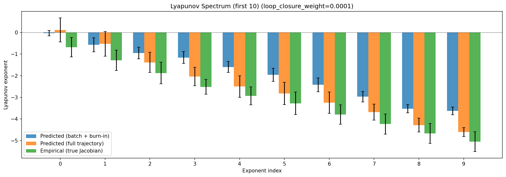

### kaplan_yorke

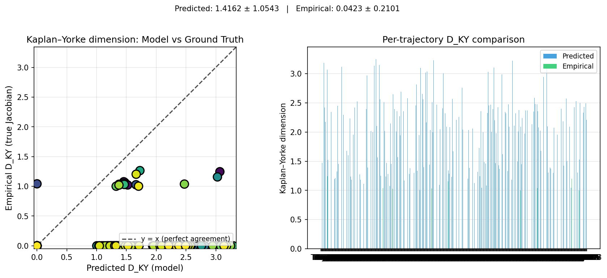

### per_run_lyapunov

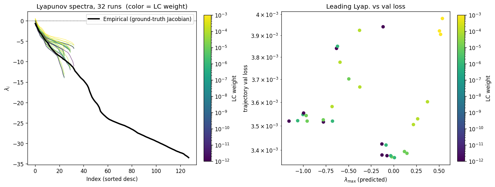

### per_run_lyapunov_vs_true

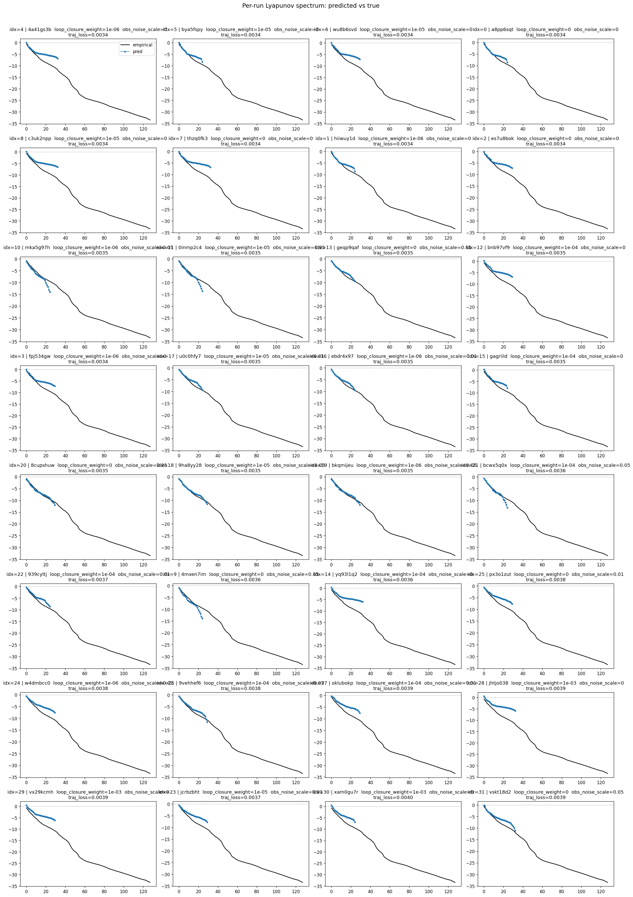

### per_run_lyapunov_relerr

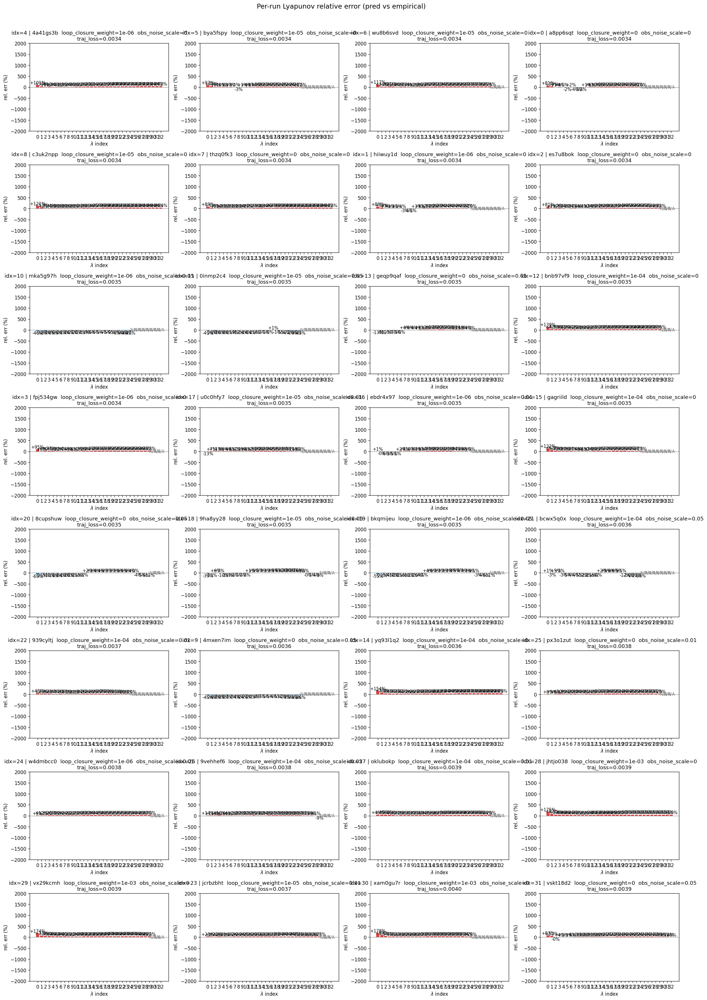

### encoder_decoder_jacobians

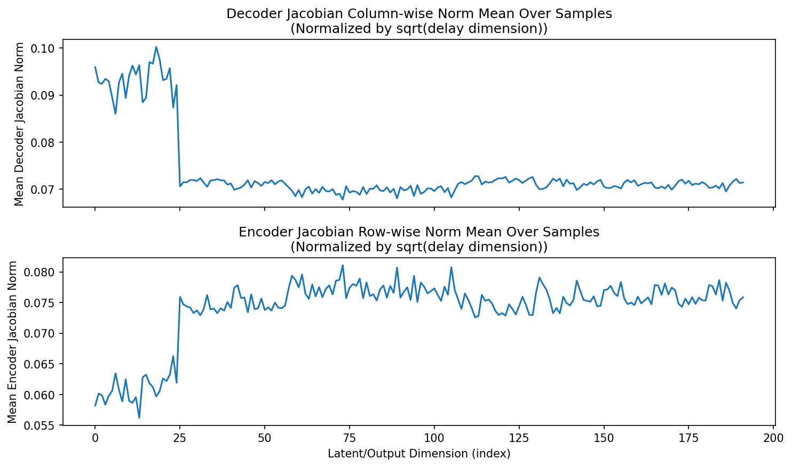

### amplification

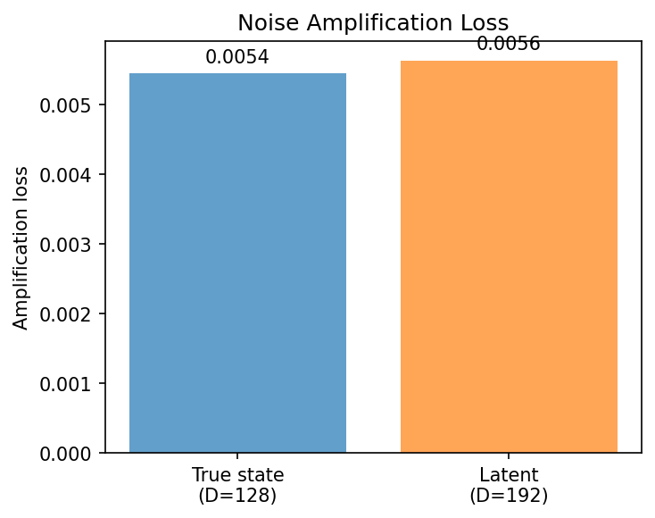

### kaplan_yorke_pca

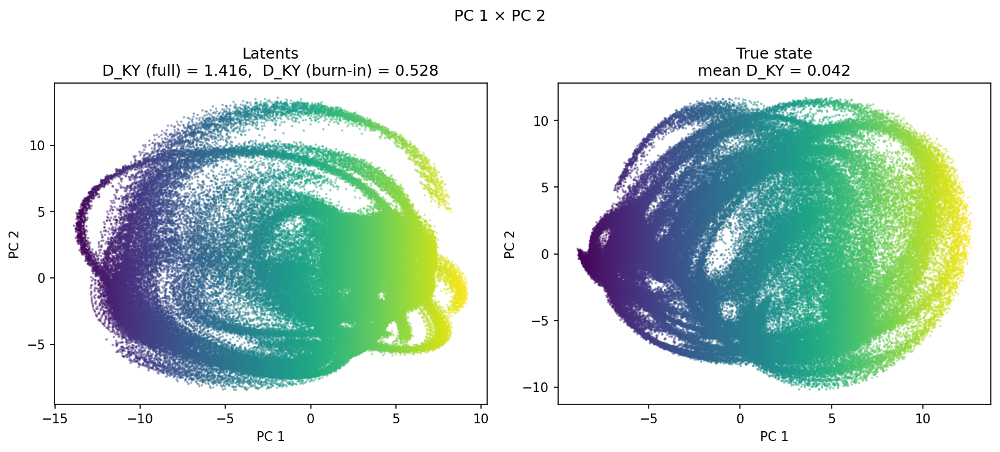

### prediction_detail_latent

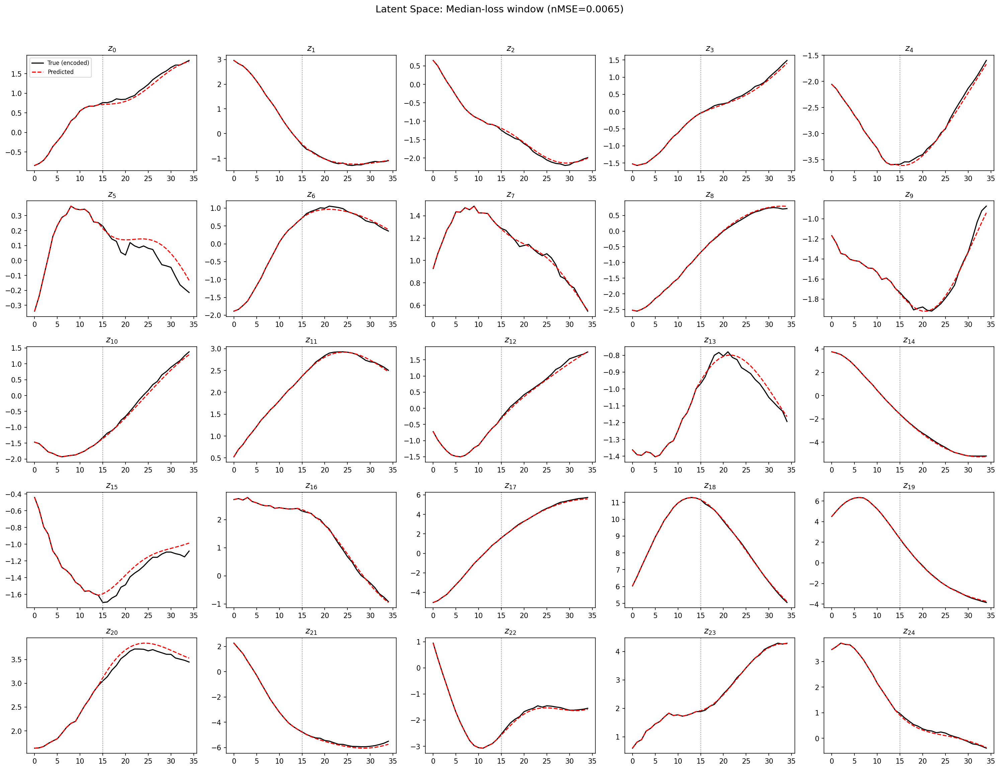

### prediction_detail_obs

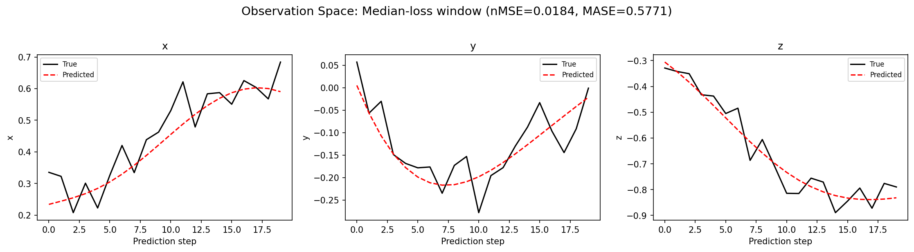

### tangent_spectrum

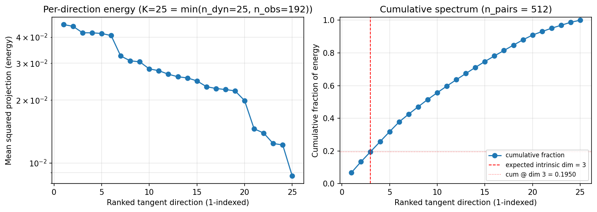

### per_run_tangent_spectrum

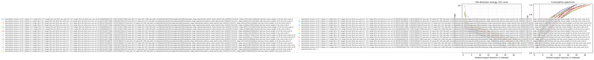

## Discussion

<!--
This section is intentionally left as a placeholder. A human reviewer
or Claude Code agent should fill it in based on the tables and figures
above, explicitly addressing each success criterion and comparing the
outcome to the stated hypothesis. Write the Discussion to
`discussion.md` in this directory and re-run `render_report`.
-->

_(to be written)_

## `run_analytics` stdout

<details><summary>Click to expand — full diagnostic output from <code>run_analytics</code></summary>

```
No run_id provided — selecting best run from group 'wmtask_pobs16_cayley_top3nd_lcobs_20260501T163325Z__stage_b' ...
Found 32 total runs in JacobianODE/WMTask_identity_encoder_verification (group=wmtask_pobs16_cayley_top3nd_lcobs_20260501T163325Z__stage_b)
All runs (state, loop_closure_weight, tangent_entropy_weight, kl_dyn_weight):
  4a41gs3b: state=finished, lc=1e-06, te=0.0, kl_dyn=0.0
  bya5fspy: state=finished, lc=1e-05, te=0.0, kl_dyn=0.0
  wu8b6svd: state=finished, lc=1e-05, te=0.0, kl_dyn=0.0
  a8pp6sqt: state=finished, lc=0.0, te=0.0, kl_dyn=0.0
  c3uk2npp: state=finished, lc=1e-05, te=0.0, kl_dyn=0.0
  thzq0fk3: state=finished, lc=0.0, te=0.0, kl_dyn=0.0
  hiiwuy1d: state=finished, lc=1e-06, te=0.0, kl_dyn=0.0
  es7u8bok: state=finished, lc=0.0, te=0.0, kl_dyn=0.0
  mka5g97h: state=finished, lc=1e-06, te=0.0, kl_dyn=0.0
  0inmp2c4: state=finished, lc=1e-05, te=0.0, kl_dyn=0.0
  geqp9qaf: state=finished, lc=0.0, te=0.0, kl_dyn=0.0
  bnb97vf9: state=finished, lc=0.0001, te=0.0, kl_dyn=0.0
  fpj534gw: state=finished, lc=1e-06, te=0.0, kl_dyn=0.0
  u0c0hfy7: state=finished, lc=1e-05, te=0.0, kl_dyn=0.0
  ebdr4x97: state=finished, lc=1e-06, te=0.0, kl_dyn=0.0
  gagriild: state=finished, lc=0.0001, te=0.0, kl_dyn=0.0
  8cupshuw: state=finished, lc=0.0, te=0.0, kl_dyn=0.0
  9ha8yy28: state=finished, lc=1e-05, te=0.0, kl_dyn=0.0
  bkqmijeu: state=finished, lc=1e-06, te=0.0, kl_dyn=0.0
  bcwx5q0x: state=finished, lc=0.0001, te=0.0, kl_dyn=0.0
  939cyltj: state=finished, lc=0.0001, te=0.0, kl_dyn=0.0
  4mxen7im: state=finished, lc=0.0, te=0.0, kl_dyn=0.0
  yq93l1q2: state=finished, lc=0.0001, te=0.0, kl_dyn=0.0
  px3o1zut: state=finished, lc=0.0, te=0.0, kl_dyn=0.0
  w4dmbcc0: state=finished, lc=1e-06, te=0.0, kl_dyn=0.0
  9vehhef6: state=finished, lc=0.0001, te=0.0, kl_dyn=0.0
  oklubokp: state=finished, lc=0.0001, te=0.0, kl_dyn=0.0
  jhtjo038: state=finished, lc=0.001, te=0.0, kl_dyn=0.0
  vx29kcmh: state=finished, lc=0.001, te=0.0, kl_dyn=0.0
  jcrbzbht: state=finished, lc=1e-05, te=0.0, kl_dyn=0.0
  xam0gu7r: state=finished, lc=0.001, te=0.0, kl_dyn=0.0
  vskt18d2: state=finished, lc=0.0, te=0.0, kl_dyn=0.0

slurm_timeout_min not found in any run config — falling back to 180 min
  Including 4a41gs3b (lc=1e-06): use_all_runs=True (state=finished)
  Including bya5fspy (lc=1e-05): use_all_runs=True (state=finished)
  Including wu8b6svd (lc=1e-05): use_all_runs=True (state=finished)
  Including a8pp6sqt (lc=0.0): use_all_runs=True (state=finished)
  Including c3uk2npp (lc=1e-05): use_all_runs=True (state=finished)
  Including thzq0fk3 (lc=0.0): use_all_runs=True (state=finished)
  Including hiiwuy1d (lc=1e-06): use_all_runs=True (state=finished)
  Including es7u8bok (lc=0.0): use_all_runs=True (state=finished)
  Including mka5g97h (lc=1e-06): use_all_runs=True (state=finished)
  Including 0inmp2c4 (lc=1e-05): use_all_runs=True (state=finished)
  Including geqp9qaf (lc=0.0): use_all_runs=True (state=finished)
  Including bnb97vf9 (lc=0.0001): use_all_runs=True (state=finished)
  Including fpj534gw (lc=1e-06): use_all_runs=True (state=finished)
  Including u0c0hfy7 (lc=1e-05): use_all_runs=True (state=finished)
  Including ebdr4x97 (lc=1e-06): use_all_runs=True (state=finished)
  Including gagriild (lc=0.0001): use_all_runs=True (state=finished)
  Including 8cupshuw (lc=0.0): use_all_runs=True (state=finished)
  Including 9ha8yy28 (lc=1e-05): use_all_runs=True (state=finished)
  Including bkqmijeu (lc=1e-06): use_all_runs=True (state=finished)
  Including bcwx5q0x (lc=0.0001): use_all_runs=True (state=finished)
  Including 939cyltj (lc=0.0001): use_all_runs=True (state=finished)
  Including 4mxen7im (lc=0.0): use_all_runs=True (state=finished)
  Including yq93l1q2 (lc=0.0001): use_all_runs=True (state=finished)
  Including px3o1zut (lc=0.0): use_all_runs=True (state=finished)
  Including w4dmbcc0 (lc=1e-06): use_all_runs=True (state=finished)
  Including 9vehhef6 (lc=0.0001): use_all_runs=True (state=finished)
  Including oklubokp (lc=0.0001): use_all_runs=True (state=finished)
  Including jhtjo038 (lc=0.001): use_all_runs=True (state=finished)
  Including vx29kcmh (lc=0.001): use_all_runs=True (state=finished)
  Including jcrbzbht (lc=1e-05): use_all_runs=True (state=finished)
  Including xam0gu7r (lc=0.001): use_all_runs=True (state=finished)
  Including vskt18d2 (lc=0.0): use_all_runs=True (state=finished)
Found 32 effectively-done sweep runs:
  loop_closure_weight=0.0, tangent_entropy_weight=0.0, kl_dyn_weight=0.0 -> run_id=4mxen7im
  loop_closure_weight=0.0, tangent_entropy_weight=0.0, kl_dyn_weight=0.0 -> run_id=8cupshuw
  loop_closure_weight=0.0, tangent_entropy_weight=0.0, kl_dyn_weight=0.0 -> run_id=a8pp6sqt
  loop_closure_weight=0.0, tangent_entropy_weight=0.0, kl_dyn_weight=0.0 -> run_id=es7u8bok
  loop_closure_weight=0.0, tangent_entropy_weight=0.0, kl_dyn_weight=0.0 -> run_id=geqp9qaf
  loop_closure_weight=0.0, tangent_entropy_weight=0.0, kl_dyn_weight=0.0 -> run_id=px3o1zut
  loop_closure_weight=0.0, tangent_entropy_weight=0.0, kl_dyn_weight=0.0 -> run_id=thzq0fk3
  loop_closure_weight=0.0, tangent_entropy_weight=0.0, kl_dyn_weight=0.0 -> run_id=vskt18d2
  loop_closure_weight=1e-06, tangent_entropy_weight=0.0, kl_dyn_weight=0.0 -> run_id=4a41gs3b
  loop_closure_weight=1e-06, tangent_entropy_weight=0.0, kl_dyn_weight=0.0 -> run_id=bkqmijeu
  loop_closure_weight=1e-06, tangent_entropy_weight=0.0, kl_dyn_weight=0.0 -> run_id=ebdr4x97
  loop_closure_weight=1e-06, tangent_entropy_weight=0.0, kl_dyn_weight=0.0 -> run_id=fpj534gw
  loop_closure_weight=1e-06, tangent_entropy_weight=0.0, kl_dyn_weight=0.0 -> run_id=hiiwuy1d
  loop_closure_weight=1e-06, tangent_entropy_weight=0.0, kl_dyn_weight=0.0 -> run_id=mka5g97h
  loop_closure_weight=1e-06, tangent_entropy_weight=0.0, kl_dyn_weight=0.0 -> run_id=w4dmbcc0
  loop_closure_weight=1e-05, tangent_entropy_weight=0.0, kl_dyn_weight=0.0 -> run_id=0inmp2c4
  loop_closure_weight=1e-05, tangent_entropy_weight=0.0, kl_dyn_weight=0.0 -> run_id=9ha8yy28
  loop_closure_weight=1e-05, tangent_entropy_weight=0.0, kl_dyn_weight=0.0 -> run_id=bya5fspy
  loop_closure_weight=1e-05, tangent_entropy_weight=0.0, kl_dyn_weight=0.0 -> run_id=c3uk2npp
  loop_closure_weight=1e-05, tangent_entropy_weight=0.0, kl_dyn_weight=0.0 -> run_id=jcrbzbht
  loop_closure_weight=1e-05, tangent_entropy_weight=0.0, kl_dyn_weight=0.0 -> run_id=u0c0hfy7
  loop_closure_weight=1e-05, tangent_entropy_weight=0.0, kl_dyn_weight=0.0 -> run_id=wu8b6svd
  loop_closure_weight=0.0001, tangent_entropy_weight=0.0, kl_dyn_weight=0.0 -> run_id=939cyltj
  loop_closure_weight=0.0001, tangent_entropy_weight=0.0, kl_dyn_weight=0.0 -> run_id=9vehhef6
  loop_closure_weight=0.0001, tangent_entropy_weight=0.0, kl_dyn_weight=0.0 -> run_id=bcwx5q0x
  loop_closure_weight=0.0001, tangent_entropy_weight=0.0, kl_dyn_weight=0.0 -> run_id=bnb97vf9
  loop_closure_weight=0.0001, tangent_entropy_weight=0.0, kl_dyn_weight=0.0 -> run_id=gagriild
  loop_closure_weight=0.0001, tangent_entropy_weight=0.0, kl_dyn_weight=0.0 -> run_id=oklubokp
  loop_closure_weight=0.0001, tangent_entropy_weight=0.0, kl_dyn_weight=0.0 -> run_id=yq93l1q2
  loop_closure_weight=0.001, tangent_entropy_weight=0.0, kl_dyn_weight=0.0 -> run_id=jhtjo038
  loop_closure_weight=0.001, tangent_entropy_weight=0.0, kl_dyn_weight=0.0 -> run_id=vx29kcmh
  loop_closure_weight=0.001, tangent_entropy_weight=0.0, kl_dyn_weight=0.0 -> run_id=xam0gu7r
loaded wmtask RNN model checkpoint 41
Loading cached wmtask hiddens from /orcd/data/ekmiller/001/eisenaj/ControlJacobians/WMTaskModels/WMSelectionTask__cue_time_0.1__response_time_0.25__enforce_fixation_False/BiologicalRNN__cue_time_0.1__learning_rate_0.0005__max_epochs_42__N1_64__N2_64__tau_0.05__dt_0.02__eig_lower_bound_0.1__init_mode_random/_jacobianode_cache/hiddens__all__epoch41__trials4096__seed42.pt
n_dims=192, n_latent=192, n_dyn=25, dt=0.0200
  run=4mxen7im: DiagnosticMetrics(one_step_mase=0.5376163721084595, loop_closure_loss=120.42092895507812, fast_eigenvalue_fraction=0.0, trajectory_val_loss=0.0035497567150741816) (from W&B history)
  run=8cupshuw: DiagnosticMetrics(one_step_mase=0.5629146099090576, loop_closure_loss=197.6678466796875, fast_eigenvalue_fraction=0.0, trajectory_val_loss=0.003519719932228327) (from W&B history)
  run=a8pp6sqt: DiagnosticMetrics(one_step_mase=0.5160377025604248, loop_closure_loss=91.54121398925781, fast_eigenvalue_fraction=0.0, trajectory_val_loss=0.003424505004659295) (from W&B history)
  run=es7u8bok: DiagnosticMetrics(one_step_mase=0.5327379703521729, loop_closure_loss=97.23672485351562, fast_eigenvalue_fraction=0.0, trajectory_val_loss=0.003379681147634983) (from W&B history)
  run=geqp9qaf: DiagnosticMetrics(one_step_mase=0.5327146053314209, loop_closure_loss=112.8042221069336, fast_eigenvalue_fraction=0.0, trajectory_val_loss=0.0035160095430910587) (from W&B history)
  run=px3o1zut: DiagnosticMetrics(one_step_mase=0.5657796263694763, loop_closure_loss=176.20384216308594, fast_eigenvalue_fraction=0.0, trajectory_val_loss=0.003840089775621891) (from W&B history)
  run=thzq0fk3: DiagnosticMetrics(one_step_mase=0.5615644454956055, loop_closure_loss=101.78414154052734, fast_eigenvalue_fraction=0.0, trajectory_val_loss=0.0033769046422094107) (from W&B history)
  run=vskt18d2: DiagnosticMetrics(one_step_mase=0.6179745197296143, loop_closure_loss=417.56097412109375, fast_eigenvalue_fraction=0.0, trajectory_val_loss=0.003920660819858313) (from W&B history)
  run=4a41gs3b: DiagnosticMetrics(one_step_mase=0.5608217120170593, loop_closure_loss=40.93993377685547, fast_eigenvalue_fraction=0.0, trajectory_val_loss=0.0033689914271235466) (from W&B history)
  run=bkqmijeu: DiagnosticMetrics(one_step_mase=0.5618592500686646, loop_closure_loss=105.38843536376953, fast_eigenvalue_fraction=0.0, trajectory_val_loss=0.0035213942173868418) (from W&B history)
  run=ebdr4x97: DiagnosticMetrics(one_step_mase=0.5321716070175171, loop_closure_loss=55.3389892578125, fast_eigenvalue_fraction=0.0, trajectory_val_loss=0.003519639605656266) (from W&B history)
  run=fpj534gw: DiagnosticMetrics(one_step_mase=0.5320156216621399, loop_closure_loss=39.86077880859375, fast_eigenvalue_fraction=0.0, trajectory_val_loss=0.003376834327355027) (from W&B history)
  run=hiiwuy1d: DiagnosticMetrics(one_step_mase=0.5156449675559998, loop_closure_loss=37.05280685424805, fast_eigenvalue_fraction=0.0, trajectory_val_loss=0.003420293563976884) (from W&B history)
  run=mka5g97h: DiagnosticMetrics(one_step_mase=0.535812258720398, loop_closure_loss=62.04085922241211, fast_eigenvalue_fraction=0.0, trajectory_val_loss=0.0035473888274282217) (from W&B history)
  run=w4dmbcc0: DiagnosticMetrics(one_step_mase=0.5648389458656311, loop_closure_loss=88.52106475830078, fast_eigenvalue_fraction=0.0, trajectory_val_loss=0.0038446676917374134) (from W&B history)
  run=0inmp2c4: DiagnosticMetrics(one_step_mase=0.5350269079208374, loop_closure_loss=18.635419845581055, fast_eigenvalue_fraction=0.0, trajectory_val_loss=0.0035431236028671265) (from W&B history)
  run=9ha8yy28: DiagnosticMetrics(one_step_mase=0.5599707365036011, loop_closure_loss=31.662199020385742, fast_eigenvalue_fraction=0.0, trajectory_val_loss=0.0035197639372199774) (from W&B history)
  run=bya5fspy: DiagnosticMetrics(one_step_mase=0.5129249095916748, loop_closure_loss=11.107897758483887, fast_eigenvalue_fraction=0.0, trajectory_val_loss=0.003372401697561145) (from W&B history)
  run=c3uk2npp: DiagnosticMetrics(one_step_mase=0.5600445866584778, loop_closure_loss=11.130702018737793, fast_eigenvalue_fraction=0.0, trajectory_val_loss=0.003386485856026411) (from W&B history)
  run=jcrbzbht: DiagnosticMetrics(one_step_mase=0.5609524250030518, loop_closure_loss=28.307636260986328, fast_eigenvalue_fraction=0.0, trajectory_val_loss=0.0037021550815552473) (from W&B history)
  run=u0c0hfy7: DiagnosticMetrics(one_step_mase=0.5317320823669434, loop_closure_loss=16.83565330505371, fast_eigenvalue_fraction=0.0, trajectory_val_loss=0.0035251060035079718) (from W&B history)
  run=wu8b6svd: DiagnosticMetrics(one_step_mase=0.531672477722168, loop_closure_loss=10.826793670654297, fast_eigenvalue_fraction=0.0, trajectory_val_loss=0.0033937497064471245) (from W&B history)
  run=939cyltj: DiagnosticMetrics(one_step_mase=0.5346970558166504, loop_closure_loss=3.605109453201294, fast_eigenvalue_fraction=0.0, trajectory_val_loss=0.003666474251076579) (from W&B history)
  run=9vehhef6: DiagnosticMetrics(one_step_mase=0.5681678652763367, loop_closure_loss=7.610333442687988, fast_eigenvalue_fraction=0.0, trajectory_val_loss=0.0037117006722837687) (from W&B history)
  run=bcwx5q0x: DiagnosticMetrics(one_step_mase=0.5366339683532715, loop_closure_loss=4.2423505783081055, fast_eigenvalue_fraction=0.0, trajectory_val_loss=0.0035704022739082575) (from W&B history)
  run=bnb97vf9: DiagnosticMetrics(one_step_mase=0.5336598753929138, loop_closure_loss=2.0139076709747314, fast_eigenvalue_fraction=0.0, trajectory_val_loss=0.003529232693836093) (from W&B history)
  run=gagriild: DiagnosticMetrics(one_step_mase=0.5135023593902588, loop_closure_loss=2.120859146118164, fast_eigenvalue_fraction=0.0, trajectory_val_loss=0.003505139844492078) (from W&B history)
  run=oklubokp: DiagnosticMetrics(one_step_mase=0.5687460899353027, loop_closure_loss=6.735525608062744, fast_eigenvalue_fraction=0.0, trajectory_val_loss=0.003924041520804167) (from W&B history)
  run=yq93l1q2: DiagnosticMetrics(one_step_mase=0.565270185470581, loop_closure_loss=1.7546478509902954, fast_eigenvalue_fraction=0.0, trajectory_val_loss=0.003602190874516964) (from W&B history)
  run=jhtjo038: DiagnosticMetrics(one_step_mase=0.5720411539077759, loop_closure_loss=0.2710019648075104, fast_eigenvalue_fraction=0.0, trajectory_val_loss=0.0039050981868058443) (from W&B history)
  run=vx29kcmh: DiagnosticMetrics(one_step_mase=0.5425883531570435, loop_closure_loss=0.3111302852630615, fast_eigenvalue_fraction=0.0, trajectory_val_loss=0.003921205177903175) (from W&B history)
  run=xam0gu7r: DiagnosticMetrics(one_step_mase=0.5219135880470276, loop_closure_loss=0.32467490434646606, fast_eigenvalue_fraction=0.0, trajectory_val_loss=0.003980071283876896) (from W&B history)

Ranking method:           best_traj_loss
Best run ID:              gagriild
Best loop_closure_weight: 0.0001
Best tangent_entropy_weight: 0.0
Best kl_dyn_weight:       0.0
Best traj loss:           0.003505
Criteria applied: ['C1', 'C2', 'C3']
Surviving: 8 / 32
Auto-selected run_id: gagriild

======================================================================
PARETO FRONTIER RUNS (7 runs)
======================================================================
  Run ID               LC Loss   Traj Val Loss
  ------------  --------------  --------------
  jhtjo038            0.271002        0.003905
  yq93l1q2            1.754648        0.003602
  bnb97vf9            2.013908        0.003529
  gagriild            2.120859        0.003505 <-- selected
  wu8b6svd           10.826794        0.003394
  bya5fspy           11.107898        0.003372
  4a41gs3b           40.939934        0.003369

======================================================================
RANKING METHOD COMPARISON (over 8 survivors)
======================================================================
  Method                  Run ID               LC Loss   Traj Val Loss
  ----------------------  ------------  --------------  --------------
  best_traj_loss          gagriild            2.120859        0.003505 <-- active
  pareto_knee             yq93l1q2            1.754648        0.003602
  geo_rank                gagriild            2.120859        0.003505
  minimax_rank            yq93l1q2            1.754648        0.003602
  geo_log_score           gagriild            2.120859        0.003505
  minimax_log_score       yq93l1q2            1.754648        0.003602
======================================================================

Loading run gagriild from JacobianODE/WMTask_identity_encoder_verification ...
loaded wmtask RNN model checkpoint 41
Loading cached wmtask hiddens from /orcd/data/ekmiller/001/eisenaj/ControlJacobians/WMTaskModels/WMSelectionTask__cue_time_0.1__response_time_0.25__enforce_fixation_False/BiologicalRNN__cue_time_0.1__learning_rate_0.0005__max_epochs_42__N1_64__N2_64__tau_0.05__dt_0.02__eig_lower_bound_0.1__init_mode_random/_jacobianode_cache/hiddens__all__epoch41__trials4096__seed42.pt
Loading checkpoint epoch=43-step=5500.ckpt...
Train dataset shape: torch.Size([25803, 35, 192])
Validation dataset shape: torch.Size([7380, 35, 192])
Test dataset shape: torch.Size([3681, 35, 192])
Train trajectories dataset shape: torch.Size([2867, 44, 192])
Validation trajectories dataset shape: torch.Size([820, 44, 192])
Test trajectories dataset shape: torch.Size([409, 44, 192])
Loading checkpoint epoch=43-step=5500.ckpt...
Computing reconstruction ...
Computing MASE ...
Teacher-forced MASE: 0.5044
Free-running MASE:   0.5940
Computing latent utilization ...
Entropy-based utilization: 0.882
Null subspace mean RMS: 6.242261e-02
Computing Lyapunov exponents ...
  Computing full-trajectory Lyapunov (409 test trajs, T=44) ...
Predicted Lyapunov exponents (batch+burn-in, 128 windowed trajs):
  λ_1 = -0.0391 ± 0.1249
  λ_2 = -0.5751 ± 0.3254
  λ_3 = -0.9587 ± 0.2681
  λ_4 = -1.1630 ± 0.2730
  λ_5 = -1.5976 ± 0.2552
  λ_6 = -1.9557 ± 0.3011
  λ_7 = -2.4193 ± 0.3187
  λ_8 = -2.9699 ± 0.2398
  λ_9 = -3.5230 ± 0.1927
  λ_10 = -3.6274 ± 0.1818
  λ_11 = -3.7472 ± 0.2093
  λ_12 = -3.8798 ± 0.2456
  λ_13 = -4.0736 ± 0.2071
  λ_14 = -4.3503 ± 0.1952
  λ_15 = -4.4639 ± 0.1855
  λ_16 = -4.5958 ± 0.1590
  λ_17 = -4.7203 ± 0.1319
  λ_18 = -4.8522 ± 0.1527
  λ_19 = -4.9905 ± 0.2162
  λ_20 = -5.2600 ± 0.2314
  λ_21 = -6.0815 ± 0.2545
  λ_22 = -6.4515 ± 0.2096
  λ_23 = -6.8846 ± 0.2200
  λ_24 = -7.7661 ± 0.2828
  λ_25 = -8.2495 ± 0.2381
Predicted Lyapunov exponents (full-length, 409 test trajs):
  λ_1 = +0.1131 ± 0.5537
  λ_2 = -0.5263 ± 0.5695
  λ_3 = -1.3854 ± 0.4610
  λ_4 = -2.0374 ± 0.4293
  λ_5 = -2.5012 ± 0.4966
  λ_6 = -2.8212 ± 0.5150
  λ_7 = -3.2482 ± 0.4898
  λ_8 = -3.6829 ± 0.3686
  λ_9 = -4.2828 ± 0.3173
  λ_10 = -4.6030 ± 0.2034
  λ_11 = -4.8354 ± 0.2234
  λ_12 = -4.9739 ± 0.2356
  λ_13 = -5.1049 ± 0.2277
  λ_14 = -5.2299 ± 0.2244
  λ_15 = -5.3492 ± 0.2167
  λ_16 = -5.4469 ± 0.2114
  λ_17 = -5.5664 ± 0.2507
  λ_18 = -5.6834 ± 0.2569
  λ_19 = -5.8229 ± 0.2566
  λ_20 = -6.0261 ± 0.3434
  λ_21 = -6.2518 ± 0.3115
  λ_22 = -6.4430 ± 0.2896
  λ_23 = -6.6444 ± 0.3012
  λ_24 = -6.9123 ± 0.3711
  λ_25 = -8.0017 ± 0.4796
Empirical Lyapunov exponents (mean ± std):
  λ_1 = -0.6836 ± 0.4470
  λ_2 = -1.2860 ± 0.4717
  λ_3 = -1.8796 ± 0.4983
  λ_4 = -2.5140 ± 0.3383
  λ_5 = -2.9329 ± 0.4143
  λ_6 = -3.2778 ± 0.5212
  λ_7 = -3.7948 ± 0.4446
  λ_8 = -4.2351 ± 0.4668
  λ_9 = -4.6672 ± 0.4583
  λ_10 = -5.0458 ± 0.4531
  λ_11 = -5.3534 ± 0.4185
  λ_12 = -5.7506 ± 0.4346
  λ_13 = -6.2355 ± 0.3491
  λ_14 = -6.7043 ± 0.5036
  λ_15 = -7.0414 ± 0.4554
  λ_16 = -7.3719 ± 0.4648
  λ_17 = -7.6725 ± 0.4415
  λ_18 = -7.9667 ± 0.4130
  λ_19 = -8.2155 ± 0.4290
  λ_20 = -8.4474 ± 0.4083
  λ_21 = -8.6400 ± 0.3667
  λ_22 = -8.8546 ± 0.3395
  λ_23 = -9.0471 ± 0.3366
  λ_24 = -9.3642 ± 0.2863
  λ_25 = -9.5403 ± 0.3009
  λ_26 = -9.7473 ± 0.3189
  λ_27 = -9.9780 ± 0.3514
  λ_28 = -10.2177 ± 0.4331
  λ_29 = -10.4760 ± 0.4197
  λ_30 = -10.6968 ± 0.4504
  λ_31 = -11.0538 ± 0.5425
  λ_32 = -11.3182 ± 0.5459
  λ_33 = -11.7806 ± 0.6071
  λ_34 = -12.3300 ± 0.5244
  λ_35 = -12.6464 ± 0.5369
  λ_36 = -13.0198 ± 0.6314
  λ_37 = -13.3795 ± 0.7073
  λ_38 = -13.7502 ± 0.7660
  λ_39 = -14.0682 ± 0.7579
  λ_40 = -14.3279 ± 0.7619
  λ_41 = -14.6206 ± 0.8778
  λ_42 = -15.0213 ± 0.8116
  λ_43 = -15.3487 ± 0.8488
  λ_44 = -15.7679 ± 0.8512
  λ_45 = -16.3535 ± 0.8105
  λ_46 = -17.2371 ± 0.8420
  λ_47 = -18.0172 ± 0.6551
  λ_48 = -18.7348 ± 0.4352
  λ_49 = -19.1920 ± 0.4388
  λ_50 = -19.6032 ± 0.3862
  λ_51 = -19.9849 ± 0.4171
  λ_52 = -20.2854 ± 0.3677
  λ_53 = -20.7129 ± 0.4088
  λ_54 = -21.2293 ± 0.4493
  λ_55 = -22.1518 ± 0.3711
  λ_56 = -22.5100 ± 0.3571
  λ_57 = -22.8264 ± 0.3133
  λ_58 = -23.1069 ± 0.3495
  λ_59 = -23.3589 ± 0.3337
  λ_60 = -23.6276 ± 0.2926
  λ_61 = -23.8603 ± 0.3155
  λ_62 = -24.0618 ± 0.3005
  λ_63 = -24.2152 ± 0.3129
  λ_64 = -24.3396 ± 0.3136
  λ_65 = -24.4895 ± 0.3210
  λ_66 = -24.6115 ± 0.3197
  λ_67 = -24.7359 ± 0.3269
  λ_68 = -24.8561 ± 0.3392
  λ_69 = -24.9753 ± 0.3426
  λ_70 = -25.1117 ± 0.3497
  λ_71 = -25.2226 ± 0.3734
  λ_72 = -25.3357 ± 0.4009
  λ_73 = -25.4353 ± 0.4172
  λ_74 = -25.5439 ± 0.4046
  λ_75 = -25.6332 ± 0.4116
  λ_76 = -25.7832 ± 0.4585
  λ_77 = -25.9142 ± 0.4799
  λ_78 = -26.0449 ± 0.4990
  λ_79 = -26.1810 ± 0.5037
  λ_80 = -26.3617 ± 0.4899
  λ_81 = -26.5171 ± 0.4864
  λ_82 = -26.6628 ± 0.4753
  λ_83 = -26.8617 ± 0.4795
  λ_84 = -27.0282 ± 0.5036
  λ_85 = -27.2607 ± 0.4846
  λ_86 = -27.4529 ± 0.4854
  λ_87 = -27.5733 ± 0.4725
  λ_88 = -27.7187 ± 0.4967
  λ_89 = -27.8617 ± 0.5003
  λ_90 = -27.9895 ± 0.4903
  λ_91 = -28.1274 ± 0.4923
  λ_92 = -28.2824 ± 0.4913
  λ_93 = -28.4072 ± 0.4914
  λ_94 = -28.5255 ± 0.4695
  λ_95 = -28.6477 ± 0.4521
  λ_96 = -28.7842 ± 0.4453
  λ_97 = -28.9001 ± 0.4403
  λ_98 = -29.0308 ± 0.4330
  λ_99 = -29.1511 ± 0.4295
  λ_100 = -29.2954 ± 0.4247
  λ_101 = -29.4503 ± 0.4217
  λ_102 = -29.5753 ± 0.4321
  λ_103 = -29.6956 ± 0.4539
  λ_104 = -29.8547 ± 0.4485
  λ_105 = -29.9992 ± 0.4490
  λ_106 = -30.1172 ± 0.4378
  λ_107 = -30.2615 ± 0.4426
  λ_108 = -30.4062 ± 0.3980
  λ_109 = -30.5554 ± 0.4003
  λ_110 = -30.7032 ± 0.3985
  λ_111 = -30.8743 ± 0.4228
  λ_112 = -31.0109 ± 0.4336
  λ_113 = -31.1492 ± 0.4292
  λ_114 = -31.3023 ± 0.3981
  λ_115 = -31.4396 ± 0.4097
  λ_116 = -31.5685 ± 0.3902
  λ_117 = -31.7302 ± 0.3526
  λ_118 = -31.8705 ± 0.3050
  λ_119 = -31.9948 ± 0.3040
  λ_120 = -32.0998 ± 0.2813
  λ_121 = -32.2401 ± 0.2718
  λ_122 = -32.3221 ± 0.2617
  λ_123 = -32.4282 ± 0.2531
  λ_124 = -32.5858 ± 0.2272
  λ_125 = -32.8296 ± 0.2629
  λ_126 = -33.0206 ± 0.2244
  λ_127 = -33.2132 ± 0.2160
  λ_128 = -33.4614 ± 0.3541
Mean KY dim (predicted): 1.416 ± 1.054
Mean KY dim (empirical): 0.042 ± 0.210
Mean KY dim (burn-in):   0.528 ± 0.719
Computing prediction windows ...
Windows: 3 — nMSE min=0.0148, median=0.0184, mean=0.0219, max=0.0326
Computing long-trajectory free-running rollouts ...
Computing encoder/decoder Jacobians ...
encoder_jacobian: (128, 192, 192)
decoder_jacobian: (128, 192, 192)
Computing amplification loss ...
Amplification loss — True state: 0.005443
Amplification loss — Latent:     0.005630
Computing tangent space spectrum ...
```

</details>
