# Sweep Analysis: `wmtask_migration_smoke`

**Project**: [WMTask_migration_smoke](https://wandb.ai/JacobianODE/WMTask_migration_smoke/groups/wmtask_migration_smoke)  
**Launched**: 2026-04-27T22:30:18Z  
**Completed**: 2026-04-27T22:40:20Z  
**Outcome**: `complete_clean`  
**Git**: `latent-JacobianODE` @ `1266f49`  
**Expected runs**: 2

## Experiment Context

### `wmtask_migration_smoke`

**Description**

Smoke test for migrate_to: split-submission. 2-cell grid (LC sweep),
DirectSum encoder, n_target_dims_per_block=[4,4], 1 epoch, 5 train /
3 val batches. Verifies _submit_one_split fires correctly and
expected.json.partition_per_cell ends up populated.

**Hypothesis**

Cell 0 lands on mit_normal_gpu, cell 1 on ou_bcs_normal (assuming
free budget at submit). expected.json has partition_per_cell map
with both entries. squeue shows one job on each partition.

**Success criteria**

- Both cells submit (no sbatch failures)
- expected.json.partition_per_cell has 2 entries
- squeue shows one of our jobs on mit_normal_gpu, one on ou_bcs_normal

## Results

**Swept axes** (1): `training.lightning.loop_closure_weight`

**Chosen run** (by `best_traj_loss`): `c18l3e1k` — traj_loss=0.73792, MASE=7.6147, R²=0.0810, LC loss=0.035, epoch=0.0

Swept-axis values at chosen run: `training.lightning.loop_closure_weight`=1.0e-05

**Runs analyzed**: 2 (expected 2)

### Per-run results

| run_idx | run_id | `training.lightning.loop_closure_weight` | best_traj_loss | best_MASE | R² | LC loss | epoch |
|---|---|---|---|---|---|---|---|
| 0 | `c18l3e1k` | 1.0e-05 | 0.73792 | 7.6147 | 0.0810 | 0.035 | — |
| 1 | `17wmv4wy` | 1.0e-04 | 0.73792 | 7.6147 | 0.0810 | 0.032 | — |

## Success-criteria verdicts (automated)

| Criterion | Verdict | Note |
|---|---|---|
| Both cells submit (no sbatch failures) | **Unknown** |  |
| expected.json.partition_per_cell has 2 entries | **Unknown** |  |
| squeue shows one of our jobs on mit_normal_gpu, one on ou_bcs_normal | **Unknown** |  |

_Automated verdicts use simple numeric-threshold parsing and may mis-classify qualitative criteria. The Discussion section below takes precedence._

## Figures

### sweep_overview

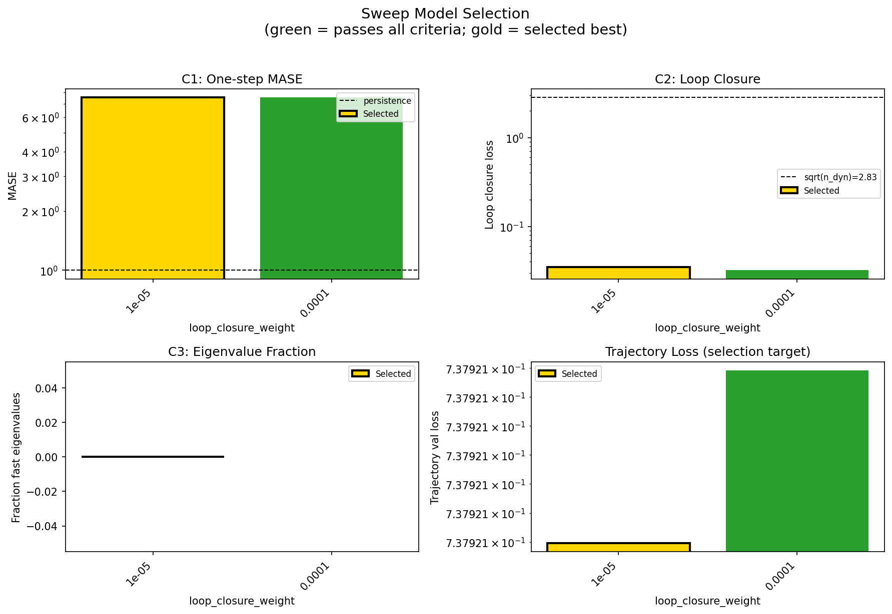

### sweep_pareto

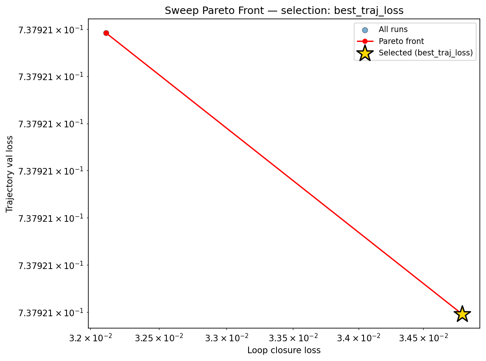

### reconstruction

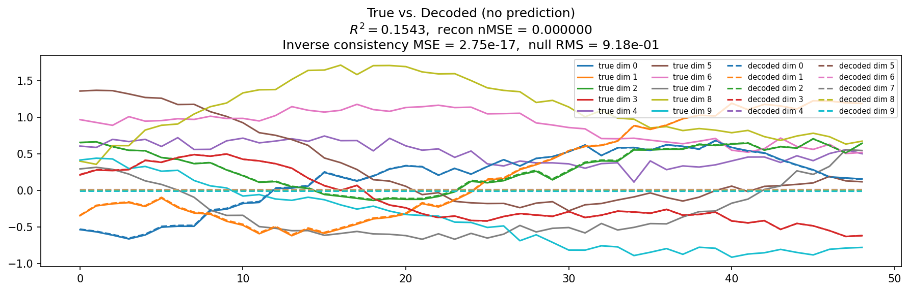

### prediction_windows

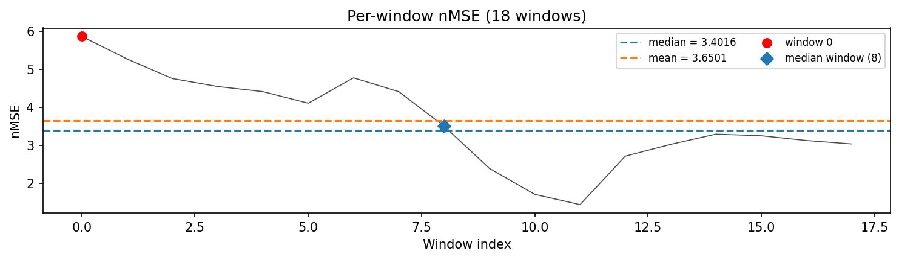

### long_trajectory

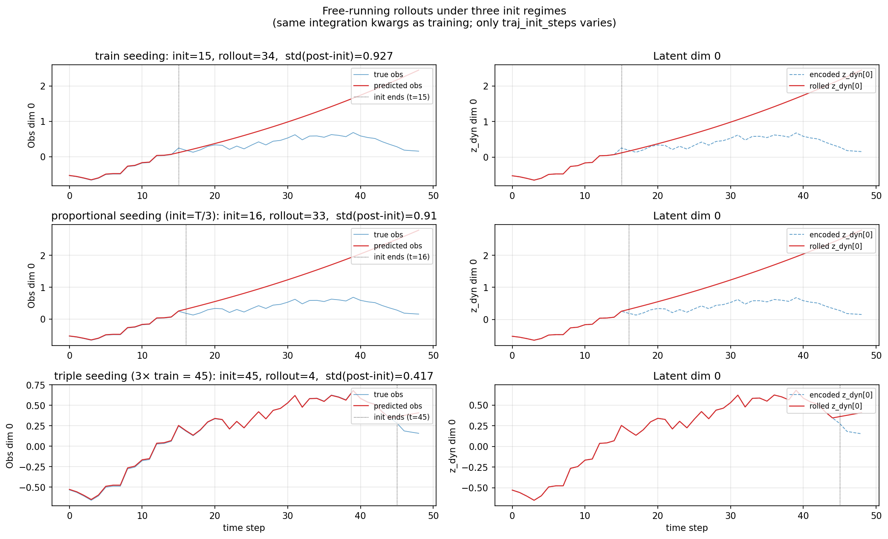

### mase

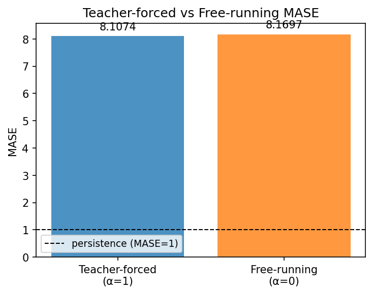

### latent_utilization

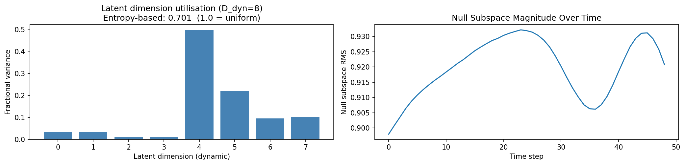

### lyapunov

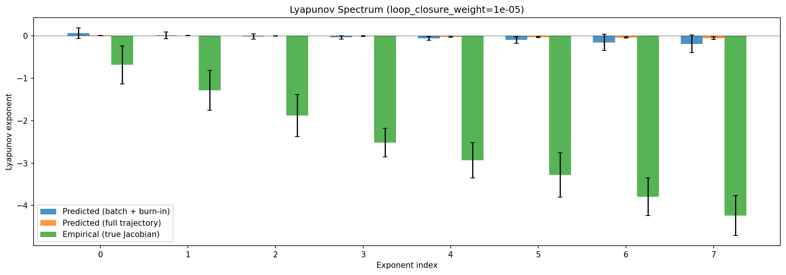

### kaplan_yorke

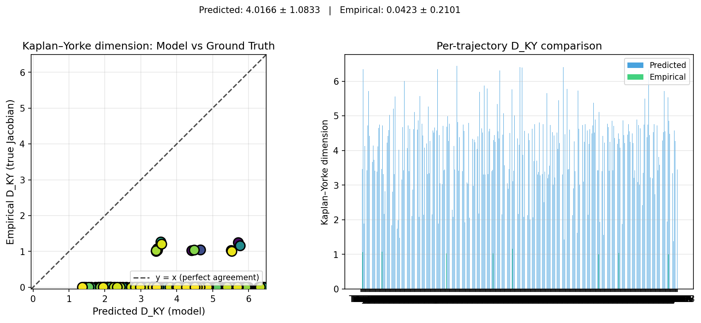

### per_run_lyapunov

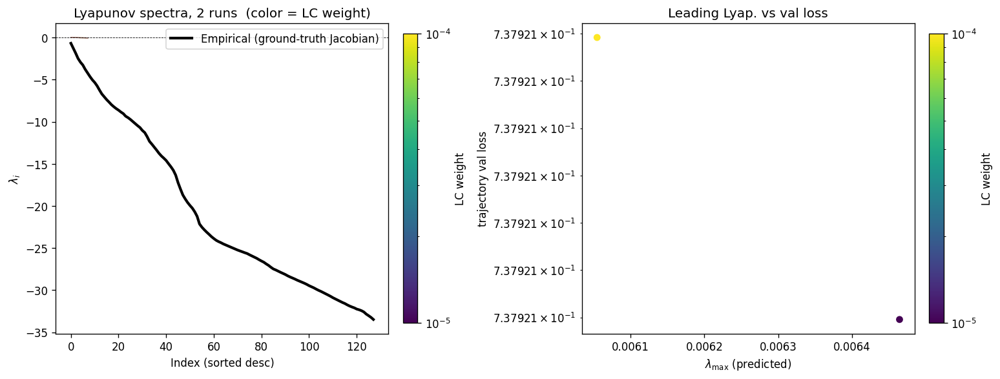

### per_run_lyapunov_vs_true

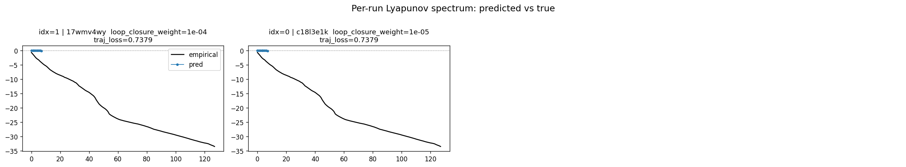

### per_run_lyapunov_relerr

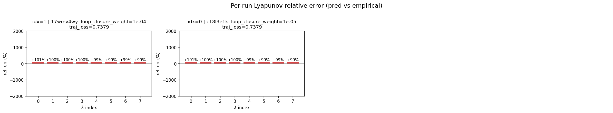

### encoder_decoder_jacobians

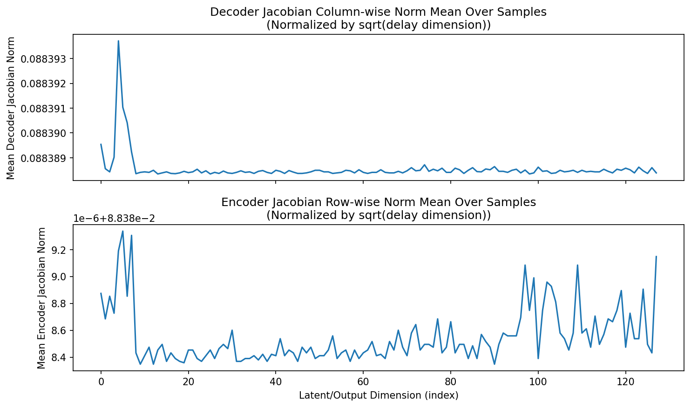

### amplification

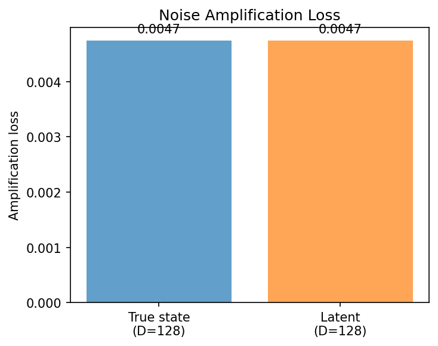

### kaplan_yorke_pca

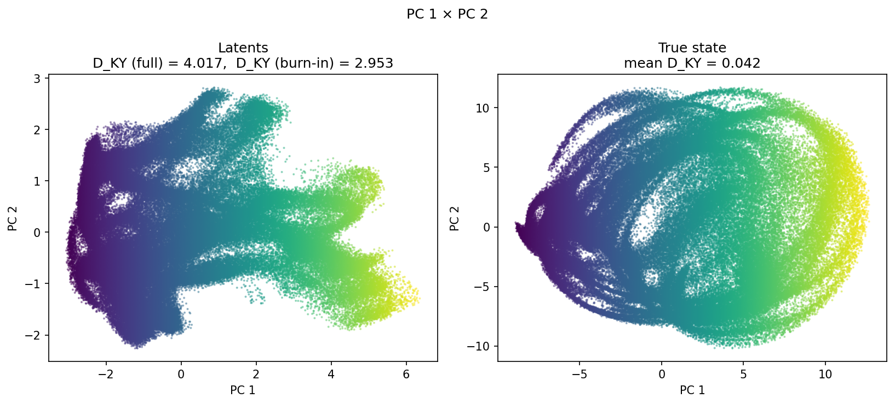

### prediction_detail_latent

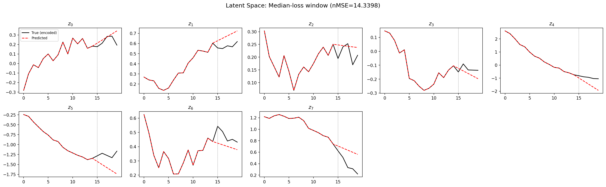

### prediction_detail_obs

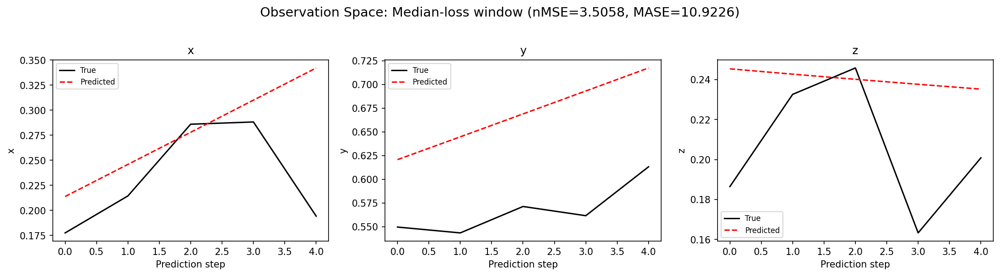

### tangent_spectrum

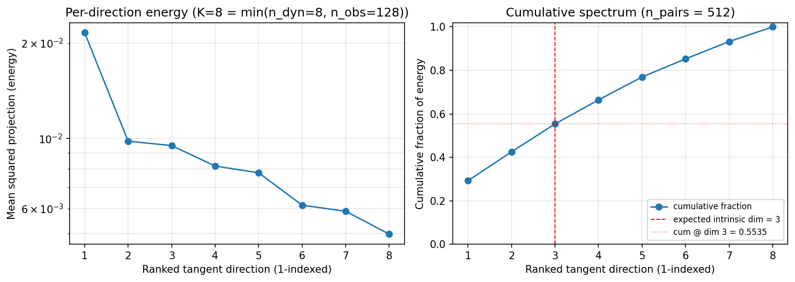

### per_run_tangent_spectrum

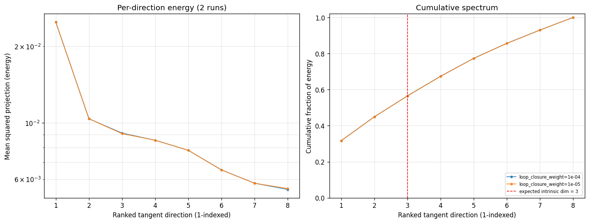

## Discussion

<!--
This section is intentionally left as a placeholder. A human reviewer
or Claude Code agent should fill it in based on the tables and figures
above, explicitly addressing each success criterion and comparing the
outcome to the stated hypothesis. Write the Discussion to
`discussion.md` in this directory and re-run `render_report`.
-->

_(to be written)_

## `run_analytics` stdout

<details><summary>Click to expand — full diagnostic output from <code>run_analytics</code></summary>

```
No run_id provided — selecting best run from group 'wmtask_migration_smoke' ...
Found 2 total runs in JacobianODE/WMTask_migration_smoke (group=wmtask_migration_smoke)
All runs (state, loop_closure_weight, tangent_entropy_weight, kl_dyn_weight):
  17wmv4wy: state=finished, lc=0.0001, te=0.0, kl_dyn=0.0
  c18l3e1k: state=finished, lc=1e-05, te=0.0, kl_dyn=0.0

slurm_timeout_min not found in any run config — falling back to 180 min
  Including 17wmv4wy (lc=0.0001): use_all_runs=True (state=finished)
  Including c18l3e1k (lc=1e-05): use_all_runs=True (state=finished)
Found 2 effectively-done sweep runs:
  loop_closure_weight=1e-05, tangent_entropy_weight=0.0, kl_dyn_weight=0.0 -> run_id=c18l3e1k
  loop_closure_weight=0.0001, tangent_entropy_weight=0.0, kl_dyn_weight=0.0 -> run_id=17wmv4wy
loaded wmtask RNN model checkpoint 41
Loading cached wmtask hiddens from /orcd/data/ekmiller/001/eisenaj/ControlJacobians/WMTaskModels/WMSelectionTask__cue_time_0.1__response_time_0.25__enforce_fixation_False/BiologicalRNN__cue_time_0.1__learning_rate_0.0005__max_epochs_42__N1_64__N2_64__tau_0.05__dt_0.02__eig_lower_bound_0.1__init_mode_random/_jacobianode_cache/hiddens__all__epoch41__trials4096__seed42.pt
n_dims=128, n_latent=128, n_dyn=8, dt=0.0200
  run=c18l3e1k: DiagnosticMetrics(one_step_mase=7.551759719848633, loop_closure_loss=0.0348052978515625, fast_eigenvalue_fraction=0.0, trajectory_val_loss=0.7379210591316223) (from W&B history)
  run=17wmv4wy: DiagnosticMetrics(one_step_mase=7.551760196685791, loop_closure_loss=0.032114285975694656, fast_eigenvalue_fraction=0.0, trajectory_val_loss=0.7379211783409119) (from W&B history)

Ranking method:           best_traj_loss
Best run ID:              c18l3e1k
Best loop_closure_weight: 1e-05
Best tangent_entropy_weight: 0.0
Best kl_dyn_weight:       0.0
Best traj loss:           0.737921
Criteria applied: ['C3']
Surviving: 2 / 2
Auto-selected run_id: c18l3e1k

======================================================================
PARETO FRONTIER RUNS (2 runs)
======================================================================
  Run ID               LC Loss   Traj Val Loss
  ------------  --------------  --------------
  17wmv4wy            0.032114        0.737921
  c18l3e1k            0.034805        0.737921 <-- selected

======================================================================
RANKING METHOD COMPARISON (over 2 survivors)
======================================================================
  Method                  Run ID               LC Loss   Traj Val Loss
  ----------------------  ------------  --------------  --------------
  best_traj_loss          c18l3e1k            0.034805        0.737921 <-- active
  pareto_knee             17wmv4wy            0.032114        0.737921
  geo_rank                c18l3e1k            0.034805        0.737921
  minimax_rank            c18l3e1k            0.034805        0.737921
  geo_log_score           c18l3e1k            0.034805        0.737921
  minimax_log_score       17wmv4wy            0.032114        0.737921
======================================================================

Loading run c18l3e1k from JacobianODE/WMTask_migration_smoke ...
loaded wmtask RNN model checkpoint 41
Loading cached wmtask hiddens from /orcd/data/ekmiller/001/eisenaj/ControlJacobians/WMTaskModels/WMSelectionTask__cue_time_0.1__response_time_0.25__enforce_fixation_False/BiologicalRNN__cue_time_0.1__learning_rate_0.0005__max_epochs_42__N1_64__N2_64__tau_0.05__dt_0.02__eig_lower_bound_0.1__init_mode_random/_jacobianode_cache/hiddens__all__epoch41__trials4096__seed42.pt
Loading checkpoint epoch=0-step=5.ckpt...
Train dataset shape: torch.Size([11468, 45, 128])
Validation dataset shape: torch.Size([3280, 45, 128])
Test dataset shape: torch.Size([1636, 45, 128])
Train trajectories dataset shape: torch.Size([2867, 49, 128])
Validation trajectories dataset shape: torch.Size([820, 49, 128])
Test trajectories dataset shape: torch.Size([409, 49, 128])
Loading checkpoint epoch=0-step=5.ckpt...
Computing reconstruction ...
Computing MASE ...
Teacher-forced MASE: 8.1074
Free-running MASE:   8.1697
Computing latent utilization ...
Entropy-based utilization: 0.701
Null subspace mean RMS: 9.199774e-01
Computing Lyapunov exponents ...
  Computing full-trajectory Lyapunov (409 test trajs, T=49) ...
Predicted Lyapunov exponents (batch+burn-in, 128 windowed trajs):
  λ_1 = +0.0639 ± 0.1225
  λ_2 = +0.0081 ± 0.0772
  λ_3 = -0.0160 ± 0.0603
  λ_4 = -0.0373 ± 0.0422
  λ_5 = -0.0633 ± 0.0445
  λ_6 = -0.1005 ± 0.0789
  λ_7 = -0.1552 ± 0.1872
  λ_8 = -0.1904 ± 0.2110
Predicted Lyapunov exponents (full-length, 409 test trajs):
  λ_1 = +0.0067 ± 0.0039
  λ_2 = +0.0028 ± 0.0030
  λ_3 = -0.0011 ± 0.0032
  λ_4 = -0.0082 ± 0.0115
  λ_5 = -0.0232 ± 0.0116
  λ_6 = -0.0305 ± 0.0109
  λ_7 = -0.0405 ± 0.0161
  λ_8 = -0.0580 ± 0.0288
Empirical Lyapunov exponents (mean ± std):
  λ_1 = -0.6836 ± 0.4470
  λ_2 = -1.2860 ± 0.4717
  λ_3 = -1.8796 ± 0.4983
  λ_4 = -2.5140 ± 0.3383
  λ_5 = -2.9329 ± 0.4143
  λ_6 = -3.2778 ± 0.5212
  λ_7 = -3.7948 ± 0.4446
  λ_8 = -4.2351 ± 0.4668
  λ_9 = -4.6672 ± 0.4583
  λ_10 = -5.0458 ± 0.4531
  λ_11 = -5.3534 ± 0.4185
  λ_12 = -5.7506 ± 0.4346
  λ_13 = -6.2355 ± 0.3491
  λ_14 = -6.7043 ± 0.5036
  λ_15 = -7.0414 ± 0.4554
  λ_16 = -7.3719 ± 0.4648
  λ_17 = -7.6725 ± 0.4415
  λ_18 = -7.9667 ± 0.4130
  λ_19 = -8.2155 ± 0.4290
  λ_20 = -8.4474 ± 0.4083
  λ_21 = -8.6400 ± 0.3667
  λ_22 = -8.8546 ± 0.3395
  λ_23 = -9.0471 ± 0.3366
  λ_24 = -9.3642 ± 0.2863
  λ_25 = -9.5403 ± 0.3009
  λ_26 = -9.7473 ± 0.3189
  λ_27 = -9.9780 ± 0.3514
  λ_28 = -10.2177 ± 0.4331
  λ_29 = -10.4760 ± 0.4197
  λ_30 = -10.6968 ± 0.4504
  λ_31 = -11.0538 ± 0.5425
  λ_32 = -11.3182 ± 0.5459
  λ_33 = -11.7806 ± 0.6071
  λ_34 = -12.3300 ± 0.5244
  λ_35 = -12.6464 ± 0.5369
  λ_36 = -13.0198 ± 0.6314
  λ_37 = -13.3795 ± 0.7073
  λ_38 = -13.7502 ± 0.7660
  λ_39 = -14.0682 ± 0.7579
  λ_40 = -14.3279 ± 0.7619
  λ_41 = -14.6206 ± 0.8778
  λ_42 = -15.0213 ± 0.8116
  λ_43 = -15.3487 ± 0.8488
  λ_44 = -15.7679 ± 0.8512
  λ_45 = -16.3535 ± 0.8105
  λ_46 = -17.2371 ± 0.8420
  λ_47 = -18.0172 ± 0.6551
  λ_48 = -18.7348 ± 0.4352
  λ_49 = -19.1920 ± 0.4388
  λ_50 = -19.6032 ± 0.3862
  λ_51 = -19.9849 ± 0.4171
  λ_52 = -20.2854 ± 0.3677
  λ_53 = -20.7129 ± 0.4088
  λ_54 = -21.2293 ± 0.4493
  λ_55 = -22.1518 ± 0.3711
  λ_56 = -22.5100 ± 0.3571
  λ_57 = -22.8264 ± 0.3133
  λ_58 = -23.1069 ± 0.3495
  λ_59 = -23.3589 ± 0.3337
  λ_60 = -23.6276 ± 0.2926
  λ_61 = -23.8603 ± 0.3155
  λ_62 = -24.0618 ± 0.3005
  λ_63 = -24.2152 ± 0.3129
  λ_64 = -24.3396 ± 0.3136
  λ_65 = -24.4895 ± 0.3210
  λ_66 = -24.6115 ± 0.3197
  λ_67 = -24.7359 ± 0.3269
  λ_68 = -24.8561 ± 0.3392
  λ_69 = -24.9753 ± 0.3426
  λ_70 = -25.1117 ± 0.3497
  λ_71 = -25.2226 ± 0.3734
  λ_72 = -25.3357 ± 0.4009
  λ_73 = -25.4353 ± 0.4172
  λ_74 = -25.5439 ± 0.4046
  λ_75 = -25.6332 ± 0.4116
  λ_76 = -25.7832 ± 0.4585
  λ_77 = -25.9142 ± 0.4799
  λ_78 = -26.0449 ± 0.4990
  λ_79 = -26.1810 ± 0.5037
  λ_80 = -26.3617 ± 0.4899
  λ_81 = -26.5171 ± 0.4864
  λ_82 = -26.6628 ± 0.4753
  λ_83 = -26.8617 ± 0.4795
  λ_84 = -27.0282 ± 0.5036
  λ_85 = -27.2607 ± 0.4846
  λ_86 = -27.4529 ± 0.4854
  λ_87 = -27.5733 ± 0.4725
  λ_88 = -27.7187 ± 0.4967
  λ_89 = -27.8617 ± 0.5003
  λ_90 = -27.9895 ± 0.4903
  λ_91 = -28.1274 ± 0.4923
  λ_92 = -28.2824 ± 0.4913
  λ_93 = -28.4072 ± 0.4914
  λ_94 = -28.5255 ± 0.4695
  λ_95 = -28.6477 ± 0.4521
  λ_96 = -28.7842 ± 0.4453
  λ_97 = -28.9001 ± 0.4403
  λ_98 = -29.0308 ± 0.4330
  λ_99 = -29.1511 ± 0.4295
  λ_100 = -29.2954 ± 0.4247
  λ_101 = -29.4503 ± 0.4217
  λ_102 = -29.5753 ± 0.4321
  λ_103 = -29.6956 ± 0.4539
  λ_104 = -29.8547 ± 0.4485
  λ_105 = -29.9992 ± 0.4490
  λ_106 = -30.1172 ± 0.4378
  λ_107 = -30.2615 ± 0.4426
  λ_108 = -30.4062 ± 0.3980
  λ_109 = -30.5554 ± 0.4003
  λ_110 = -30.7032 ± 0.3985
  λ_111 = -30.8743 ± 0.4228
  λ_112 = -31.0109 ± 0.4336
  λ_113 = -31.1492 ± 0.4292
  λ_114 = -31.3023 ± 0.3981
  λ_115 = -31.4396 ± 0.4097
  λ_116 = -31.5685 ± 0.3902
  λ_117 = -31.7302 ± 0.3526
  λ_118 = -31.8705 ± 0.3050
  λ_119 = -31.9948 ± 0.3040
  λ_120 = -32.0998 ± 0.2813
  λ_121 = -32.2401 ± 0.2718
  λ_122 = -32.3221 ± 0.2617
  λ_123 = -32.4282 ± 0.2531
  λ_124 = -32.5858 ± 0.2272
  λ_125 = -32.8296 ± 0.2629
  λ_126 = -33.0206 ± 0.2244
  λ_127 = -33.2132 ± 0.2160
  λ_128 = -33.4614 ± 0.3541
Mean KY dim (predicted): 4.017 ± 1.083
Mean KY dim (empirical): 0.042 ± 0.210
Mean KY dim (burn-in):   2.953 ± 2.900
Computing prediction windows ...
Windows: 18 — nMSE min=1.4396, median=3.4016, mean=3.6501, max=5.8718
Computing long-trajectory free-running rollouts ...
Computing encoder/decoder Jacobians ...
encoder_jacobian: (128, 128, 128)
decoder_jacobian: (128, 128, 128)
Computing amplification loss ...
Amplification loss — True state: 0.004748
Amplification loss — Latent:     0.004748
Computing tangent space spectrum ...
```

</details>
